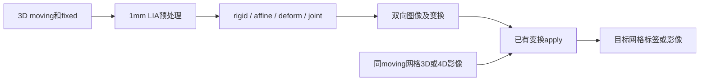

# SynthMorph：配准与 3D/4D 变换应用

[返回首页](../../README.md) · [完整旧文档与更早证据](../../validation/synthmorph/readme_archive_20261005.md)

| 项目 | 内容 |
|---|---|
| 输入 | moving/fixed两幅3D；已有变换可用于同源3D/4D |
| 输出 | 双向配准图及带几何的仿射/位移场 |
| 对应原软件 | FreeSurfer mri_synthmorph / mri_synthmorph apply |
| Python / CLI | fnit.SynthMorph、apply_transform；fnit synthmorph / apply |
| CPU / GPU | CPU/CUDA；读图、坐标准备及保存含CPU步骤 |

## 1. 功能简介

本模块将指定 FreeSurfer 8.2.0 构建中的 TensorFlow/Keras SynthMorph 移植为 PyTorch，支持刚性、仿射、非线性和联合配准，直接读取官方 HDF5 权重。推理不导入 TensorFlow、VoxelMorph、Neurite，也不调用 FreeSurfer。

参考 build 为 `freesurfer-linux-centos7_x86_64-8.2.0-20260314-d932c45`，并非随时变化的开发分支。准确源文件和权重哈希见 [provenance.json](../provenance.json)。

配准模型仅接受单帧3D，已有变换的apply支持末维为frame的4D。默认joint联合仿射和非线性；deform要求已合适仿射对齐，rigid/affine返回矩阵。CUDA默认float32/TF32，无FP16/BF16；CPU构造保持调用方CUDA状态。



<a id="2-python-调用输入与输出"></a>
<a id="应用已有变换"></a>
<a id="固定场bbr与逐帧运动的一次采样"></a>
<a id="公共world变换链的验证范围"></a>

## 2. Python 调用

```python
from pathlib import Path
from fnit import SynthMorph, apply_transform

registration_output_directory = Path("results")  # 配准与标签结果目录
registration_output_directory.mkdir(parents=True, exist_ok=True)  # 准备保存目录
registration_model = SynthMorph(
    weights="/path/to/weights",  # 已校验的affine和deform权重目录
    device="cuda:0",  # 网络设备，无GPU时用cpu
    model="joint",  # 联合仿射与非线性配准
)
registration_result = registration_model(
    moving="moving_T1w.nii.gz",  # 待配准3D原生图像
    fixed="fixed_T1w.nii.gz",  # 目标3D图像，决定forward网格
)
registration_result.moved.save(registration_output_directory / "moving_in_fixed.nii.gz")  # forward图像
registration_result.fixed_moved.save(registration_output_directory / "fixed_in_moving.nii.gz")  # inverse图像
registration_result.transform.save(registration_output_directory / "moving_to_fixed.mgz")  # 带几何forward场
registration_result.inverse.save(registration_output_directory / "fixed_to_moving.mgz")  # 带几何inverse场
transformed_label_image = apply_transform(
    image="moving_labels.nii.gz",  # 与moving同shape和affine的标签
    transformation=registration_result.transform,  # moving→fixed变换
    method="nearest",  # 最近邻保留整数标签
    dtype="int16",  # 标签存储类型
    device="cpu",  # 采样设备独立于网络设备
)
transformed_label_image.save(registration_output_directory / "labels_in_fixed.nii.gz")  # fixed网格标签
```

### 输入数据格式

- `moving`、`fixed`：有限值单帧3D `(X,Y,Z)`，NIfTI、MGH/MGZ路径或nibabel SpatialImage；各自有效affine，网格与orientation可以不同。强度无固定单位，空间可为原生或明确的模板空间。
- `init`：LTA路径、带source/target几何的AffineTransform，或4×4 world-RAS矩阵；不是FLIRT scaled-mm矩阵。mid_space=True要求init。
- `apply_transform.image`：3D或4D `(X,Y,Z,T)`，前三轴必须匹配原moving/source几何。末维3分量的位移场不能当时间序列。
- CPU路径先按ArrayProxy默认缩放解码，再转模型float32；自有已解码数组不重复缩放。输出mask仅适用于公共World链，必须同目标网格。
- 权重可为目录或affine/rigid/deform映射字典；joint需affine+deform，deform只需非线性模型，rigid/affine各需对应模型。

### 模型构造

| 参数 | 必需 | 类型 | 默认值 | 含义 |
|---|---|---|---|---|
| `weights` | 否 | `str 或 Path 或 dict[str, 路径] 或 None` | `None` | 官方 checkpoint 文件或目录；省略时按显式配置、FNIT_WEIGHTS 和缓存查找 |
| `device` | 否 | `str` | `'cpu'` | 计算设备，cpu 或 cuda:N；编号遵循 CUDA_VISIBLE_DEVICES |
| `model` | 否 | `str` | `'joint'` | joint、deform、affine 或 rigid 配准模型 |
| `extent` | 否 | `int` | `256` | 网络网格每轴体素数，192 或 256 |
| `hyper` | 否 | `float` | `0.5` | 非线性正则化参数，0 < hyper < 1；需重建实例改变 |
| `steps` | 否 | `int` | `7` | stationary velocity scaling-and-squaring次数，至少5 |
| `configure_precision` | 否 | `bool` | `True` | CUDA True 配置默认 TF32，False 保留调用方策略；CPU 不改 CUDA 状态 |

### 配准调用

| 参数 | 必需 | 类型 | 默认值 | 含义 |
|---|---|---|---|---|
| `moving` | 是 | `str 或 Path 或 nibabel SpatialImage` | `—` | 单幅待配准 3D 图像，路径或 nibabel 空间影像 |
| `fixed` | 是 | `str 或 Path 或 nibabel SpatialImage` | `—` | 目标 3D 图像；决定 forward 输出网格 |
| `init` | 否 | `str 或 Path 或 AffineTransform 或 4×4 ndarray 或 None` | `None` | 可选带source/target几何的LTA或4×4 moving→fixed世界坐标矩阵 |
| `mid_space` | 否 | `bool` | `False` | 按初始仿射的中间空间初始化；True 必须有 init |
| `header_only` | 否 | `bool` | `False` | rigid/affine 仅改头信息；不适用于非线性模型 |
| `output_dir` | 否 | `str 或 Path 或 None` | `None` | 结果或调试文件的目录；具体自动保存范围见输出 |
| `transform_only` | 否 | `bool` | `False` | 仅生成变换，跳过最终图像采样 |
| `compute_inverse` | 否 | `bool` | `True` | 同时计算 inverse；False 时反向结果为空 |
| `precision_report` | 否 | `list[dict] 或 None` | `None` | 可选列表，追加实际前向设备、dtype、TF32 和 autocast 记录 |

### apply_transform参数

| 参数 | 必需 | 类型 | 默认值 | 含义 |
|---|---|---|---|---|
| `image` | 是 | `str 或 Path 或 nibabel SpatialImage` | `—` | 输入影像，格式、维数与预处理约束见输入数据格式 |
| `transformation` | 是 | `str 或 Path 或 SpatialImage 或 AffineTransform 或 DenseWarp 或 WorldTransformChain` | `—` | 带 source/target 几何的 Affine、DenseWarp 或公共 WorldTransformChain |
| `method` | 否 | `str` | `'linear'` | linear、nearest；World链另支持公共 volume 的 spline/边界合同 |
| `fill` | 否 | `float` | `0` | 视野外或掩膜外填充值；SynthStrip None 为 min(input.min(),0) |
| `dtype` | 否 | `str` | `'float32'` | 输出体素dtype；标签应选整数型并用nearest |
| `header_only` | 否 | `bool` | `False` | rigid/affine 仅改头信息；不适用于非线性模型 |
| `device` | 否 | `str` | `'cpu'` | 计算设备，cpu 或 cuda:N；编号遵循 CUDA_VISIBLE_DEVICES |
| `frame_chunk_size` | 否 | `int 或 None` | `None` | 正整数帧缓冲上限；None 自动按CPU/显存预算分块 |
| `boundary` | 否 | `str` | `'grid-constant'` | grid-constant 或公共World链支持的边界政策 |
| `output_mask` | 否 | `str 或 Path 或 nibabel SpatialImage 或 None` | `None` | World链可选目标网格mask；普通变换不支持时明确报错 |
| `spatial_chunk_size` | 否 | `int` | `262144` | 公共World链每次查询空间点数，正整数；普通变换只接受默认值 |

### convert_warp_to_fsl参数

| 参数 | 必需 | 类型 | 默认值 | 含义 |
|---|---|---|---|---|
| `warp` | 是 | `str 或 Path 或 nibabel SpatialImage` | `—` | fixed网格的 SynthMorph world-RAS pull 位移，形状(X,Y,Z,3)，mm |
| `moving` | 是 | `str 或 Path 或 nibabel SpatialImage` | `—` | 单幅待配准 3D 图像，路径或 nibabel 空间影像 |
| `fixed` | 是 | `str 或 Path 或 nibabel SpatialImage` | `—` | 目标 3D 图像；决定 forward 输出网格 |

### 输出

```text
results/
├── moving_in_fixed.nii.gz  # fixed网格float32影像
├── fixed_in_moving.nii.gz  # moving网格float32影像
├── moving_to_fixed.mgz    # fixed网格(X,Y,Z,3) RAS-mm pull场
├── fixed_to_moving.mgz    # moving网格(X,Y,Z,3) RAS-mm pull场
└── labels_in_fixed.nii.gz # fixed网格int16标签
```

`RegistrationResult`含moved、fixed_moved、transform、inverse；transform_only=True时图像为None。compute_inverse=False仅允许非线性、transform_only=True且无调试目录。Python仅显式save；output_dir只写inp_1.nii.gz、inp_2.nii.gz及network_transforms.npz。

rigid/affine返回world-RAS forward矩阵，保存`.lta`；deform/joint的DenseWarp名称表示moving→fixed任务，但存储在fixed网格上的fixed→moving **pull相对位移**，单位mm。inverse反向同理。NIfTI场为(X,Y,Z,3)、intent1007，不携带FreeSurfer完整source/target扩展；外部文件使用前须保留原图几何。

apply结果在transformation.target网格，4D保留frame顺序和时间header。连续图linear、标签nearest；普通Affine/DenseWarp只用float32采样。WorldTransformChain可组合固定场、world-RAS BBR和逐帧HMC，样条/周期边界沿用[公共volume合同](../applywarp/README.md)；其完整构造及一次采样例见[旧版细节归档](../../validation/synthmorph/readme_archive_20261005.md#固定场bbr与逐帧运动的一次采样)。

`convert_warp_to_fsl(warp,moving=...,fixed=...)`返回fixed网格float32、intent2006的FSL relative field；必须同时给两幅原图，不可只改intent。

普通apply的None分帧CPU最多32帧，CUDA按已驻留坐标后的20,000,000,000B预算和最多8GiB变化缓冲选择；显式分块超预算报错。World链None为8帧，fill固定0、不能header_only；普通变换只接受默认boundary、无output_mask及默认spatial_chunk_size。

## 3. 命令行调用

```bash
fnit synthmorph moving_T1w.nii.gz fixed_T1w.nii.gz --device cuda:0 \
  -o results/moving_in_fixed.nii.gz -O results/fixed_in_moving.nii.gz \
  -t results/moving_to_fixed.mgz -T results/fixed_to_moving.mgz
fnit apply results/moving_to_fixed.mgz moving_labels.nii.gz results/labels_in_fixed.nii.gz -m nearest -t int16
```

### fnit synthmorph

| CLI 参数 | Python 参数 / 输出 | 含义 |
|---|---|---|
| `moving` | `moving` | 单幅待配准 3D 图像，路径或 nibabel 空间影像 |
| `fixed` | `fixed` | 目标 3D 图像；决定 forward 输出网格 |
| `-m` / `--model` | `model` | joint、deform、affine 或 rigid 配准模型 |
| `--weights` | `weights` | 官方 checkpoint 文件或目录；省略时按显式配置、FNIT_WEIGHTS 和缓存查找 |
| `--device` | `device` | 计算设备，cpu 或 cuda:N；编号遵循 CUDA_VISIBLE_DEVICES |
| `-o` / `--out-moving` | `result.moved.save` | moving在fixed网格图像 |
| `-O` / `--out-fixed` | `result.fixed_moved.save` | fixed在moving网格图像 |
| `-t` / `--trans` | `result.transform.save` | moving→fixed变换保存路径 |
| `-T` / `--inverse` | `result.inverse.save` | fixed→moving变换保存路径 |
| `--fsl-warp` | `convert_warp_to_fsl` | 另存FSL relative warp |
| `-i` / `--init` | `init` | 可选带source/target几何的LTA或4×4 moving→fixed世界坐标矩阵 |
| `-M` / `--mid-space` | `mid_space` | 按初始仿射的中间空间初始化；True 必须有 init |
| `-H` / `--header-only` | `header_only` | rigid/affine 仅改头信息；不适用于非线性模型 |
| `-e` / `--extent` | `extent` | 网络网格每轴体素数，192 或 256 |
| `-r` / `--hyper` | `hyper` | 非线性正则化参数，0 < hyper < 1；需重建实例改变 |
| `-n` / `--steps` | `steps` | stationary velocity scaling-and-squaring次数，至少5 |
| `-j` / `--threads` | `threads` | PyTorch CPU 线程预算；None 保留当前值，CLI 默认另见下节 |
| `-d` / `--output-dir` | `output_dir` | 结果或调试文件的目录；具体自动保存范围见输出 |

### fnit apply

| CLI 参数 | Python 参数 / 输出 | 含义 |
|---|---|---|
| `transform` | `transformation` | 带几何的变换文件 |
| `image` | `image` | 输入影像，格式、维数与预处理约束见输入数据格式 |
| `output` | `结果保存路径` | 输出影像路径 |
| `-m` / `--method` | `method` | linear、nearest；World链另支持公共 volume 的 spline/边界合同 |
| `-f` / `--fill` | `fill` | 视野外或掩膜外填充值；SynthStrip None 为 min(input.min(),0) |
| `-t` / `--dtype` | `dtype` | 输出体素dtype；标签应选整数型并用nearest |
| `-H` / `--header-only` | `header_only` | rigid/affine 仅改头信息；不适用于非线性模型 |
| `--device` | `device` | 计算设备，cpu 或 cuda:N；编号遵循 CUDA_VISIBLE_DEVICES |
| `--frame-chunk-size` | `frame_chunk_size` | 正整数帧缓冲上限；None 自动按CPU/显存预算分块 |

CLI与Python默认差异：CLI线程4，Python构造无threads；CLI apply不暴露World链全部参数。

## 4. 原软件调用

以下命令用于独立原软件参考环境；FNIT生产入口不执行它。

```bash
mri_synthmorph register -m joint -o reference/moving_in_fixed.nii.gz \
  -O reference/fixed_in_moving.nii.gz -t reference/moving_to_fixed.mgz \
  -T reference/fixed_to_moving.mgz moving_T1w.nii.gz fixed_T1w.nii.gz
mri_synthmorph apply -m nearest -t int16 reference/moving_to_fixed.mgz \
  moving_labels.nii.gz reference/labels_in_fixed.nii.gz
```

| FNIT参数 / 产物 | 原软件参数 / 产物 |
|---|---|
| model / extent / hyper / steps | -m / -e / -r / -n |
| moving / fixed / init / mid_space | 位置参数 / -i / -M |
| moved / fixed_moved / transform / inverse | -o / -O / -t / -T |
| header_only / output_dir | -H / -d |
| apply method / fill / dtype | apply -m / -f / -t |
| apply device / frame_chunk_size | FNIT采样设备/分帧；原版无同名控制 |

模型和权重固定到参考build。原版NIfTI warp通常(X,Y,Z,1,3)、intent1006并带源/目标几何，与FNIT NIfTI保存格式不同。header_only只支持刚性/仿射。World链spline为新增公共采样入口，不是SynthMorph模型新算法。

<a id="配准调用与结果"></a>
<a id="4d-影像示例"></a>
<a id="此处文件是已经转换好的world-ras-bbr不能直接传flirt-scaled-mm-mat"></a>
<a id="转成-fsl-warp-并应用"></a>
<a id="moving_4d需与原moving具有相同采样几何"></a>
<a id="省略--frame-chunk-size变化帧缓冲最多8-gib并检查已驻留坐标后的剩余20-gb预算"></a>
<a id="若显式指定--frame-chunk-size-8每次最多8帧同样检查剩余额度"></a>
<a id="5-精度运行时间与脑图"></a>
<a id="51-当前-cpu-续修对照2026-10-04"></a>
<a id="511-已归档-cpu-初轮官方对照2026-10-04"></a>
<a id="52-已归档-4d-数据流优化2026-10-02"></a>
<a id="53-已归档-joint-配准2026-09-27"></a>
<a id="54-已归档-fsl-warp-转换真实-t1w"></a>

## 5. 最新精度和运行时间

最新2026-10-04 CPU续修用公开CC0 ds003138 v1.0.1两幅完整224×288×288原始T1，FreeSurfer8.2.0-1参考。基线f1cbdab1与冻结修复源码SHA绑定[公共报告](../../validation/synthmorph/cpu_fixes_20261004/report.public.json)。nodecw7同8物理核/8线程，CPU网络float32；每模式各新进程CLI含加载、计算及保存，未清缓存。

### 端到端 benchmark

| 指标 | FNIT | 原软件 | 差异 |
|---|---|---|---|
| rigid完整CLI | 23.54 s | 311.21 s | 双向世界最大误差0.000142/0.000962mm |
| affine完整CLI | 26.53 s | 65.10 s | 双向世界最大0.000237/0.000127mm |
| deform完整CLI | 143.15 s | 168.80 s | 双向场RMSE约1.02e-5mm |
| joint完整CLI | 148.17 s | 174.97 s | 双向场RMSE6.48e-5/4.38e-5mm |

### 分步骤 benchmark

| 阶段 | FNIT | 原软件 |
|---|---|---|
| 读图/网络/积分/输出采样 | observer分项见原报告 | 不是无observer端到端CLI同边界 |
| H100 affine旧/新 | 四数组与完整元数据SHA相同 | 当前没有新增官方GPU全模式计时 |
| H100 affine reserved峰值 | 5.91 GB | 本轮未测同边界官方峰值 |

默认extent256四模式通过固定门：全网格affine世界误差max≤0.001mm，dense max≤0.001mm/RMSE≤0.0001mm，连续图全FOV/脑内/上边界NRMSE≤0.001。额外joint192/hyper0.75/steps5的forward全零参考边界仍有2微值，严格零门未过。共享负载单次时间不代表稳定加速；本轮未完成joint GPU完整回归。物化对象、返回LTA回放和真实两帧DWI World入口均按原协议另核验。[续修全部证据](../../validation/synthmorph/cpu_fixes_20261004/README.md)。


<a id="6-最近更新与-benchmark-记录"></a>

## 6. 最近版本和 benchmark

| 日期 | commit / version | 变化 | benchmark |
|---|---|---|---|
| 2026-10-04 | f1cbdab1基线＋续修SHA | NIfTI解码、返回仿射与joint归约形状 | 默认四模式固定门；额外零边界失败保留 |
| 2026-10-04 | cpu_20261004冻结 | CPU有效域、nearest半体素与积分复用 | [首轮原报告](../../validation/synthmorph/cpu_20261004/README.md) |
| 2026-10-02 | World公共入口冻结 | 固定场、BBR与HMC一次采样 | [完整490帧及7图](../../validation/fmri/public_resamplers_20261002/README.md) |
| 2026-10-02 | registration_lossless冻结 | 普通apply解码/坐标复用与分帧 | [历史4D优化](../../validation/registration_lossless_20261002/README.md)；旧CPU边界结论不重标 |

每条记录保留真实冻结源码、输入与时间边界；逐例、debug/profiling和更早脑图见[完整归档](../../validation/synthmorph/readme_archive_20261005.md)。文档整理不重跑MRI，不把执行成功或--help核验作为精度benchmark。

<a id="权重与执行位置"></a>
<a id="7-参考文献与原实现"></a>

## 7. 参考文献、原软件和资源

- 参考文献：Hoffmann et al., *Anatomy-aware and acquisition-agnostic joint registration with SynthMorph*, Imaging Neuroscience (2024), [doi:10.1162/imag_a_00197](https://doi.org/10.1162/imag_a_00197)。
- 原实现代码库：[FreeSurfer `mri_synthmorph`](https://github.com/freesurfer/freesurfer/tree/dev/mri_synthmorph)；[VoxelMorph TensorFlow 分支](https://github.com/voxelmorph/voxelmorph/tree/dev-tensorflow)。

- [SynthMorph论文全文](https://pmc.ncbi.nlm.nih.gov/articles/PMC11247402/)；[官方CLI源码](https://github.com/freesurfer/freesurfer/blob/dev/mri_synthmorph/mri_synthmorph)、[官方registration wrapper](https://github.com/freesurfer/freesurfer/blob/dev/mri_synthmorph/synthmorph/registration.py)。开发分支用于浏览，复现依据为本页固定构建和provenance哈希。
- [Surfa原代码库](https://github.com/freesurfer/surfa)：官方apply的几何、warp格式与多frame插值；独立参考为FreeSurfer 8.2附带的Surfa 0.6.3。
- World链的preproc/clean原软件参照、坐标和样条依据沿用[volume原实现说明](../fmri/normalization.md#参考文献与原实现)；原软件运行命令见[volume对照](../fmri/README.md#4-原软件调用)。

### FNIT源码组织

| 文件 | 责任 |
|---|---|
| [models.py](../../src/fnit/synthmorph/models.py) | affine/rigid 特征网络、HyperVxmJoint、HDF5 读取与权重特化 |
| [pipeline.py](../../src/fnit/synthmorph/pipeline.py) | 图像几何、预后处理、双向结果与 apply |
| [spatial.py](../../src/fnit/synthmorph/spatial.py) | 复用坐标的采样计划、仿射/位移组合和积分 |
| [fsl_warp.py](../../src/fnit/synthmorph/fsl_warp.py) | RAS 位移转换为 fixed 网格 FSL relative warp |
| [_transforms.py](../../src/fnit/_transforms.py) | 带 source/target geometry 的 `AffineTransform`、`DenseWarp` 及 LTA 读写 |
| [_world_resampling.py](../../src/fnit/_world_resampling.py) | 从成熟volume实现抽取的world坐标链及共享linear/nearest/cubic采样器 |
| [__init__.py](../../src/fnit/synthmorph/__init__.py) | 功能公开导出 |

模型使用下列官方原始文件，Git/wheel不包含。固定[assets-v1 Release](https://github.com/weikanggong1/Fudan-Neuroimaging-toolkit/releases/tag/assets-v1)及公开asset-manifest与当前weights.py逐项大小/SHA记录一致；本轮未重新下载所有大文件。安装器先Release再原站；完整清单见[资源文件清单](../RESOURCE_MANIFEST.md)。

```bash
fnit-setup-weights --model synthmorph-joint --model synthmorph-rigid --dest /data/fnit-weights
fnit-setup-weights --model synthmorph-joint --model synthmorph-rigid --dest /data/fnit-weights --verify-only
```

| 资源 | 用途 | 官方来源 | 大小 | SHA-256 | 是否允许 FNIT 再分发 |
|---|---|---|---|---|---|
| `synthmorph.rigid.1.h5` | 官方推理权重 / 标签数组 | [原站](https://surfer.nmr.mgh.harvard.edu/docs/synthmorph/synthmorph.rigid.1.h5) | 51,656,152 B | `284c145fce47e98ecf3fdeda2163f646ac3ebb0240e87dd50d71d879f4d5b3af` | 允许；CC BY 4.0，保留归属 |
| `synthmorph.affine.2.h5` | 官方推理权重 / 标签数组 | [原站](https://surfer.nmr.mgh.harvard.edu/docs/synthmorph/synthmorph.affine.2.h5) | 51,455,312 B | `1ac5304b683036e5177f5b4ad38fa09fcbbe7883e742d6fa5bdaedd0e619ced6` | 允许；CC BY 4.0，保留归属 |
| `synthmorph.deform.3.h5` | 官方推理权重 / 标签数组 | [原站](https://surfer.nmr.mgh.harvard.edu/docs/synthmorph/synthmorph.deform.3.h5) | 3,508,630,424 B | `95b367cd30788cc647e4704b650642fc1d70d7e419c20c04f1ba1b2902bc6536` | 允许；CC BY 4.0，保留归属 |

本页列出的模型/数组共3个，3,611,741,888 B。原始文件许可及归属见[统一资源规则](../WEIGHTS.md#权重许可与归属)。模型推理从本地加载已准备资源。
