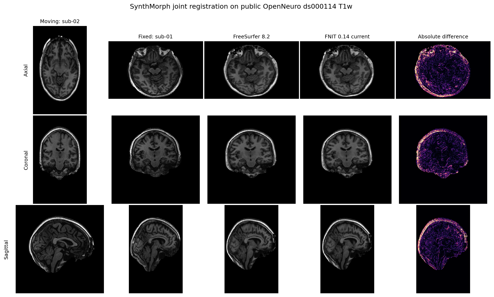
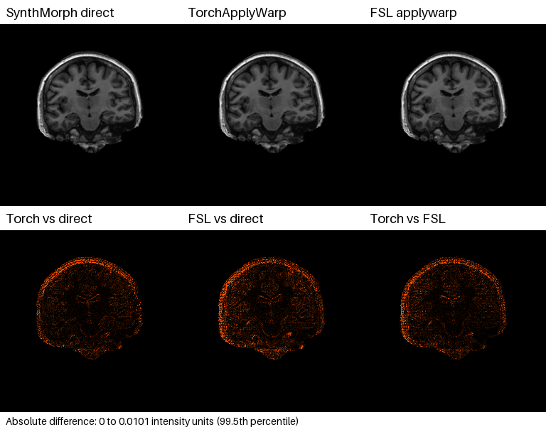

# SynthMorph：配准与变换应用

[返回首页](../../README.md) · [源码目录](../../src/fnit/synthmorph/) · [权重](../WEIGHTS.md)

本模块将指定 FreeSurfer 8.2.0 构建中的 TensorFlow/Keras SynthMorph 移植为 PyTorch，支持刚性、仿射、非线性和联合配准，直接读取官方 HDF5 权重。推理不导入 TensorFlow、VoxelMorph、Neurite，也不调用 FreeSurfer。

参考 build 为 `freesurfer-linux-centos7_x86_64-8.2.0-20260314-d932c45`，并非随时变化的开发分支。准确源文件和权重哈希见 [provenance.json](../provenance.json)。

## Python API

```python
from pathlib import Path
from fnit import SynthMorph, TorchApplyWarp, apply_transform, convert_warp_to_fsl

output_dir = Path("results")  # 输出目录：保存本例配准图像和变换
output_dir.mkdir(parents=True, exist_ok=True)

register = SynthMorph(
    weights="/path/to/weights",  # 权重输入：包含官方 SynthMorph HDF5 权重的目录
    device="cuda:0",  # 计算设备；可改为 "cpu"
    model="joint",  # 配准模型：joint 同时估计仿射和非线性变换
    extent=256,  # 网络空间每轴体素数；支持 192 或 256
    hyper=0.5,  # 非线性正则化参数，范围 0–1
    steps=7,  # stationary velocity scaling-and-squaring 次数
)
result = register(
    moving="moving_T1w.nii.gz",  # 输入：待变换的单帧 3D 图像
    fixed="fixed_T1w.nii.gz",  # 输入：目标图像；决定 moved 输出网格
    init=None,  # 可选输入：带几何信息的初始 LTA 仿射
    mid_space=False,  # 是否以初始仿射的中间空间初始化；True 时必须提供 init
    header_only=False,  # affine/rigid 时可只改头信息；joint 应为 False
    output_dir=None,  # 可选调试目录；此处不写网络空间中间文件
)
result.moved.save(path=output_dir / "moving_in_fixed.nii.gz")  # 输出路径：moving 在 fixed 网格的图像
result.fixed_moved.save(path=output_dir / "fixed_in_moving.nii.gz")  # 输出路径：fixed 在 moving 网格的图像
result.transform.save(path=output_dir / "moving_to_fixed.mgz")  # 输出路径：moving→fixed 变换
result.inverse.save(path=output_dir / "fixed_to_moving.mgz")  # 输出路径：fixed→moving 变换

fsl_warp = convert_warp_to_fsl(
    warp=result.transform,  # 输入：joint/deform 返回的 fixed 网格 RAS 位移场
    moving="moving_T1w.nii.gz",  # 输入：配准时的 moving；决定 FSL source 坐标
    fixed="fixed_T1w.nii.gz",  # 输入：配准时的 fixed；决定 warp 和输出网格
)
fsl_warp.save(path=output_dir / "moving_to_fixed_fsl_warp.nii.gz")  # 输出：FSL 相对位移场
warped = TorchApplyWarp(device="cuda:0").run(
    input="moving_T1w.nii.gz",  # 输入：与配准 moving 具有相同网格的待变换图像
    reference="fixed_T1w.nii.gz",  # 输入：目标网格；与转换时 fixed 一致
    output=output_dir / "moving_in_fixed_by_fsl_warp.nii.gz",  # 输出：空间变换后的图像
    warp=output_dir / "moving_to_fixed_fsl_warp.nii.gz",  # 输入：刚转换的 FSL warp
    interpolation="trilinear",  # 连续图像用三线性；标签图用 nearest
    warp_convention="auto",  # intent 2006 自动按 FSL relative 解释
    output_dtype="float",  # 输出 float32
)

labels = apply_transform(
    image="moving_labels.nii.gz",  # 输入：与 moving 几何一致的离散标签图
    transformation=result.transform,  # 输入：moving→fixed 的带几何变换
    method="nearest",  # 标签使用最近邻，避免产生新标签值
    fill=0,  # 视野外填充值
    dtype="int16",  # 输出体素类型
    header_only=False,  # False 表示真正重采样数据
)
labels.save(path=output_dir / "labels_in_fixed.nii.gz")  # 输出路径：重采样后的标签图
```

`from fnit.synthmorph import SynthMorph, RegistrationResult, apply_transform, convert_warp_to_fsl` 是等价的功能模块入口。模型实例可重复用于后续影像对。

### 模型构造

`SynthMorph(weights=None, device="cpu", model="joint", extent=256, hyper=0.5, steps=7, configure_precision=True)`：

| 参数 | 含义 |
|---|---|
| `weights` | 权重目录，或将 `affine`、`rigid`、`deform` 映射到权重文件的字典；省略时使用统一查找顺序 |
| `device` | `"cpu"` 或 `"cuda:N"` |
| `model="joint"` | 默认，联合仿射与非线性配准 |
| `model="deform"` | 非线性阶段；输入应已具有适当的仿射对齐 |
| `model="affine"` / `"rigid"` | 仿射 / 刚性配准 |
| `extent` | 192 或 256，每轴网络网格大小，分辨率 1 mm，默认 256 |
| `hyper` | 非线性正则化参数，`0 < hyper < 1`，默认 0.5；实例构造时固定 |
| `steps` | scaling-and-squaring 次数，至少 5，默认 7 |
| `configure_precision` | 默认 `True` 延续独立TF32配置；`False`保留调用方策略。recon-all构造后应用已验证的阶段FP32例外，不开启半精度。 |

模型使用 float32 张量；CUDA 构造默认允许 TF32 matmul 和 cuDNN 内核，不使用 float16 或 bfloat16。不同 `hyper` 需构造另一实例；底层 `DeformNetwork.set_hyper()` 是显式重新计算特化权重的入口。改变实例的普通属性不会自动更新这些权重。Python 的 CPU 线程数可用 `torch.set_num_threads()` 设置；统一 CLI 提供 `-j` 参数。

### 配准调用与结果

`register(moving, fixed, init=None, mid_space=False, header_only=False, output_dir=None, transform_only=False, compute_inverse=True, precision_report=None)`：

| 参数 | 含义 |
|---|---|
| `moving`, `fixed` | 文件路径或 `nibabel.spatialimages.SpatialImage`，必须为单帧 3D 图像；网格和方向可不同 |
| `init` | 可选初始仿射：`.lta` 路径、带源/目标几何的 `AffineTransform`，或 4×4 world-RAS 矩阵 |
| `mid_space` | 使用初始仿射的中间空间；为 `True` 时必须提供 `init` |
| `header_only` | 仅改变影像头信息，限 affine / rigid |
| `output_dir` | 调试输出目录：`inp_1.nii.gz`、`inp_2.nii.gz` 和 `network_transforms.npz` |
| `transform_only` | 默认 `False`；`True`不重采样两幅影像，`moved`/`fixed_moved`为`None`，与`header_only`不能同时开启。 |
| `compute_inverse` | 默认 `True`；`False`仅允许非线性模型、`transform_only=True`且无调试目录，`inverse=None`。两次反对称velocity前向保留，只省去未消费的反向积分/合成；不代替recon-all的原生数值求逆。非法组合抛`ValueError`。 |
| `precision_report` | 默认 `None`；列表收集真实前向设备、输入/模型dtype、TF32和autocast，不插入额外同步。 |

返回 `RegistrationResult`：

| 字段 | 含义 |
|---|---|
| `moved` | moving 在 fixed 空间的 `FNITNifti1Image` |
| `fixed_moved` | fixed 在 moving 空间的 `FNITNifti1Image` |
| `transform` | moving → fixed 的带几何变换 |
| `inverse` | fixed → moving 的带几何变换 |

重采样时图像采用目标网格；`header_only=True` 保留数据并更新 affine。默认计算双向结果；显式关闭未消费逆变换的接口见上表。affine / rigid 返回 world-space `AffineTransform`，保存为 `.lta`；joint / deform 返回 target-grid、target→source 的 world-RAS 毫米位移 `DenseWarp`，可保存为 `.mgz`、`.mgh` 或 NIfTI。普通三通道数组不携带足够的源/目标几何，不能直接替代内存中的变换对象。直接在 Python 中保存时，由调用者准备输出父目录。

### 应用已有变换

`apply_transform(image, transformation, method="linear", fill=0, dtype="float32", header_only=False)`：

| 参数 | 含义 |
|---|---|
| `image` | 路径或 `nibabel.spatialimages.SpatialImage`；接受 3D 和末维为 frame 的 4D |
| `transformation` | `.lta` 路径、warp 文件路径、`AffineTransform` 或 `DenseWarp` |
| `method` | `linear` 或 `nearest`，标签使用 `nearest` |
| `fill` | 视野外强度，默认 0 |
| `dtype` | 输出类型，默认 `float32` |
| `header_only` | 只更新头信息，限 affine |

返回 `FNITNifti1Image`。warp 的 source geometry 必须与输入图像一致；配准输入仍仅支持 3D，这一限制不适用于应用已有变换。

### 转成 FSL warp 并应用

`convert_warp_to_fsl(warp, *, moving, fixed)` 返回 fixed 网格、末维为 3 的 float32 NIfTI，intent 为 2006（FSL relative displacement）。`warp` 可为本次 `result.transform`，也可为之前保存的 RAS 位移场路径。`moving` 和 `fixed` 必须是**生成这个 warp 时使用的两张 3D 图像**，可以给路径或 nibabel image。转换会核对 warp 网格；内存中的 `DenseWarp` 还会核对源和目标几何。保存后的普通 warp 文件不保存源几何，因此使用文件路径时必须正确传入原 moving。

SynthMorph 在每个 fixed 体素上保存 world-RAS 位移 `d`。转换先求源图像中的 FSL scaled-mm 坐标，再减去 fixed 的 FSL scaled-mm 坐标：`F_moving A_moving⁻¹ (A_fixed v + d(v)) − F_fixed v`。这里 `A` 是 NIfTI voxel→RAS，`F` 是 voxel→FSL scaled-mm。方向仍是 fixed→moving 的 pull mapping；文件名中的 moving→fixed 指的是图像重采样方向。它不是 FNIRT B-spline coefficient，也不能把 RAS 位移数组直接改 NIfTI intent 当成 FSL warp。

`TorchApplyWarp(input=..., reference=..., warp=...)` 把图像重采样到 `reference` 网格，返回 `ApplyWarpResult`：`image` 是输出图像，`valid_mask` 是有效采样区，`qc` 记录实际位移约定等信息。`run(input=..., reference=..., output=..., warp=...)` 同时写盘。复用这个 warp 处理其他模态或标签时，输入应与原 moving 具有相同的采样几何；若不同，需另行提供符合 FLIRT scaled-mm 定义的 `premat`。详见 [TorchApplyWarp](../applywarp/README.md)。

## 命令行

```bash
fnit synthmorph moving_T1w.nii.gz fixed_T1w.nii.gz \
  --model joint --device cuda:0 --weights /path/to/weights \
  -o results/moving_in_fixed.nii.gz -O results/fixed_in_moving.nii.gz \
  -t results/moving_to_fixed.mgz -T results/fixed_to_moving.mgz \
  --fsl-warp results/moving_to_fixed_fsl_warp.nii.gz

fnit applywarp --in moving_T1w.nii.gz --ref fixed_T1w.nii.gz \
  --warp results/moving_to_fixed_fsl_warp.nii.gz --interp trilinear \
  --datatype float --device cuda:0 \
  --out results/moving_in_fixed_by_fsl_warp.nii.gz

fnit apply results/moving_to_fixed.mgz moving_labels.nii.gz \
  results/labels_in_fixed.nii.gz --method nearest --dtype int16
```

对应的 FreeSurfer 原版指令为：

```bash
mri_synthmorph register -m joint \
  -o results/moving_in_fixed.nii.gz -O results/fixed_in_moving.nii.gz \
  -t results/moving_to_fixed.mgz -T results/fixed_to_moving.mgz \
  moving_T1w.nii.gz fixed_T1w.nii.gz

mri_synthmorph apply -m nearest -t int16 \
  results/moving_to_fixed.mgz moving_labels.nii.gz \
  results/labels_in_fixed.nii.gz

applywarp --in=moving_T1w.nii.gz --ref=fixed_T1w.nii.gz \
  --warp=results/moving_to_fixed_fsl_warp.nii.gz --rel \
  --interp=trilinear --datatype=float \
  --out=results/moving_in_fixed_by_fsl_warp.nii.gz
```

两版的第一个输入均为 moving、第二个为 fixed；`-o/-O` 保存两个方向的影像，`-t/-T` 保存对应变换。`--fsl-warp` 是 FNIT 新增输出，FreeSurfer 的 `mri_synthmorph register` 没有同名参数；它只支持 `joint`/`deform`。第二条 FNIT 命令与最后一条 FSL `applywarp` 命令均用生成的 warp 对 moving 作空间变换。`apply` 的原版 `-m/-t` 分别对应本包的 `--method/--dtype`。离散标签使用最近邻插值，以免引入新标签值。

| 配准参数 | 含义 |
|---|---|
| `moving fixed` | 两个必需位置参数 |
| `-m`, `--model` | joint / deform / affine / rigid，默认 joint |
| `--weights`, `--device` | 权重目录、设备 |
| `-o`, `--out-moving` / `-O`, `--out-fixed` | 正向 / 反向图像 |
| `-t`, `--trans` / `-T`, `--inverse` | 正向 / 反向变换 |
| `--fsl-warp` | joint/deform 正向变换转换为 FSL intent-2006 相对位移场 |
| `-i`, `--init` / `-M`, `--mid-space` | 初始仿射 / 中间空间初始化 |
| `-H`, `--header-only` | 仅更新头信息 |
| `-e`, `--extent` / `-r`, `--hyper` / `-n`, `--steps` | 网络网格、正则化和积分步数，与 API 默认值一致 |
| `-j`, `--threads` | Torch 线程数，CLI 默认 4 |
| `-d`, `--output-dir` | 调试目录 |

配准至少请求一个影像、变换、FSL warp 或调试输出。统一 CLI 会创建输出父目录。`fnit apply` 的位置参数依次是变换、影像、输出；支持 `--method`、`--fill`、`--dtype`、`--header-only`。CLI dtype 选择为 `uint8`、`uint16`、`int16`、`int32`、`float32`，默认 `float32`。apply 使用包内 PyTorch sampler 在 CPU 重采样，不接受设备参数。当前 apply CLI 与 Python 每次均处理一对 image/output。

## 权重和执行位置

| 权重 | 使用模式 |
|---|---|
| `synthmorph.affine.2.h5` | affine；joint 的仿射阶段 |
| `synthmorph.rigid.1.h5` | rigid |
| `synthmorph.deform.3.h5` | deform；joint 的非线性阶段 |

官方地址、文件大小、SHA-256 和许可证见 [WEIGHTS.md](../WEIGHTS.md)。独立推理只需本地权重；HDF5 加载器只支持这里记录的架构，不是任意 Keras 网络转换器。

网络空间采样、网络、速度场积分、坐标组合和配准结果重采样在所选 PyTorch 设备执行。HDF5 读取、超网络权重特化、初始仿射的矩阵平方根及 nibabel 影像 I/O 在 CPU 执行；独立 `apply_transform` 固定在 CPU。对于固定 `hyper`，构造时把大型超网络特化为普通卷积权重，随后可复用。这一初始化与重复调用的时间分配不同于原实现，比较性能时需区分完整 CLI 进程和已加载 API。

## 源码组织

| 文件 | 责任 |
|---|---|
| [models.py](../../src/fnit/synthmorph/models.py) | affine/rigid 特征网络、HyperVxmJoint、HDF5 读取与权重特化 |
| [pipeline.py](../../src/fnit/synthmorph/pipeline.py) | 图像几何、预后处理、双向结果与 apply |
| [spatial.py](../../src/fnit/synthmorph/spatial.py) | pull 采样、仿射/位移组合和积分 |
| [fsl_warp.py](../../src/fnit/synthmorph/fsl_warp.py) | RAS 位移转换为 fixed 网格 FSL relative warp |
| [_transforms.py](../../src/fnit/_transforms.py) | 带 source/target geometry 的 `AffineTransform`、`DenseWarp` 及 LTA 读写 |
| [__init__.py](../../src/fnit/synthmorph/__init__.py) | 功能公开导出 |

## 原版源码对应关系

下列路径相对于已记录的 FreeSurfer 8.2.0 `$FREESURFER_HOME`；Python 依赖路径位于 `python/lib/python3.8/site-packages/`。行号以 provenance 中固定的构建为准。

| 原版源码 | 行号 | 对应功能 |
|---|---:|---|
| `python/scripts/mri_synthmorph` | 文件末尾的 CLI parser | `register`/`apply` 参数、模型选择与检查；显式选择 TensorFlow 后端 |
| `python/packages/synthmorph/registration.py` | 10–15 | affine.2、rigid.1、deform.3 官方权重名 |
| 同上 | 18–54 | 依据影像几何建立 1 mm 等体素 LIA 网络网格 |
| 同上 | 57–100 | 网络空间重采样、视野外填零、全局 min–max 归一化 |
| 同上 | 103–156 | 嵌套 Keras H5 权重读取 |
| 同上 | 159–242 | 几何检查、初始仿射和网络选择 |
| 同上 | 244–310 | 原生坐标组合、Surfa 变换、双向输出和调试文件 |
| `voxelmorph/tf/networks.py` | 1238–1459 | `VxmAffineFeatureDetector` |
| 同上 | 1462–1685 | `HyperVxmJoint` |
| `neurite/tf/layers.py` | 2668–2803 | `HyperConvFromDense`，由超网络生成完整卷积核和偏置 |
| `neurite/tf/utils/utils.py` | 73 起 | 多线性插值、视野外填充与边界扩展 |
| 同上 | 512–578 | 归一化特征重心和 divide-no-nan |
| `voxelmorph/tf/utils/utils.py` | 253–348 | 仿射与 dense pull 变换组合 |
| 同上 | 350 起 | scaling-and-squaring 积分 |
| 同上 | 794–982 | 仿射参数和 XYZ 内禀 Euler 旋转 |
| 同上 | 983–1046 | Cholesky 分解除去 scale/shear |
| 同上 | 1049–1098 | 加权最小二乘仿射拟合 |

FreeSurfer 附带的 `voxelmorph/torch/networks.py` 只有普通 `VxmDense`，没有 affine feature detector 或 `HyperVxmJoint`；只更改 `VXM_BACKEND` 不能得到同一算法。原命令还会强制选择 TensorFlow 后端。

## 模型和权重转换

### Affine 与 rigid

单幅影像 detector 共享权重：前四层为 3×3×3、256 通道卷积，每层接 LeakyReLU(0.2) 和 2 倍 max pooling；最粗尺度再接四层 256 通道卷积，最后输出 64 通道 ReLU 特征。独立配准以 `(2i,2j,2k)` 索引下采样归一化网络影像，再计算 64 个加权特征重心。坐标按特征图范围归一化后乘 detector 输入范围，不能用普通 resize 网格替代。

两幅图归一化特征质量的乘积用于双向加权最小二乘拟合。正向结果与反向结果的逆取平均，反向变换再取该平均矩阵的逆。rigid 使用独立权重，并按原版 Cholesky/Euler 分解除去 scale 和 shear；SVD 最近旋转不是同一算法。矩阵作用于从 0 开始的 voxel index，因此估计结果还需用 `(shape-1)/2` 的平移共轭到图像中心。

### Deformable

用户给出的正则化标量先经过四层 Dense(32, ReLU)。主网络 13 个卷积层的完整卷积核和偏置，分别由这个 32 维向量经线性映射生成。主干包含四层 256 通道 encoder 卷积与 pooling、四层 256 通道 decoder 卷积、最近邻 2 倍上采样和 skip concatenation，再接四层 256 通道卷积和三通道线性 SVF 输出。decoder 的第 5–8 层输入为 512 通道；输入通道顺序固定为 moving、fixed。

Keras Conv3D 权重布局为 `(Ki,Kj,Kk,Cin,Cout)`，PyTorch 为 `(Cout,Cin,Ki,Kj,Kk)`，因此使用 `(4,3,0,1,2)` 转置，不反转空间轴。Dense 权重保留 `(input,output)`，按 `h @ W + b` 计算。超网络的扁平输出必须先还原为 Keras 五维卷积核，再转置到 PyTorch 布局。

官方 deform H5 保存数 GB 的超网络系数。本实现逐个读取 hyperkernel 矩阵，与 32 维状态相乘后只保留普通卷积权重。这是在固定 `hyper` 下的代数特化，不是缩小网络。`DeformNetwork.set_hyper(r)` 可为任意 `0 < r < 1` 重新生成权重，相同值会复用缓存。加载过程不导入 TensorFlow；其他权重必须符合这里固定的 8.2 架构。

已记录 H5 shape 对应 12,837,696 个 affine 参数（FP32 51,350,784 字节）和 877,133,827 个 deform 超网络参数（FP32 3,508,535,308 字节）。特化后保留 26,579,715 个 deform 卷积参数（FP32 106,318,860 字节）。这些数字只统计参数，不含 activation、卷积 workspace、HDF5 metadata 和进程内存。

## 对称约束和坐标变换

非线性网络以交换顺序运行两次，得到反对称 SVF：`v = (D(m,f) - D(f,m))/2`，反向为 `-v`。两者在半分辨率上分别计算 `exp(v)` 和 `exp(-v)`。七步积分先令 `u=v/128`，再重复七次 `u <- u + u(Id+u)`；向量场采样使用边界扩展，而不是填零。

joint 模式在半分辨率影像空间估计对称仿射，并分别计算正向、反向矩阵的 principal square root，然后把两幅全分辨率图直接采样到仿射中间空间。因此，joint 不等同于普通 affine 后直接运行 deform，除非 deform 使用文档约定的 mid-space 初始化。本实现用 float64 Denman–Beavers 迭代求 4×4 实主平方根，再转回 FP32；原 TensorFlow 路径使用 Schur 方法，最终误差必须通过实测判断。

网络变换都是 pull map：正向 field 把 fixed 坐标映射到 moving 坐标，以便采样 moving。wrapper 再用网络网格与原生网格变换进行共轭组合。内存中的 `AffineTransform` 明确保存 source→target 方向；采样时再求 target→source pull。非线性结果从 voxel displacement 转为 target-grid 的 world-RAS 毫米位移 `DenseWarp`。缺少 source/target geometry 的普通三通道数组不能直接替代这些内存对象。

## 预处理、后处理和选项边界

wrapper 保留单帧 NIfTI/MGZ 的 shape、方向和空间信息。joint/affine/rigid 的网络网格分别以两幅输入的视野中心建立；deform-only 把 moving 网络网格放在 fixed 中心，前提是输入已有合适的仿射对齐。两幅图重采样到 192³ 或 256³、1 mm LIA 网格后做全局 min–max 归一化，归一化范围包含视野外的零填充；这不是 percentile 或逐切片归一化。

网络推理、网络空间采样、SVF 积分、坐标组合和 registration 输出重采样都在所选 PyTorch 设备运行；保存的影像为 nibabel 对象。`apply_transform` 使用同一包内 sampler，但固定在 CPU。运行时不调用 FreeSurfer、TensorFlow 或 Surfa。

registration 的 linear sampler 接受闭区间 `[0,n-1]` 内坐标，越界使用 `fill`。`apply_transform(method="nearest")` 另按 Surfa 0.6.3 使用 `floor(x + 0.5)` 和 `[0,n)` 有效域。下节 12 例结果由报告中记录的测量源码生成；当前 registration linear 路径通过源码等价证明继承，nearest 路径不借用这组真实数据指标。

原版 `mri_synthmorph` 的 `-i` 和 `-i -M` 路径存在 float64/float32 混合错误，未修改的命令会失败。验证记录同时保留原失败结果，以及仅在原包副本的 native-space composition 前增加两次 `np.asarray` 转换后的比较；FreeSurfer 安装文件未被修改。后者明确标为 **patched reference**，不能写成原命令成功运行。

保存后的 affine 或 nonlinear 变换可应用于多帧 4D 图像；神经网络配准仍只接受单帧 3D 图像。选项验证使用四个不同 frame 检查 affine/nonlinear、linear/nearest、dtype、fill 和 header-only。

## 验证、差异与限制

[`GPU 报告`](../../validation/synthmorph/report.real.current.gpu.json)和 [`CPU 报告`](../../validation/synthmorph/report.real.current.cpu.json)使用测量源码 `pipeline.py` `e680d3…`、`spatial.py` `9c629a…` 的完整 Nibabel/PyTorch 调用链，将同一组 12 例真实临床 T1w 配准到同一 MNI152 T1 2 mm 模板，并逐例比较 FreeSurfer 8.2.0 `mri_synthmorph register -m joint`。当前 `pipeline.py` 和 `spatial.py` 的 hash 仍为 `70e97c…`、`dab615…`；registration 的 `SynthMorph.__call__` 与 linear 重采样路径未因新增 FSL warp 转换而改变，关系见[源码等价证明](../../validation/runtime_dependencies/synthmorph_linear_source_equivalence.public.json)。旧报告不覆盖新增的 `--fsl-warp` CLI 输出；下方单独给出当前转换路径的真实数据测量。病例按固定排序选取，未按输出质量筛选；公开报告只保存去标识别名和输入 SHA-256。两边原始计时均为每例 fresh CLI，包含 Python 启动、HDF5 加载与超网络特化、读图、推理、重采样和两份 NIfTI 写出。GPU 候选默认启用 TF32，影像和模型张量为 float32，没有使用 float16 或 bfloat16；CPU 两边均固定 8 线程。

| 项目 | 12 例结果 |
|---|---:|
| moved shape / affine / dtype | 12/12 一致 |
| moved Pearson 最低值 | `0.994337` |
| moved NRMSE 最大值 | `0.081249` |
| 位移向量平均误差（12 例均值） | `0.079139 mm` |
| 位移向量最大误差 | `1.104136 mm` |
| FNIT GPU 完整命令中位数 | `15.780 s` |
| FreeSurfer GPU 完整命令中位数 | `116.594 s` |
| FNIT / FreeSurfer GPU 中位时间比 | `0.1353` |
| FNIT 峰值 CUDA allocation | `13.426 GB` |
| FNIT CPU 完整命令中位数 | `140.185 s` |
| FreeSurfer CPU 完整命令中位数 | `164.549 s` |
| FNIT / FreeSurfer CPU 中位时间比 | `0.8519` |
| CPU moved Pearson 最低值 | `0.994810` |
| CPU 位移向量平均误差（12 例均值） | `0.0000677 mm` |

形变文件的语义一致：两者均表示 target 网格上 target→source 的 world-RAS 毫米位移。FreeSurfer 文件 shape 为 `[X,Y,Z,1,3]`，FNIT 使用标准 NIfTI vector shape `[X,Y,Z,3]`；比较时只压缩原版的单例 frame 轴。坐标和 moved 输出非常接近，但仍有非零误差，因此本页结论是功能与数值近似，不是逐元素等价。

下图使用仓库内公开的 OpenNeuro ds000114 去面部 T1w：`sub-02` 为 moving，`sub-01` 为 fixed。图中原版和 FNIT 均为 joint 模式的当前输出；两者 shape、affine 和 float32 dtype 一致，非零并集内 Pearson 为 `0.998347`。输入、输出和图片哈希见 [`public_example.current.json`](../../validation/synthmorph/public_example.current.json)。



### FSL warp 转换：真实 T1w

使用仓库内 OpenNeuro ds000114 去面部 `sub-02` moving 和 `sub-01` fixed，先在 gpucw1 H100 上运行本包 joint 配准，再将 `result.transform` 转为 FSL intent-2006 relative warp。分别以本包 `TorchApplyWarp`（GPU）和 FSL 6.0.7.4 `applywarp`（CPU）应用**同一个转换后的 warp**。对比指标在非零并集内计算，输出网格为 `256×156×256`；三者 shape 相同，Torch 与 FSL 的 affine 最大差为 0。完整数值、输入和转换源码 SHA-256 见[报告](../../validation/synthmorph/report.fsl_warp.real.json)，复现命令见[验证说明](../../validation/synthmorph/README.md)。

| 对比 | Pearson r | MAE | 最大绝对差 |
|---|---:|---:|---:|
| SynthMorph 直接重采样 vs TorchApplyWarp | 0.999999999966 | 0.001545 | 0.07910 |
| FSL applywarp vs TorchApplyWarp | 0.999999999967 | 0.001570 | 0.07483 |
| SynthMorph 直接重采样 vs FSL applywarp | 0.999999999950 | 0.001933 | 0.10962 |

| 计时边界 | 实测时间 |
|---|---:|
| SynthMorph joint：模型已加载，含配准推理，不含结果写盘 | 3.990 s |
| RAS→FSL 转换：含输入 header 读取，不含 warp 写盘 | 0.624 s |
| TorchApplyWarp：GPU，含 NIfTI 读写 | 2.795 s |
| FSL applywarp：CPU 外部命令，含 NIfTI 读写 | 40.892 s |

这是一对真实 T1w 的单次计时；Torch 与 FSL 使用不同计算设备，不据此推断同设备加速比。H100 峰值 CUDA allocation：配准 12.50 GiB，单独应用 warp 2.29 GiB。转换与两个 applywarp 输出仍有小幅插值数值差异，不能称为逐体素相等。



当前限制：神经网络配准只接受单帧 3D 图像；`apply_transform` 可处理末维为 frame 的 4D 图像。`apply_transform` 固定使用 CPU sampler。nearest 的 Surfa 半整数和边界规则已通过 headcw CPU 16 项及 gpucw1 H100 26 项定向测试，但尚无独立真实标签数据 benchmark；12 例 registration 报告只覆盖 linear 路径。原版 `-i` 与 `-i -M` 的已知 dtype 错误不属于默认 joint 路径，不能把 patched reference 写作未修改原命令。真实病例没有配准地标真值，本报告验证对原实现的复现程度，不评价独立解剖学准确率。

复核入口：

```bash
python -m pytest tests/synthmorph tests/test_public_api.py
python validation/synthmorph/current_regression.py --help
python validation/synthmorph/validate_fsl_warp.py --help
```

具体移植依据为已记录哈希的 FreeSurfer 8.2.0 安装版本。

## Reference

- 参考文献：Hoffmann et al., *Anatomy-aware and acquisition-agnostic joint registration with SynthMorph*, Imaging Neuroscience (2024), [doi:10.1162/imag_a_00197](https://doi.org/10.1162/imag_a_00197)。
- 原实现代码库：[FreeSurfer `mri_synthmorph`](https://github.com/freesurfer/freesurfer/tree/dev/mri_synthmorph)；[VoxelMorph TensorFlow 分支](https://github.com/voxelmorph/voxelmorph/tree/dev-tensorflow)。
