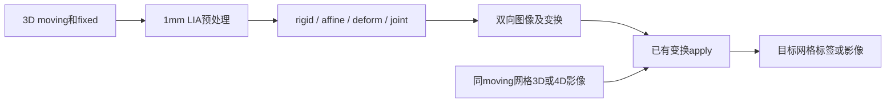

# SynthMorph：配准与 3D/4D 变换应用

[返回首页](../../README.md) · [完整旧文档与更早证据](../../validation/synthmorph/readme_archive_20261005.md)

| 项目 | 内容 |
|---|---|
| 输入 | moving/fixed两幅3D；已有变换可用于同源3D/4D |
| 输出 | 双向配准图及带几何的仿射/位移场 |
| 对应原软件 | FreeSurfer mri_synthmorph / mri_synthmorph apply |
| Python / CLI | fnit.SynthMorph、apply_transform；fnit synthmorph / apply |
| CPU / GPU | CPU/CUDA；读图、坐标准备及保存含CPU步骤 |

## 1. 功能简介

本模块将指定 FreeSurfer 8.2.0 构建中的 TensorFlow/Keras SynthMorph 移植为 PyTorch，支持刚性、仿射、非线性和联合配准，直接读取官方 HDF5 权重。推理不导入 TensorFlow、VoxelMorph、Neurite，也不调用 FreeSurfer。

参考 build 为 `freesurfer-linux-centos7_x86_64-8.2.0-20260314-d932c45`，并非随时变化的开发分支。准确源文件和权重哈希见 [provenance.json](../provenance.json)。

配准模型仅接受单帧3D，已有变换的apply支持末维为frame的4D。默认joint联合仿射和非线性；deform要求已合适仿射对齐，rigid/affine返回矩阵。CUDA默认float32/TF32，无FP16/BF16；CPU构造保持调用方CUDA状态。



<a id="2-python-调用输入与输出"></a>
<a id="应用已有变换"></a>
<a id="固定场bbr与逐帧运动的一次采样"></a>
<a id="公共world变换链的验证范围"></a>

2026-10-02 的独立 apply 优化复用解码后的 float32 数据、坐标与采样索引，并按 frame 限制 CUDA 缓冲。2026-10-04 修复 CPU 最终 linear 的有效域和 nearest 半体素舍入；续修统一 CPU 的 NIfTI 缩放解码，让 rigid/affine 配准图像按返回的仿射重采样，并修正 CPU joint 的置信 mass 与 barycenter 两种归约形状。随后 CPU joint 续修原始坐标插值、显式 oneDNN 小网格卷积与仿射算术顺序，extent192/256 的完整固定门均通过。2026-10-05 在保持输出位模式的前提下，以可回退的 NumBa 循环融合 CPU joint 初始采样，并修复 Conda Python 的缓存权限能力差异。配准模型仍只接受单帧 3D 输入，CUDA 沿用已验收的解码与采样路径。

## 2. Python 调用

```python
from pathlib import Path
from fnit import SynthMorph, apply_transform

registration_output_directory = Path("results")  # 配准与标签结果目录
registration_output_directory.mkdir(parents=True, exist_ok=True)  # 准备保存目录
registration_model = SynthMorph(
    weights="/path/to/weights",  # 已校验的affine和deform权重目录
    device="cuda:0",  # 网络设备，无GPU时用cpu
    model="joint",  # 联合仿射与非线性配准
)
registration_result = registration_model(
    moving="moving_T1w.nii.gz",  # 待配准3D原生图像
    fixed="fixed_T1w.nii.gz",  # 目标3D图像，决定forward网格
)
registration_result.moved.save(registration_output_directory / "moving_in_fixed.nii.gz")  # forward图像
registration_result.fixed_moved.save(registration_output_directory / "fixed_in_moving.nii.gz")  # inverse图像
registration_result.transform.save(registration_output_directory / "moving_to_fixed.mgz")  # 带几何forward场
registration_result.inverse.save(registration_output_directory / "fixed_to_moving.mgz")  # 带几何inverse场
transformed_label_image = apply_transform(
    image="moving_labels.nii.gz",  # 与moving同shape和affine的标签
    transformation=registration_result.transform,  # moving→fixed变换
    method="nearest",  # 最近邻保留整数标签
    dtype="int16",  # 标签存储类型
    device="cpu",  # 采样设备独立于网络设备
)
transformed_label_image.save(registration_output_directory / "labels_in_fixed.nii.gz")  # fixed网格标签
```

### 输入数据格式

- `moving`、`fixed`：有限值单帧3D `(X,Y,Z)`，NIfTI、MGH/MGZ路径或nibabel SpatialImage；各自有效affine，网格与orientation可以不同。强度无固定单位，空间可为原生或明确的模板空间。
- `init`：LTA路径、带source/target几何的AffineTransform，或4×4 world-RAS矩阵；不是FLIRT scaled-mm矩阵。mid_space=True要求init。
- `apply_transform.image`：3D或4D `(X,Y,Z,T)`，前三轴必须匹配原moving/source几何。末维3分量的位移场不能当时间序列。
- CPU路径先按ArrayProxy默认缩放解码，再转模型float32；自有已解码数组不重复缩放。输出mask仅适用于公共World链，必须同目标网格。
- 权重可为目录或affine/rigid/deform映射字典；joint需affine+deform，deform只需非线性模型，rigid/affine各需对应模型。

### 模型构造

| 参数 | 必需 | 类型 | 默认值 | 含义 |
|---|---|---|---|---|
| `weights` | 否 | `str 或 Path 或 dict[str, 路径] 或 None` | `None` | 官方 checkpoint 文件或目录；省略时按显式配置、FNIT_WEIGHTS 和缓存查找 |
| `device` | 否 | `str` | `'cpu'` | 计算设备，cpu 或 cuda:N；编号遵循 CUDA_VISIBLE_DEVICES |
| `model` | 否 | `str` | `'joint'` | joint、deform、affine 或 rigid 配准模型 |
| `extent` | 否 | `int` | `256` | 网络网格每轴体素数，192 或 256 |
| `hyper` | 否 | `float` | `0.5` | 非线性正则化参数，0 < hyper < 1；需重建实例改变 |
| `steps` | 否 | `int` | `7` | stationary velocity scaling-and-squaring次数，至少5 |
| `configure_precision` | 否 | `bool` | `True` | CUDA True 配置默认 TF32，False 保留调用方策略；CPU 不改 CUDA 状态 |

### 配准调用

| 参数 | 必需 | 类型 | 默认值 | 含义 |
|---|---|---|---|---|
| `moving` | 是 | `str 或 Path 或 nibabel SpatialImage` | `—` | 单幅待配准 3D 图像，路径或 nibabel 空间影像 |
| `fixed` | 是 | `str 或 Path 或 nibabel SpatialImage` | `—` | 目标 3D 图像；决定 forward 输出网格 |
| `init` | 否 | `str 或 Path 或 AffineTransform 或 4×4 ndarray 或 None` | `None` | 可选带source/target几何的LTA或4×4 moving→fixed世界坐标矩阵 |
| `mid_space` | 否 | `bool` | `False` | 按初始仿射的中间空间初始化；True 必须有 init |
| `header_only` | 否 | `bool` | `False` | rigid/affine 仅改头信息；不适用于非线性模型 |
| `output_dir` | 否 | `str 或 Path 或 None` | `None` | 结果或调试文件的目录；具体自动保存范围见输出 |
| `transform_only` | 否 | `bool` | `False` | 仅生成变换，跳过最终图像采样 |
| `compute_inverse` | 否 | `bool` | `True` | 同时计算 inverse；False 时反向结果为空 |
| `precision_report` | 否 | `list[dict] 或 None` | `None` | 可选列表，追加实际前向设备、dtype、TF32 和 autocast 记录 |

### apply_transform参数

| 参数 | 必需 | 类型 | 默认值 | 含义 |
|---|---|---|---|---|
| `image` | 是 | `str 或 Path 或 nibabel SpatialImage` | `—` | 输入影像，格式、维数与预处理约束见输入数据格式 |
| `transformation` | 是 | `str 或 Path 或 SpatialImage 或 AffineTransform 或 DenseWarp 或 WorldTransformChain` | `—` | 带 source/target 几何的 Affine、DenseWarp 或公共 WorldTransformChain |
| `method` | 否 | `str` | `'linear'` | linear、nearest；World链另支持公共 volume 的 spline/边界合同 |
| `fill` | 否 | `float 或 None` | `0` | 普通变换的视野外填充值；None 使用最近边界值。World链只接受0 |
| `dtype` | 否 | `str` | `'float32'` | 输出体素dtype；标签应选整数型并用nearest |
| `header_only` | 否 | `bool` | `False` | rigid/affine 仅改头信息；不适用于非线性模型 |
| `device` | 否 | `str` | `'cpu'` | 计算设备，cpu 或 cuda:N；编号遵循 CUDA_VISIBLE_DEVICES |
| `frame_chunk_size` | 否 | `int 或 None` | `None` | 正整数帧缓冲上限；None 自动按CPU/显存预算分块 |
| `boundary` | 否 | `str` | `'grid-constant'` | grid-constant 或公共World链支持的边界政策 |
| `output_mask` | 否 | `str 或 Path 或 nibabel SpatialImage 或 None` | `None` | World链可选目标网格mask；普通变换不支持时明确报错 |
| `spatial_chunk_size` | 否 | `int` | `262144` | 公共World链每次查询空间点数，正整数；普通变换只接受默认值 |

### convert_warp_to_fsl参数

| 参数 | 必需 | 类型 | 默认值 | 含义 |
|---|---|---|---|---|
| `warp` | 是 | `str 或 Path 或 nibabel SpatialImage` | `—` | fixed网格的 SynthMorph world-RAS pull 位移，形状(X,Y,Z,3)，mm |
| `moving` | 是 | `str 或 Path 或 nibabel SpatialImage` | `—` | 单幅待配准 3D 图像，路径或 nibabel 空间影像 |
| `fixed` | 是 | `str 或 Path 或 nibabel SpatialImage` | `—` | 目标 3D 图像；决定 forward 输出网格 |

### 输出

```text
results/
├── moving_in_fixed.nii.gz  # fixed网格float32影像
├── fixed_in_moving.nii.gz  # moving网格float32影像
├── moving_to_fixed.mgz    # fixed网格(X,Y,Z,3) RAS-mm pull场
├── fixed_to_moving.mgz    # moving网格(X,Y,Z,3) RAS-mm pull场
└── labels_in_fixed.nii.gz # fixed网格int16标签
```

`RegistrationResult`含moved、fixed_moved、transform、inverse；transform_only=True时图像为None。compute_inverse=False仅允许非线性、transform_only=True且无调试目录。Python仅显式save；output_dir只写inp_1.nii.gz、inp_2.nii.gz及network_transforms.npz。

rigid/affine返回world-RAS forward矩阵，保存`.lta`；deform/joint的DenseWarp名称表示moving→fixed任务，但存储在fixed网格上的fixed→moving **pull相对位移**，单位mm。inverse反向同理。NIfTI场为(X,Y,Z,3)、intent1007，不携带FreeSurfer完整source/target扩展；外部文件使用前须保留原图几何。

apply结果在transformation.target网格，4D保留frame顺序和时间header。连续图linear、标签nearest；普通Affine/DenseWarp只用float32采样。WorldTransformChain可组合固定场、world-RAS BBR和逐帧HMC，样条/周期边界沿用[公共volume合同](../applywarp/README.md)；其完整构造及一次采样例见[旧版细节归档](../../validation/synthmorph/readme_archive_20261005.md#固定场bbr与逐帧运动的一次采样)。

`convert_warp_to_fsl(warp,moving=...,fixed=...)`返回fixed网格float32、intent2006的FSL relative field；必须同时给两幅原图，不可只改intent。

普通apply的None分帧CPU最多32帧，CUDA按已驻留坐标后的20,000,000,000B预算和最多8GiB变化缓冲选择；显式分块超预算报错。World链None为8帧，fill固定0、不能header_only；普通变换只接受默认boundary、无output_mask及默认spatial_chunk_size。

## 3. 命令行调用

```bash
fnit synthmorph moving_T1w.nii.gz fixed_T1w.nii.gz --device cuda:0 \
  -o results/moving_in_fixed.nii.gz -O results/fixed_in_moving.nii.gz \
  -t results/moving_to_fixed.mgz -T results/fixed_to_moving.mgz
fnit apply results/moving_to_fixed.mgz moving_labels.nii.gz results/labels_in_fixed.nii.gz -m nearest -t int16
```

### fnit synthmorph

| CLI 参数 | Python 参数 / 输出 | 含义 |
|---|---|---|
| `moving` | `moving` | 单幅待配准 3D 图像，路径或 nibabel 空间影像 |
| `fixed` | `fixed` | 目标 3D 图像；决定 forward 输出网格 |
| `-m` / `--model` | `model` | joint、deform、affine 或 rigid 配准模型 |
| `--weights` | `weights` | 官方 checkpoint 文件或目录；省略时按显式配置、FNIT_WEIGHTS 和缓存查找 |
| `--device` | `device` | 计算设备，cpu 或 cuda:N；编号遵循 CUDA_VISIBLE_DEVICES |
| `-o` / `--out-moving` | `result.moved.save` | moving在fixed网格图像 |
| `-O` / `--out-fixed` | `result.fixed_moved.save` | fixed在moving网格图像 |
| `-t` / `--trans` | `result.transform.save` | moving→fixed变换保存路径 |
| `-T` / `--inverse` | `result.inverse.save` | fixed→moving变换保存路径 |
| `--fsl-warp` | `convert_warp_to_fsl` | 另存FSL relative warp |
| `-i` / `--init` | `init` | 可选带source/target几何的LTA或4×4 moving→fixed世界坐标矩阵 |
| `-M` / `--mid-space` | `mid_space` | 按初始仿射的中间空间初始化；True 必须有 init |
| `-H` / `--header-only` | `header_only` | rigid/affine 仅改头信息；不适用于非线性模型 |
| `-e` / `--extent` | `extent` | 网络网格每轴体素数，192 或 256 |
| `-r` / `--hyper` | `hyper` | 非线性正则化参数，0 < hyper < 1；需重建实例改变 |
| `-n` / `--steps` | `steps` | stationary velocity scaling-and-squaring次数，至少5 |
| `-j` / `--threads` | `threads` | PyTorch CPU 线程预算；None 保留当前值，CLI 默认另见下节 |
| `-d` / `--output-dir` | `output_dir` | 结果或调试文件的目录；具体自动保存范围见输出 |

### fnit apply

| CLI 参数 | Python 参数 / 输出 | 含义 |
|---|---|---|
| `transform` | `transformation` | 带几何的变换文件 |
| `image` | `image` | 输入影像，格式、维数与预处理约束见输入数据格式 |
| `output` | `结果保存路径` | 输出影像路径 |
| `-m` / `--method` | `method` | linear、nearest；World链另支持公共 volume 的 spline/边界合同 |
| `-f` / `--fill` | `fill` | 普通变换的视野外填充值，CLI只接受数值，默认0；Python另支持None |
| `-t` / `--dtype` | `dtype` | 输出体素dtype；标签应选整数型并用nearest |
| `-H` / `--header-only` | `header_only` | rigid/affine 仅改头信息；不适用于非线性模型 |
| `--device` | `device` | 计算设备，cpu 或 cuda:N；编号遵循 CUDA_VISIBLE_DEVICES |
| `--frame-chunk-size` | `frame_chunk_size` | 正整数帧缓冲上限；None 自动按CPU/显存预算分块 |

CLI与Python默认差异：CLI线程4，Python构造无threads；CLI apply不暴露World链全部参数。

## 4. 原软件调用

以下命令用于独立原软件参考环境；FNIT生产入口不执行它。

```bash
mri_synthmorph register -m joint -o reference/moving_in_fixed.nii.gz \
  -O reference/fixed_in_moving.nii.gz -t reference/moving_to_fixed.mgz \
  -T reference/fixed_to_moving.mgz moving_T1w.nii.gz fixed_T1w.nii.gz
mri_synthmorph apply -m nearest -t int16 reference/moving_to_fixed.mgz \
  moving_labels.nii.gz reference/labels_in_fixed.nii.gz
```

| FNIT参数 / 产物 | 原软件参数 / 产物 |
|---|---|
| model / extent / hyper / steps | -m / -e / -r / -n |
| moving / fixed / init / mid_space | 位置参数 / -i / -M |
| moved / fixed_moved / transform / inverse | -o / -O / -t / -T |
| header_only / output_dir | -H / -d |
| apply method / fill / dtype | apply -m / -f / -t |
| apply device / frame_chunk_size | FNIT采样设备/分帧；原版无同名控制 |

模型和权重固定到参考build。原版NIfTI warp通常(X,Y,Z,1,3)、intent1006并带源/目标几何，与FNIT NIfTI保存格式不同。header_only只支持刚性/仿射。World链spline为新增公共采样入口，不是SynthMorph模型新算法。

<a id="配准调用与结果"></a>
<a id="4d-影像示例"></a>
<a id="此处文件是已经转换好的world-ras-bbr不能直接传flirt-scaled-mm-mat"></a>
<a id="转成-fsl-warp-并应用"></a>
<a id="moving_4d需与原moving具有相同采样几何"></a>
<a id="省略--frame-chunk-size变化帧缓冲最多8-gib并检查已驻留坐标后的剩余20-gb预算"></a>
<a id="若显式指定--frame-chunk-size-8每次最多8帧同样检查剩余额度"></a>
<a id="5-精度运行时间与脑图"></a>
<a id="51-当前-cpu-续修对照2026-10-04"></a>
<a id="511-已归档-cpu-初轮官方对照2026-10-04"></a>
<a id="52-已归档-4d-数据流优化2026-10-02"></a>
<a id="53-已归档-joint-配准2026-09-27"></a>
<a id="54-已归档-fsl-warp-转换真实-t1w"></a>

## 5. 最新精度和运行时间

### 5.1 最新 CPU joint 采样优化：2026-10-05

CPU joint 的原始体素坐标八角采样现在可使用仓库自写的 NumBa FP32 循环，将索引、权重和八角累加合在一次遍历中；`fastmath=False`，保留逐角顺序。PyTorch 继续建立原坐标、运行网络及生成最终输出，Python/CLI 参数不变。新增路径只接受 Linux x86 CPU、float32、无梯度、无 autocast、有限数据及至少 32,768 个输出位置；不满足条件、NumBa 缺失/JIT 禁用或编译失败时调用原 Torch 路径。线程预算取当前 Torch 和 NumBa 的较小值，退出时恢复 NumBa mask。`FNIT_SYNTHMORPH_CPU_RAW_NUMBA=0` 可关闭这一优化；默认开启，不启用半精度。

同一公开 OpenNeuro ds003138 v1.0.1 / CC0 双 T1 在固定八物理核、OMP/MKL/OpenBLAS/NumBa/Torch 各八线程下重新完整运行。实际输入及外置权重的大小/SHA 先验核对；两份冻结源码的全部 1,231 / 1,232 文件逐一校验。四次默认 extent256 CLI、extent192 CLI 和完全物化 API 均完成；两图两场的**全数组位模式、完整 header/extensions/affine、shape 和 dtype**与已验收 v29 相同，沿用其官方固定误差门。原版 CNN 没有重跑，没有调整容差。[完整输出、后端、源码及资源报告](../../validation/synthmorph/cpu_fixes_20261004/full_sampler_v35.public.json)。

| 完整新进程，默认 extent256 | 原 Torch v34（秒） | NumBa v35（秒） |
| --- | ---: | ---: |
| 第一对 A1 → C1 | 171.484 | 159.966 |
| 第二对 C2 → A2 | 154.704 | 150.207 |
| 两次中位数 | 163.094 | 155.086 |

顺序为 **A1 → C1 → C2 → A2**。C1 的 NumBa disk cache 初始为空，完整时间包括懒导入/JIT；C2 是复用该 cache 的新进程。两边都已有 Eigen 构建缓存。该组中位时间下降 **4.91%**，但仅一组共享节点观测，load 44–57、页面缓存未清空，不能推广为稳定倍数。256 sampled process-tree RSS 为 11.718–11.799 GB。extent192 / hyper0.75 / steps5 为 **87.383 s**、RSS **5.449 GB**；它单列，不与默认256的两对计时混合。

完全物化 API 的输入读取/物化 **1.016 s**、模型加载 **3.619 s**、API **121.043 s**、保存 **21.466 s**；含 observer、诊断数组保存及启动的完整 worker **166.986 s**，RSS **12.081 GB**。两幅图像和两个场与完整 CLI 相同，输入不变。两个 detector 为 2.314 / 2.197 s、affine inclusive 4.740 s、两个 deform 50.241 / 50.498 s、顶层网络111.163 s；这些时钟有嵌套，不能相加。

同源码的有限真实采样门验证 raw 和 normalized 各 **47,710,208 值**逐位相同。每图暖 ABBA：192 为 Torch **0.593804 s** / NumBa **0.110970 s**，256 为 **1.958145 s** / **0.322657 s**。独立空 cache 256 首次调用计入懒导入与 JIT，NumBa **2.331800 s**，Torch **2.076089 s**，冷调用慢 **12.3%**；局部暖速比不代表完整配准速比。[最终采样门与冷启动记录](../../validation/synthmorph/cpu_raw_sampler_20261004/README.md)。

在 Morph 冻结 v35 中，GPU 入口、六个核心文件和全局 TF32/cuDNN 策略与父版相同；[GPU 隔离审计](../../validation/synthmorph/cpu_fixes_20261004/gpu_route_v35.public.json)另含 CPU guard/入口 AST、三种实际小 CUDA 采样逐位一致及 helper 未导入。当前整合版的五个普通配准核心及 CPU helper 仍匹配该版；共享 World 已合入另一任务的 CPU 修订，详见[整合绑定与范围](../../validation/smri_cpu/synthmorph_integration_binding_20261005.json)。普通 joint 不调用 World 分支，既有完整 H100 两图两场和 reserved **17,836,277,760 bytes** 证据保留，本次未重跑 GPU CNN或性能。当前 World sampler 另有[完整 490 帧 H100 旧新逐字节相同记录](../../validation/multimodal_cpu_20261004/gpu_world_v20_20261004.public.json)，但不覆盖3D时间header修订或整合 wrapper 全参数。下节脑图来自 v29，v35 同输入位模式相同。

### 5.1.1 CPU joint 精度续修及其他模式回归：2026-10-04

最新实现修复 CPU joint 的首次分歧：NIfTI 默认缩放后转 float32；初始网络输入按原始体素坐标有序八角插值；仿射特征显式采用 oneDNN 卷积；置信、XYZ moments、4×4 LU/solve、平方根与中心组合保留明确的 FP32 次序。既有 rigid/affine 返回变换与最终图像的 pull 契约保留。最终采样、权重、deform 网络、速度积分、standalone affine/rigid 以及全部 CUDA 公式保持。各入口、局部 hook、训练和 autocast 的保护条件另有回归。

真实输入为 OpenNeuro `ds003138` v1.0.1 的两幅完整 `224×288×288` T1w（CC0）。当前所有 CLI 在 **nodecw7**，8 线程、同八物理核及同组锁；没有使用 nodecw10 时间。页面缓存未清空，节点有大量外部内存任务与存储等待，以下是实际观测。

| 默认 extent256 | 当前完整 CLI（秒） | 固定双向精度门 |
|---|---:|---|
| rigid | 22.791 | 完整两图/LTA 与已验收输出一致；原版完整 source 网格世界误差最大 `0.000142410 / 0.000961941 mm`，所有影像区域通过 |
| affine | 21.536 | 完整两图/LTA 与已验收输出一致；世界误差最大 `0.000237338 / 0.000126700 mm`，inverse 上边界 NRMSE `1.11984e−5`，全部通过 |
| deform | 162.754 | 两图两场与已验收输出逐值相同；场 RMSE `1.02277e−5 / 1.01477e−5 mm`，全部通过 |
| joint | 184.288 | 场 RMSE `1.31021e−5 / 1.68163e−5 mm`，正向 27,653 个参考零边界点误差全为零，inverse 上边界 NRMSE `3.42879e−6`，全部通过 |

`joint extent192 / hyper0.75 / steps5` 的完整 CLI `100.162 s`、RSS `6.312 GB`；两向场 RMSE `9.85699e−6 / 1.05717e−5 mm`，32,866 个正向参考零边界点误差全为零，inverse 上边界 NRMSE `1.59068e−6`。extent256 RSS `11.763 GB`。两配置均通过完整全 FOV、官方脑 mask、上边界、图像和场的原门。仿射全 source 网格世界误差最大≤`0.001 mm`，dense 分量最大≤`0.001 mm`/RMSE≤`0.0001 mm`；连续图像 NRMSE≤`0.001`，零动态范围区域要求严格零误差。没有改容差或补零。

当前相邻 A-C-R-C-A 顺序中，已发布 v7 CLI `182.312 / 170.276 s`，v29 `194.054 / 176.282 s`，中位数 `176.294 / 185.168 s`；新 CPU 约慢 `5.0%`。同节点原版完整 CLI 为 `691.550 s`，共享负载与 I/O 干扰显著，不宣称稳定加速倍数。分步骤、GNU time user/sys、上下文切换、缺页和 I/O 及实际时序保存在[最新 JSON](../../validation/synthmorph/cpu_fixes_20261004/joint_precision_v29.public.json)。历史 v7 四模式 main/原版对照和 v10–v23 未过候选分别归档，不作为新计时。

当时冻结版的完整物化 joint API 与路径 CLI 两图、两场及全部元数据相同，输入未修改：读取/物化 `1.003 s`、模型加载 `4.039 s`、API `146.031 s`、保存 `23.837 s`，observer worker `194.019 s`。rigid/affine 保存 LTA 后双向回放，图像与完整头一致。该冻结版没有改共享 World，保留真实两帧 DWI 三入口×三插值回归；当前整合版已含上文单列的 World 修订，历史记录不改标为新实测。

当前 H100 GPU1（实际 UUID 及公共锁记录见 JSON）完整 joint v7/v29 pair 的两图两场 SHA 和完整图像元数据相同，reserved 均 `17,836,277,760 bytes`，19 GB quota。旧/新 API `6.90588 / 6.83554 s`，完整 worker `45.1056 / 40.1046 s`；两入口均未加载 CPU helper。存在外部 GPU 任务，只列同场观测。最终 inference policy 的新增 guard 对这条 CUDA 路线直接返回，数学正文另经 AST 审计；同保存真实 CPU 输入的最终 guard 源码与 v29 features/矩阵逐值相同。

CPU joint 的 Eigen 适配器是 FNIT 自有小段 C++，不调用原软件。主页 Conda 环境固定 `eigen=3.4.0`、GCC/GXX `11`；wheel/sdist 包含 `.cpp`。首次 CPU joint 推理懒编译，默认缓存 `~/.cache/fnit/synthmorph/cpu_eigen`；`FNIT_SYNTHMORPH_BUILD_CACHE` 可指定缓存，`CXX`/`FNIT_EIGEN_INCLUDE` 可指定独立 Conda compiler/headers。缺少依赖或 headers 版本不是 `3.4.0` 时会报清晰错误。cache identity 绑定源码、Eigen headers、compiler/flags 和 binary SHA；编译末尾显式关闭 fast-math/FMA contraction。缓存目录和文件限定为当前用户拥有的普通目录/文件，权限分别为 `0700`/`0600`，拒绝符号链接和文件硬链接。锁等待上限 20 秒，共享文件系统 ENOLCK 最多尝试 3 次；compiler 版本查询上限 5 秒，编译上限 60 秒，超时只结束本次编译子进程组。首次含构建的阶段 `18.191 s`、完整 stage worker `20.526 s`，已有缓存阶段进程 `2.255 s`；上面 CLI 已有编译缓存。其他模式、CUDA、训练不加载该适配器。

**2026-10-05 缓存兼容修复（v34）**：nodecw7 的 Conda Python 不支持 `chmod(..., follow_symlinks=False)`，v33 在编译前抛出 `NotImplementedError`。现通过 `O_DIRECTORY | O_NOFOLLOW` 打开目录，对同一文件描述符检查用户所有权、设置并再次确认 `0700`；无法执行权限策略的文件系统明确报错。源码、Eigen 版本和数值计算保持原定义，失败记录保留。

新冻结 v34 在独立 Conda Eigen `3.4.0` / GCC `11.4.0` 下重新编译，两种 extent 保存的 **8 个真实 4×4 矩阵**与旧适配器结果逐位相同，重复调用也相同。实际目录为 `0700`、三份缓存文件为 `0600`。首次构建及调用 `19.581485 s`，同进程缓存调用 `0.000058 s`，包含导入和读写的整个验证 `22.288850 s`；这些是矩阵阶段，完整配准不在本次时钟中。[完整源码、529 份头文件、compiler、binary 绑定及失败记录](../../validation/synthmorph/cpu_fixes_20261004/eigen_loader_v34.public.json)。最终缓存能力合同 9 项通过，包含上述平台能力缺失及文件系统不落实权限时的拒绝行为。


显示前应用独立原版脑 mask 并裁出脑部显示框；数值验收始终使用完整 FOV。差图色标为脑内绝对误差 P99，最低0.01；完整误差、版本、源码/权重/输出指纹、所有失败历史和复现命令见[续修说明](../../validation/synthmorph/cpu_fixes_20261004/README.md)。

## 6. 最近版本和 benchmark

| 日期 | 更新 | 验证记录 |
|---|---|---|
| 2026-10-05 | CPU有序NumBa采样、安全Eigen cache平台修复；GPU入口与数学源码保留 | [完整192/256/API全同，256单共享节点ABBA中位下降4.91%；暖/冷采样分别列出](../../validation/synthmorph/cpu_fixes_20261004/full_sampler_v35.public.json)；[GPU隔离审计](../../validation/synthmorph/cpu_fixes_20261004/gpu_route_v35.public.json) |
| 2026-10-04 joint 续修 | 原始坐标输入、oneDNN 小网格卷积、有序仿射算术、Eigen3.4.0；保护训练/hooks/autocast，CUDA 保留 | [192/256 全门、物化 API、三模式输出保持、GPU joint pair、当前 CPU 约慢5%](../../validation/synthmorph/cpu_fixes_20261004/README.md) |
| 2026-10-04 已归档 v7 | CPU NIfTI 解码、rigid/affine 返回仿射契约、joint 两种归约形状；GPU 原公式保留 | [nodecw7 四模式全部固定门、物化对象/192明确未过项、H100 affine 当前源码和 shared World](../../validation/synthmorph/cpu_fixes_20261004/README.md) |
| 2026-10-04 | CPU 构造精度隔离、最终 linear 有效域/affine 坐标、nearest 半体素舍入、积分 grid 复用与 init debug 几何；GPU 原路径保留 | [四模式、参数、独立 apply、GPU 回归与明确未过项](../../validation/synthmorph/cpu_20261004/README.md)；历史 4D 的 CPU 逐位结论不作为本次边界修复版结论 |
| 2026-10-02 | `WorldTransformChain` 接入公共volume采样器，支持同一次插值中的固定场、BBR与逐帧HMC，新增spline/边界/mask参数 | `tests/synthmorph/test_world_transform.py` 契约测试；[完整 490 帧 API、矩阵/调用门与脑图](../../validation/fmri/public_resamplers_20261002/README.md)通过 |
| 2026-10-02 | 独立apply一次解码、float32输入复用、坐标复用、可选CUDA与frame chunk，仿射准备复用voxel grid | [本轮真实影像报告](../../validation/registration_lossless_20261002/README.md)；完整490帧同设备位模式、header与保存重读均通过 |
| 2026-10-02 | 修复既有 `(X,Y,Z,1)` 输入重采样后折叠为3D的bug；现在保留单例frame轴，registration的3D返回不变 | `test_apply_preserves_singleton_frame_dimension` |
| 2026-09-28 | 归档公开去面部T1w图例及固定测量源码关系 | [公开例子](../../validation/synthmorph/public_example.current.json)、[历史说明](../../validation/synthmorph/README.md) |
| 2026-09-27 | 12例真实T1w joint与官方CPU/GPU配准基准 | [历史双环境记录](../../validation/synthmorph/README.md)，不是本轮4D计时 |

更早的完整图、逐模式测量和资源说明见[归档手册](../../validation/synthmorph/readme_archive_20261005.md)。以上当前结果均绑定各自冻结源码，不把文档合并计作重新测试。

## 7. 参考文献、原软件和资源

- 参考文献：Hoffmann et al., *Anatomy-aware and acquisition-agnostic joint registration with SynthMorph*, Imaging Neuroscience (2024), [doi:10.1162/imag_a_00197](https://doi.org/10.1162/imag_a_00197)。
- 原实现代码库：[FreeSurfer `mri_synthmorph`](https://github.com/freesurfer/freesurfer/tree/dev/mri_synthmorph)；[VoxelMorph TensorFlow 分支](https://github.com/voxelmorph/voxelmorph/tree/dev-tensorflow)。

- [SynthMorph论文全文](https://pmc.ncbi.nlm.nih.gov/articles/PMC11247402/)；[官方CLI源码](https://github.com/freesurfer/freesurfer/blob/dev/mri_synthmorph/mri_synthmorph)、[官方registration wrapper](https://github.com/freesurfer/freesurfer/blob/dev/mri_synthmorph/synthmorph/registration.py)。开发分支用于浏览，复现依据为本页固定构建和provenance哈希。
- [Surfa原代码库](https://github.com/freesurfer/surfa)：官方apply的几何、warp格式与多frame插值；独立参考为FreeSurfer 8.2附带的Surfa 0.6.3。
- World链的preproc/clean原软件参照、坐标和样条依据沿用[volume原实现说明](../fmri/normalization.md#参考文献与原实现)；原软件运行命令见[volume对照](../fmri/README.md#4-原软件调用)。

### FNIT源码组织

| 文件 | 责任 |
|---|---|
| [models.py](../../src/fnit/synthmorph/models.py) | affine/rigid 特征网络、HyperVxmJoint、HDF5 读取与权重特化 |
| [pipeline.py](../../src/fnit/synthmorph/pipeline.py) | 图像几何、预后处理、双向结果与 apply |
| [spatial.py](../../src/fnit/synthmorph/spatial.py) | 复用坐标的采样计划、仿射/位移组合和积分 |
| [_cpu_raw_sampler.py](../../src/fnit/synthmorph/_cpu_raw_sampler.py) | 可回退的CPU joint有序FP32八角采样；不更改GPU入口 |
| [fsl_warp.py](../../src/fnit/synthmorph/fsl_warp.py) | RAS 位移转换为 fixed 网格 FSL relative warp |
| [_transforms.py](../../src/fnit/_transforms.py) | 带 source/target geometry 的 `AffineTransform`、`DenseWarp` 及 LTA 读写 |
| [_world_resampling.py](../../src/fnit/_world_resampling.py) | 从成熟volume实现抽取的world坐标链及共享linear/nearest/cubic采样器 |
| [__init__.py](../../src/fnit/synthmorph/__init__.py) | 功能公开导出 |

模型使用下列官方原始文件，Git/wheel不包含。固定[assets-v1 Release](https://github.com/weikanggong1/Fudan-Neuroimaging-toolkit/releases/tag/assets-v1)及公开asset-manifest与当前weights.py逐项大小/SHA记录一致；本轮未重新下载所有大文件。安装器先Release再原站；完整清单见[资源文件清单](../RESOURCE_MANIFEST.md)。

```bash
fnit-setup-weights --model synthmorph-joint --model synthmorph-rigid --dest /data/fnit-weights
fnit-setup-weights --model synthmorph-joint --model synthmorph-rigid --dest /data/fnit-weights --verify-only
```

| 资源 | 用途 | 官方来源 | 大小 | SHA-256 | 是否允许 FNIT 再分发 |
|---|---|---|---|---|---|
| `synthmorph.rigid.1.h5` | 官方推理权重 / 标签数组 | [原站](https://surfer.nmr.mgh.harvard.edu/docs/synthmorph/synthmorph.rigid.1.h5) | 51,656,152 B | `284c145fce47e98ecf3fdeda2163f646ac3ebb0240e87dd50d71d879f4d5b3af` | 允许；CC BY 4.0，保留归属 |
| `synthmorph.affine.2.h5` | 官方推理权重 / 标签数组 | [原站](https://surfer.nmr.mgh.harvard.edu/docs/synthmorph/synthmorph.affine.2.h5) | 51,455,312 B | `1ac5304b683036e5177f5b4ad38fa09fcbbe7883e742d6fa5bdaedd0e619ced6` | 允许；CC BY 4.0，保留归属 |
| `synthmorph.deform.3.h5` | 官方推理权重 / 标签数组 | [原站](https://surfer.nmr.mgh.harvard.edu/docs/synthmorph/synthmorph.deform.3.h5) | 3,508,630,424 B | `95b367cd30788cc647e4704b650642fc1d70d7e419c20c04f1ba1b2902bc6536` | 允许；CC BY 4.0，保留归属 |

本页列出的模型/数组共3个，3,611,741,888 B。原始文件许可及归属见[统一资源规则](../WEIGHTS.md#权重许可与归属)。模型推理从本地加载已准备资源。
