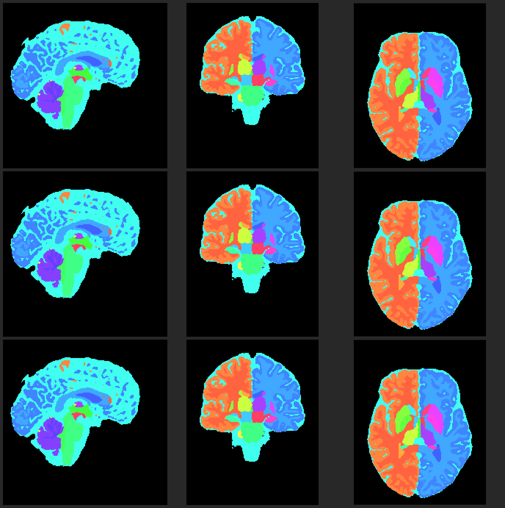

# SynthSeg 可选 CPU 列缓冲复用（完整候选验收，2026-10-06）

## 1. 功能简介

该候选在 SynthSeg 33 类网络最后一级 `SegmentUNet.up[3].conv0` 复用一次调用内的列缓冲。输入仍按原来的14层slab展开，矩阵尺寸、通道和卷积核顺序、FP32、bias预填以及当前Torch已加载的LP64 SGEMM保持。缓冲在该层返回后释放，不缓存大张量、不改变全局allocator。

只有已验收权重、`[1,72,192,224,256]` 输入、72→24通道、3×3×3卷积、8个CPU线程、eval/no-grad、oneDNN关闭且无autocast/hooks/forward-AD时启用。未知shape、权重、运行库或编译环境继续使用成熟CPU分块卷积。Tensor子类、懒negative/conjugate视图也继续原路径。CUDA、训练和通用slab代码不使用这个候选。

**同输入阶段与CPU/GPU整例验收通过；整合源码绑定及发布记录见 [ROOT_REVIEW.json](../../validation/smri_cpu/seg_columns_integration_20261006/ROOT_REVIEW.json) 和 [总表](../../validation/smri_cpu/README.md)。新独立Conda安装尚未测试。** 该候选不是新的分割模型，也不改变公共API。

## 2. Python调用、输入与输出

```python
from pathlib import Path
import nibabel as nib
from fnit import SynthSeg, SynthSegPlus

input_t1_path = Path('/data/example/T1w.nii.gz')  # 单幅3-D T1；保留原affine/header。
external_weights_directory = Path('/data/fnit-weights')  # 已校验的H5和标签数组。
output_segmentation_path = Path('/data/output/segmentation.nii.gz')
output_volumes_path = Path('/data/output/volumes.csv')

segmenter = SynthSeg(
    weights=external_weights_directory,  # 默认None使用FNIT已声明资源目录。
    device='cpu',                       # CUDA仍使用既有PyTorch路径。
    threads=8,                          # 本候选仅接受8；其他预算继续原CPU路径。
    cudnn_tf32=True,                     # 原默认不变；只作用于CUDA前向。
)
segmentation_result = segmenter(
    input_t1_path,
    keep_geometry=False,                # False输出约1-mm RAS网格；True恢复输入网格。
    color_lut=None,                      # 可传已有色表路径，不改变标签数值。
)
nib.save(segmentation_result.segmentation, output_segmentation_path)
segmentation_result.write_volumes_csv(input_t1_path, output_volumes_path)

# 公共--parc接口示例。默认CPU oneDNN开启时保持原路径，不强行切换后端。
parcellator = SynthSegPlus(
    weights=external_weights_directory,
    parc_weights=external_weights_directory,
    device='cpu',
    cudnn_tf32=True,
)
parcel_result = parcellator(
    input_t1_path,
    keep_geometry=True,  # Plus默认输出原T1网格。
    fast=False,          # True省去左右翻转集成，保留既有fast后处理。
    min_pad=128,         # 预处理最小padding；实际网格还需满足网络32倍数。
    volumes=True,        # 返回软体积，允许write_volumes_csv。
)
```

输入仍是NIfTI路径或普通SynthSeg接受的nibabel影像；模型通过外置原始H5和NPY加载。输出仍是整数分割影像、按标签的mm³软体积、总颅内容积、标签名及真实前向precision记录。Plus另返回皮层脑区和合并图，字段和顺序不变。完整参数与输出表见 [SynthSeg](README.md)、[Plus](../synthseg_plus/README.md) 和 [已有精度策略](../../validation/smri_cpu/seg_tf32_20261005/README.md)。本候选没有新的用户算法参数。

普通33类 `SynthSeg.__call__` 的CPU调用关闭oneDNN，同形状原图和翻转两pass均可资格检查。`SynthSegPlus` / `run_synthseg_parc_t1` 共用相同33类网络：调用方oneDNN=False时，普通模式两pass、fast一pass可检查；当前公开CPU默认oneDNN=True时继续成熟路径。皮层 `ParcUNet` 没有标记，不启用候选。未知权重即使网络结构相同也不启用。

## 3. 命令行及Conda缓存

```bash
# 公共命令保持不变，候选无需新开关。
fnit-synthseg --i /data/example/T1w.nii.gz \
  --o /data/output/segmentation.nii.gz --vol /data/output/volumes.csv \
  --weights /data/fnit-weights --device cpu --threads 8
fnit-synthseg --i /data/example/T1w.nii.gz \
  --o /data/output/combined.nii.gz --parc --fast \
  --weights /data/fnit-weights --device cpu --threads 8

# 主页环境已包含GCC/G++11，不增加依赖；从仓库根创建环境。
conda env create -f environment.yml
conda activate fnit
fnit-setup-weights --model synthseg --dest /data/fnit-weights
fnit-setup-weights --model synthseg --dest /data/fnit-weights --verify-only
```

每次合资格CPU层调用校验已有Torch头文件/库、provider和GCC11；首次未命中私有cache时编译FNIT自有4,385B胶水。可用环境变量：`CXX`指定一个GCC11编译器可执行文件，不能附参数；`FNIT_SYNTHSEG_CPU_CACHE`指定本人拥有的0700缓存目录；未指定时使用`$XDG_CACHE_HOME/fnit/synthseg_columns`，或`~/.cache/fnit/synthseg_columns`。锁和产物为0600，按源码、运行库、头文件、provider、编译器、ABI和flags生成键，原子发布。无编译器或不匹配库时数学开始前回退原卷积；开始候选数值后异常传播，不暗中重复卷积。

CPU目标是Linux x86_64、Torch2.5.1/ABI0、已验收运行库SHA及MKL LP64 provider；其他平台/版本先回退。动态库不打包，weight和MRI也不进入wheel。编译子进程最多120秒、退出收尾5秒，锁等待15秒；仅编译子进程CUDA不可见，不写调用方环境、线程、TF32或autocast。已有Conda/GCC11目标环境已经真实构建加载及短数值合同通过，**全新独立Conda安装尚未测试**。

## 4. 原软件调用与原步骤

```bash
# 仅独立官方benchmark环境运行；FNIT生产不会调用该命令。
mri_synthseg --i /data/example/T1w.nii.gz \
  --o /data/reference/segmentation.nii.gz --vol /data/reference/volumes.csv \
  --cpu --threads 8
```

原软件的这一个内部卷积层没有独立CLI。候选保持原成熟CPU路径的14-plane slab，K=1944、N=24、M=802816（最后10层M=573440），NN、lda/ldc=实际紧凑M、ldb=1944、alpha=beta=1。自己的copy胶水调用的是已经加载的公共SGEMM，不是隐藏的ATen CPUBlas/Unfold3d wrapper；不加载其他BLAS。

## 5. 最新完整精度、时间及内存

本轮同原始CC0 OpenNeuro ds003138 v1.0.1 case02 T1、同nodecw7/8物理核运行4个完整CPU新进程，既有正式官方输出和55.0464秒冷进程时钟复用，无新官方运行。原图SHA、H5、配置和17生产源/4支持源前后固定。[完整源绑定报告](../../validation/smri_cpu/seg_columns_integration_20261006/README.md) 与 [机械结果](../../validation/smri_cpu/seg_columns_integration_20261006/RESULTS.json) 保留全arm/raw receipt。

| CPU arm | 冷进程秒 | API秒 | 构造/保存秒 | 最大RSS GB | 编译 |
|---|---:|---:|---:|---:|---:|
| A1原 | 107.5875 | 104.7752 | 0.1595 / 0.1707 | 13.5211 | 0 |
| B1候选cold | 90.7195 | 88.0436 | 0.1535 / 0.1505 | 13.3990 | 1 |
| B2候选warm | 89.5184 | 86.7436 | 0.1588 / 0.1517 | 13.4457 | 0 |
| A2原 | 108.2877 | 105.5134 | 0.1685 / 0.1543 | 13.4589 | 0 |

同例两arm中位数冷进程107.9376→90.1189秒，API105.1443→87.3936秒，观察耗时分别下降16.51%/16.88%。cold计入全新独立cache编译，warm是同cache的新进程；两个API都包含每个命中层的参数/runtime/header/provider哈希和compiler probe。cold进程还含source/input校验、imports、构造、保存和收尾。官方CLI含module/import/推理/主图/CSV；时钟与输出边界分别列明，**完整同线程官方速度门仍未通过**，不能把87秒API说成比55秒CLI快。

四个CPU完整gzip/CSV SHA相同，9,072,000体素新旧差0、各label Dice1、硬体积和软CSV差0，完整NIfTI所有struct字段/13个常规geometry及extension控制相同。与官方仍差1体素（CSF少1、背景多1）；最低前景Dice0.99999856858，软CSV最大绝对差0.8mm³（TIV），CSF0.53mm³，右皮层0.08、左白质0.06，其余非零≤0.004mm³；这1voxel和每区差均是旧版已存在误差，新候选未增减官方错误。官方header字段和13控制全部相同，gzip和CSV文件SHA不同，不能称官方位一致。逐label/数值列见 [保存结果评分](../../validation/smri_cpu/seg_columns_integration_20261006/whole_results/posthoc_v2/POSTHOC.json)。

GPU default True完整原/新AB同图/CSV SHA、前向FP32/TF32和恢复相同，CPU可选模块没有import，copy/SGEMM/compile为0。Torch allocated10.7125 GB/reserved14.6151 GB逐字节不变；本人进程树driver采样最大15.1771GB是采样上限观察，不是绝对峰值。冷进程10.4420/7.5517秒、API3.7742/3.6127秒只报告共享GPU观察；单对且preflight不同，不给速度倍率。



新图来自本轮A1原/B2候选/已有官方完整输出，上中下三行，矢状/冠状/轴位三列，RAS索引89/98/129；离散色，不插值，PNG SHA30ef9e7e…。单层历史15.39→5.72秒及三个264,241,152值完整pre-ELU位门见 [单层报告](../../validation/smri_cpu/seg_columns_real_layer_v2_20261006/README.md)，不能用本层2.69倍推算总体。新whole没有逐层CNN/blur细分计时，不把旧profile占比当成本轮值。

## 6. 版本、实际验收和剩余项

- 4385B自有胶水经编译加载、固定短合同与同层ABBA验收；原库不发布。旧真实层v1因哈希rank守卫在卷积前退出，独立v2仅修哈希后通过，失败记录保留。
- 本次70ad6537窄CPU接入39个守卫/缓存合同；41ede608冻结实际worker/计划。已有Conda/GCC11真实compile/load1次，随后6numeric+13copy oracle+23fallback/异常守卫全部通过，12copy/12SGEMM、所有FP32位差0。short cache与wholecold cache分离，whole另compile1次，两candidate各实际2pass/2层命中/28copy/28SGEMM。
- 完整CPU4/GPU2、strict map/CSV/header/源资源精度恢复门通过，原外层退出均rc0；每个成功candidate立即核科学文件SHA后才派下一arm。phase1两个child rc0且controller complete，原phase1外层OS RC未另外采样，报告明确此界限。
- 后验v1仅因环境缺Matplotlib绘图退出，没有再跑模型；v2先原子保存数字，再用NumPy+stdlib画PNG，4正例/3负例PNG合同通过，63项原6臂/源/出口SHA前后相同。没有新增绘图依赖。
- 整合源码绑定及发布记录见本leaf的ROOT_REVIEW.json和CPU总表；当前新独立Conda环境安装尚未测，已有目标Conda实际编译已通过。未知库/版本/shape/参数安全fallback。默认CPUparc/fast无影响路径没有重复跑，本轮不是robust SynthSeg+完整实现。
- 普通33、parc及fast的整体官方CPU速度目标仍未过；上一版parc约55.68秒对官方48.30、fast约42–43对33.78记录保留。本次不改变oneDNN/BN/ELU/精度，不泛化其它层或shape；下一项工作区复用另独立验收。

## 7. 参考、源码与许可

- [SynthSeg官方代码](https://github.com/BBillot/SynthSeg)；Billot et al., *Medical Image Analysis* (2023), [doi:10.1016/j.media.2023.102789](https://doi.org/10.1016/j.media.2023.102789)。权重继续按FreeSurfer资源条款外置。
- [PyTorch2.5.1 Slow3d](https://github.com/pytorch/pytorch/blob/v2.5.1/aten/src/ATen/native/ConvolutionMM3d.cpp) 与 [CPUBlas](https://github.com/pytorch/pytorch/blob/v2.5.1/aten/src/ATen/native/CPUBlas.cpp)。本轮只阅读接口与矩阵定义；自有copy没有复制其实现体。
- [PyTorch BSD许可](https://github.com/pytorch/pytorch/blob/v2.5.1/LICENSE)；MKL及GCC/libgomp沿用用户已有Conda运行库的许可证。FNIT不再分发这些库，详见 [本胶水归属](../../src/fnit/synthseg_parc/CPU_COLUMNS_NOTICE.md) 和 [既有第三方说明](../../THIRD_PARTY_NOTICES.md)。
