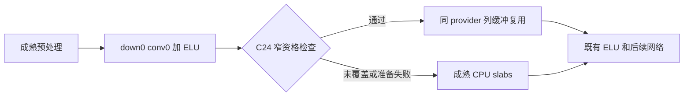

# SynthSeg C24 列缓冲复用（生产接入草稿，2026-10-06）

## 1. 功能与状态

本草稿为普通 SynthSeg 33 类网络 `SegmentUNet.down[0].conv1` 增加可选 CPU 列缓冲复用。它保持原 32 平面分块、C/kD/kH/kW 列顺序、FP32、偏置预填和同一个已加载 LP64 SGEMM。columns、slab output 两个 scratch 只在当前层调用内存在，返回即释放。

[独立真实层](../../validation/smri_cpu/seg_columns_c24_real_results_20261006/README.md)已测两次前向 10.889→5.003 秒、六次完整位比较差 0。本草稿尚未执行生产缓存编译或完整 CPU/GPU 模型验证。完整性能、分割和 CSV 门待[有限计划](../../validation/smri_cpu/seg_columns_c24_integration_prepare_20261006/PLAN.json)审查执行。



旧 C72 的数值代码、资格检查、符号、builder 和 cache key 保留原字节。CUDA 在 `CPUInferenceConv3d` 的 CPU 分支之前继续原 `nn.Conv3d`，不会导入 C24 loader。未知权重、shape、状态或编译环境在数学开始前继续成熟路径；开始复制/SGEMM 后的错误传播，不隐含重算。

## 2. Python、输入、输出与参数

公共调用没有新算法参数；以下是草稿完成验收后沿用的调用方式：

```python
from pathlib import Path
from fnit import SynthSeg

input_t1_path = Path("/data/example/T1w.nii.gz")  # 原始三维 T1 NIfTI
external_weights_directory = Path("/data/fnit-weights")  # 已核验的外置 H5/标签资源
output_segmentation_path = Path("/data/output/segmentation.nii.gz")
output_volumes_path = Path("/data/output/volumes.csv")

segmentation_model = SynthSeg(
    weights=external_weights_directory,  # None 沿用既有 FNIT 资产目录
    device="cpu",                       # CUDA 保留既有实现
    threads=8,                          # 本窄优化使用 8 个 CPU 线程
    cudnn_tf32=True,                     # 原 CUDA 前向策略，CPU helper 不写此开关
)
segmentation_result = segmentation_model(
    input_t1_path,
    keep_geometry=False,                # False 输出约 1-mm RAS 网格；True 恢复原网格
    color_lut=None,                      # 可传色表文件，不改变整数标签
)
segmentation_result.segmentation.save(output_segmentation_path)
segmentation_result.write_volumes_csv(input_t1_path, output_volumes_path)
```

输入可为原接口接受的 NIfTI 路径或 nibabel 三维影像。输出仍为整数分割图、各脑区 mm³ 软体积 CSV、总颅内容积、标签名称及真实 precision 记录；网格和字段详见[SynthSeg](README.md)。上述示例未在本草稿重跑。

内部资格只覆盖原图与翻转图的 `[1,24,192,224,256]` CPU 普通 FP32 Tensor，以及 `down[0].conv1` 的实际 `[24,24,3,3,3]` kernel、`[24]` bias。参数逐位 SHA 必须匹配已验证模型。eval/no-grad、oneDNN=False、无 autocast/hooks/forward AD/懒负或共轭视图，stride/dilation=1、padding=1、groups=1，当前 intra 线程必须 8。输出同形状、连续、FP32，不别名输入/参数。helper 不设置线程、TF32、autocast、allocator 或调用方环境。

`ParcUNet` 没有 C24 标记；默认 Plus/fast 的 oneDNN=True 路径不触发。本草稿没有扩大权重、层或 shape 范围。

## 3. CLI、Conda 与缓存

```bash
fnit synthseg --i /data/example/T1w.nii.gz \
  --o /data/output/segmentation.nii.gz --csv-vols /data/output/volumes.csv \
  --weights /data/fnit-weights --device cpu --threads 8
```

`--i/--o/--csv-vols` 分别是原 T1、整数分割和体积 CSV；`--weights` 是已核验外置资源目录，`--device` 指定设备，`--threads` 是线程预算。完整其他参数沿用[SynthSeg CLI](README.md)。

新增依赖 **0**。仍使用主页 Conda 环境已有 GCC/G++11、Torch 2.5.1 ABI0、Torch headers/库、已加载 MKL LP64 和 OpenMP。C24 自有 `_columns_c24.cpp` 为 4,396 B，与已验收短合同源码逐字节相同；独立导出 C24 符号，不重编或覆盖旧 C72 DSO。

新私有 C24 cache 默认位于既有 CPU cache 根的 `c24` 子目录，或由 `FNIT_SYNTHSEG_C24_CPU_CACHE` 指定本人拥有的 0700 目录。C72 原 `FNIT_SYNTHSEG_CPU_CACHE` 含义不变。C24 按独立源码、原接受的运行库/headers/provider/GCC/flags 身份与导出符号生成新键；0600 lock/manifest/DSO，原子发布。构建失败在本进程对应键记录，不改 C72 的缓存或失败账本。

编译复用成熟 builder 的 flags 与 linker/rpath：C++17、GCC11、ABI0、`-O2 -fno-fast-math -ffp-contract=off -fopenmp`，compiler 120 秒，锁 15 秒。目标外平台或版本在数值前回退。wheel 已有 `synthseg_parc/*.cpp` 配置；本草稿已在 `MANIFEST.in` 明确包含 `_columns_c24.cpp`，并用 setuptools FileList 核验 source inclusion。实际打包文件清单和新独立 Conda 安装仍待验证。

## 4. 原软件与原步骤

```bash
# 独立官方 benchmark 环境；FNIT 运行时不调用该命令。
mri_synthseg --i /data/example/T1w.nii.gz \
  --o /data/reference/segmentation.nii.gz --vol /data/reference/volumes.csv \
  --cpu --threads 8
```

内部 conv1 没有独立官方 CLI。候选保持成熟 FP32 CPU 的 K=648、N=24、M=1,835,008、每 slab 32 平面；NN、lda/ldc=实际 M、ldb=648、alpha=beta=1。使用原加载的公共 SGEMM 指针，不寻找或加载第二套 BLAS。

## 5. 已有精度、时间、资源与待测整例

独立真实层 ABBA 中位两次前向 **10.889→5.003 秒，2.177 倍**。B1/B2/A2 的原图/翻转图六次完整 FP32 uint32 比较均不同位元素 0、最大绝对差 0；shape/stride/finite、输入/参数/flags/源码门通过。最大 RSS **9,769,492,480 B**。这是单层证据，不能作为新完整模型结果。

计划先两个新 metadata worker 编译/复用独立 C24 contract cache（1/0 次编译、0 数学，AS 8 GB、worker/child RSS 各 4 GB，Torch 线程原值只读保持），再普通 33 类 CPU A1/B1cold/B2warm/A2、GPU A/B。CPU 每臂 600 秒、AS/RSS 各 32 GB；GPU 每臂 300 秒、allocated/reserved 和本人进程树采样各 20 GB。C72 复用已核验 warm cache，四臂始终编译 0 次；B1 在新 C24 cache 编译一次并单列实际 compiler 秒，B2 使用同 cache 的新进程。

每个完整臂先保存完整图/CSV/原回执，马上核同名 gzip 与 CSV 的全部 bytes/SHA，再派下一臂。完整文件 SHA 同时固定全部标签、CSV、header 和 extension 字节。GPU 必须保留 FP32、原 TF32/autocast 与恢复、相同 UUID 和 allocated/reserved，4 个 CPU optional 模块未 import、编译/复制/SGEMM/probe 为 0，记录 driver 有效样本、最大 gap 与失败，单对计时只作观察。首次失败停止，无重试或阈值更改。

草稿无新的分割脑图。既有 C72 完整脑图和官方对照见[已验收报告](../../validation/smri_cpu/seg_columns_integration_20261006/README.md)；新完整结果和脑图须由本计划的实际输出生成。

## 6. 更新与验收记录

- 当前生产草稿：旧 C72 与新 C24 guard/cache 共 56 项软件合同通过；C24 队列的成功、图差、compiler 次数差和 worker 后置失败 4 项控制合同通过，另 4 项资源控制合同通过（同锁继承、未回收、中断清理、outer alarm）。完整 worker 逐 pass 核实际输入/输出及参数 device/dtype、全部精度 flags 与 PLAN 一致，才能通过 valid 门。它们不运行 compiler、SGEMM、MRI 或完整 CNN。
- [C24 真实层报告](../../validation/smri_cpu/seg_columns_c24_real_results_20261006/README.md)已提交 `05f36b86`，冻结采集/ABBA 源不修改。
- [C24 短合同](../../validation/smri_cpu/seg_columns_c24_contracts_20261006/README.md)及真实层均验收；生产 CPP 字节和数学 AST 与该已验证原型相同，避免重复合成数值试验。
- 新生产 cache 编译/加载、完整 CPU/GPU、打包源检查待根任务审查后一次执行。共享安装入口、根总表、main 发布由根任务维护。

## 7. 来源、许可与参考

新 glue 为 FNIT 自有代码；C24 由已验收自有 C72 glue 特化。只使用用户已安装 Torch 的 headers 和已加载库；不分发 Torch/MKL/GCC 动态库、权重或 MRI。外置模型继续原资源条款，新增依赖为 0。

- [SynthSeg](https://github.com/BBillot/SynthSeg)，Billot et al., *Medical Image Analysis* (2023)。
- PyTorch 2.5.1 [ConvolutionMM3d](https://github.com/pytorch/pytorch/blob/v2.5.1/aten/src/ATen/native/ConvolutionMM3d.cpp)、[CPUBlas](https://github.com/pytorch/pytorch/blob/v2.5.1/aten/src/ATen/native/CPUBlas.cpp)。
- [既有 C72 文档](CPU_COLUMNS.md)、[胶水归属](../../src/fnit/synthseg_parc/CPU_COLUMNS_NOTICE.md)、[有限验证准备](../../validation/smri_cpu/seg_columns_c24_integration_prepare_20261006/README.md)。
