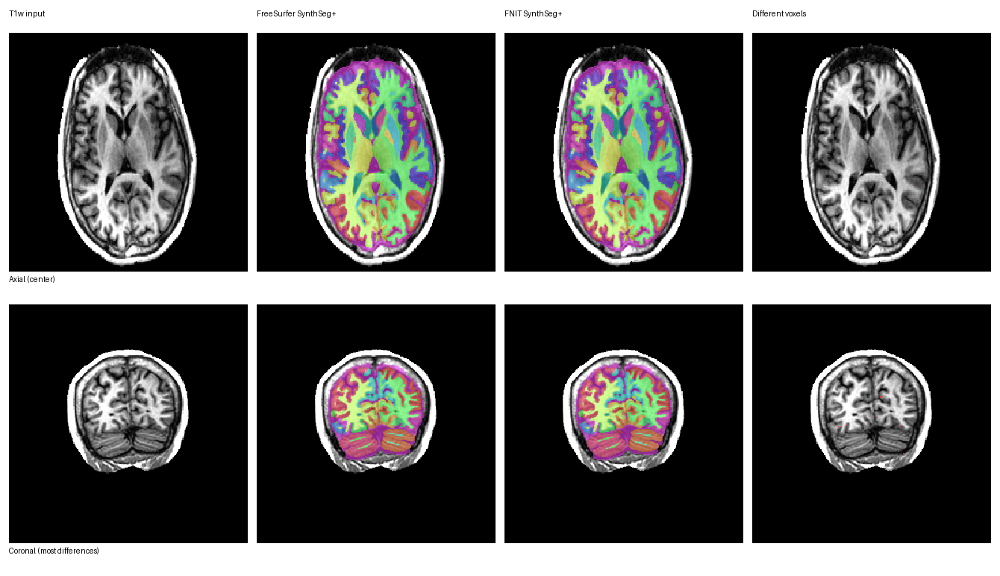
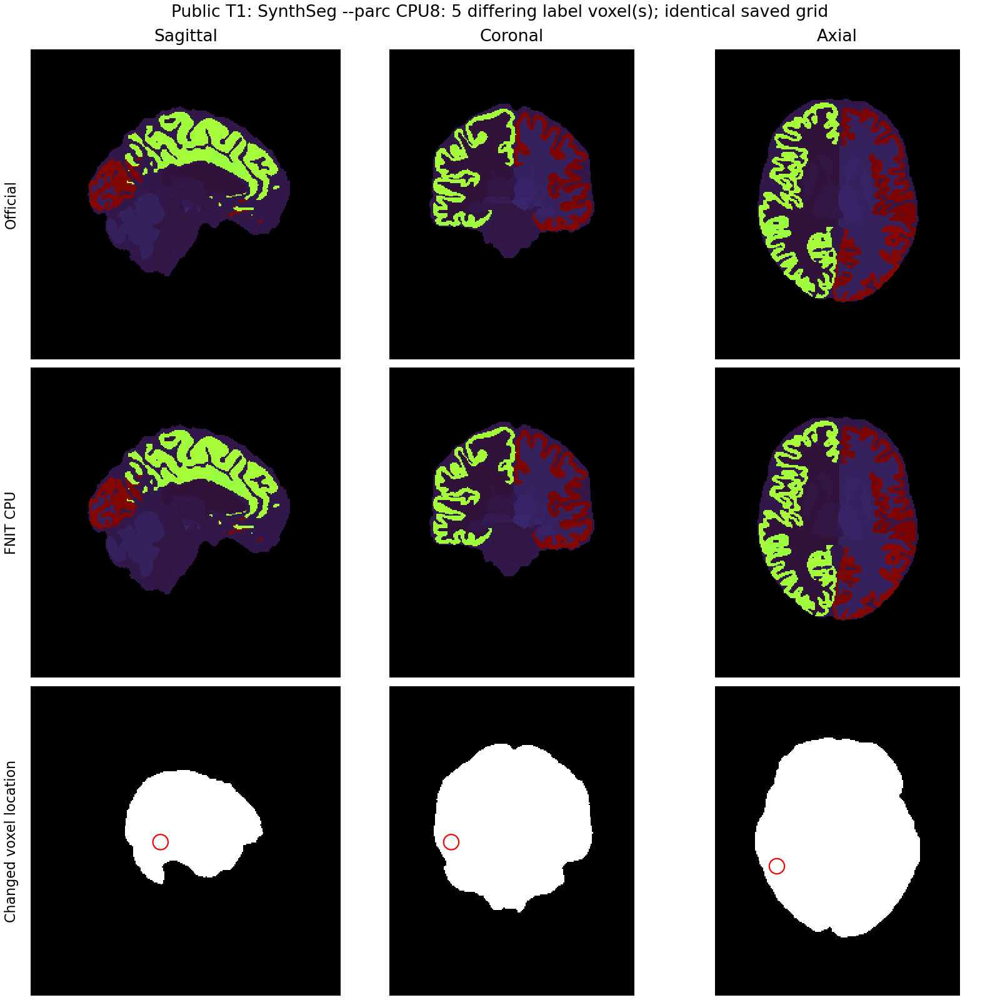

# SynthSeg+ 体积分区

[返回首页](../../README.md) · [33 类 SynthSeg](../synthseg/README.md) · [权重](../WEIGHTS.md)

`SynthSegPlus` 在已有 PyTorch SynthSeg 2.0 的 33 类分割后运行官方 69 通道皮层分区网络，输出左右半球 68 个体积脑区标签。推理只依赖 FNIT 的 Python/Conda 环境和官方权重；对照测试才使用 FreeSurfer 8.2。这里的分区是体素标签，不是 recon-all 的表面 DKT 分区，因而不提供表面面积或厚度。
[原版 `mri_synthseg` 源码](https://github.com/freesurfer/freesurfer/blob/v8.2.0/mri_synthseg/mri_synthseg)中的 `--parc` 网络输入、皮层背景重置和 `--vol` 后验求和，是这里的对应步骤。

FNIT 的类名 `SynthSegPlus` 对应普通 SynthSeg 2.0 **加 `--parc`**。原论文中的 SynthSeg+ 是鲁棒分割方法，对应原版 `--robust`，使用不同模型和后处理；FNIT 当前没有实现这条模式。`fast=True` 对应普通 `--parc --fast`，不能代替 `--robust`。

同一个 `SynthSegPlus` 对象会保留已经载入的两套网络权重。再次调用时无需重新读取 H5；每次调用仍只处理一幅 T1w。

共享的 `SynthSegSegmenter` 已修正构造时覆盖调用方精度设置的问题，并复用
33 类后验缓冲；默认 GPU 卷积 TF32 保持开启，recon-all 的 FP32 例外不会
改成此入口的默认策略。[子函数改动与同输入回归](../synthseg/README.md#recon-all-集成发现的精度设置覆盖)
分别记录实际前向设置及测试版本。2026-10-04 的 CPU 与 GPU 回归见下文单独小节；此前单例表保留历史源码与计时范围。

## 安装与权重

按首页 `environment.yml` 创建环境，然后运行：

```bash
fnit-setup-weights --model synthseg-plus --dest /absolute/path/weights
```

这一组包括 SynthSeg 2.0 主网络、皮层分区网络、主分割标签/名称/拓扑数组。下载器检查文件大小和 SHA-256，推理过程不联网。皮层分区标签顺序与 FreeSurfer 8.2 `synthseg_parcellation_labels.npy` 的 69 项一致。

## Python 用法

```python
from fnit import SynthSegPlus

model = SynthSegPlus(
    weights="/absolute/path/weights",       # 主网络及三个主分割 npy 所在目录
    parc_weights="/absolute/path/weights",  # 皮层分区 H5 所在目录
    device="cuda:0",                         # 计算设备；CPU 可写 "cpu"
)
result = model(
    t1="sub-01_T1w.nii.gz",  # 输入：一幅 3D T1 NIfTI/MGZ 路径
    keep_geometry=False,    # 输出：使用原版默认的 RAS、约 1 mm 推理网格
    fast=False,             # 使用原版普通 --parc 的左右翻转集成
    min_pad=128,            # 网络输入各轴的最小补零尺寸，单位为体素
    volumes=True,           # 计算 --vol 软体积；默认 False，关闭时推理较快
)
result.segmentation.save("sub-01_33class.nii.gz")          # 33 类主分割
result.cortical_parcellation.save("sub-01_cortex.nii.gz")  # 仅皮层的 68 区标签
result.combined.save("sub-01_synthseg_plus.nii.gz")        # 主分割与皮层分区合并
result.write_volumes_csv(
    source="sub-01_T1w.nii.gz",  # CSV 第一列的被试名由此路径生成
    path="sub-01_volumes.csv",  # 输出：101 个数值列的软体积表，单位 mm³
)
left_precentral = result.mask("ctx-lh-precentral")         # 布尔掩膜；shape 与 combined 相同
```

输入 `t1` 为单幅三维结构像路径。`weights`、`parc_weights` 可省略，按 `FNIT_WEIGHTS`、已配置目录和默认缓存查找。`fast=True` 采用较短的后处理路径；要对照原版普通 `--parc`，保持 `False`。`keep_geometry=False` 返回预处理后的 RAS、约 1 mm 网格，与命令行默认值相同。

返回对象的 `segmentation` 为 33 类解剖标签，`cortical_parcellation` 仅在皮层为 68 个脑区编号，`combined` 在 33 类标签上用脑区编号替换左右皮层 3/42。三者均为 `FNITNifti1Image`，标签 dtype 为 `int32`；`label_names` 为 `{编号: 名称}`，`mask(编号或名称)` 返回与 `combined` 同 shape 的布尔数组。`keep_geometry=True` 会对三张标签图以最近邻法重采样，使 shape 和 affine 与输入一致；软体积仍在推理网格上计算，不受这一步影响。

`volumes=True` 时，`volumes_mm3` 返回 `{标签编号: 软体积 mm³}`，顺序为 32 个非背景主分割标签、左侧 34 个皮层区、右侧 34 个皮层区；`total_intracranial_mm3` 单独给出颅内容积。它们依据网络后验概率求和，不能由合并硬标签直接推算。`volumes=False` 时两项为 `None`，调用 `write_volumes_csv` 会报错。`source` 决定 CSV 第一列被试名，`path` 是写出的 CSV 路径。

三张 NIfTI 标签图的 shape、affine、`int32` 类型和 qform/sform 代码与本页原版对照相同。FreeSurfer 默认还在合并 NIfTI 中嵌入颜色表扩展，FNIT 当前未写入该扩展；可用 `label_names` 查询编号对应的名称。

## 命令行与原版

```bash
fnit synthseg --i sub-01_T1w.nii.gz --o sub-01_synthseg_plus.nii.gz \
  --parc --parc-out sub-01_cortex.nii.gz --csv-vols sub-01_volumes.csv \
  --weights /absolute/path/weights --parc-weights /absolute/path/weights \
  --device cuda:0 --threads 4

mri_synthseg --i sub-01_T1w.nii.gz --o sub-01_official_parc.nii.gz \
  --parc --vol sub-01_official_volumes.csv --threads 4
```

`--i` 是输入 T1，`--o` 是合并后的标签图，`--parc-out` 是可选的皮层单独标签图，`--csv-vols` 指定软体积 CSV。`--weights` 指主网络目录，`--parc-weights` 指皮层网络目录，`--device` 指 PyTorch 设备，`--threads` 控制 CPU 线程数。`--fast` 仅能与 `--parc` 一起使用，对应原版普通 `--parc --fast`；普通 33 类入口传 `--fast` 会报错。命令行不加 `--keep-geometry` 与原版不加 `--keepgeom` 一样，输出在推理网格；两端同时加上对应参数才比较原 T1 网格输出。原版 `mri_synthseg --parc` 只输出合并标签图；FNIT 的三个 Python 返回图用于分别检查主分割和分区。

`--csv-vols` 对应原版 `--vol`；两份 CSV 均以被试名开头，然后是颅内容积、32 个主分割软体积和 68 个皮层区软体积。不需要 CSV 时去掉这两个参数，FNIT 会省去概率体积的计算和传输。

## 真实数据对照

### 2026-10-04 CPU 功能与 GPU 回归

共享的分割写出函数修复了斜位 T1 在 `keep_geometry=True` 时重编码未启用 qform、改变 `pixdim` 的问题。实际 GPU 公共 CLI `--parc --fast --keep-geometry` 已保存并回读，shape、affine、pixdim 与原始输入逐值相同，int32 标签和 qform/sform code 为 0/2。此项验证输出几何；CPU/GPU 网络精度与耗时仍分别按各冻结源码记录，见[保存几何记录](../../validation/smri_cpu_20261004/t2_seg/keep_geometry.public.json)。

本次矩阵分别安排普通 `--parc`、`--parc --fast`、输入网格输出和软体积 CSV，完成状态及数值见[8 线程验证记录](../../validation/smri_cpu_20261004/t2_seg/README.md)。计时配对只保存原版也输出的合并标签图与 CSV；Python 返回的主分割、单独皮层图和 `mask()` 功能另作输出检查，不向计时流程添加额外写盘。

共享预处理修复真实影像少一层问题，3 幅 CPU 网络输入 float32 数组 SHA 与官方相同；CPU 连通域使用 6 邻接 SciPy。最初将所有 CPU 卷积切片的候选使 fast 从旧 FNIT 56.33/52.57 秒变成 63.59/58.33 秒，因此选择在 Plus 保留既有完整 oneDNN 卷积，仅普通 SynthSeg 的既有保护上下文启用保留原后端的切片。case01 最终策略公共 CLI 的 fast baseline 为 54.33/58.35 秒，候选为 51.83/50.07 秒；非 fast baseline 为 73.87/71.11 秒，候选为 71.86/70.36 秒。两种模式的硬标签和数值 CSV 均与同输入 baseline 逐值相同。

对官方 fast 仍差 1 个体素、最小 Dice 0.99990777、CSV 最大差 0.10 mm³；非 fast 差 6 个体素、最小 Dice 0.99961215、CSV 最大差 0.90 mm³。第二例的原版剩余误差和更早全层分块变慢的结果均保留，不能称官方逐值一致。`--parc` 与 `--color-lut` 的组合尚不支持，最终共享 CLI 明确拒绝该组合。CUDA 前向仍走原卷积；CPU 调用保留同进程的 CUDA 精度与性能开关。新版本和下列历史验证按源码和核组分别记录。

### 此前公开 T1w 单例

这份历史单例的详细命令、逐标签结果及计时范围见[验证记录](../../validation/synthseg_plus/README.md)。GPU 使用 TF32；未使用 float16 或 bfloat16。

| 项目 | 与 FreeSurfer 8.2.0-1 的本例对照 |
|---|---:|
| 合并标签图 | shape / affine 一致；逐体素一致率 `0.9999758`；最低标签 Dice `0.9983427` |
| `--vol` / `--csv-vols` | 101 个数值列及列名顺序一致；68 个皮层区平均 / 最大绝对差 `2.11 / 7.55 mm³` |
| CPU 完整命令的输出 | 合并图仅差 `6` 个体素；101 列软体积平均 / 最大绝对差 `0.028 / 0.293 mm³` |
| 官方 CPU / FNIT CPU 完整命令 | `241.48 / 210.19 s`，同输入、同输出范围 |
| 官方 GPU / FNIT GPU 完整命令 | `542.08 / 18.71 s`，同输入、同输出范围，H100 共享负载不同 |
| FNIT H100 Python 调用，含软体积 | 首轮 `16.68 s`，同一对象复用权重后 `13.10 s`；不含写盘 |

完整命令可以按输出范围对照，但共享 GPU 的负载不同，不能把单次结果作为稳定加速倍数。Python 调用不含写盘，与完整命令的计时范围不同。QC 输出尚未实现；此历史单例未覆盖 `fast=True`，2026-10-04 CPU 对照已覆盖 fast 与非 fast。



### 大体积 T1 的 CPU 原生崩溃修复

原始影像驱动的亚区 pipeline 暴露了成熟 `SynthSegPlus` 子函数的问题：公开
ds000114 T1 的网络张量为 `224×288×288`，CPU 分割网络最后的 24→33 通道
`1×1×1` 卷积在 oneDNN 3.5.3 中触发 SIGSEGV，尚未保存分割。逐层控制与
原生栈定位到该投影，不代表整个 CPU 环境不可用。33 通道输出逻辑大小为
2,452,488,192 B，日志中的 48 通道填充布局为 3,567,255,552 B；现有栈不能
确定具体地址或溢出原因。

修复只将 CPU FP32 推理中估算填充大小超过 `2**31-1` B 的 `1×1×1` 投影按
深度分块，保留 oneDNN、所有通道与体素顺序；其他 oneDNN 层沿用完整卷积。
没有更改模型、翻转集成、后处理、GPU 精度或调用者全局设置。未带 batch 的
4D `Conv3d` 继续走 PyTorch 原路径。该修复不需要新增依赖或调用原软件。

同一真实 T1、nodecw10 相同 8 物理核/8 线程，冷进程 ABBA 的完整命令包含
权重载入、计算、CSV 和标签图保存：

| 普通 `--parc` | 第一次 wall | 第二次 wall |
|---|---:|---:|
| 官方 CPU | 325.90 s | 118.17 s |
| FNIT 大投影分块 | 102.13 s | 106.16 s |

官方首轮有网络文件读取等待，两次原值均保留，不以首轮计算稳定加速倍数。
两轮同网格对照均差 5 个标签体素，前景最小 Dice 为 0.99980350，101 列软体积
最大绝对差 0.683 mm³；候选两次保存的硬标签、数值 CSV 与几何逐值相同。
修复前后的两个已有病例普通/fast 模式精度门，以及本次 GPU 实际回归状态，
见[专项记录](../../validation/smri_cpu_20261004/t2_seg/README.md#9-大体积-plus-cpu-崩溃定位与修复)
和[逐区证据](../../validation/smri_cpu_20261004/t2_seg/large_pointwise.public.json)。



## Reference

- 参考文献：Billot et al., *Robust machine learning segmentation for large-scale analysis of heterogeneous clinical brain MRI datasets*, PNAS (2023), [doi:10.1073/pnas.2216399120](https://doi.org/10.1073/pnas.2216399120)。
- 原实现代码库：[FreeSurfer `mri_synthseg --parc`](https://github.com/freesurfer/freesurfer/tree/dev/mri_synthseg)。
