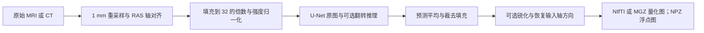

# SynthSR：从单幅扫描合成 1 mm T1w

[返回首页](../../README.md) · [权重配置](../WEIGHTS.md) · [本轮完整验证](../../validation/smri_cpu/synth_fixes_20261004/sr_cpu_followup/README.md)

## 1. 功能简介

SynthSR 接受一幅 3D MRI 或 CT，输出标准 T1w 对比度的 1 mm 等方 MP-RAGE 图像，并在合成时填补白质病灶。输入可以是 T1w、T2w、FLAIR 等对比度，不要求事先去颅骨、校正偏场或归一化强度。FNIT 使用自有 PyTorch 网络和 nibabel 读写，运行时不调用 FreeSurfer 或 TensorFlow。



本轮特别修复成熟 CPU 网络的 FP32 尾差：实际官方完整图融合 Conv+Bias+ELU，其 ELU 算术与独立 ELU 不同；BN 的 rsqrt 和乘加顺序也有差异。新增 CPU 推理 helper 复用原卷积、池化、上采样和 checkpoint，仅在适用的 CPU 推理调用中使用 channels-last 3D 及独立编写的 NumBa FP32 ELU/BN。CUDA 继续执行原 forward，默认 TF32。

## 2. Python 调用、输入与输出

```python
from fnit import SynthSR

super_resolution_model = SynthSR(
    weights=None,  # None 按 FNIT 配置查找权重；也可指定 HDF5 文件或目录
    device="cuda:0",  # 指定计算设备；"cpu" 使用 CPU
    lowfield=False,  # False 使用通用模型；True 选择低场单输入模型
    v1=False,  # False 使用 v2；True 选择 2021 年 v1，优先于 lowfield
    threads=8,  # PyTorch CPU 线程数，也约束新 CPU helper 的 NumBa 线程预算
)
super_resolution_result = super_resolution_model(
    image="case_FLAIR.nii.gz",  # 单幅影像路径；也接受 nibabel SpatialImage
    ct=False,  # MRI 为 False；以 Hounsfield 单位保存的 CT 使用 True
    disable_flipping=False,  # False 保留左右翻转推理并平均两次预测
    disable_sharpening=False,  # False 保留高斯差分锐化
)
super_resolution_result.image.save(path="case_synthsr.nii.gz")  # 写 1 mm uint8 图
super_resolution_result.image.save(path="case_synthsr.npz")  # 同次结果另存浮点 vol_data
print(super_resolution_result.image.data.shape)
print(super_resolution_result.image.affine)
```

构造时加载一次权重，同一对象可重复处理影像。参数如下。

| 参数 | 默认值 | 含义 |
|---|---|---|
| `weights` | `None` | `.h5` 文件或权重目录；省略时按 FNIT 配置查找 |
| `device` | `"cpu"` | 计算设备，例如 `"cpu"`、`"cuda:0"` |
| `lowfield` | `False` | 选择低场单输入 v2 权重 |
| `v1` | `False` | 选择通用 v1；为 True 时优先于 `lowfield` |
| `threads` | `None` | PyTorch CPU 线程；None 保留调用者设置，负值沿用已有全部逻辑线程行为 |
| `image` | 必填 | `.nii`、`.nii.gz`、`.mgz`、`.npz` 路径或 `nibabel.spatialimages.SpatialImage` |
| `ct` | `False` | 将真实 HU CT 截到 0–80，再归一化 |
| `disable_flipping` | `False` | True 只计算原图；False 再计算左右翻转分支并平均 |
| `disable_sharpening` | `False` | True 跳过末端锐化 |
| `save(path)` 的 `path` | 必填 | 输出 `.nii`、`.nii.gz`、`.mgz` 或 `.npz` 路径 |

输入、空间和返回值：

- 常规输入为单幅 3D 扫描及其 affine；多通道文件沿用原版只取第一通道的行为。NPZ 读取 `vol_data`，使用单位 affine。SpatialImage 可含 ArrayProxy，也可含完全解码的自有 ndarray。
- 先重采样到 1 mm，再对齐 RAS 轴、居中填充到 32 的倍数。输出恢复输入的轴方向，位于同一物理空间；尺寸通常不同，不重采样回原始体素尺寸。
- `result.image.data` 为 3D `numpy.ndarray`、`uint8`，范围 0–255，供 NIfTI/MGZ 保存；`result.image.affine` 为描述输出网格的 4×4 RAS 矩阵。
- `result.image.float_data` 为锐化后、末端乘 2 前的浮点强度。NPZ 保存该字段为 `vol_data`，不执行末端乘 2 和 uint8 量化，且不保存 affine。
- MGZ 由 nibabel 保存后重新读入报告 float32 存储类型，数值仍为上述量化值。

CPU helper 仅适用于 Linux x86-64/SSE2/FMA、MKLDNN 可用、CPU FP32、单 volume、eval 且无梯度的原结构网络。训练、autograd、CPU autocast、用户 hooks、替换叶模块、其他平台和 dtype 使用既有 Module 调用。每次使用临时 channels-last 权重视图，参数和 buffers 的内容、身份、stride 与版本保持；模型随后转 CUDA 仍保留原参数布局。NumBa 延迟导入，线程 mask 在正常或异常返回后恢复。主页 Conda 已有 NumBa/LLVM，无新增依赖。

| 模型选择 | 官方权重 | FNIT 配置命令 |
|---|---|---|
| 通用 v2 | `synthsr_v20_230130.h5` | `python tools/setup_weights.py --model synthsr` |
| 低场单输入 v2 | `synthsr_lowfield_v20_230130.h5` | `python tools/setup_weights.py --model synthsr-lowfield` |
| 通用 v1 | `synthsr_v10_210712.h5` | `python tools/setup_weights.py --model synthsr-v1` |

权重优先核对 FNIT 固定 `assets-v1` Release 清单，按大小和 SHA-256 复用；下载规则、原作者来源和许可见[权重说明](../WEIGHTS.md)。仓库及 wheel 不包含权重，推理不联网，也不自动读取 `$FREESURFER_HOME/models/`。

## 3. 命令行调用

```bash
# 通用 v2，指定 GPU 与 CPU 线程
fnit synthsr --i case_FLAIR.nii.gz --o case_synthsr.nii.gz \
  --device cuda:0 --threads 8

# 同一输入改用 CPU；模型和后处理参数相同
fnit synthsr --i case_FLAIR.nii.gz --o case_synthsr_cpu.nii.gz \
  --cpu --threads 8
```

`--i`、`--o` 为输入和输出；单幅输入的输出也可为目录，文件名自动加 `_synthsr`。`--weights` 与 `--model` 同义。`--cpu` 覆盖 `--device`；其余 `--ct`、`--lowfield`、`--v1`、`--disable_flipping`、`--disable_sharpening` 与 Python 参数同义。CLI 的线程默认值为 1。

## 4. 对应原软件调用

```bash
mri_synthsr --i case_FLAIR.nii.gz --o case_synthsr.nii.gz \
  --model /path/to/synthsr_v20_230130.h5 --cpu --threads 8
```

原版支持同名 CT、模型、翻转和锐化开关；省略 `--cpu` 时可自动选择 TensorFlow GPU，没有 FNIT 的具体 GPU 编号参数。独立双输入 `mri_synthsr_hyperfine --t1 ... --t2 ...` 使用另一模型，不属于本单输入接口。

## 5. 最新代码与原版的真实对照（2026-10-04）

本轮冻结生产源码 `source_sr_v2`，同一 CC0 OpenNeuro ds003138 v1.0.1 原始 T1、相同官方通用权重。nodecw7 使用核 `0,4,8,12,16,20,24,28`、Torch/OMP/MKL/NumBa 8 线程及专属锁；原版为 FreeSurfer 8.2.0-1 / TensorFlow 2.13.1。原完整图参考与最终输出 SHA 保持，未关闭其融合。源码、输入、权重、原程序 SHA 和完整数值报告见[验证页](../../validation/smri_cpu/synth_fixes_20261004/sr_cpu_followup/README.md)。

### 完整数值门

| 范围 | 修复前 | 本次 CPU 候选 |
|---|---:|---:|
| 两翻转分支 CNN 输出共 22,020,096 值 | 有 FP32 尾差 | **全值及规范数组 SHA 同官方** |
| 最终浮点固定 `rtol=1e-5, atol=1e-3` | 3,522 / 9,072,000 值失败 | **0 失败，全部逐值同** |
| 最终浮点最大差 / RMSE | 0.0191345 / 9.82070e-5 | **0 / 0** |
| uint8 不同体素 | 527 / 9,072,000，max1 | **0，NIfTI 文件 SHA 同官方** |
| affine 与 NIfTI header | 同官方 | **同官方** |

生产候选新/新两次分别完整通过；旧/旧复测保留同一 3,522 点失败。另外 v1、低场模型、关闭翻转、关闭锐化各完整量化图也全同官方。第二幅T1、FLAIR、真实HU CT、64mT MRI与EPI第一通道的NIfTI全值、affine/header和文件SHA同官方。EPI NPZ979,200个浮点值通过原固定门（0失败），max0.000339508、RMSE1.76756e-5，仍有922,432个值不同；旧max0.001571655、RMSE6.87055e-5。[参数门](../../validation/smri_cpu/synth_fixes_20261004/sr_cpu_followup/reports/sr_functions_node7_v2.public.json)与[唯一真实域门](../../validation/smri_cpu/synth_fixes_20261004/sr_cpu_followup/reports/sr_domains_node7_v1.public.json)分别记录，不把默认通用T1的浮点逐值结论推广到所有扫描。

### 正常 CPU CLI 与内部阶段

正常 CLI 顺序为官方/旧/新/新/旧/官方，每次为新进程。候选两次使用独立空 NumBa cache，时钟包含导入、权重加载、JIT、完整推理和正常 NIfTI 保存，不保存额外 CNN 数组或 NPZ，不计后续哈希评分。

| 正常 CPU CLI | 两次 GNU wall（s） | 中位数（s） | GNU 峰值 RSS（GB，十进制） |
|---|---:|---:|---:|
| 官方 | 148.68 / 75.17 | 111.925 | 8.780 |
| 旧 FNIT | 28.24 / 29.08 | 28.660 | 10.222 |
| 本次候选 | 29.91 / 26.77 | 28.340 | 7.496 |

旧新完整 CLI 基本持平。官方冷导入及 GPFS 文件缓存波动较大；这些是同机实测时钟，不作为稳定加速倍数。负载与每次输入/output/header SHA 见[正常 CLI 报告](../../validation/smri_cpu/synth_fixes_20261004/sr_cpu_followup/reports/sr_normal_cli_node7_v1.public.json)。

另一次带完整数值门的旧/新/新/旧 API ABBA 保留网络张量 view 用于后续哈希，保存 NIfTI+NPZ，因此与正常 CLI 分列：

| 内部阶段（s） | 旧两次 | 候选两次 |
|---|---:|---:|
| 权重构造 | 0.969 / 0.327 | 0.695 / 0.681 |
| NumBa warmup，含编译或缓存加载 | 0 / 0 | 1.277 / 0.246 |
| CNN 原图 + 翻转，嵌套于 API | 12.299+9.442 / 15.070+14.428 | 12.194+12.033 / 12.406+12.731 |
| 完整 API | 25.979 / 33.792 | 28.487 / 29.443 |
| 两份输出保存 | 2.063 / 1.921 | 1.897 / 1.911 |
| 完整 worker，含评分 GNU wall | 33.84 / 39.74 | 36.62 / 36.68 |

API 采样 RSS 从旧约 10.219 GB 降至候选约 7.485 GB；其中都包含 176,160,768 B 保留网络 view。这些子阶段不能重复累加为 API，带评分 worker 也不替代正常 CLI。

### CUDA 保存原行为

gpucw1 H100 GPU0 的公共锁下，同一完整原始 T1 执行旧/新/新/旧；预算为 20,000,000,000 B。候选及旧重复与首个旧 GPU 参考：两 CNN、最终浮点、uint8、affine、header、NIfTI/NPZ 文件 SHA 全同，CPU helper 均未导入，卷积参数 stride 保持。allocated 峰值均为 **10,006,443,008 B**，reserved 均为 **13,845,397,504 B**。

完整诊断 API 旧 7.001/7.256 s、新 6.234/6.463 s，两 CNN 旧 0.549+0.401 / 0.550+0.331 s、新 0.550+0.405 / 0.533+0.403 s。GNU wall 旧 19.43/17.79 s、新 16.05/15.59 s；包含 CUDA bootstrap、CNN 追踪复制、额外私有数组保存和评分。GPU 外部利用率 97–100%，这些污染时钟只作观察，不宣称稳定 GPU 加速。另行正常CLI仅保存NIfTI，包含20GB设置和12元素CUDA probe的冷bootstrap：旧12.14/11.25 s、新11.36/11.29 s；输出及显存仍全同。[正常GPU CLI报告](../../validation/smri_cpu/synth_fixes_20261004/sr_cpu_followup/reports/sr_normal_gpu_cli_v1.public.json)的评分在所有CLI之后执行。

### 脑图示例

下图是同一公开 T1 **修复前**的首差定位图：红点为量化相差 1 的位置。当前候选的完整量化图逐值同官方，整个差异图为零；历史图保留诊断作用。它不代替完整浮点门。


## 6. 最近版本与 benchmark 记录

| 版本或阶段 | 实际范围和结果 |
|---|---|
| 2026-10-04，`source_sr_v2` | 自有 CPU FP32 oneDNN ELU + Eigen BN、临时 CL3D 卷积；同原始 T1 CPU 完整 CNN/浮点/量化全同官方，GPU 旧新全同；正常 CPU CLI 基本持平、RSS 降低。源码、失败阶段和全部时钟见本轮验证页。 |
| 2026-10-04，独立 Eigen ELU/BN 诊断 | 首层阶段全同；完整浮点仍有 172 点失败、量化192点差1，未接入。实际原整图 profiler 揭示18个融合 Conv+Bias+ELU，隔离 raw+ELU equality 不替代整图门。 |
| 2026-10-04，较早逐 Torch ELU 原型 | API66.815 s、浮点1,935点失败、量化457点差1；更慢且未通过，未接入。[原记录](../../validation/smri_cpu/synth_fixes_20261004/README.md)保留。 |
| 2026-10-04，`task5_candidate_cpu_v5` | 完全物化 SpatialImage API 与旧 FNIT NIfTI/NPZ 逐值及文件 SHA 同；旧官方浮点门仍失败。API29.987 s，含评分进程41.545 s。[物化入口报告](../../validation/smri_cpu/strip_sr_20261004/in_memory_20261004/README.md)。 |
| 2026-10-04，原 `1d31e7baa` 网络 | nodecw10 的9个参数/7个域格式场景量化容差通过，默认 T1 浮点3,522点失败。正常默认两例官方/FNIT中位62.810/42.800、80.869/45.947 s；低场/EPI部分较慢。[原 CPU 记录](../../validation/smri_cpu/strip_sr_20261004/README.md)，不与本轮 nodecw7 时间除比。 |
| 2026-09-27，源码树 `7b5bc19e…` | 12例临床 TF32 GPU 历史对照，平均 MAE0.02314、最大差9，GPU命令中位14.45 s、allocated13,780 MiB；非逐值等价且不同运行时段。[历史验证](../../validation/synthsr/README.md)。 |

历史公开 FLAIR 示例沿用当时默认 TF32，来自公开扫描，与12例临床统计分开；shape、uint8和affine一致，exact97.8558%、MAE0.02145、max2。


## 7. 参考文献与原实现

- Iglesias et al., *SynthSR: A public AI tool to turn heterogeneous clinical brain scans into high-resolution T1-weighted images for 3D morphometry*, Science Advances (2023), [doi:10.1126/sciadv.add3607](https://doi.org/10.1126/sciadv.add3607)。
- [FreeSurfer SynthSR 使用说明](https://surfer.nmr.mgh.harvard.edu/fswiki/SynthSR)与[原实现代码库](https://github.com/freesurfer/freesurfer/tree/dev/mri_synthsr)。
- CPU ELU 公式依据实际 oneDNN2.7.3 [eltwise injector](https://github.com/oneapi-src/oneDNN/blob/v2.7.3/src/cpu/x64/injectors/jit_uni_eltwise_injector.cpp)；独立实现只采用必要数值公式，实际版本、源码 SHA、LLVM/ISA与完整真实门见本轮验证报告。
