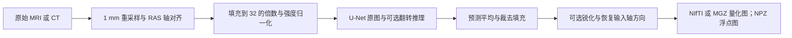

# SynthSR：从单幅扫描合成 1 mm T1w

[返回首页](../../README.md) · [完整旧文档与更早证据](../../validation/synthsr/readme_archive_20261005.md)

| 项目 | 内容 |
|---|---|
| 输入 | 单幅MRI或HU CT |
| 输出 | 1mm合成T1w；NIfTI/MGZ量化图或NPZ浮点图 |
| 对应原软件 | FreeSurfer mri_synthsr |
| Python / CLI | fnit.SynthSR；fnit synthsr |
| CPU / GPU | CPU/CUDA；重采样及保存包含CPU步骤 |

## 1. 功能简介

SynthSR 接受一幅 3D MRI 或 CT，输出标准 T1w 对比度的 1 mm 等方 MP-RAGE 图像，并在合成时填补白质病灶。输入可以是 T1w、T2w、FLAIR 等对比度，不要求事先去颅骨、校正偏场或归一化强度。FNIT 使用自有 PyTorch 网络和 nibabel 读写，运行时不调用 FreeSurfer 或 TensorFlow。



本轮特别修复成熟 CPU 网络的 FP32 尾差：实际官方完整图融合 Conv+Bias+ELU，其 ELU 算术与独立 ELU 不同；BN 的 rsqrt 和乘加顺序也有差异。新增 CPU 推理 helper 复用原卷积、池化、上采样和 checkpoint，仅在适用的 CPU 推理调用中使用 channels-last 3D 及独立编写的 NumBa FP32 ELU/BN。CUDA 继续执行原 forward，默认 TF32。

## 2. Python 调用

```python
from fnit import SynthSR

super_resolution_model = SynthSR(
    weights=None,  # None 按 FNIT 配置查找权重；也可指定 HDF5 文件或目录
    device="cuda:0",  # 指定计算设备；"cpu" 使用 CPU
    lowfield=False,  # False 使用通用模型；True 选择低场单输入模型
    v1=False,  # False 使用 v2；True 选择 2021 年 v1，优先于 lowfield
    threads=8,  # PyTorch CPU 线程数，也约束新 CPU helper 的 NumBa 线程预算
)
super_resolution_result = super_resolution_model(
    image="case_FLAIR.nii.gz",  # 单幅影像路径；也接受 nibabel SpatialImage
    ct=False,  # MRI 为 False；以 Hounsfield 单位保存的 CT 使用 True
    disable_flipping=False,  # False 保留左右翻转推理并平均两次预测
    disable_sharpening=False,  # False 保留高斯差分锐化
)
super_resolution_result.image.save(path="case_synthsr.nii.gz")  # 写 1 mm uint8 图
super_resolution_result.image.save(path="case_synthsr.npz")  # 同次结果另存浮点 vol_data
print(super_resolution_result.image.data.shape)
print(super_resolution_result.image.affine)
```

### 输入数据格式

- `image`：`.nii`、`.nii.gz`、`.mgz`、`.npz`路径或nibabel SpatialImage。常规输入单幅3D `(X,Y,Z)`；末维不超过10的4D文件只取第一通道，不合成完整时间序列。
- NIfTI/MGZ需要有效affine与体素间距；不要求统一orientation、mask、去颅骨、偏场或强度归一化。MRI强度无固定单位；ct=True要求真实Hounsfield单位，截到0–80。
- NPZ输入需有`vol_data`数组；入口使用单位affine，不包含扫描几何。数组输入应先封装为nibabel SpatialImage；不直接接受ndarray。

### 模型构造

| 参数 | 必需 | 类型 | 默认值 | 含义 |
|---|---|---|---|---|
| `weights` | 否 | `str 或 Path 或 None` | `None` | 官方 checkpoint 文件或目录；省略时按显式配置、FNIT_WEIGHTS 和缓存查找 |
| `device` | 否 | `str` | `'cpu'` | 计算设备，cpu 或 cuda:N；编号遵循 CUDA_VISIBLE_DEVICES |
| `lowfield` | 否 | `bool` | `False` | 选择单输入低场 v2 模型；v1=True 时 v1 优先 |
| `v1` | 否 | `bool` | `False` | 选择 2021 年通用 v1 权重 |
| `threads` | 否 | `int 或 None` | `None` | PyTorch CPU 线程预算；None 保留当前值，CLI 默认另见下节 |

### 单次调用

| 参数 | 必需 | 类型 | 默认值 | 含义 |
|---|---|---|---|---|
| `image` | 是 | `str 或 Path 或 nibabel SpatialImage` | `—` | 输入影像，格式、维数与预处理约束见输入数据格式 |
| `ct` | 否 | `bool` | `False` | CT 按 Hounsfield 单位处理，截到 0–80 |
| `disable_flipping` | 否 | `bool` | `False` | 关闭左右翻转测试增强 |
| `disable_sharpening` | 否 | `bool` | `False` | 关闭输出末端锐化 |

### 输出

```text
case_synthsr.nii.gz  # 1mm网格、uint8、0–255
# 或case_synthsr.mgz：读入存储dtype为float32，值仍是量化0–255
# 或case_synthsr.npz：vol_data为锐化后、末端乘2前的浮点数值
```

返回`SynthSRResult.image`，其`data`是3D uint8数组，`float_data`是末端量化前浮点数组，`affine`为4×4 RAS坐标矩阵。输出为1mm网格、保留输入轴方向和物理空间，shape通常不同于输入；不回到原始体素尺寸。

### 输出字段与数值含义

| 字段 | 格式与用途 |
|---|---|
| `image.data` | `(X1,Y1,Z1)`、uint8，末端乘2并截到0–255后的合成强度 |
| `image.float_data` | 同shape的浮点数组，锐化后、乘2与量化前的数值 |
| `image.affine` | `(4,4)`、float64，1mm输出体素到RAS毫米的坐标映射 |
| `image.header` | NIfTI header对象；保存时dtype由输出规则决定 |

合成强度没有绝对物理单位；它不作为CT的HU输出。浮点NPZ与量化NIfTI具有不同数值定义，比较两者时应先按相同末端转换对齐。NPZ只保存`vol_data`，后续空间叠加需另保留`image.affine`。

`disable_flipping=True`使用单次网络预测；默认对原输入和左右翻转输入各预测一次。`disable_sharpening=True`关闭末端高斯反锐化，二者都会改变输出，benchmark需记录实际开关。

`.save(path)`按扩展写NIfTI、MGZ或NPZ；后者不乘2、不转uint8，须用`numpy.load(path)["vol_data"]`读。调用本身不自动保存，也不重新训练模型。

<a id="单例命令行"></a>

## 3. 命令行调用

```bash
fnit synthsr --i case_FLAIR.nii.gz --o case_synthsr.nii.gz --device cuda:0 --threads 4
```

### fnit synthsr

| CLI 参数 | Python 参数 / 输出 | 含义 |
|---|---|---|
| `--i` / `-i` | `image` | 输入影像路径 |
| `--o` / `-o` | `保存路径` | 输出影像或单例目录 |
| `--device` | `device` | 计算设备，cpu 或 cuda:N；编号遵循 CUDA_VISIBLE_DEVICES |
| `--cpu` | `device=cpu` | 覆盖device强制CPU |
| `--threads` | `threads` | PyTorch CPU 线程预算；None 保留当前值，CLI 默认另见下节 |
| `--ct` | `ct` | CT 按 Hounsfield 单位处理，截到 0–80 |
| `--lowfield` | `lowfield` | 选择单输入低场 v2 模型；v1=True 时 v1 优先 |
| `--v1` | `v1` | 选择 2021 年通用 v1 权重 |
| `--disable_sharpening` | `disable_sharpening` | 关闭输出末端锐化 |
| `--disable_flipping` | `disable_flipping` | 关闭左右翻转测试增强 |
| `--weights` / `--model` | `weights` | 官方 checkpoint 文件或目录；省略时按显式配置、FNIT_WEIGHTS 和缓存查找 |

CLI与Python默认差异：Python threads=None，CLI为1；--cpu覆盖--device。

## 4. 原软件调用

以下命令用于独立原软件参考环境；FNIT生产入口不执行它。

```bash
mri_synthsr --i case_FLAIR.nii.gz --o reference/case_synthsr.nii.gz --threads 4
```

| FNIT参数 / 产物 | 原软件参数 / 产物 |
|---|---|
| image / image.save | --i / --o |
| ct / lowfield / v1 | --ct / --lowfield / --v1 |
| disable_flipping / disable_sharpening | 同名参数 |
| weights / device=cpu / threads | --model / --cpu / --threads |

同为单输入模型，v1优先于lowfield。FNIT可显式选cuda:N；原版自动选可用TensorFlow GPU或--cpu。双输入mri_synthsr_hyperfine使用另一模型，此接口未覆盖。

<a id="原版指令与模型"></a>
<a id="2026-10-04相同-cpu-资源对照"></a>
<a id="默认完全物化-spatialimage-apiv5-冻结"></a>
<a id="2026-10-04cpu网络首差定位"></a>
<a id="2026-09-27既有-gpu-与-cpu-对照"></a>
<a id="该次公开-flair-示意图"></a>

## 5. 最新精度和运行时间

本轮冻结生产源码 `source_sr_v2`，同一 CC0 OpenNeuro ds003138 v1.0.1 原始 T1、相同官方通用权重。nodecw7 使用核 `0,4,8,12,16,20,24,28`、Torch/OMP/MKL/NumBa 8 线程及专属锁；原版为 FreeSurfer 8.2.0-1 / TensorFlow 2.13.1。原完整图参考与最终输出 SHA 保持，未关闭其融合。源码、输入、权重、原程序 SHA 和完整数值报告见[验证页](../../validation/smri_cpu/synth_fixes_20261004/sr_cpu_followup/README.md)。

### 完整数值门

| 范围 | 修复前 | 本次 CPU 候选 |
|---|---:|---:|
| 两翻转分支 CNN 输出共 22,020,096 值 | 有 FP32 尾差 | **全值及规范数组 SHA 同官方** |
| 最终浮点固定 `rtol=1e-5, atol=1e-3` | 3,522 / 9,072,000 值失败 | **0 失败，全部逐值同** |
| 最终浮点最大差 / RMSE | 0.0191345 / 9.82070e-5 | **0 / 0** |
| uint8 不同体素 | 527 / 9,072,000，max1 | **0，NIfTI 文件 SHA 同官方** |
| affine 与 NIfTI header | 同官方 | **同官方** |

生产候选新/新两次分别完整通过；旧/旧复测保留同一 3,522 点失败。另外 v1、低场模型、关闭翻转、关闭锐化各完整量化图也全同官方。第二幅T1、FLAIR、真实HU CT、64mT MRI与EPI第一通道的NIfTI全值、affine/header和文件SHA同官方。EPI NPZ979,200个浮点值通过原固定门（0失败），max0.000339508、RMSE1.76756e-5，仍有922,432个值不同；旧max0.001571655、RMSE6.87055e-5。[参数门](../../validation/smri_cpu/synth_fixes_20261004/sr_cpu_followup/reports/sr_functions_node7_v2.public.json)与[唯一真实域门](../../validation/smri_cpu/synth_fixes_20261004/sr_cpu_followup/reports/sr_domains_node7_v1.public.json)分别记录，不把默认通用T1的浮点逐值结论推广到所有扫描。

### 正常 CPU CLI 与内部阶段

正常 CLI 顺序为官方/旧/新/新/旧/官方，每次为新进程。候选两次使用独立空 NumBa cache，时钟包含导入、权重加载、JIT、完整推理和正常 NIfTI 保存，不保存额外 CNN 数组或 NPZ，不计后续哈希评分。

| 正常 CPU CLI | 两次 GNU wall（s） | 中位数（s） | GNU 峰值 RSS（GB，十进制） |
|---|---:|---:|---:|
| 官方 | 148.68 / 75.17 | 111.925 | 8.780 |
| 旧 FNIT | 28.24 / 29.08 | 28.660 | 10.222 |
| 本次候选 | 29.91 / 26.77 | 28.340 | 7.496 |

旧新完整 CLI 基本持平。官方冷导入及 GPFS 文件缓存波动较大；这些是同机实测时钟，不作为稳定加速倍数。负载与每次输入/output/header SHA 见[正常 CLI 报告](../../validation/smri_cpu/synth_fixes_20261004/sr_cpu_followup/reports/sr_normal_cli_node7_v1.public.json)。

另一次带完整数值门的旧/新/新/旧 API ABBA 保留网络张量 view 用于后续哈希，保存 NIfTI+NPZ，因此与正常 CLI 分列：

| 内部阶段（s） | 旧两次 | 候选两次 |
|---|---:|---:|
| 权重构造 | 0.969 / 0.327 | 0.695 / 0.681 |
| NumBa warmup，含编译或缓存加载 | 0 / 0 | 1.277 / 0.246 |
| CNN 原图 + 翻转，嵌套于 API | 12.299+9.442 / 15.070+14.428 | 12.194+12.033 / 12.406+12.731 |
| 完整 API | 25.979 / 33.792 | 28.487 / 29.443 |
| 两份输出保存 | 2.063 / 1.921 | 1.897 / 1.911 |
| 完整 worker，含评分 GNU wall | 33.84 / 39.74 | 36.62 / 36.68 |

API 采样 RSS 从旧约 10.219 GB 降至候选约 7.485 GB；其中都包含 176,160,768 B 保留网络 view。这些子阶段不能重复累加为 API，带评分 worker 也不替代正常 CLI。

### CUDA 保存原行为

gpucw1 H100 GPU0 的公共锁下，同一完整原始 T1 执行旧/新/新/旧；预算为 20,000,000,000 B。候选及旧重复与首个旧 GPU 参考：两 CNN、最终浮点、uint8、affine、header、NIfTI/NPZ 文件 SHA 全同，CPU helper 均未导入，卷积参数 stride 保持。allocated 峰值均为 **10,006,443,008 B**，reserved 均为 **13,845,397,504 B**。

完整诊断 API 旧 7.001/7.256 s、新 6.234/6.463 s，两 CNN 旧 0.549+0.401 / 0.550+0.331 s、新 0.550+0.405 / 0.533+0.403 s。GNU wall 旧 19.43/17.79 s、新 16.05/15.59 s；包含 CUDA bootstrap、CNN 追踪复制、额外私有数组保存和评分。GPU 外部利用率 97–100%，这些污染时钟只作观察，不宣称稳定 GPU 加速。另行正常CLI仅保存NIfTI，包含20GB设置和12元素CUDA probe的冷bootstrap：旧12.14/11.25 s、新11.36/11.29 s；输出及显存仍全同。[正常GPU CLI报告](../../validation/smri_cpu/synth_fixes_20261004/sr_cpu_followup/reports/sr_normal_gpu_cli_v1.public.json)的评分在所有CLI之后执行。

### 脑图示例

下图是同一公开 T1 **修复前**的首差定位图：红点为量化相差 1 的位置。当前候选的完整量化图逐值同官方，整个差异图为零；历史图保留诊断作用。它不代替完整浮点门。


## 6. 最近版本和 benchmark

| 版本或阶段 | 实际范围和结果 |
|---|---|
| 2026-10-04，`source_sr_v2` | 自有 CPU FP32 oneDNN ELU + Eigen BN、临时 CL3D 卷积；同原始 T1 CPU 完整 CNN/浮点/量化全同官方，GPU 旧新全同；正常 CPU CLI 基本持平、RSS 降低。源码、失败阶段和全部时钟见本轮验证页。 |
| 2026-10-04，独立 Eigen ELU/BN 诊断 | 首层阶段全同；完整浮点仍有 172 点失败、量化192点差1，未接入。实际原整图 profiler 揭示18个融合 Conv+Bias+ELU，隔离 raw+ELU equality 不替代整图门。 |
| 2026-10-04，较早逐 Torch ELU 原型 | API66.815 s、浮点1,935点失败、量化457点差1；更慢且未通过，未接入。[原记录](../../validation/smri_cpu/synth_fixes_20261004/README.md)保留。 |
| 2026-10-04，`task5_candidate_cpu_v5` | 完全物化 SpatialImage API 与旧 FNIT NIfTI/NPZ 逐值及文件 SHA 同；旧官方浮点门仍失败。API29.987 s，含评分进程41.545 s。[物化入口报告](../../validation/smri_cpu/strip_sr_20261004/in_memory_20261004/README.md)。 |
| 2026-10-04，原 `1d31e7baa` 网络 | nodecw10 的9个参数/7个域格式场景量化容差通过，默认 T1 浮点3,522点失败。正常默认两例官方/FNIT中位62.810/42.800、80.869/45.947 s；低场/EPI部分较慢。[原 CPU 记录](../../validation/smri_cpu/strip_sr_20261004/README.md)，不与本轮 nodecw7 时间除比。 |
| 2026-09-27，源码树 `7b5bc19e…` | 12例临床 TF32 GPU 历史对照，平均 MAE0.02314、最大差9，GPU命令中位14.45 s、allocated13,780 MiB；非逐值等价且不同运行时段。[历史验证](../../validation/synthsr/README.md)。 |

历史公开 FLAIR 示例沿用当时默认 TF32，来自公开扫描，与12例临床统计分开；shape、uint8和affine一致，exact97.8558%、MAE0.02145、max2。


## 7. 参考文献、原软件和资源

- 参考文献：Iglesias et al., *SynthSR: A public AI tool to turn heterogeneous clinical brain scans into high-resolution T1-weighted images for 3D morphometry*, Science Advances (2023), [doi:10.1126/sciadv.add3607](https://doi.org/10.1126/sciadv.add3607)。
- 原实现代码库：[FreeSurfer `mri_synthsr`](https://github.com/freesurfer/freesurfer/tree/dev/mri_synthsr)。

模型使用下列官方原始文件，Git/wheel不包含。固定[assets-v1 Release](https://github.com/weikanggong1/Fudan-Neuroimaging-toolkit/releases/tag/assets-v1)及公开asset-manifest与当前weights.py逐项大小/SHA记录一致；本轮未重新下载所有大文件。安装器先Release再原站；完整清单见[资源文件清单](../RESOURCE_MANIFEST.md)。

```bash
fnit-setup-weights --model synthsr --model synthsr-lowfield --model synthsr-v1 --dest /data/fnit-weights
fnit-setup-weights --model synthsr --model synthsr-lowfield --model synthsr-v1 --dest /data/fnit-weights --verify-only
```

离线环境按将使用的模型准备资源即可；默认仅需通用v2，lowfield和v1各使用另一份H5。下载及verify-only通过后显式传入模型文件或目录。`v1=True`会优先于`lowfield=True`，不能把两个模型叠加使用。

Python `threads=None`保留Torch当前值；负数使用CPU核心数。输入MRI至少应有非零强度范围，因为模型需要按全幅最小值和最大值归一化。

| 资源 | 用途 | 官方来源 | 大小 | SHA-256 | 是否允许 FNIT 再分发 |
|---|---|---|---|---|---|
| `synthsr_v20_230130.h5` | 官方推理权重 / 标签数组 | [原站](https://surfer.nmr.mgh.harvard.edu/pub/dist/freesurfer/repo/annex.git/annex/objects/f08/bc9/SHA256E-s106163752--a472f776e7b33b5ea6e10c801f55fee488f1477a208b3e6998dc1aec1d9c5f8b.h5/SHA256E-s106163752--a472f776e7b33b5ea6e10c801f55fee488f1477a208b3e6998dc1aec1d9c5f8b.h5) | 106,163,752 B | `a472f776e7b33b5ea6e10c801f55fee488f1477a208b3e6998dc1aec1d9c5f8b` | 允许；FreeSurfer许可，保留条款与归属 |
| `synthsr_lowfield_v20_230130.h5` | 官方推理权重 / 标签数组 | [原站](https://surfer.nmr.mgh.harvard.edu/pub/dist/freesurfer/repo/annex.git/annex/objects/de0/799/SHA256E-s106163752--a7c5ea91c94fe31f3c716252caae0d181629201bd884dc59af88ddfd75ed4b84.h5/SHA256E-s106163752--a7c5ea91c94fe31f3c716252caae0d181629201bd884dc59af88ddfd75ed4b84.h5) | 106,163,752 B | `a7c5ea91c94fe31f3c716252caae0d181629201bd884dc59af88ddfd75ed4b84` | 允许；FreeSurfer许可，保留条款与归属 |
| `synthsr_v10_210712.h5` | 官方推理权重 / 标签数组 | [原站](https://raw.githubusercontent.com/freesurfer/freesurfer/dev/mri_synthsr/synthsr_v10_210712.h5) | 53,075,984 B | `2fd59e96196388360eba95254fb6dfc9eb9eb8638018b590575e47e0a387f255` | 允许；FreeSurfer许可，保留条款与归属 |

本页列出的模型/数组共3个，265,403,488 B。原始文件许可及归属见[统一资源规则](../WEIGHTS.md#权重许可与归属)。模型推理从本地加载已准备资源。

- CPU ELU 公式依据实际 oneDNN2.7.3 [eltwise injector](https://github.com/oneapi-src/oneDNN/blob/v2.7.3/src/cpu/x64/injectors/jit_uni_eltwise_injector.cpp)；独立实现只采用必要数值公式，实际版本、源码 SHA、LLVM/ISA与完整真实门见本轮验证报告。
