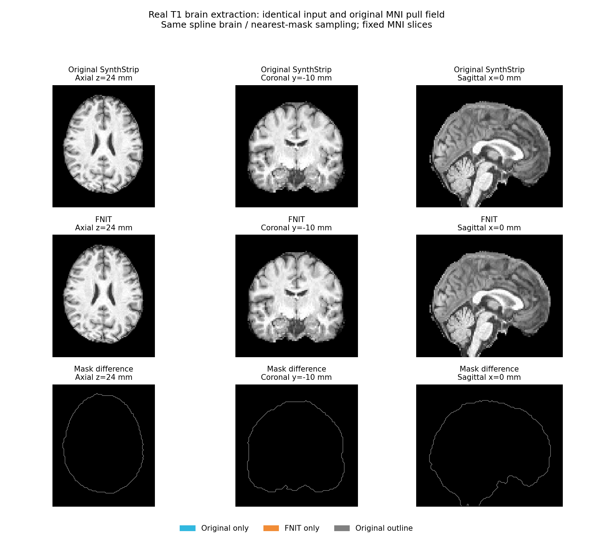

# SynthStrip：脑提取

[返回首页](../../README.md) · [源码目录](../../src/fnit/synthstrip/) · [权重](../WEIGHTS.md)

SynthStrip 从脑影像预测有符号距离场，生成脑掩膜和去除背景的影像。官方模型已使用 PyTorch。本模块沿用其网络、权重和影像处理流程，提供可重复调用的 Python API；模型未重新训练。

参考版本为 **FreeSurfer 8.2.0**，build `freesurfer-linux-centos7_x86_64-8.2.0-20260314-d932c45`。分析对象是 `$FREESURFER_HOME/python/scripts/mri_synthstrip`，不是 `bin/` 下的包装脚本。脚本 SHA-256 为 `bbc2ff8f8779862039401b05d5cd6039fb4f3583e0032a793ac9adb3f4521590`，全部来源信息见 [provenance.json](../provenance.json)。

## Python API

```python
from pathlib import Path
from fnit import SynthStrip

out = Path("results")
out.mkdir(exist_ok=True)
extract = SynthStrip(
    weights="/path/to/weights",  # 权重：官方 PT 文件或权重目录
    device="cuda:0",  # 设备：第一张可见 CUDA GPU
    no_csf=False,  # 模型：保留 CSF 的默认模型
    threads=4,  # CPU 线程：预处理与后处理使用 4 线程
)
result = extract(
    image="subject_T1w.nii.gz",  # 输入：单幅 3D T1w，也可传 nibabel 空间影像
    border=1,  # 掩膜阈值：距离场小于 1 mm 视为脑内
    fill=0,  # 输出背景：脑掩膜外填 0
)
result.image.save(path=out / "subject_brain.nii.gz")  # 输出路径：脑提取后的 T1w
result.mask.save(path=out / "subject_mask.nii.gz")  # 输出路径：二值脑掩膜
result.distance.save(path=out / "subject_sdt.nii.gz")  # 输出路径：有符号距离场
# 可继续 extract(image="another_T1w.nii.gz")，复用已加载模型。
```

`from fnit.synthstrip import SynthStrip, StripResult` 是等价的功能模块入口。

### 模型构造

`SynthStrip(weights=None, device="cpu", no_csf=False, threads=None, *, configure_precision=True)`：

| 参数 | 含义 |
|---|---|
| `weights` | 官方 PT 文件或所在目录；省略时使用[统一查找顺序](../ARCHITECTURE.md#公开-python-api) |
| `device` | `"cpu"` 或 `"cuda:N"`；CUDA 编号遵循 `CUDA_VISIBLE_DEVICES` |
| `no_csf` | 为 `True` 时使用排除 CSF 的官方权重 |
| `threads` | 当前进程的 Torch 线程数；`None` 保留当前值 |
| `configure_precision` | 默认 `True` 延续TF32配置；`False` 保留调用方TF32设置，不改变模型和float32输入。recon-all在构造后施加其cuDNN FP32例外。 |

模型进入 eval 模式并使用 float32 张量；CUDA 构造默认允许 TF32 matmul 和 cuDNN 内核，不使用 float16 或 bfloat16。卷积使用 `cudnn.benchmark=False` 和 `cudnn.deterministic=True`，固定算法选择；这两项设置以及 TF32 是当前进程的 PyTorch 后端策略。重复使用实例可避免重复加载权重。

[`DMRIPipeline`](../dmri_pipeline/README.md#b0-脑掩膜与权重) 使用此原生 API 对 TOPUP 校正 b0 均值或 AP-only 原 b0 均值提取 EDDY mask，固定标准模型、`border=1 mm`，复用实例处理 MMORF T1。输入均值保留原灰度和几何，标准权重在 pipeline 首次加载时校验大小/SHA-256；算法、网络和本模块预处理没有因此修改。该接入的真实新整链比较由 dMRI 验证页单独记录，下方既有 EPI/T1 基准保留原计时范围。

### 单次调用与结果

`extract(image, border=1, fill=None, *, precision_report=None) -> StripResult`：

| 参数或字段 | 含义 |
|---|---|
| `image` 输入 | 文件路径或 `nibabel.spatialimages.SpatialImage`；支持 3D 和逐帧处理的 4D |
| `border` | SDT 阈值，单位 mm，默认 1 |
| `fill` | 掩膜外的强度；省略时为 `min(image.min(), 0)` |
| `precision_report` | 默认 `None`；提供列表时，每帧真实前向前追加模型/输入设备与dtype、TF32及autocast状态，不增加CUDA同步。 |
| `result.image` | 掩膜外已填充的影像，保留原网格和几何 |
| `result.mask` | 二值脑掩膜 |
| `result.distance` | 有符号距离场，单位 mm |

三个返回字段均为 `FNITNifti1Image`（`nibabel.Nifti1Image` 子类），可用 `.save(path)` 保存；也可直接传给 `nibabel.save`。调用不会修改输入对象。直接使用 Python 保存时，由调用者准备输出父目录。

2026-10-02的[recon-all串行接入](../recon_all/SERIAL_OPTIMIZATION.md)使用此精度接口，
记录实际前向并在Talairach子进程启动前释放Strip模型。默认独立调用保持兼容，
没有开启半精度。输入链当前整例仍在验证，旧功能benchmark不改标为本轮结果。

## 命令行

```bash
fnit synthstrip -i subject_T1w.nii.gz \
  -o results/subject_brain.nii.gz -m results/subject_mask.nii.gz \
  -d results/subject_sdt.nii.gz --weights /path/to/weights --device cuda:0
```

对应的 FreeSurfer 原版指令为：

```bash
mri_synthstrip -i subject_T1w.nii.gz \
  -o results/subject_brain.nii.gz -m results/subject_mask.nii.gz \
  -d results/subject_sdt.nii.gz
```

两条命令的 `-o`、`-m`、`-d` 分别保存脑图、掩膜和毫米单位的距离场；Python 返回字段依次为 `result.image`、`result.mask`、`result.distance`。原版 `-g` 选择可见 GPU，统一 CLI 用 `--device cuda:N` 指定设备；原版 `-t` 和 `--model` 分别对应统一 CLI 的 `-j` 与 `--weights`。

| CLI 参数 | 对应 API / 行为 |
|---|---|
| `-i`, `--image` | 输入影像，必需 |
| `-o`, `--out` | `result.image` |
| `-m`, `--mask` | `result.mask` |
| `-d`, `--sdt` | `result.distance` |
| `--weights` | PT 文件或目录 |
| `--device` | 默认 `cpu` |
| `--no-csf` | `no_csf=True` |
| `-b`, `--border` | 默认 1 mm |
| `-f`, `--fill` | 可选背景强度 |
| `-j`, `--threads` | Torch 线程数，统一 CLI 默认 4 |

至少指定一个输出。统一 CLI 会创建输出父目录。

## 权重与 CPU/GPU 分工

| 文件 | 用途 |
|---|---|
| `synthstrip.1.pt` | 默认脑提取 |
| `synthstrip.nocsf.1.pt` | `no_csf=True` |

通过 `checkpoint["model_state_dict"]` 严格加载，无权重转换或精度压缩。下载、许可和 SHA-256 见 [WEIGHTS.md](../WEIGHTS.md)。推理使用本地权重，不调用 FreeSurfer 命令。

U-Net、1 mm 最近邻重采样和 SDT 回采样在所选 PyTorch 设备执行。nibabel 负责影像读写；离散轴重排、裁剪、归一化在 CPU 完成，SDT 扩展和连通域使用 SciPy。4D 输入逐帧处理，每次网络推理一个 frame。

## 源码组织

| 文件 | 责任 |
|---|---|
| [model.py](../../src/fnit/synthstrip/model.py) | `ConvBlock`、`StripModel`，保留官方网络和参数名 |
| [pipeline.py](../../src/fnit/synthstrip/pipeline.py) | `SynthStrip`、`StripResult` 和 `extend_sdt` |
| [__init__.py](../../src/fnit/synthstrip/__init__.py) | 功能公开导出 |

## 网络

- 输入为 `[N, 1, X, Y, Z]` float32，默认 API 每次推理一个 frame。
- 3D U-Net 共 7 个分辨率层级、6 次 `MaxPool3d(2)`。
- 编码器每级两次 `Conv3d(kernel=3, stride=1, padding=1)`；通道依次为
  16、32、64、64、64、64。
- 解码器每级两次卷积，然后最近邻 2 倍上采样，与相应编码器特征在通道维拼接。
  最后保留两层 16 通道卷积，再输出一个通道。
- 中间激活均为 `LeakyReLU(0.2)`；最后一层不加激活。没有 BatchNorm 或 Dropout。
- 默认网络共 **2,566,561 个可训练参数**、27 个卷积层；预测的是有符号距离，
  不直接输出 softmax 分割。保留原网络可选 `return_mask=True` 架构入口，官方 SDT
  权重和高级 API 使用默认 `False`。
- `encoder.*`、`decoder.*`、`remaining.*` 参数名称与官方权重一致。

## 每帧处理

1. 先通过离散轴重排转为 LIA，再按 NIfTI `pixdim` 决定 1 mm 网格尺寸，使用最近邻重采样和 float32 数据。保留官方 `shape / 2` 定义的视野中心；网格和中间 affine 使用 float64，采样坐标使用逐项 float32 运算，不受 TF32 矩阵乘法影响。
2. 按强度 `> 0` 的包围盒裁剪；各轴尺寸向上取 64 的倍数，再限制在 192–320；居中裁剪或补零。奇数个体素需裁掉时，多裁的一个体素位于高索引端。
   此上限是官方行为，大视野超过 320 mm 的部分可能被裁掉。
3. 减去全图最小值，除以第 99 百分位数，限制到 `[0,1]`。这里的百分位数包含零值。
4. U-Net 预测窄带 signed distance transform (SDT)。`border` 大于窄带范围时，按官方
   `extend_sdt` 重算外部距离；负值内部预测保持不变。
5. SDT 线性重采样回原始体素空间，视野外填 100。以 `SDT < border` 得到 mask，
   保留最大连通域并填洞。默认 `border=1` mm；`--no-csf` 切换另一份官方权重。
6. 原影像 mask 外填 `min(image.min(), 0)`，也可显式提供 `fill`。4D 输入逐帧执行，
   再恢复 frame 维；原数据几何、体素格和有效区强度保留。

算法沿用官方输入范围：非有限强度、纯常数图像等没有增设修复规则。若归一化分母
为零，不能将所得输出视为有效提取结果。

## 功能差异与验证

官方脚本集成参数解析和执行流程；本包将同一网络和影像处理拆成可导入接口。生产运行使用 nibabel、PyTorch 和 SciPy，不调用 FreeSurfer，也不依赖 Surfa。统一 CLI 为 `fnit synthstrip`。

### 最新完整三维对照

受测源码 `cfb7beee` 已在同一例真实 SBRef 和 T1 的完整原始网格上核对已保存输出。实际 `pipeline.py` SHA-256 为 `0ae5d3e3…`，与运行捕获的源码一致；官方 checkpoint SHA-256 为 `37417f80…`，30,851,709 字节，与原程序相同。输入文件的 SHA-256 也逐项一致。完整哈希、三维统计和计时来源见[最新版原程序对照](../../validation/synthstrip/latest_native_comparison.public.json)。

| 最新完整三维对照 | SBRef / EPI | T1 |
|---|---:|---:|
| mask Dice | 0.999994968 | 0.999998569 |
| mask 不同体素数 | 1 | 4 |
| FNIT / 原程序脑内体素数 | 99,371 / 99,372 | 1,397,746 / 1,397,746 |
| 脑图完整三维 RMSE | 未单独捕获脑图 | 0.389388 |
| 脑图完整三维 spatial r | — | 0.999999655 |
| 两份脑掩膜并集内脑图 RMSE / spatial r | — | 0.824671 / 0.999996445 |
| FNIT 复用模型的子函数阶段（s） | 1.1654 | 1.4442 |
| 原 FreeSurfer 独立进程（s） | 8.5569 | 9.3769 |

FNIT 阶段计时包括影像处理、网络推理和该阶段结果保存，模型构造在两阶段计时之外；原进程包括 Python 启动、模型加载及影像读写。两种计时边界分别保留，未将它们相除为完整命令加速比。EPI 的流水线捕获保存了二值掩膜，没有单独保存 SynthStrip 脑图；T1 脑图比较覆盖全部 6,269,400 个体素，其强度差异只出现在上述 4 个 mask 边界体素。

当前 T1 脑图和掩膜与 `1eb9c417` 的固定脑图示例输入逐值相同，文件 SHA-256 也相同。因此下方使用同一原 FNIRT 场的脑提取示例仍适用于当前输出；此核对范围是 SynthStrip 输出。

### 跨进程卷积选择修复

完整 fMRI 流程的真实 T1 重复检查发现，旧构造函数同时开启 `cudnn.benchmark=True` 和 `cudnn.deterministic=True`。后者限制卷积算法本身的确定性，前者仍按每次进程的实测速度选择算法；共享 GPU 上的计时变化会使选择不同。此行为与 [PyTorch 2.5.1 的说明](https://github.com/pytorch/pytorch/blob/v2.5.1/docs/source/notes/randomness.rst)一致。

在同一真实 T1、相同模型状态和归一化网络输入哈希的控制中，旧策略的两个新进程有 19 个掩膜边界体素不同，SDT RMSE 为 0.0002128 mm；在原构造后只关闭 `benchmark`，两个新进程的掩膜和 SDT 逐值相同。因此在成熟的 SynthStrip 子函数中将默认 `benchmark` 改为 `False`，保留 `deterministic=True`、默认 TF32、权重、网络和所有影像处理步骤。API 参数和返回结构不变。该检查验证相同环境下的 FNIT 重复性；相对原 FreeSurfer 的精度仍由下方独立对照报告说明。

当前默认策略可用[真实图像跨进程驱动](../../validation/synthstrip/check_repeatability.py)重新核对；掩膜和 SDT 留在私有目录，公开 JSON 仅包含标量及实际输入、权重、模型状态、网络输入/预测、源码的 SHA-256。`--preceding-image` 可重现完整 fMRI 中先处理 EPI、再处理 T1 的调用顺序；`--compare-autotune` 另加旧策略的两个新进程作为诊断。参数和复现命令见[验证说明](../../validation/synthstrip/README.md)。

### 冻结版本的几何与原程序对照

此前在 gpucw1 的 H100 上，以一例真实受试者的原始 SBRef 和存档 T1 作固定输入控制，使用同一官方 `synthstrip.1.pt`。存档 T1 的转换保留体素和 affine，但尚未确认是扫描仪直接输出的原始 T1。候选 `pipeline.py` SHA-256 为 `41304bafc412bcc914d76a6cbbd29550173df4419c1aa3a54d31d95739bda95d`。官方几何参照使用 Surfa 0.6.3；独立脑掩膜参照来自未修改的 FreeSurfer 8.2 `mri_synthstrip`。

修复了通用 `conform` 与官方视野中心定义、NIfTI `pixdim` 网格尺寸以及边界采样的差异。两幅真实输入的 1 mm LIA 数组和网络归一化输入均逐元素相同。

| 冻结源码的真实几何控制 | SBRef | T1 |
|---|---:|---:|
| 1 mm LIA 数组是否逐元素一致 | 是 | 是 |
| 1 mm LIA affine 最大差异（mm） | 0 | 0 |
| 归一化网络输入是否逐元素一致 | 是 | 是 |
| 同一网络预测，经两种实现回采样后 SDT RMSE（mm） | 0 | 2.91 × 10⁻⁹ |
| 同一网络预测，经两种实现回采样后 mask 是否逐元素一致 | 是 | 是 |
| 与原程序独立推理所得 mask Dice | 0.999995 | 0.999991 |
| 与原程序独立推理所得 mask 不同体素数 | 1 | 25 |
| 控制运行时间（s） | 7.61 | 4.83 |

上表时间从模型构造前开始，到网络预测、双实现回采样和 mask 比较后停止；不含 Python 启动、输入 conform/归一化或最终写盘。它是共享 GPU 上的历史控制计时，不是双方完整 CLI 的速度比较。该冻结版本采用旧卷积选择策略并保留默认 TF32；重复控制中 SBRef 有 1–2 个、T1 有 19–25 个阈值附近体素不同。同一次预测的回采样 mask 始终一致。当前跨进程策略已按上节修复，旧报告保留其实际测量源码哈希。

完整输入、权重和源码 SHA-256、环境以及重复结果见 [机器可读报告](../../validation/fmri/synthstrip_geometry_control.public.json)。体积流程的模板空间脑图见 [fMRI 完整对照](../../validation/fmri/matched_native.md)。原始头部图像留在服务器。

### 模板空间脑提取示例

下图使用同一份真实存档 T1 输入。第一行是原 FreeSurfer SynthStrip 的脑图，第二行是本包在 `1eb9c417` 完整流程中生成的脑图；两者共用原 FNIRT 的 MNI→T1 RAS pull 场，由本包 `resample_world` 转到同一 MNI152 2 mm 网格。脑图使用三阶样条，掩膜使用最近邻；两行使用相同切面和灰度范围。



这次流程捕获的个体空间掩膜与原结果相差 4 个体素，Dice 为 0.999998569；最近邻转到 2 mm MNI 网格后，两个掩膜完全相同，第三行因此只显示灰色边界。若有不同体素，蓝色表示仅原结果包含，橙色表示仅本包包含。此图用固定变换展示脑提取差异，不用于判断两条流程的配准精度，也不表示独立推理的原空间输出始终逐体素相同。

图像、输入及变换的哈希和生成参数见 [示例图报告](../../validation/fmri/synthstrip_figure.public.json)。复现脚本为 [render_synthstrip_comparison.py](../../validation/fmri/render_synthstrip_comparison.py)。在仓库根目录执行：

```bash
# 准备同一输入的两组脑图/掩膜，以及只使用一次的原配准场。
current_brain_image=/path/to/fnit/T1_brain.nii.gz
current_brain_mask=/path/to/fnit/T1_mask.nii.gz
reference_brain_image=/path/to/original/T1_brain.nii.gz
reference_brain_mask=/path/to/original/T1_mask.nii.gz
mni_template_image=/path/to/MNI152_T1_2mm.nii.gz
original_mni_to_t1_pull=/path/to/MNI152_2mm_to_T1_pull_ras.nii.gz
candidate_source_revision=1eb9c417febebc8bdd450590d4759454e7160141

# 用本包 CPU 采样两组结果；保存模板 PNG、匿名统计和私有中间图。
PYTHONPATH=src python validation/fmri/render_synthstrip_comparison.py \
  --current-brain "$current_brain_image" --current-mask "$current_brain_mask" \
  --reference-brain "$reference_brain_image" --reference-mask "$reference_brain_mask" \
  --template "$mni_template_image" --pull-ras "$original_mni_to_t1_pull" \
  --source-revision "$candidate_source_revision" --device cpu --threads 4 \
  --private-output /path/to/private/synthstrip_figure \
  --figure-out results/synthstrip_comparison.png \
  --report-out results/synthstrip_figure.public.json
```

`--pull-ras` 必须是模板网格上的相对 RAS-mm 位移：MNI 世界坐标加该位移后得到 T1 世界坐标；它已经包含线性部分，不是 FSL 系数场或 FSL scaled-mm 位移。`--private-output` 保存四幅重采样 NIfTI，`--figure-out` 保存上述三行对照 PNG，`--report-out` 保存标量统计与文件哈希。图像仅用于本地复现；本例公开的是获授权的模板 PNG 和匿名报告。

## 测试与复现

几何回归测试覆盖视野中心、原 header 体素尺寸、正值包围盒、奇数裁剪、最近邻半体素及线性采样末端边界。后端策略测试模拟此前模型开启 autotune 的环境，核查构造函数关闭 benchmark 并保留 deterministic 和 TF32；测试不加载权重、不下载资源。当前检查命令为：

```bash
# 检查 SynthStrip 几何、公开接口和默认 TF32 设置。
python -m pytest tests/synthstrip tests/test_tf32_defaults.py

# 在装有官方 Surfa 的验证环境中，对同一真实输入和权重比较几何及回采样。
# 该验证脚本使用 FNIT 推理，不从生产接口启动 FreeSurfer。
python validation/fmri/compare_synthstrip_geometry.py \
  --manifest /path/to/private_manifest.json \
  --private-output /path/to/private_controls \
  --report /path/to/public_summary.json \
  --device cuda:1
```

私有清单格式如下。`weights` 指向官方权重文件；`original_program` 用于记录原脚本的 SHA-256；每个 `input` 为待验证影像，`original_mask` 为事先运行未修改的官方程序得到的脑掩膜。`--private-output` 保存控制生成的 mask；`--report` 只写匿名汇总和哈希。

```json
{
  "weights": "/path/to/synthstrip.1.pt",
  "original_program": "/path/to/freesurfer/python/scripts/mri_synthstrip",
  "cases": {
    "sbref": {
      "input": "/path/to/SBRef.nii.gz",
      "original_mask": "/path/to/original_SBRef_mask.nii.gz"
    },
    "t1w": {
      "input": "/path/to/T1w.nii.gz",
      "original_mask": "/path/to/original_T1w_mask.nii.gz"
    }
  }
}
```

## 最近版本更新与 benchmark

| 版本与范围 | 更新及真实数据核对 | 耗时边界 |
|---|---|---|
| 2026-10-02 dMRI 固定 b0 输入 | 同一真实官方 TOPUP b0 均值，标准权重同哈希；FNIT H100 GPU/官方 CPU mask 为 271,077/271,080 voxel，差 5 voxel、Dice=0.9999907776，shape/affine 一致，SDT MAE=0.00056229 mm。[匿名报告](../../validation/dmri_pipeline/synthstrip_fixed_input_20261002.public.json)；不是新 dMRI pipeline 整链。 | FNIT 加载＋推理 1.5973 s；完整 FNIT/官方进程另测 6.825/122.275 s，官方包含冷 NFS 读取和 8 线程 CPU 推理，不与 FNIT 子函数时间直接计算速度比。 |
| `cfb7beee` 合并版本验收 | SynthStrip 源码与 `44364a8` 一致；相对原 FreeSurfer，完整 EPI/T1 mask Dice 为 0.999994968/0.999998569，差异为 1/4 体素；当前 T1 脑图及 mask 与冻结图示输入逐值相同。见[最新版报告](../../validation/synthstrip/latest_native_comparison.public.json)。 | FNIT 复用模型子函数为 1.1654/1.4442 秒；原独立进程为 8.5569/9.3769 秒，分别保留模型构造与进程启动/读写边界。 |
| `44364a8` 固定卷积算法选择 | 默认关闭 `cudnn.benchmark`，保留 deterministic、TF32 和原 API。旧策略真实 T1 两个新进程的 19 个边界差异及关闭 benchmark 后的逐值一致控制，保存在[跨进程报告](../../validation/synthstrip/cudnn_repeatability.public.json)的 `original_diagnostic`；报告顶层记录当前源码的新驱动验收及实际输入、模型状态、网络预测哈希。 | 新驱动的调用计时包含记录张量哈希的开销，新进程计时另含启动、模型加载和写盘；各次秒数读取该报告。此项测量限于 SynthStrip，不作为完整 fMRI 流程耗时或等价性结论。 |
| `1db5917` 几何修复，`1eb9c417` 完整流程冻结验收 | 修正官方视野中心、NIfTI `pixdim` 和回采样边界。真实 SBRef/T1 的归一化网络输入与官方实现逐值相同；独立 mask Dice 为 0.999995/0.999991。对应来源以[历史几何报告](../../validation/fmri/synthstrip_geometry_control.public.json)和[冻结脑图报告](../../validation/fmri/synthstrip_figure.public.json)为准。 | SBRef/T1 控制为 7.61/4.83 秒，含模型构造、预测、双实现回采样与比较；不含 Python 启动、输入 conform/归一化和写盘。 |

## Reference

- 参考文献：Hoopes et al., *SynthStrip: Skull-Stripping for Any Brain Image*, NeuroImage (2022), [doi:10.1016/j.neuroimage.2022.119474](https://doi.org/10.1016/j.neuroimage.2022.119474)。
- 原实现代码库：[FreeSurfer `mri_synthstrip`](https://github.com/freesurfer/freesurfer/tree/dev/mri_synthstrip)。
