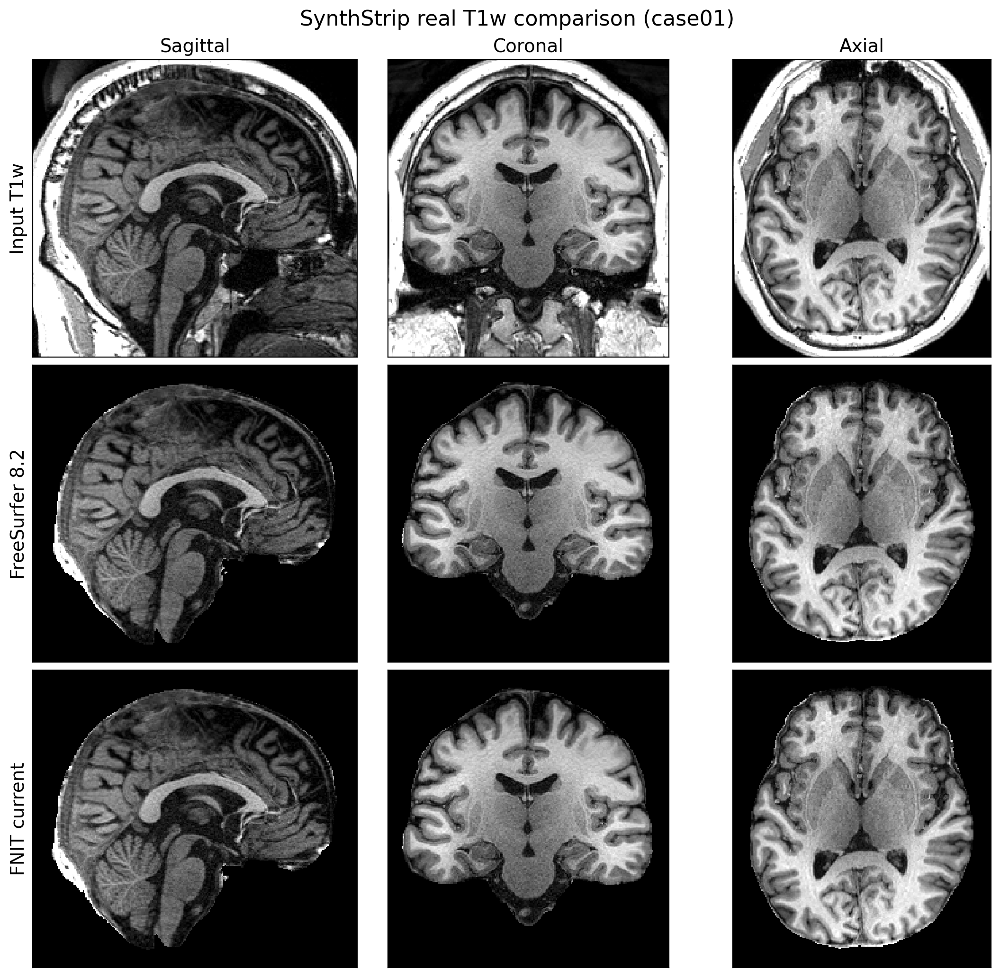

# SynthStrip：脑提取

[返回首页](../../README.md) · [源码目录](../../src/fnit/synthstrip/) · [权重](../WEIGHTS.md)

SynthStrip 从脑影像预测有符号距离场，生成脑掩膜和去除背景的影像。官方模型已使用 PyTorch。本模块沿用其网络、权重和影像处理流程，提供可重复调用的 Python API；模型未重新训练。

参考版本为 **FreeSurfer 8.2.0**，build `freesurfer-linux-centos7_x86_64-8.2.0-20260314-d932c45`。分析对象是 `$FREESURFER_HOME/python/scripts/mri_synthstrip`，不是 `bin/` 下的包装脚本。脚本 SHA-256 为 `bbc2ff8f8779862039401b05d5cd6039fb4f3583e0032a793ac9adb3f4521590`，全部来源信息见 [provenance.json](../provenance.json)。

## Python API

```python
from pathlib import Path
from fnit import SynthStrip

out = Path("results")
out.mkdir(exist_ok=True)
extract = SynthStrip(
    weights="/path/to/weights",  # 权重：官方 PT 文件或权重目录
    device="cuda:0",  # 设备：第一张可见 CUDA GPU
    no_csf=False,  # 模型：保留 CSF 的默认模型
    threads=4,  # CPU 线程：预处理与后处理使用 4 线程
)
result = extract(
    image="subject_T1w.nii.gz",  # 输入：单幅 3D T1w，也可传 nibabel 空间影像
    border=1,  # 掩膜阈值：距离场小于 1 mm 视为脑内
    fill=0,  # 输出背景：脑掩膜外填 0
)
result.image.save(path=out / "subject_brain.nii.gz")  # 输出路径：脑提取后的 T1w
result.mask.save(path=out / "subject_mask.nii.gz")  # 输出路径：二值脑掩膜
result.distance.save(path=out / "subject_sdt.nii.gz")  # 输出路径：有符号距离场
# 可继续 extract(image="another_T1w.nii.gz")，复用已加载模型。
```

`from fnit.synthstrip import SynthStrip, StripResult` 是等价的功能模块入口。

### 模型构造

`SynthStrip(weights=None, device="cpu", no_csf=False, threads=None)`：

| 参数 | 含义 |
|---|---|
| `weights` | 官方 PT 文件或所在目录；省略时使用[统一查找顺序](../ARCHITECTURE.md#公开-python-api) |
| `device` | `"cpu"` 或 `"cuda:N"`；CUDA 编号遵循 `CUDA_VISIBLE_DEVICES` |
| `no_csf` | 为 `True` 时使用排除 CSF 的官方权重 |
| `threads` | 当前进程的 Torch 线程数；`None` 保留当前值 |

模型进入 eval 模式并使用 float32 张量；CUDA 构造默认允许 TF32 matmul 和 cuDNN 内核，不使用 float16 或 bfloat16。重复使用实例可避免重复加载权重。

### 单次调用与结果

`extract(image, border=1, fill=None) -> StripResult`：

| 参数或字段 | 含义 |
|---|---|
| `image` 输入 | 文件路径或 `nibabel.spatialimages.SpatialImage`；支持 3D 和逐帧处理的 4D |
| `border` | SDT 阈值，单位 mm，默认 1 |
| `fill` | 掩膜外的强度；省略时为 `min(image.min(), 0)` |
| `result.image` | 掩膜外已填充的影像，保留原网格和几何 |
| `result.mask` | 二值脑掩膜 |
| `result.distance` | 有符号距离场，单位 mm |

三个返回字段均为 `FNITNifti1Image`（`nibabel.Nifti1Image` 子类），可用 `.save(path)` 保存；也可直接传给 `nibabel.save`。调用不会修改输入对象。直接使用 Python 保存时，由调用者准备输出父目录。

## 命令行

```bash
fnit synthstrip -i subject_T1w.nii.gz \
  -o results/subject_brain.nii.gz -m results/subject_mask.nii.gz \
  -d results/subject_sdt.nii.gz --weights /path/to/weights --device cuda:0
```

对应的 FreeSurfer 原版指令为：

```bash
mri_synthstrip -i subject_T1w.nii.gz \
  -o results/subject_brain.nii.gz -m results/subject_mask.nii.gz \
  -d results/subject_sdt.nii.gz
```

两条命令的 `-o`、`-m`、`-d` 分别保存脑图、掩膜和毫米单位的距离场；Python 返回字段依次为 `result.image`、`result.mask`、`result.distance`。原版 `-g` 选择可见 GPU，统一 CLI 用 `--device cuda:N` 指定设备；原版 `-t` 和 `--model` 分别对应统一 CLI 的 `-j` 与 `--weights`。

| CLI 参数 | 对应 API / 行为 |
|---|---|
| `-i`, `--image` | 输入影像，必需 |
| `-o`, `--out` | `result.image` |
| `-m`, `--mask` | `result.mask` |
| `-d`, `--sdt` | `result.distance` |
| `--weights` | PT 文件或目录 |
| `--device` | 默认 `cpu` |
| `--no-csf` | `no_csf=True` |
| `-b`, `--border` | 默认 1 mm |
| `-f`, `--fill` | 可选背景强度 |
| `-j`, `--threads` | Torch 线程数，统一 CLI 默认 4 |

至少指定一个输出。统一 CLI 会创建输出父目录。

## 权重与 CPU/GPU 分工

| 文件 | 用途 |
|---|---|
| `synthstrip.1.pt` | 默认脑提取 |
| `synthstrip.nocsf.1.pt` | `no_csf=True` |

通过 `checkpoint["model_state_dict"]` 严格加载，无权重转换或精度压缩。下载、许可和 SHA-256 见 [WEIGHTS.md](../WEIGHTS.md)。推理使用本地权重，不调用 FreeSurfer 命令。

U-Net 在所选设备执行。nibabel 影像读写、SciPy conform/crop、归一化、SDT 扩展、连通域和最终重采样在 CPU 执行。单例的 4D 输入逐帧处理，每次网络推理一个 frame。GPU 可加快网络部分，完整进程耗时还取决于预后处理和 I/O。

## 源码组织

| 文件 | 责任 |
|---|---|
| [model.py](../../src/fnit/synthstrip/model.py) | `ConvBlock`、`StripModel`，保留官方网络和参数名 |
| [pipeline.py](../../src/fnit/synthstrip/pipeline.py) | `SynthStrip`、`StripResult` 和 `extend_sdt` |
| [__init__.py](../../src/fnit/synthstrip/__init__.py) | 功能公开导出 |

## 网络

- 输入为 `[N, 1, X, Y, Z]` float32，默认 API 每次推理一个 frame。
- 3D U-Net 共 7 个分辨率层级、6 次 `MaxPool3d(2)`。
- 编码器每级两次 `Conv3d(kernel=3, stride=1, padding=1)`；通道依次为
  16、32、64、64、64、64。
- 解码器每级两次卷积，然后最近邻 2 倍上采样，与相应编码器特征在通道维拼接。
  最后保留两层 16 通道卷积，再输出一个通道。
- 中间激活均为 `LeakyReLU(0.2)`；最后一层不加激活。没有 BatchNorm 或 Dropout。
- 默认网络共 **2,566,561 个可训练参数**、27 个卷积层；预测的是有符号距离，
  不直接输出 softmax 分割。保留原网络可选 `return_mask=True` 架构入口，官方 SDT
  权重和高级 API 使用默认 `False`。
- `encoder.*`、`decoder.*`、`remaining.*` 参数名称与官方权重一致。

## 每帧处理

1. 使用原影像几何将输入变换至 LIA 方向、1 mm 各向同性、float32，使用最近邻重采样。
2. 按非零包围盒裁剪；各轴尺寸向上取 64 的倍数，再限制在 192–320；居中裁剪或补零。
   此上限是官方行为，大视野超过 320 mm 的部分可能被裁掉。
3. 减去全图最小值，除以第 99 百分位数，限制到 `[0,1]`。这里的百分位数包含零值。
4. U-Net 预测窄带 signed distance transform (SDT)。`border` 大于窄带范围时，按官方
   `extend_sdt` 重算外部距离；负值内部预测保持不变。
5. SDT 线性重采样回原始体素空间，视野外填 100。以 `SDT < border` 得到 mask，
   保留最大连通域并填洞。默认 `border=1` mm；`--no-csf` 切换另一份官方权重。
6. 原影像 mask 外填 `min(image.min(), 0)`，也可显式提供 `fill`。4D 输入逐帧执行，
   再恢复 frame 维；原数据几何、体素格和有效区强度保留。

算法沿用官方输入范围：非有限强度、纯常数图像等没有增设修复规则。若归一化分母
为零，不能将所得输出视为有效提取结果。

## 功能差异与验证

官方脚本集成了参数解析和执行流程，本包允许导入并缓存模型。当前影像几何处理使用 nibabel 和 SciPy；日志、版本和帮助格式由本包维护，未要求与 FreeSurfer 逐字一致。统一 CLI 名称为 `fnit synthstrip`，不会替换系统 `mri_synthstrip`。

当前 12 例真实临床 T1w 回归使用固定输入清单、同一官方权重和独立 CLI
进程，对照 FreeSurfer 8.2.0 未修改的 `mri_synthstrip` 源码 CUDA 路径。
公开报告不含病例标识或私有路径。当前候选源码 hash 为
`pipeline.py=3cc23ab81eebb6ad11ac9814691f9d3b5c13c93fc2569ee1f4dddea70ec37de7`、
`model.py=6afcff10848a8a2a57b9c00d4b637eda90e4c0e21f301d8a8031107d783a5f44`
和 `_nib.py=bffd56aeaca423b2448432ba318212e83549e9e31aa27af6bf20a60888218586`，
与本页源码一致。

两边的三项输出 shape、affine 和 dtype 全部一致。候选采用本包要求的默认
TF32，官方参考运行设置了 `NVIDIA_TF32_OVERRIDE=0`；影像几何实现也分别为
nibabel/SciPy 与官方 Surfa。因此该组结果衡量功能和数值接近程度，不声明逐体素
完全相同。

| 当前 12 例 GPU 对照 | 结果 |
|---|---:|
| mask Dice，最小值 | 0.993925 |
| 单例 mask 不同体素数，最大值 | 38,094 |
| distance MAE，12 例平均 / 单例最大（mm） | 0.338627 / 0.610645 |
| brain image Pearson r，最小值 | 0.994261 |
| brain image MAE，单例最大值 | 0.116816 |

墙钟时间包含 Python 启动、权重和影像加载、推理、后处理以及 brain、mask、
distance 三次 NIfTI 写盘。gpucw1 的 H100 共享节点上，FreeSurfer / FNIT 的
12 例中位数为 `16.916 / 16.395 s`；FNIT 与参考的中位数比为 `0.969`。
FNIT 单例 PyTorch peak allocation 为 `8.316 GB`，低于 20 GB；FNIT / 参考
进程最大 RSS 中位数为 `1,216,022 / 1,035,954 KiB`。共享节点计时不解释为
独占硬件加速比。

下图取固定清单的 case01，以同一切面和灰度范围展示输入、FreeSurfer 脑图与
当前 FNIT 脑图。真实病例没有人工脑掩膜真值，因此这些指标验证对官方实现的
复现程度，不代表独立临床准确率。



机器可读逐例指标、输入 SHA-256、源码 SHA-256、计时、RSS 和显存见
[`report.real.current.json`](../../validation/synthstrip/report.real.current.json)；
复现脚本为
[`current_regression.py`](../../validation/synthstrip/current_regression.py)。
脚本只在验证阶段读取已单独运行的 FreeSurfer 输出作为参照，FNIT 运行时不调用
FreeSurfer。

## 测试与复现

单元测试和当前真实数据回归分别使用：

```bash
python -m pytest tests/synthstrip tests/test_public_api.py
python validation/synthstrip/current_regression.py \
  --manifest /path/to/deidentified_manifest.json \
  --reference-root /path/to/freesurfer_reference \
  --output-root /path/to/fnit_outputs \
  --weights /path/to/synthstrip.1.pt \
  --source-root . \
  --python /path/to/fnit/python \
  --device cuda:0 \
  --threads 8
```

`--manifest` 只列输入路径、匿名病例号和 SHA-256；`--reference-root` 保存事先由官方 `mri_synthstrip` 生成的三项输出；`--output-root` 保存当前 FNIT 输出与报告；`--source-root` 固定待验证源码；`--python` 固定实际运行环境。该脚本不会在 FNIT 推理过程中调用 FreeSurfer。

原方法：Hoopes et al., *SynthStrip: Skull-Stripping for Any Brain Image*, NeuroImage (2022), [doi:10.1016/j.neuroimage.2022.119474](https://doi.org/10.1016/j.neuroimage.2022.119474)。
