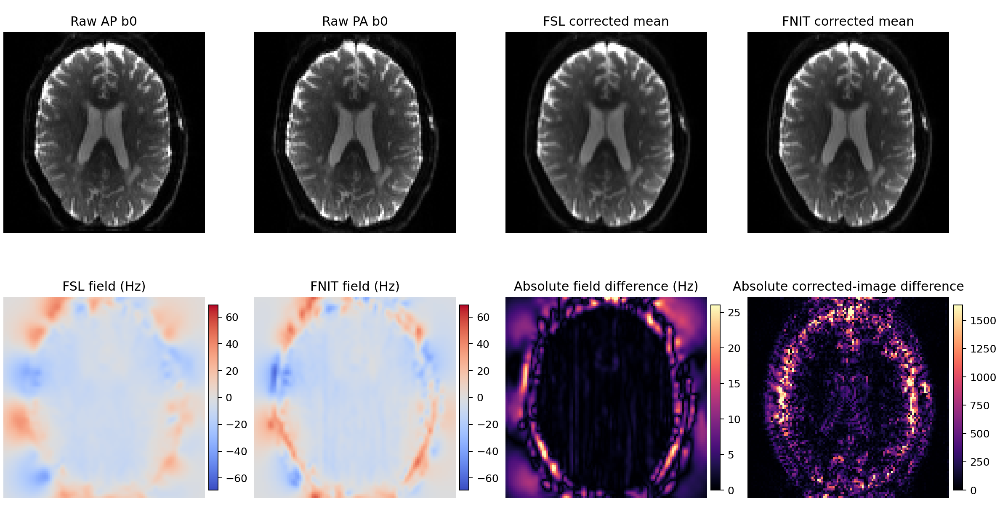

# TorchTOPUP：UK Biobank AP/PA b0 畸变校正

`fnit.topup.TorchTOPUP` 是 FSL TOPUP `b02b0.cnf` 路径的 PyTorch/CUDA 实现，用一对相反相位编码的 b0 图像估计 Hz 场图并生成 Jacobian 调制后的校正图。运行时不调用 FSL。当前公开接口一次处理一个被试；多被试调度由调用方完成。

本实现参照 FSL TOPUP `2203.2` 源码，保留 FSL 输出文件合同。2026-10-02 补齐默认 regrid，并修正周期平滑、几何 mask、样条采样与多层场传递，使用前五层联合 LM、后四层 SCG。同一真实 AP/PA 输入的新版场图信号区 RMSE 为 `0.010799 Hz`；校正图仍有可测差异，具体数值见下方新版验收。历史结果属于被替代的 L-BFGS 版本。

该功能不使用模型权重。图像、采样坐标与输出为 float32；样条场系数、几何、正则化和求解器使用 float64。三次图像插值在 double 中计算权重与累加，最后转回 float32，与原软件精度层级一致。CUDA 允许 TF32；不使用 float16 或 bfloat16。

## UKB 原始数据目录

`--raw-dir` 需要以下单被试文件：

```text
/path/to/subject/raw/
├── AP.nii.gz
├── AP.bval
├── AP.json
├── PA.nii.gz
├── PA.bval
└── PA.json
```

NIfTI 第四维必须与对应 `.bval` 长度相同。JSON 需要 `PhaseEncodingDirection`，并提供 `TotalReadoutTime`，或提供可换算总读出时间的 `EffectiveEchoSpacing`。当前实现支持 `i/i-` 或 `j/j-`，AP 与 PA 必须方向相反、矩阵和几何一致。

UKB 准备步骤会在 AP、PA 中分别找出 `b<100 s/mm²` 的候选帧，对候选帧执行 GPU 6-DOF 刚体 NCC 配准，计算两两相关均值，并执行 UKB 的选择规则：第一帧得分不低于 0.98 时选择第一帧，否则选择最高分帧。随后写出两帧 `B0_AP_PA.nii.gz` 和两行 `acqparams.txt`。这条 PyTorch 选择器没有调用 FLIRT；在本页的一例真实数据中，它与官方 FLIRT/`fslcc` 流程都选择 AP 第 0 帧和 PA 第 0 帧，但相关分数并不相同。

## 单被试命令行

从 UKB 原始目录完成 b0 选择和场图估计：

```bash
fnit topup \
  --raw-dir /path/to/subject/raw \
  --output-dir topup_subject \
  --device cuda:0
```

- `--raw-dir` 指向上面的六个输入文件。
- `--output-dir` 保存准备后的 AP/PA b0、采集参数和全部 TOPUP 输出。
- `--device cuda:0` 在指定 GPU 上完成候选帧配准和场图估计；可改为 `cpu`。
- 已有输出时程序停止；确认需要替换时加 `--overwrite`。

对已经准备好的 FSL 风格输入，命令为：

```bash
fnit topup \
  --imain B0_AP_PA.nii.gz \
  --datain acqparams.txt \
  --config b02b0.cnf \
  --out fieldmap_out \
  --fout fieldmap_fout \
  --iout fieldmap_iout \
  --jacout fieldmap_jacout \
  --device cuda:0
```

- `--imain` 是 `[X,Y,Z,2]` 的相反相位编码 b0 对。
- `--datain` 是两行四列的 FSL acquisition-parameter 文件；前三列为相位编码向量，第四列为总读出时间（秒）。
- `--config b02b0.cnf` 明确选择当前唯一实现的官方九级配置。
- `--out` 是无扩展名的 TOPUP 根名，用来写 coefficient 和 movement 文件。
- `--fout` 写 Hz 场图；`--iout` 写两帧校正图；`--jacout` 写两个 Jacobian 文件。
- 输出名不带扩展名时，`FSLOUTPUTTYPE=NIFTI` 写 `.nii`，未设置或 `NIFTI_GZ` 写 `.nii.gz`。

独立入口 `fnit-topup` 接受同一组参数，例如把上面命令的 `fnit topup` 换成 `fnit-topup`。

对应的原生 FSL 命令是：

```bash
topup \
  --imain=B0_AP_PA.nii.gz \
  --datain=acqparams.txt \
  --config=b02b0.cnf \
  --out=fieldmap_out \
  --fout=fieldmap_fout \
  --iout=fieldmap_iout \
  --jacout=fieldmap_jacout
```

两条命令中的 `imain/datain/config/out/fout/iout/jacout` 角色一致。FNIT 增加 `--device` 和 `--overwrite`。

## 单被试 Python 调用

直接处理 UKB 原始目录：

```python
from fnit import run_ukb_topup

result, prepared = run_ukb_topup(
    raw_dir="/path/to/subject/raw",  # 输入：AP/PA NIfTI、bval 和 JSON 的目录
    output_dir="topup_subject",  # 输出：该受试者的 TOPUP 结果目录
    device="cuda:0",  # 运行设备：第一张可见 CUDA GPU，也可为 "cpu"
    overwrite=False,  # 写盘策略：不覆盖已有文件
)
```

`prepared` 记录写出的 `imain/datain`、选中的 AP/PA 原始帧索引和候选得分。`result` 保存内存结果及 QC。

已有 b0 对时，可以按 FSL 参数逐项调用：

```python
from fnit import TorchTOPUP

model = TorchTOPUP(
    device="cuda:0",  # 运行设备：第一张可见 CUDA GPU
)
result = model.run(
    imain="B0_AP_PA.nii.gz",  # 输入：FSL --imain，两帧相反相位编码 b0
    datain="acqparams.txt",  # 输入：FSL --datain，采集方向与总读出时间
    out="fieldmap_out",  # 输出：FSL --out，系数和运动文件根名
    fout="fieldmap_fout",  # 输出：FSL --fout，Hz 场图
    iout="fieldmap_iout",  # 输出：FSL --iout，两帧校正图
    jacout="fieldmap_jacout",  # 输出：FSL --jacout，两个 Jacobian
    overwrite=False,  # 写盘策略：不覆盖已有文件
)
```

不写文件时使用：

```python
result = model(
    imain="B0_AP_PA.nii.gz",  # 输入：两帧相反相位编码 b0
    datain="acqparams.txt",  # 输入：两行 acquisition parameters
)
```

| Python 字段 | 内容 |
|---|---|
| `result.field_hz` | `--fout` 对应的 3D Hz 场图，NIfTI intent 2018。 |
| `result.corrected` | `--iout` 对应的 `[X,Y,Z,2]` Jacobian 调制校正图。 |
| `result.corrected_mean` | 两帧校正图的内存均值；原生 `topup --iout` 不单独写该文件。 |
| `result.jacobians` | `--jacout_01/02` 对应的两个 3D Jacobian。 |
| `result.coefficients` | `--out_fieldcoef` 对应的 cubic B-spline coefficient NIfTI，intent 2016。 |
| `result.movement_parameters` | `--out_movpar.txt` 对应的两行六列参数，平移单位 mm，旋转单位 rad。 |
| `result.qc` | 设备、精度、TF32、各层 SSD/正则化能、有效体素、LM/SCG 接受步及收敛状态、同步计算时间和 CUDA 峰值显存。 |

## 输出文件合同

以 `out=fieldmap_out` 为例：

| FNIT 输出 | 原生 TOPUP 输出 | 形状与单位 |
|---|---|---|
| `fieldmap_out_fieldcoef.nii.gz` | 同名 | `[55,55,39]`（本例），float32，intent 2016；pixdim 是 knot spacing，qform offset 编码完整场尺寸。 |
| `fieldmap_out_movpar.txt` | 同名 | `[2,6]`；第一帧固定为零，反向帧沿相位编码轴的平移固定为零。 |
| `fieldmap_fout.nii.gz` | `--fout` | `[X,Y,Z]`，float32，Hz，intent 2018。 |
| `fieldmap_iout.nii.gz` | `--iout` | `[X,Y,Z,2]`，float32，输入几何。 |
| `fieldmap_jacout_01.nii.gz`、`_02` | `--jacout_01/02` | `[X,Y,Z]`，float32；保留 TOPUP 的 qform/sform-code 0 文件合同。 |

历史 L-BFGS 版本的 coefficient 和 movement 文件已由 FSL 6.0.7.4 `applytopup` 直接读取。`applytopup` 输出与 FNIT 两帧校正均值在共同非零体素上的 Pearson `r=0.999987`，MAE `9.4876`，RMSE `23.3396`。边界掩膜与插值实现不同，因此不是逐元素一致。

## 实现范围

当前公开命令固定为 UKB 使用的 `b02b0.cnf`：正好两个 3D b0、单一且相反的 `i` 或 `j` 方向、cubic B-spline 场、SSD 加弯曲能、周期图像插值及 Jacobian 强度调制。第一帧固定；反向帧的 PE 平移固定，只估计其余五个运动参数。参数文件遵循 FSL `datain` 坐标约定；输入为 neurological storage 时，内部将 x 数据翻到 FSL radiological storage，但不修改 `datain` 的方向符号。`fout/iout` 恢复输入 storage，系数、运动和 Analyze-style Jacobian 保留 FSL canonical 约定。

| `TOPUPConfig` 参数 | 九层默认值 | 含义 |
|---|---|---|
| `warp_resolution_mm` | `20,16,14,12,10,6,4,4,4` | 场的 knot resolution，mm；每轴按当层 voxel size 取整得到至少一个 voxel 的 knot spacing。 |
| `subsampling` | `2,2,2,2,2,1,1,1,1` | 每轴降采样倍数；必须整除输入尺寸，按块平均。 |
| `fwhm_mm` | `8,6,4,3,3,2,1,0,0` | 周期 Gaussian 平滑的 FWHM，mm。 |
| `maximum_iterations` | `5,5,5,5,5,10,10,20,20` | 原软件 `miter`：前五层 LM 的接受步上限；后四层 SCG 的迭代上限。 |
| `regularization` | `0.005,0.001,0.0001,0.000015,0.000005,0.0000005,0.00000005,0.0000000005,0.00000000001` | 弯曲能权重；按官方 `ssqlambda=1` 乘最近一次 cost 计算的 SSD。 |

Python 参数仍要求九层；命令行只接受 `b02b0.cnf`。不支持 `k/k-`、多于两帧、其他正则模型或原软件全部配置选项。公开 Python 类、调用、结果和文件名保持原用途。旧的 `optimizer_steps_per_iteration` 是 L-BFGS 额外预算参数，已移除；调用方应删除该参数并用 `maximum_iterations` 表示官方层内预算。

## 2026-10-02 数值修复与验收边界

- 补齐原软件默认 `regrid=1`：源图每轴增加最大 subsampling 数，原图先以 cubic 重采样。源图 voxel size、刚体中心、位移采样和 alpha 导数比例按实际源网格计算；场与输出 Target 保留原几何。本例源图为 `106×106×74`，Target 为 `104×104×72`。
- 周期平滑与 float 图像的核初始化、累加和块平均遵循原源码；替代旧的 zero-padding 平滑。
- cost 与写出都使用同一几何 mask，并清掉非 PE 方向的一 voxel 边框；移除原软件没有的 `Jacobian > 0.05` 排除条件。
- 图像 cubic sampler 使用官方负周期坐标索引、z/y/x tap 顺序、double 权重与累加。CUDA 将强度和三个解析空间导数融合计算；CPU 使用相同数学路径。
- 改变 subsampling 时直接采样旧 B-spline，再拟合新系数；随后按原软件顺序改变 warp resolution。相同场网格不重复拟合。
- 前五层联合估计场与运动，使用矩阵无关 GN/LM 和 PCG；后四层固定运动，使用 SCG。大 Hessian 不以稠密矩阵构造。复用已存在的 FNIRT 样条、正则化和求解器实现。

CPU 数学回归覆盖上述 mask、平滑、降采样、采样导数、冻结 SSD 权重时的梯度、联合 GN 对称性及正半定性、LM 预算和固定系数的输出几何；这些小测试不用于真实精度或性能结论。固定官方保存系数与 movement 的重渲染诊断不进行估计，分别比较场、Jacobian、支持区和 iout。保存系数已由内部 double 转成 float32，movement 已格式化为文本，因此与官方原始内部参数直接生成的输出之间仍有落盘舍入边界。

共享样条的 separable double 展开与官方逐系数 double 累加在算术顺序上不同。下面以同输入估计、固定官方参数渲染和首层梯度三项真实检查分别量化估计与渲染；完整 dMRI pipeline 另行验收。`qc.fsl_numerically_equivalent` 和 `qc.bitwise_equivalent` 仍为 `False`。

## 2026-10-02 新版同输入真实验收

一例真实数据的同一 `104×104×72×2` AP/PA b0 对、两行采集参数及官方 `b02b0.cnf` 九层 schedule，分别由 FSL 6.0.7.4 和当前 FNIT 独立估计。输入 SHA-256 为 `f701b4ef97e39f3e821030d8c630f575a1410ec380627f26f11312005968c774`；验收源码 `core.py` SHA-256 为 `d6b9838ca62ffeaa32b608a860520fc3feb5e66582064303a6de47f199e2b8e8`，`_sampling_cuda.py` 为 `ee19a764849bda80137312ed3ab8f1bf0aaef5e13f852f49f435e511b40d2427`。当前源码已完成三次独立进程估计、固定参数渲染、首层梯度及真实坐标 sampler 验收。输入图像和输出 NIfTI 不公开。

比较前检查完整输出的 shape、affine 和有限值，不通过时不计算误差。下列五个文件的检查均通过，intent 也分别匹配。固定信号区为原始两帧均值 `>100`（546,543 个空间体素）；固定脑区来自独立的原软件脑 mask `>0.5`（271,080 个空间体素）。两帧 iout 先在同一个空间 ROI 内取值，再展开为 4D 全部数值统计，未重采样输出。

| 输出 | 范围 | Pearson r | MAE | RMSE | p95 绝对误差 | 最大绝对误差 |
|---|---|---:|---:|---:|---:|---:|
| Hz 场图 | 全 FOV | 0.9999998965 | 0.004052 Hz | 0.009095 Hz | 0.013837 Hz | 0.405796 Hz |
| Hz 场图 | 固定信号区 | 0.9999998778 | 0.005255 Hz | 0.010799 Hz | 0.016525 Hz | 0.405796 Hz |
| Hz 场图 | 固定原软件脑区 | 0.9999997811 | 0.005950 Hz | 0.011799 Hz | 0.017849 Hz | 0.405796 Hz |
| 两帧校正图 | 全 FOV | 0.9999983857 | 1.155769 | 8.248893 | 4.796875 | 1037.257813 |
| 两帧校正图 | 固定原软件脑区 | 0.9999965618 | 2.703056 | 12.849295 | 8.593799 | 1037.257813 |
| Jacobian 01 | 固定原软件脑区 | 0.9999965295 | 0.000223 | 0.000407 | 0.000687 | 0.014418 |
| Jacobian 02 | 固定原软件脑区 | 0.9999965295 | 0.000223 | 0.000407 | 0.000687 | 0.014418 |
| 场系数 | 全部 117,975 个系数 | 0.9999996802 | 0.006814 | 0.016368 | 0.027912 | 0.678102 |

运动文件的最大平移差为 `5.340487×10⁻⁵ mm`，最大旋转差为 `6.659318×10⁻⁶ rad`。本次九层均用完默认预算 `5,5,5,5,5,10,10,20,20`，每层所有步均被接受；`converged=False` 记录预算内未满足停止条件。最终有效空间体素为 739,322，固定官方参数渲染为 739,315。

完成输出的[独立 CPU 诊断](../../validation/topup/output_support_20261002.public.json)确认：固定脑区的 271,080 个体素，在两侧的两帧 iout 中全部非零，非零支持区 XOR 为 0；共同非零脑区与固定脑区的误差完全相同，支持差异贡献的平方误差为 0。全 FOV 的 FNIT-only 非零体素为 7，原软件-only 为 0，均在固定脑区之外。因此脑内 RMSE `12.849295` 和最大差 `1037.257813` 来自共同支持区内的强度残差。场与运动的小幅估计差会通过采样位置、局部强度梯度和 Jacobian 调制影响 iout；本次尚未进一步隔离每一项贡献，不能将残差只归因于 GPU 舍入。该诊断使用 decoded 非零信号，不把它当作独立几何 mask。

### 固定参数与首层梯度检查

固定原软件保存的 fieldcoef 和 movpar，只用 FNIT 重渲染同一输入，不重新估计场或运动：

| 输出 | 范围 | Pearson r | MAE | RMSE | 最大绝对误差 |
|---|---|---:|---:|---:|---:|
| Hz 场图 | 固定原软件脑区 | 0.999999999999998 | 1.001596×10⁻⁷ Hz | 4.866082×10⁻⁷ Hz | 1.525879×10⁻⁵ Hz |
| 两帧校正图 | 固定原软件脑区 | 0.999999999997419 | 0.005234 | 0.011135 | 0.267578 |
| Jacobian 01/02 | 全 FOV | >0.99999999999999 | ≈4.48×10⁻⁹ | ≈2.00×10⁻⁸ | 2.384186×10⁻⁷ |

固定参数的有效支持区与原软件 iout 非零支持区 Dice 为 `1`，有效空间体素 739,315；脑内 iout RMSE 相对原软件脑内均值 7,684.8649 为约 `1.45×10⁻⁶`。补齐默认源图 regrid 前，同一检查的脑内 iout RMSE 为 480.471；补齐后为 0.011135，定位了旧渲染路径中的主要几何错误。剩余微小差异包含保存系数/运动的舍入边界及实现算术顺序，尚未逐项分配来源；不声明逐元素一致。

首层零场、零运动的有效体素数与原软件同为 88,400，FNIT SSD `924.964677585` 对应原软件日志 `924.965`。1,695 个场与运动参数梯度的 Pearson `r=0.999999999991098`，相对 L2 差 `4.569587×10⁻⁶`，RMSE `0.000308597`。第一步 LM 接受后的 cost 为 `629.979685552`，原软件日志为 `629.98`。这些检查验证初始目标函数、导数与第一步路径；独立完整估计仍保留上表中的残差。

### 计时范围与报告

当前源码在 H100 / PyTorch 2.5.1 上完成三次独立进程运行，CPU threads 为 8，CPU affinity 为 8–15，CUDA 预算为 20,000,000,000 bytes；原软件 CPU 配准使用不同 CPU 核，计时段没有本任务其他 GPU 作业重叠。三次精度统计完全相同，峰值 CUDA 已分配显存均为 `389,119,488 bytes`。第一轮明显较慢，原因尚未隔离。

| 计时范围 | 第 1 次 | 第 2 次 | 第 3 次 | 三次中位数 |
|---|---:|---:|---:|---:|
| API 读取＋计算＋NIfTI 写盘 | 17.864061 s | 6.704100 s | 7.094846 s | 7.094846 s |
| 内部同步计算 | 17.130760 s | 5.966458 s | 6.368049 s | 6.368049 s |
| 完整进程，含启动、imports、CUDA 初始化及统计/JSON | 22.13 s | 10.56 s | 10.82 s | 10.82 s |

主要精度报告使用第 2 次运行，对应 API `6.704100 s`；表中的 `7.094846 s` 是三次 API 中位数，分别标明口径。完整进程时间比 API 多包含验证统计，不与内部计算时间混用。

FSL 6.0.7.4 在同一真实输入、同一节点本地存储上独立重复两次，CPU affinity 为 16–23、8 线程，不使用 GPU；本任务其他 CPU 作业使用不同核，系统 cache 未清空。

| FSL 计时范围 | 第 1 次 | 第 2 次 | 两次中位数 |
|---|---:|---:|---:|
| 外层同步 subprocess 墙钟 | 216.987430 s | 205.233591 s | 211.110510 s |
| GNU time 原生进程墙钟 | 216.98 s | 205.22 s | 211.10 s |

FSL 两次输出文件的 SHA-256 相同。外层 FSL 墙钟中位数 `211.110510 s` 相对 FNIT 完整验证进程中位数 `10.82 s` 的观测时间比为 `19.51×`；FNIT 该时间还包含额外误差统计和 JSON 写入。API 的 `7.094846 s` 不包含启动及验证统计，因此不将它与 FSL 完整进程相除作同范围比较。该时间比来自一例共享节点上的组件运行，输出仍有上表残差；不表示数值等价或完整 dMRI 链的加速比。本轮完整参考链中 CPU 0–7 的 TOPUP 单次耗时 `215.4733 s` 单独记录，没有混入 CPU 16–23 的两次中位数，也不沿用历史 `300.170 s` 分母。

另对两帧各 778,752 个真实 Target 坐标，在相同驻留 image coefficient 与坐标上比较融合 CUDA sampler 和独立 double tensor 数学参照。强度、三个空间导数和 valid mask 的全部值精确相同。两帧暖同步 wall 中位数分别为 tensor `0.019326/0.019327 s`、融合 `0.000217/0.000212 s`，时间比分别 `89.002×/91.043×`。这是相对逐 tap tensor 参照的 sampler 时间比，参照没有调用 FSL；不表示完整 TOPUP 或 FSL 加速比。计时排除输入读写、regrid、预滤、几何准备与 JIT warmup，CUDA event 表示 stream 区间而非独占 kernel 时间。

机器可读结果为[独立同输入估计](../../validation/topup/report.matched_20261002.public.json)、[三次 GPU 重复](../../validation/topup/repeats_20261002.public.json)、[两次原生 FSL 重复](../../validation/topup/reference_repeats_20261002.public.json)、[固定官方参数重渲染](../../validation/topup/fixed_parameters_20261002.public.json)、[首层梯度](../../validation/topup/initial_gradient_20261002.public.json)和[真实 sampler](../../validation/topup/sampler_20261002.public.json)；运行和区域定义见[验收说明](../../validation/topup/README.md)。受支持本地 Python 3.11 / PyTorch 2.5.1 的[96 项组合回归](../../validation/dmri_pipeline/regression_synthstrip_topup_20261002.public.json)通过，其中 20 项 CUDA sampler 测试使用 RTX 3060，其余为 CPU 接口与数学检查；小测试不作为 benchmark。新版脑图随独立完整链验收更新；下方图属于历史 L-BFGS 版本。

## 历史发布验收状态

[`report.public.json`](../../validation/topup/report.public.json) 由 FNIT 0.14.0 生成，记录当时的数值文件 SHA-256；其 L-BFGS 数值路径曾覆盖 FNIT 0.16.0。2026-10-02 本次修复改变了 `core.py` 并新增 CUDA sampler，因此该报告与下表、图示仅保留为历史基线，不能代表本次 LM/SCG 版本。病例数为一。

## 历史 L-BFGS 版与 FSL 6.0.7.4 的真实数据对照

验证使用 `/path/to/subject/raw` 中一例 UKB 格式真实 dMRI。AP 为 105 帧、PA 为 6 帧；官方选择流程和 FNIT 都选择各自第 0 个 b0。FSL 和 FNIT 使用同一 `104×104×72×2` 输入、同一两行 `acqparams.txt` 和同一 `b02b0.cnf` schedule。数值指标来自完整 3D/4D 输出；“信号区”预先定义为原始 AP/PA 均值大于 100 的体素。

| 输出 | 比较范围 | Pearson r | MAE | RMSE | 最大绝对误差 |
|---|---|---:|---:|---:|---:|
| Hz 场图 | 全 FOV | 0.925534 | 4.977568 Hz | 7.624566 Hz | 104.590492 Hz |
| Hz 场图 | 信号区 | 0.945641 | 4.406024 Hz | 7.320009 Hz | 104.590492 Hz |
| 两帧校正图 | 全 FOV | 0.994358 | 226.416113 | 490.237869 | 25762.781250 |
| 校正均值图 | 全 FOV | 0.995778 | 181.485061 | 422.956005 | 23167.198242 |
| 两个 Jacobian | 全 FOV | 0.808462 | 0.075396 | 0.135923 | 2.945159 |

shape、dtype、场图/校正图 affine、NIfTI intent、coefficient shape/pixdim/qform/sform，以及 Jacobian 的 Analyze-style header 合同均与 FSL 对应输出一致。场图、Jacobian 和运动参数仍有超出数值舍入的差异，所以本包不声明 TOPUP 数值等价。

计时在共享 `gpucw1` 上完成：Intel Xeon Gold 6430、NVIDIA H100 PCIe 80 GB、FSL 6.0.7.4、PyTorch 2.5.1 CUDA。每次计时包含独立进程启动、NIfTI 读取、优化和全部输出写入；GPU 计时前后同步。三次运行使用同一真实输入。

| 实现 | 设备 | 墙钟中位数 [Q1–Q3] | 峰值内存 |
|---|---|---:|---:|
| FSL `topup` | CPU | 300.170 [299.525–300.980] s | 285,676 KB peak RSS |
| FNIT `fnit topup` | H100 GPU | 87.800 [86.955–87.810] s | 1.566 GB CUDA；1,079,372 KB peak RSS |

FNIT 内部 CUDA 同步计算中位数为 81.652 s；历史墙钟相对 FSL 的中位数比为 3.419×；该版本的输出并非数值等价，且此比值不代表本次修复后的速度。节点未做独占隔离，数字表示这台共享节点上的观测时间。样本量为一个真实被试，三次重复只用于计时稳定性，不能当作三名被试。

下图显示同一轴位切片的原始 AP/PA、FSL/FNIT 校正均值、Hz 场图和绝对差值。显示色阶不参与上表计算。



公开机器可读报告位于 [`validation/topup/report.public.json`](../../validation/topup/report.public.json)。图中不含病例标识；仓库不上传该私有原始 dMRI。

## 源码与许可

UKB AP/PA b0 准备顺序参考 UK Biobank brain imaging pipeline v1.5；场估计实现参照 FSL TOPUP `2203.2`（commit `3e2cb9104e834ce18c10e4b7edddbd500d0c459c`）、basisfield、miscmaths、newimage 和 warpfns。完整、未修改的上游 TOPUP 源码、每文件 SHA-256 和 Git tree 保存在 [`src/fnit/_vendor_fsl`](../../src/fnit/_vendor_fsl/README.md)。修改后的 PyTorch 源码与上游源码一同发布，受 [`FSL Software Licence 6.0`](../../licenses/FSL-6.0.txt) 的非商业条款约束。本项目不是 FSL 官方发布。

## Reference

- 参考文献：Andersson, Skare & Ashburner, *How to correct susceptibility distortions in spin-echo echo-planar images: application to diffusion tensor imaging*, NeuroImage (2003), [doi:10.1016/S1053-8119(03)00336-7](https://doi.org/10.1016/S1053-8119(03)00336-7)。
- 原实现代码库：[FSL `topup`](https://git.fmrib.ox.ac.uk/fsl/topup)。

## 最近更新

| 日期 | 代码与 benchmark 范围 |
|---|---|
| 2026-10-02 | 补齐默认源图 regrid，修正目标函数支持区、周期平滑、图像插值精度及索引、层间场传递、FSL storage 约定，改为联合 LM/SCG；一例同输入真实场图信号区 RMSE 0.010799 Hz，固定参数脑内 iout RMSE 0.011135；当前源码三次 API 中位数 7.094846 s，96 项组合回归通过，独立估计非逐元素一致。 |
| FNIT 0.16.0 | 与 0.14.0 数值文件逐字节相同；保留当时一例真实 pair 的 L-BFGS 对照。 |
| FNIT 0.14.0 | 初版 AP/PA 路径、FSL 文件合同、单病例精度与三次共享节点计时；不声明数值等价。 |
