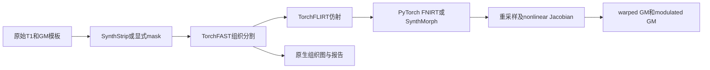
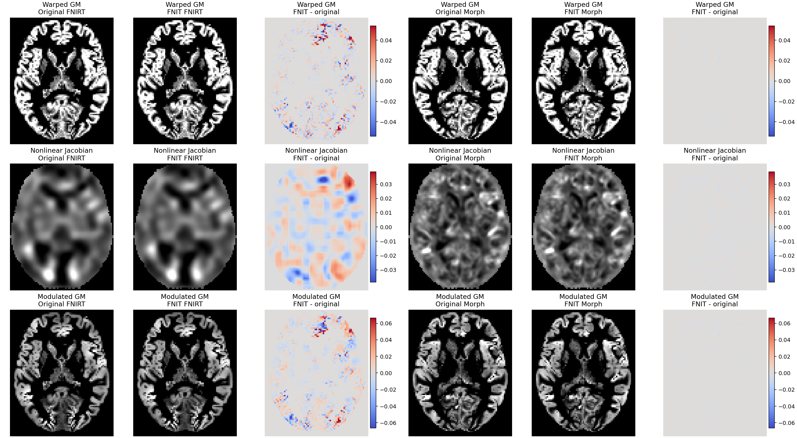

# UK Biobank v1.5 VBM 参考

[返回首页](../../README.md) · [完整旧文档与更早证据](../../validation/ukb_vbm/readme_archive_20261005.md)

| 项目 | 内容 |
|---|---|
| 输入 | 用户3D T1w及公开GM模板/参考mask |
| 输出 | FastVBM原生与模板空间13图及JSON |
| 对应原软件 | UK Biobank v1.5 bb_struct_init / bb_vbm，FSL |
| Python / CLI | FNIT无独立UKB VBM API/CLI；使用FastVBM / fnit fast-vbm |
| CPU / GPU | 同FastVBM CPU/CUDA；本页仅公开方法与资源 |

## 1. 功能简介

本页说明[FastVBM](../fast_vbm/README.md)对应的公开UK Biobank v1.5 VBM方法与模板。FNIT没有独立UKB数据下载、字段提取或队列聚合入口；用户提供自己的原始T1w和模板，再调用单被试FastVBM。

官方方法以GM PVE为moving、公开GM模板为fixed，进行仿射/非线性配准、nonlinear-only Jacobian及调制。FNIT两分支共用SynthStrip、TorchFAST、TorchFLIRT、重采样与调制，非线性估计器可选SynthMorph或TorchFNIRT。SynthStrip自动脑提取与官方初始化的裁剪/BET前段不同。



## 2. Python 调用

```python
from fnit import FastVBM

vbm_pipeline = FastVBM(
    device="cuda:0",  # PyTorch计算设备
    threads=4,  # CPU线程预算
    registration_backend="fnirt",  # 使用TorchFNIRT GM配置
    fast_execution="fsl",  # 项目内部FAST原序实现，不启动FSL
)
vbm_result = vbm_pipeline.run(
    image="subject_T1w.nii.gz",  # 原始3D T1w
    template="template_GM.nii.gz",  # 固定GM模板，决定模板空间网格
    output_dir="results/sub-01",  # 单被试输出目录
    brain_mask=None,  # 省略时SynthStrip自动提取
    reference_mask="template_brain_mask.nii.gz",  # 同模板网格显式掩膜
    overwrite=False,  # 不覆盖已有同名产物
)
```

### 输入数据格式

- `image`：用户自有单幅3D T1w `(X,Y,Z)`，有效NIfTI affine和体素间距、原生空间，强度无固定单位；不接受队列字段或表型表。
- `template`：公开archive的template_GM.nii.gz，3D连续GM模板，通常MNI152 2mm、91×109×91；具体shape/affine应以实际文件核验，不能凭文件名推断。
- `brain_mask`：可选同T1shape/affine二值脑mask；`reference_mask`：同GM模板shape/affine的非空mask，复现原运行时使用其实际mask。下载包内1mm掩膜不能直接当2mm模板mask。
- `output_dir`：单被试独立目录。模型权重与公开模板分别安装；模板不是网络权重，均无原始数据表/表型字段要求。

### pipeline构造

| 参数 | 必需 | 类型 | 默认值 | 含义 |
|---|---|---|---|---|
| `device` | 否 | `str` | `'cpu'` | 计算设备，cpu 或 cuda:N；编号遵循 CUDA_VISIBLE_DEVICES |
| `threads` | 否 | `int 或 None` | `None` | PyTorch CPU 线程预算；None 保留当前值，CLI 默认另见下节 |
| `synthstrip_weights` | 否 | `str 或 Path 或 None` | `None` | SynthStrip PT 文件或目录；仅未提供 brain_mask 时使用 |
| `synthmorph_weights` | 否 | `str 或 Path 或 None` | `None` | SynthMorph deform H5 文件或目录；仅 synthmorph 后端使用 |
| `bias_correction` | 否 | `bool` | `True` | 启用FAST偏置校正；False将bias_fwhm_mm设0 |
| `fast_execution` | 否 | `str` | `'tensor'` | FAST 更新模式：tensor 或内部原序 fsl |
| `synthmorph_extent` | 否 | `int` | `256` | SynthMorph 网络尺寸，192 或256 |
| `synthmorph_hyper` | 否 | `float` | `0.5` | SynthMorph 正则化，严格0<hyper<1 |
| `synthmorph_steps` | 否 | `int` | `7` | SynthMorph 速度场积分步数，至少5 |
| `registration_backend` | 否 | `str` | `'synthmorph'` | 非线性估计器：synthmorph 或 fnirt |
| `fnirt_strides` | 否 | `tuple[int, ...]` | `(4, 2, 1, 1)` | 四个分辨率层的体素采样步长 |
| `fnirt_steps` | 否 | `tuple[int, ...]` | `(5, 5, 10, 5)` | 四层 Gauss–Newton 最大更新次数 |
| `fnirt_input_fwhm_mm` | 否 | `tuple[float, ...]` | `(6.0, 4.0, 2.0, 2.0)` | 四层 moving GM 平滑 FWHM，mm |
| `fnirt_reference_fwhm_mm` | 否 | `tuple[float, ...]` | `(4.0, 2.0, 0.0, 0.0)` | 四层 fixed GM 平滑 FWHM，mm |
| `fnirt_warp_resolution_mm` | 否 | `float` | `10.0` | FNIRT 三次 B-spline 控制点间距，mm |
| `fnirt_regularization` | 否 | `tuple[float, ...]` | `(150.0, 75.0, 50.0, 30.0)` | 四层 bending-energy 正则化权重 |

### run输入与保存参数

| 参数 | 必需 | 类型 | 默认值 | 含义 |
|---|---|---|---|---|
| `image` | 是 | `str 或 Path 或 nibabel SpatialImage` | `—` | 输入影像，格式、维数与预处理约束见输入数据格式 |
| `template` | 是 | `str 或 Path 或 nibabel SpatialImage` | `—` | 3D GM 模板；决定标准空间结果 shape、affine 和空间 |
| `output_dir` | 是 | `str 或 Path` | `—` | 结果或调试文件的目录；具体自动保存范围见输出 |
| `brain_mask` | 否 | `str 或 Path 或 nibabel SpatialImage 或 None` | `None` | 同 T1 网格非空二值掩膜；有值时跳过 SynthStrip |
| `reference_mask` | 否 | `str 或 Path 或 nibabel SpatialImage 或 None` | `None` | 同模板网格非空 mask；FNIRT使用，SynthMorph仅记录 |
| `overwrite` | 否 | `bool` | `False` | 已有任何同名结果时是否覆盖 |

### 输出

```text
results/sub-01/
├── T1_brain.nii.gz / brain_mask.nii.gz
├── T1_brain_pve_0.nii.gz / _pve_1.nii.gz / _pve_2.nii.gz
├── T1_brain_seg.nii.gz / _pveseg.nii.gz / _mixeltype.nii.gz
├── T1_brain_bias.nii.gz / _restore.nii.gz
├── T1_GM_to_template_GM.nii.gz
├── T1_GM_JAC_nl.nii.gz
├── T1_GM_to_template_GM_mod.nii.gz
└── fast_vbm_report.json
```

| Python 属性 | 内容 |
|---|---|
| `brain`、`brain_mask` | 输入 T1 网格的脑图和二值 mask |
| `fast` | `FASTResult`；含三类 PVE、分割、mixel、bias 和 restored T1 |
| `registration` | `VBMRegistrationResult`；含模板空间结果和配准 QC |
| `pve_gm` | `fast.pve_gm` 的便利属性 |
| `warped_gm` | affine 与所选 nonlinear backend 共同重采样后的 GM |
| `jacobian` | nonlinear-only pull Jacobian，不含 FLIRT affine determinant |
| `modulated_gm` | `warped_gm * jacobian` |
| `settings` | 设备、TF32、mask 来源、后端和实际参数 |
| `timing_sec` | 脑提取、FAST、配准/Jacobian/modulation 和总墙钟时间 |

| Python 键 | 文件名 | 网格 | 含义 |
|---|---|---|---|
| `brain` | `T1_brain.nii.gz` | 输入 T1 | 脑内保留输入；默认脑外背景为 `min(input.min(), 0)`，负值输入时为该最小值 |
| `brain_mask` | `brain_mask.nii.gz` | 输入 T1 | 二值脑 mask |
| `pve_csf` | `T1_brain_pve_0.nii.gz` | 输入 T1 | CSF PVE |
| `pve_gm` | `T1_brain_pve_1.nii.gz` | 输入 T1 | GM PVE，配准 moving image |
| `pve_wm` | `T1_brain_pve_2.nii.gz` | 输入 T1 | WM PVE |
| `hard_segmentation` | `T1_brain_seg.nii.gz` | 输入 T1 | PVE 前硬分类 |
| `pve_segmentation` | `T1_brain_pveseg.nii.gz` | 输入 T1 | 最大 PVE 分类 |
| `mixel_type` | `T1_brain_mixeltype.nii.gz` | 输入 T1 | pure/mixed tissue 类型 |
| `bias_field` | `T1_brain_bias.nii.gz` | 输入 T1 | 乘性 bias field，脑外为 1 |
| `restored` | `T1_brain_restore.nii.gz` | 输入 T1 | bias-corrected T1，脑外为 0 |
| `warped_gm` | `T1_GM_to_template_GM.nii.gz` | GM template | affine + nonlinear warped GM |
| `jacobian` | `T1_GM_JAC_nl.nii.gz` | GM template | 仅非线性 pull 变换的行列式 |
| `modulated_gm` | `T1_GM_to_template_GM_mod.nii.gz` | GM template | warped GM × Jacobian |

另写 `fast_vbm_report.json`，记录参数、分阶段时间、FAST 摘要、配准 QC 和输出文件名。报告不保存原始输入路径。

脑图保留输入dtype，mask uint8，三种分类int32；PVE/bias/restore及三模板连续图float32。原生10图shape/affine与T1同，末三图shape/affine与GM模板同。PVE及Jacobian无量纲，modulated GM=warped GM×nonlinear Jacobian；数值体积另可用体素体积积分，单位mm³。

内部forward affine为moving-world→fixed-world；采样为fixed→moving pull，nonlinear Jacobian不含FLIRT affine determinant。CPU FNIRT用已计算的解析coefficient Jacobian，其余路径保留dense-field定义。pipeline不另写warp/coefficient；需要这些用[独立FNIRT](../fnirt/README.md)。FastVBM(...)()与run输入角色相同但无output_dir/overwrite，只返回内存；result.save(output_dir,overwrite=False,report=True)三个保存参数。

### 标准空间结果的读取

以下示例读取已经保存的结果，保留模板网格与仿射。PVE、Jacobian和调制图为无量纲数值；灰质体积积分乘模板体素体积后才以mm³表示。

```python
import nibabel as nib
import numpy as np

modulated_gm_image = nib.load("results/sub-01/T1_GM_to_template_GM_mod.nii.gz")  # 模板空间调制GM
modulated_gm_data = np.asanyarray(modulated_gm_image.dataobj)  # float32、与模板同shape
voxel_volume_mm3 = abs(np.linalg.det(modulated_gm_image.affine[:3, :3]))  # 每体素物理体积
modulated_gm_integral_mm3 = float(modulated_gm_data.sum(dtype=np.float64) * voxel_volume_mm3)  # 体积积分
print(modulated_gm_image.affine, modulated_gm_integral_mm3)
```

### 保存与报告辅助方法

| 方法 / 参数 | 必需 | 类型 / 默认值 | 含义 |
|---|---|---|---|
| `result.volumes()` | 无参数 | `dict[str, SpatialImage]` | 返回13张原生或模板网格影像的稳定名称映射 |
| `result.report()` | 无参数 | `dict` | 参数、实际时间定义、FAST摘要与配准QC |
| `result.save(output_dir)`的`output_dir` | 是 | `str 或 Path` | 保存13张影像和可选JSON的目录 |
| `result.save`的`overwrite` | 否 | `bool=False` | 同名结果存在时是否覆盖 |
| `result.save`的`report` | 否 | `bool=True` | 是否保存JSON报告 |

`run()`先计算再调用上述保存方法；直接调用`vbm_pipeline(image,template,...)`只返回内存结果。参考mask用于FNIRT拟合；SynthMorph分支记录该mask但不以它约束网络。`fast_execution`与`registration_backend`分别控制组织分割与非线性估计，必须一起记录才能复现方法。

## 3. 命令行调用

```bash
fnit fast-vbm -i subject_T1w.nii.gz --template template_GM.nii.gz \
  --reference-mask template_brain_mask.nii.gz -o results/sub-01 \
  --registration-backend fnirt --fast-execution fsl --device cuda:0 --threads 4
```

没有独立ukb-vbm命令。下表是FastVBM共享CLI；完整默认、参数与输出亦见[FastVBM手册](../fast_vbm/README.md)。

### fnit fast-vbm

| CLI 参数 | Python 参数 / 输出 | 含义 |
|---|---|---|
| `-i` / `--image` | `image` | 输入影像，格式、维数与预处理约束见输入数据格式 |
| `--template` | `template` | 3D GM 模板；决定标准空间结果 shape、affine 和空间 |
| `-o` / `--output-dir` | `output_dir` | 结果或调试文件的目录；具体自动保存范围见输出 |
| `--brain-mask` | `brain_mask` | 同 T1 网格非空二值掩膜；有值时跳过 SynthStrip |
| `--reference-mask` | `reference_mask` | 同模板网格非空 mask；FNIRT使用，SynthMorph仅记录 |
| `--synthstrip-weights` | `synthstrip_weights` | SynthStrip PT 文件或目录；仅未提供 brain_mask 时使用 |
| `--synthmorph-weights` | `synthmorph_weights` | SynthMorph deform H5 文件或目录；仅 synthmorph 后端使用 |
| `--registration-backend` | `registration_backend` | 非线性估计器：synthmorph 或 fnirt |
| `--device` | `device` | 计算设备，cpu 或 cuda:N；编号遵循 CUDA_VISIBLE_DEVICES |
| `--threads` | `threads` | PyTorch CPU 线程预算；None 保留当前值，CLI 默认另见下节 |
| `--fast-execution` | `fast_execution` | FAST 更新模式：tensor 或内部原序 fsl |
| `--synthmorph-extent` | `synthmorph_extent` | SynthMorph 网络尺寸，192 或256 |
| `--synthmorph-hyper` | `synthmorph_hyper` | SynthMorph 正则化，严格0<hyper<1 |
| `--synthmorph-steps` | `synthmorph_steps` | SynthMorph 速度场积分步数，至少5 |
| `--fnirt-strides` | `fnirt_strides` | 四个分辨率层的体素采样步长 |
| `--fnirt-steps` | `fnirt_steps` | 四层 Gauss–Newton 最大更新次数 |
| `--fnirt-input-fwhm-mm` | `fnirt_input_fwhm_mm` | 四层 moving GM 平滑 FWHM，mm |
| `--fnirt-reference-fwhm-mm` | `fnirt_reference_fwhm_mm` | 四层 fixed GM 平滑 FWHM，mm |
| `--fnirt-warp-resolution-mm` | `fnirt_warp_resolution_mm` | FNIRT 三次 B-spline 控制点间距，mm |
| `--fnirt-regularization` | `fnirt_regularization` | 四层 bending-energy 正则化权重 |
| `--no-bias` | `bias_fwhm_mm=0` | 关闭偏置校正 |
| `--overwrite` | `overwrite` | 已有任何同名结果时是否覆盖 |

CLI与Python默认差异：同FastVBM，示例显式fnirt/fsl；不另造UKB入口。

## 4. 原软件调用

以下命令用于独立原软件参考环境；FNIT生产入口不执行它。

```bash
fsl_reg T1_brain_pve_1.nii.gz template_GM.nii.gz \
  T1_GM_to_template_GM -fnirt \
  "--config=GM_2_MNI152GM_2mm.cnf --jout=T1_GM_JAC_nl"
fslmaths T1_GM_to_template_GM -mul T1_GM_JAC_nl T1_GM_to_template_GM_mod -odt float
```

| FNIT参数 / 产物 | 原软件参数 / 产物 |
|---|---|
| fast_execution=fsl | FAST -t1 -n3原位更新 |
| registration_backend=fnirt | fsl_reg -fnirt及GM配置 |
| fnirt_* 四级默认参数 | GM_2_MNI152GM_2mm.cnf |
| reference_mask | FNIRT --refmask（按GM schedule最后一级） |
| warped_gm / jacobian / modulated_gm | fsl_reg输出 / --jout / fslmaths -mul |
| registration_backend=synthmorph | FreeSurfer mri_synthmorph deform，替换非线性估计器 |

这是官方bb_vbm中的GM配准/调制范围，前提是已完成其bb_struct_init。核对方法基于commit0e39a7f7eb76b55437942bfa3073512506b6c8fa，bb_vbm SHA256 efdca88961dad9eeec52e15e2d26ad5f807b2c0bd3b41c547990ba78ebb7753f。代码许可Apache2.0；公开template archive许可未逐文件确认，FNIT不再分发。

<a id="官方-vbm-步骤"></a>
<a id="公开模板"></a>
<a id="当前证据边界"></a>

## 5. 最新精度和运行时间

本页没有独立UKB队列benchmark。本地现场核对main140c3739的API，最近正式全链结果来自**公开非UKB真实T1** ds003138 v1.0.1一例、6f1e2b38/v4，原版FSL6.0.7.4及FreeSurfer8.2.0-1参考；CPU评测节点 Xeon Gold6418H同8物理核/8线程、CPUfloat32，GPU未启用。

### 端到端 benchmark

| 指标 | FNIT | 原软件 | 差异 |
|---|---|---|---|
| FNIRT raw→13图完整CLI | 536.788 s | 已有官方完整链769.365 s | 未数值等价；非紧邻配对 |
| SynthMorph raw→13图完整CLI | 317.736 s | 同边界完整冷链未测 | 不得相加复用阶段作为完整wall |
| FNIRT脑内warped/Jacobian/mod NRMSE | 0.0189811 /0.0100674 /0.0160380 | 独立官方FNIRT输出 | 按RMSE/(P99−P1) |
| Morph脑内三图NRMSE | 0.000561591 /0.000352361 /0.000450764 | 独立官方Morph输出 | 13图并非逐位同 |

### 分步骤 benchmark

| 阶段 | FNIT | 原软件 |
|---|---|---|
| 脑提取 /FAST /配准调制API，FNIRT | 9.383 /97.443 /421.900 s | 原子进程边界不同 |
| 同范围Morph API | 10.243 /109.200 /190.122 s | 完整冷链未测 |

FNIRT/Morph采样RSS5.678/12.631GB，CPU显存不适用。后续组件修复未以此替代完整pipeline重测。数据、资源、源码、13图几何与非空间header差异见[最终完整报告](../../validation/smri_cpu_20261004/task04/fast_vbm_cpu_20261004/final_v4/README.md)，不是对UKB受限队列的精度声明。



## 6. 最近版本和 benchmark

| 日期 | commit / version | 变化 | benchmark |
|---|---|---|---|
| 2026-10-04 | CPU FNIRT Jacobian修复SHA | 解析nonlinear-only Jacobian | [固定系数及stage/GPU回归](../../validation/smri_cpu/fnirt_jacobian_20261004/README.md) |
| 2026-10-04 | 6f1e2b38/v4 | 原始T1两完整CPU链与原序FAST | 上节正式全链；后续组件不改标 |
| 2026-10-02 | registration_lossless冻结 | FNIRT梯度/坐标复用 | [完整18图无损回归](../../validation/registration_lossless_20261002/README.md) |

每条记录保留真实冻结源码、输入与时间边界；逐例、debug/profiling和更早脑图见[完整归档](../../validation/ukb_vbm/readme_archive_20261005.md)。文档整理不重跑MRI，不把执行成功或--help核验作为精度benchmark。

<a id="来源"></a>

## 7. 参考文献、原软件和资源

- [UK Biobank pipeline v1](https://git.fmrib.ox.ac.uk/open-science/analysis/UK_biobank_pipeline_v_1)
- [FMRIB UK Biobank pipeline and ancillary files](https://www.fmrib.ox.ac.uk/ukbiobank/fbp/)
- [FNIRT user guide](https://fsl.fmrib.ox.ac.uk/fsl/docs/registration/fnirt/user_guide.html)
- [FSL FNIRT source](https://git.fmrib.ox.ac.uk/fsl/fnirt)

模型使用下列官方原始文件，Git/wheel不包含。固定[assets-v1 Release](https://github.com/weikanggong1/Fudan-Neuroimaging-toolkit/releases/tag/assets-v1)及公开asset-manifest与当前weights.py逐项大小/SHA记录一致；本轮未重新下载所有大文件。安装器先Release再原站；完整清单见[资源文件清单](../RESOURCE_MANIFEST.md)。

```bash
fnit-setup-weights --model fast-vbm --dest /data/fnit-weights
fnit-setup-weights --model fast-vbm --dest /data/fnit-weights --verify-only
```

| 资源 | 用途 | 官方来源 | 大小 | SHA-256 | 是否允许 FNIT 再分发 |
|---|---|---|---|---|---|
| `synthstrip.1.pt` | 官方推理权重 / 标签数组 | [原站](https://surfer.nmr.mgh.harvard.edu/docs/synthstrip/requirements/synthstrip.1.pt) | 30,851,709 B | `37417f802196186441aae3e7f385d94f8a98c64a88acaeaa2723af995c653e33` | 允许；CC BY 4.0，保留归属 |
| `synthmorph.deform.3.h5` | 官方推理权重 / 标签数组 | [原站](https://surfer.nmr.mgh.harvard.edu/docs/synthmorph/synthmorph.deform.3.h5) | 3,508,630,424 B | `95b367cd30788cc647e4704b650642fc1d70d7e419c20c04f1ba1b2902bc6536` | 允许；CC BY 4.0，保留归属 |

本页列出的模型/数组共2个，3,539,482,133 B。原始文件许可及归属见[统一资源规则](../WEIGHTS.md#权重许可与归属)。模型推理从本地加载已准备资源。

GM模板优先从FNIT Release下载单个文件，不纳入Git/wheel或模型权重安装器。模板在[发布目录](../../src/fnit/_release_asset_catalog.json)中属于独立Oxford资源组，不属于`fnit-setup-standard-assets`的11项FSL标准模板。原始公开包保留为作者出处，完整archive未上传。

| 资源 | 用途 | 官方来源 | 大小 | SHA-256 | 是否允许 FNIT 再分发 |
|---|---|---|---|---|---|
| DATA_public.tar.gz | 公开GM模板与参考图的作者原包 | [原站](https://www.fmrib.ox.ac.uk/ukbiobank/fbp/templates/dckr_build/DATA_public.tar.gz) | 689,432,077 B | `52c2349270d4d19b8de6a0d136270e74f6a68379d02bda6635a92306c18e2319` | 本次未镜像完整包；保留作者出处 |
| templates/template_GM.nii.gz | fixed GM模板；[FNIT Release下载](https://github.com/weikanggong1/Fudan-Neuroimaging-toolkit/releases/download/assets-v1/oxford--template_GM.nii.gz) | [官方公开包](https://www.fmrib.ox.ac.uk/ukbiobank/fbp/templates/dckr_build/DATA_public.tar.gz) | 707,776 B | `ab933db7455d7c4b88624d54f41a3065be4ba4289d00b9230daec0cdb1597a77` | 官方仓库精确同字节文件；Apache-2.0，保留Oxford版权 |

下载后先核验单文件大小和SHA，再将本地路径传给既有FastVBM入口：

```bash
mkdir -p assets
curl --fail -L https://github.com/weikanggong1/Fudan-Neuroimaging-toolkit/releases/download/assets-v1/oxford--template_GM.nii.gz \
  -o assets/template_GM.nii.gz
test "$(wc -c < assets/template_GM.nii.gz)" -eq 707776
echo "ab933db7455d7c4b88624d54f41a3065be4ba4289d00b9230daec0cdb1597a77  assets/template_GM.nii.gz" | sha256sum -c -
```

```bash
fnit fast-vbm -i subject_T1w.nii.gz --template assets/template_GM.nii.gz \
  -o results/sub-01 --registration-backend fnirt --device cuda:0
```

官方仓库冻结版本的GM模板与原包成员大小/SHA完全相同，根许可为Apache-2.0；[许可与同字节证据](../../validation/assets_release_20261006/supplement_20/oxford_license.public.json)记录来源，保留Oxford版权与完整条款。Python调用同样把`assets/template_GM.nii.gz`作为`template`传入，pipeline参数和默认值不变。

示例reference_mask须由用户提供同GM模板网格的实际掩膜。不同分辨率的掩膜必须正确空间重采样后使用，不能只修改header。
