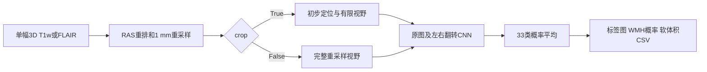
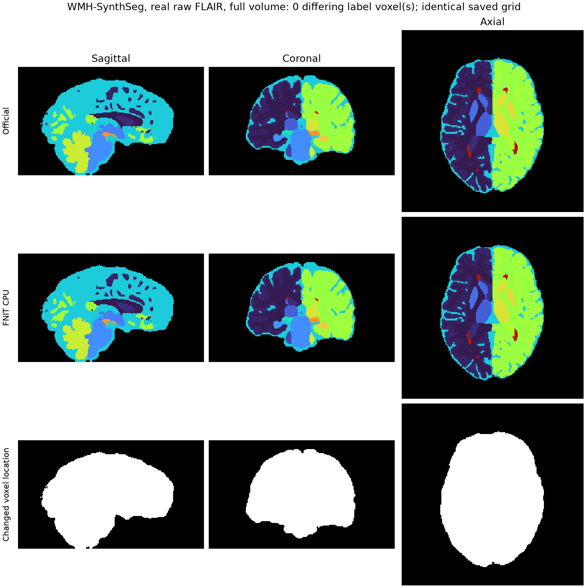
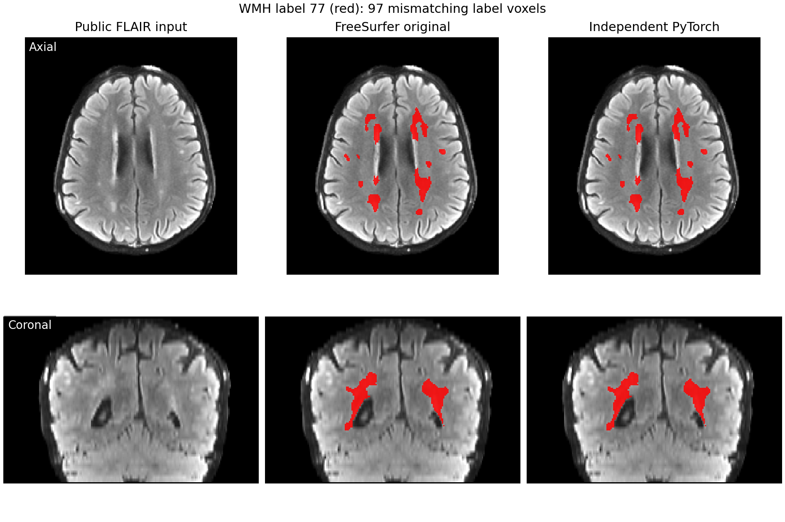

# WMH-SynthSeg：脑结构与白质高信号分割

[返回首页](../../README.md) · [官方说明](https://surfer.nmr.mgh.harvard.edu/fswiki/WMH-SynthSeg) · [官方源码](https://github.com/freesurfer/freesurfer/tree/dev/mri_WMHsynthseg/WMHSynthSeg)

WMH-SynthSeg 同时分割脑结构和白质高信号（WMH，FreeSurfer 标签 **77**），支持 T1w、FLAIR 等对比度。**FreeSurfer 原版已使用 PyTorch**。本包基于已验证的源码与官方 `WMH-SynthSeg_v10_231110.pth`，提供独立安装、单被试 Python 和单被试命令行调用；推理不调用 FreeSurfer 程序。

## 原版源码流程与输出几何

参考源为 gpucw1 安装的 FreeSurfer 8.2.0-1：`bin/mri_WMHsynthseg` 启动 `python/packages/WMHSynthSeg/inference.py`，模型定义来自同目录的 `unet3d`。输入是单幅 3D `.nii`、`.nii.gz` 或 `.mgz`。模型把影像重排到 RAS 方向，用最大值归一化，再重采样到 **1 mm 等方体素**。网络是五层 3D U-Net，输入单通道、输出 39 通道；前 33 通道用于标签后验概率。它还对第一空间轴翻转后的输入再预测一次，交换左右标签通道后平均两个概率图。

`crop=False` 时在完整重采样视野上推理，网络输入各轴填充到 32 的倍数。`crop=True` 时先在 192×224×192 的区域进行定位，再围绕估计的脑中心裁出不超过该大小的区域用于正式预测。原版官网指出 GPU 运行需要 `--crop`；裁剪可能移除视野边缘。**输出是模型处理后的 RAS/1 mm 网格，通常不等于输入网格**。分割体素值来自 33 个 FreeSurfer 标签；另可保存标签 77 的浮点概率图。CSV 体积来自各标签后验概率在 1 mm 网格上的求和，单位 mm³，因此通常不等于硬分割中各标签的体素计数。




原版 CLI 的单例指令：

```bash
mri_WMHsynthseg --i case_FLAIR.nii.gz --o case_seg.nii.gz \
  --device cpu --threads 8 --crop \
  --save_lesion_probabilities --csv_vols case_volumes.csv
```

`--i` 是唯一输入影像；`--o` 是硬分割图；`--crop` 启用上述两遍定位/裁剪；`--save_lesion_probabilities` 另写 `case_seg.lesion_probs.nii.gz`；`--csv_vols` 汇总各结构体积；`--device` 与 `--threads` 控制 PyTorch。本页只对应原版的单文件输入和单文件输出。原版 CSV 的第一列表头为 `Input-file`，实际写入的是**输出分割路径**。原版 3D 流程经过验证；安装源码中的 4D 均值分支存在参数错误，不在本包支持范围内。

## 本包单例 Python 与命令行

官方权重无需随 GitHub 仓库下载；用专属脚本从 FreeSurfer 官方地址获取并自动记录位置：

```bash
python tools/setup_weights.py --model wmh-synthseg
```

Python 模型构造一次即可复用；输入可为 3D `.nii`、`.nii.gz`、`.mgz` 路径或 `nibabel.spatialimages.SpatialImage`，返回 `WMHResult`。`crop` 和 `save_lesion_probabilities` 默认均为 `False`，下面显式开启二者以适应 GPU 并保存概率图。

```python
from fnit import WMHSynthSeg

model = WMHSynthSeg(
    weights=None,  # 权重：按 FNIT 配置顺序查找官方 checkpoint
    device="cuda:0",  # 设备：第一张可见 CUDA GPU
    threads=4,  # CPU 线程：用于预处理和后处理
)
result = model(
    image="case_FLAIR.nii.gz",  # 输入：单幅 3D FLAIR/T1w
    crop=True,  # 裁剪：先定位脑区，再在有限视野内正式推理
    save_lesion_probabilities=True,  # 输出：同时返回标签 77 的概率图
)
result.segmentation.save(path="case_seg.nii.gz")  # 输出路径：脑结构与 WMH 硬分割
result.lesion_probability.save(path="case_seg.lesion_probs.nii.gz")  # 输出路径：WMH 概率图
print(result.volumes_mm3)
```

| 参数或字段 | 类型、含义 | 原版对应 |
|---|---|---|
| `WMHSynthSeg(weights=None, device="cpu", threads=None)` | 模型构造时加载一次官方 `.pth`；`weights` 可为文件或目录；`device` 选 CPU/GPU | `--device`、`--threads`；原版从 `$FREESURFER_HOME/models` 加载固定文件 |
| `model(image, crop=False, save_lesion_probabilities=False)` | 单幅 3D 影像；`crop=True` 两遍定位并限制推理区域 | `--i`、`--crop`、`--save_lesion_probabilities` |
| `result.segmentation` | `FNITNifti1Image`（`nibabel.Nifti1Image` 子类），float32 存储的 33 类整数标签；WMH 为 77 | `--o` 指定的图像 |
| `result.lesion_probability` | 请求时为 float32 `FNITNifti1Image`，否则为 `None`；体素值为 WMH 后验概率 | `--save_lesion_probabilities` 额外写出的 `.lesion_probs` 图 |
| `result.volumes_mm3` | `{标签编号: 软体积}` 字典，单位 mm³，包括背景 0 | `--csv_vols` 的各标签体积列；CSV 不输出背景列 |

两幅图像结果都使用原版同样的处理后网格，原图的坐标变换保留在输出仿射矩阵中；不保证与输入数组同形状。调用者通过 `.save(path)` 写出影像；Python 字典若需 CSV，可用下面的 CLI 直接生成与原版列名相同的表。原版 `Intracranial-volume` 列是非背景软体积之和，`Input-file` 列实际记录**输出分割路径**。

对应的新命令为：

```bash
fnit wmh-synthseg --i case_FLAIR.nii.gz --o case_seg.nii.gz \
  --device cuda:0 --threads 4 --crop \
  --save_lesion_probabilities --csv_vols case_volumes.csv
```

这条命令的 `--i` 读取单幅 FLAIR，`--o` 写标签图；`--crop` 将正式预测限制在脑周围的区域；`--save_lesion_probabilities` 额外写 `case_seg.lesion_probs.nii.gz`；`--csv_vols` 写软体积 CSV；`--device` 指定 GPU，`--threads` 指定 Torch 的 CPU 线程。本包 CLI 每次处理单幅影像并创建输出父目录。

## 真实数据验证与更新记录

### 2026-10-04：生命周期修复与完整 GPU 裁剪回归

本轮修复成熟 WMH 子函数的内存峰值：checkpoint 在 CPU 严格加载后一次转 GPU；无梯度 eval 推理及时释放已经消费的 skip、cat 和第一次预测；CUDA 分块填充原 nearest 拼接，大 GroupNorm 后释放 inactive cache，使原 Conv 获得原 workspace。网络参数、FP32/TF32、GN/Conv 算子和标签累加不变。训练、有梯度、容器或 global hooks 保留原 Module 调用。

原始公开 T1 的 `crop=True` 完整网络为192×224×192，输出179×224×178；新代码在 **20,000,000,000 B** allocator 限额下 allocated/reserved 峰值 **18,373,921,792 / 18,438,160,384 B**。分割、WMH概率、匿名CSV三个文件 SHA 与旧成熟GPU完全相同，57次实际 cuDNN卷积kernel和三次CNN输入SHA也相同。旧不限额隔离参考峰值32,633,949,696 /45,267,025,920 B，不能作为同20 GB预算速度比较。[最终完整门](../../validation/smri_cpu/synth_fixes_20261004/reports/wmh_final_gpu_acceptance.public.json)保留证据。

GPU默认 `crop=False` 保留原decoder、forward和概率缓冲调度：20 GB优化原型产生1个硬标签及概率尾差，故未接入该默认模式。同实例full→crop→full完整输出均与旧GPU各自SHA相同，调用后状态恢复。原full峰值allocated37,997,219,328 B，**full仍未达到20 GB**；在20 GB环境显式使用 `crop=True`，裁剪可能移除边缘。直接使用观察hooks的原容器路径不承诺优化峰值。

nodecw7同8核/8线程完整CPU官方/候选/候选/官方为172.064/77.134/83.876/107.942 s，标签、WMH概率、33列数值及完整header/affine逐值同；采样RSS官方约29.992 GB、候选约16.778 GB。无profiler完整GPUcrop ABBA的API旧4.842/5.364 s、新5.199/5.375 s，完整worker wall旧12.85/13.32 s、新13.21/13.18 s，构造/API/保存分别记录。CPUload99–136、共享GPU利用率43–100%，这些是观察时间，不能断言稳定性能保证。以下上一轮GroupNorm/初始化OOM为历史失败，新完整crop门已补足。[完整报告与复现](../../validation/smri_cpu/synth_fixes_20261004/README.md)含失败原型、小视野及最终模式切换记录。


### 2026-10-04 CPU 对照

本次 CPU 对照矩阵使用原始公开 T1 和 FLAIR，安排 `crop=True/False`、33 类标签、CSV 和 WMH 概率输出；同组两端固定 8 个物理核、8 个计算线程。完整命令包括冷进程、权重读取、全部计算和保存。[逐模式记录](../../validation/smri_cpu_20261004/t2_seg/README.md)保留实际核组、时间、逐标签数值及源码/输入 hash。

| 原始影像 CPU 模式 | 官方两次 wall（秒） | FNIT 两次 wall（秒） | 硬标签/33 列 CSV/WMH 概率 |
|---|---|---|---|
| FLAIR `crop=True` | 121.909 / 114.893 | 83.364 / 83.861 | 逐值差异均为 0 |
| FLAIR `crop=False` | 65.588 / 103.131 | 59.331 / 61.589 | 逐值差异均为 0 |
| T1 `crop=True` | 180.240 / 137.197 | 107.158 / 94.373 | 逐值差异均为 0 |
| T1 `crop=False` | 107.648 / 91.330 | 76.350 / 79.598 | 逐值差异均为 0 |

完整矩阵 16/16 已完成，四组的原版配对和各臂自重复均逐值相同。共享节点上的原版时间存在波动，以上是这组输入的实测值，不推广为全部扫描的固定加速比。FNIT CPU 采样 RSS 峰值约 24–36 GB；本轮没有修改 WMH 网络、重采样或概率/体积归约。以下 2026-09-27 的 FLAIR 输入是经过预处理的公开样例，不能代替本次原始影像验证。

这轮发现并修复了成熟子函数的保存头信息问题：输出为新 RAS/1 mm 网格时，旧代码继承输入 qform/sform code 和 FLAIR 扫描 XML 扩展。现在按原版 `MRIwrite` 用全新 float32 NIfTI header，qform/sform code 为 0/2，不继承扫描扩展。新保存代码的实际 CPU 原始 FLAIR full 与 T1 crop 输出，对官方硬标签、数值 CSV、WMH 概率的差异均为 0，保存几何字段也相同；[独立记录](../../validation/smri_cpu_20261004/t2_seg/wmh_output_header.public.json)列出冻结源文件和权重 SHA。它与已完成矩阵的网络源文件逐个 SHA 相同，旧计时仍保留原冻结身份。

同输入 GPU crop 的 baseline/candidate 4 次均在模型原有 GroupNorm 阶段超过 20,000,000,000 B allocator 限额；较小 full 模式的 baseline 也超过限额，candidate 在 CUDA 初始化时报 OOM。失败发生在新保存代码执行前，不将它们列为 GPU 回归通过，也没有提高预算或降低精度。模型及空间处理 CUDA 代码保持原样，本项保存修复的 CPU/CUDA 状态检查通过；完整 GPU 性能回归仍受现有显存需求限制。

下图为本次原始 FLAIR full 的实际保存标签；量化比较直接在同一保存网格上进行。



测试发现 FreeSurfer 模块安装缺少 WMH checkpoint，原始参考调用因此在推理前失败。参考端通过私密运行目录链接同一经大小和 SHA-256 校验的权重恢复测试，保留原脚本和原 Python 环境；不改公共 FreeSurfer 安装，也不将参考程序作为 FNIT 运行依赖。FNIT CPU 构造与推理保留调用方 CUDA TF32、cuDNN benchmark/deterministic 设置；CUDA 默认行为保持原策略。

### 2026-09-27 历史验证

2026-09-27 使用三幅公开真实 FLAIR 重新运行当前源码，并与 FreeSurfer 8.2.0-1 CPU 输出比较。候选推理没有调用 FreeSurfer；两端使用同一官方权重和 `--crop`。当前 WMH 源码树 SHA-256 为 `39cd9b4c380a93370c1244e72eea4c3eaa9f277dd8d70ef44a4ec2293e6a5860`。

| 指标 | 三例结果 |
|---|---:|
| shape / 数值 affine 一致 | 3/3 |
| 最低全标签逐体素一致率 | 0.99997810 |
| 最低 WMH Dice | 0.99981002 |
| 病灶概率 NRMSE 中位数 | 0.00091963 |
| CSV 最大绝对误差 | 62.62 mm³ |
| FNIT GPU 完整命令 | 中位数 11.34 s [10.17–11.67] |

同一公开病例的 FNIT CPU 输出与原版在标签、概率和 33 个 CSV 数值列上完全相同，完整命令为 64.44 s。原版三例 CPU 参考任务所在时段有重叠，中位数 109.99 s，仅用于说明实测时间，不计算稳定加速倍数。独占 GPU 单例的 Torch 峰值 allocated 29,730 MiB、reserved 35,828 MiB，当前超过 20 GB 目标。

当前逐例指标、输出 shape/affine/dtype、源文件哈希、时间和显存见[验证记录](../../validation/wmh/README.md)与[机器报告](../../validation/wmh/report.public.json)。公开病例没有人工 WMH 标注，上述一致性不等同于病灶检测准确率。

### 原版与当前实现示意图

下图使用本轮公开 `sub-04` 当前重跑。左列为输入，中、右列分别叠加 FreeSurfer 原版和当前 FNIT 的标签 77；完整三维比较的 WMH Dice 为 0.99981002。



## Reference

- 参考文献：Laso et al., *Quantifying white matter hyperintensity and brain volumes in heterogeneous clinical and low-field portable MRI*, ISBI (2024), [doi:10.1109/ISBI56570.2024.10635502](https://doi.org/10.1109/ISBI56570.2024.10635502)。
- 原实现代码库：[FreeSurfer WMH-SynthSeg](https://github.com/freesurfer/freesurfer/tree/dev/mri_WMHsynthseg/WMHSynthSeg)。
