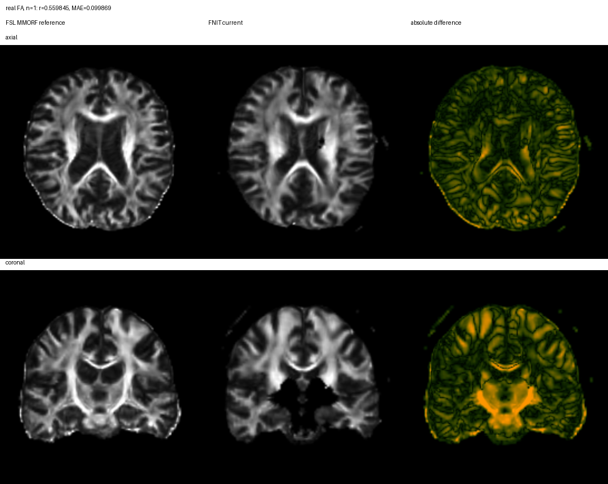
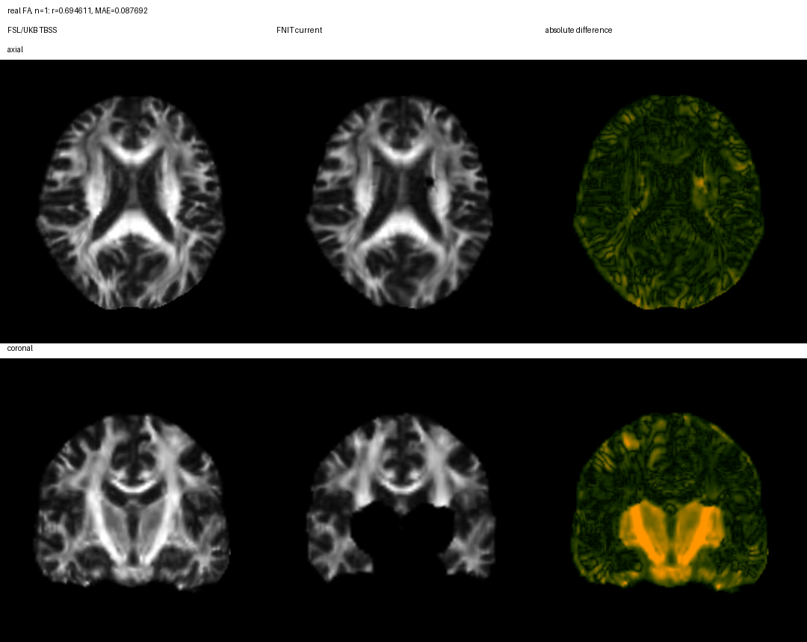

# dMRI 参数图流程源码目录

公开的单被试接口是 DMRIPipeline。它依次执行可选 TOPUP、EDDY、DTIFIT、
AMICO-NODDI，再进入 TBSS/FNIRT 或 T1+tensor MMORF 配准分支。两条分支写出
相同命名的九张标准空间参数图。输入、输出、显式参数 Python 示例、单被试命令行、
UKB 官方对应步骤和真实数据验证见
[docs/dmri_pipeline/README.md](../../../docs/dmri_pipeline/README.md)。

## 当前真实数据验证

MMORF 分支已用数值运行冻结快照完成 1 例真实 AP/PA + T1w 的 raw-to-standard 回归。九张标准图均通过 shape、affine 和 float32 dtype 合同，external wall 为 563.06 s，最大组件级 CUDA allocation 为 13.669 GB。与既有 UKB native 图和 FSL MMORF warp 参考相比，standard-map Pearson r 为 0.329829–0.585998，未达到数值等价；reference propagation 还沿用了先前固定的 FNIT affine，因此不能声明全官方端到端等价。计时期间同卡另有训练任务，不能作为隔离性能值。

TBSS 分支也已用同一例真实 AP/PA 和数值运行冻结快照完成 raw-to-standard 回归。九张 standard 和 skeleton 图均通过 shape、affine、float32 dtype 合同；standard-map Pearson r 为 0.313822–0.694611，skeleton-map r 为 0.107073–0.622653，未达到逐体素数值等价。external wall 为 444.93 s，最大组件级 CUDA allocation 为 13.664 GB。native-map r 已为 -0.002070–0.634022，说明差异在配准前已经出现。计时期间同卡另有训练任务；FSL reference 只从 prepared 参数图开始，所以不计算加速比。

两个分支的完整输入边界、逐图精度、阶段时间、显存、源码哈希和限制见[主文档](../../../docs/dmri_pipeline/README.md)与 [`validation/dmri_pipeline`](../../../validation/dmri_pipeline/README.md)。FLIRT core 从测量时的 `552856…` 经 [QC-only 第一段](../../../validation/runtime_dependencies/flirt_qc_source_equivalence.public.json)和[12-DOF/corratio 限定的第二段](../../../validation/runtime_dependencies/flirt_profile_source_equivalence.public.json)继承到当前 `ce375d…`。报告保留原测量 hash，没有 fresh current-hash 完整重跑；该链不覆盖 6-DOF/normmi。TBSS 与 MMORF 都不调用 SynthMorph，报告也没有记录其源码，因此 `synthmorph_source_status` 明确不适用 SynthMorph linear attestation。
