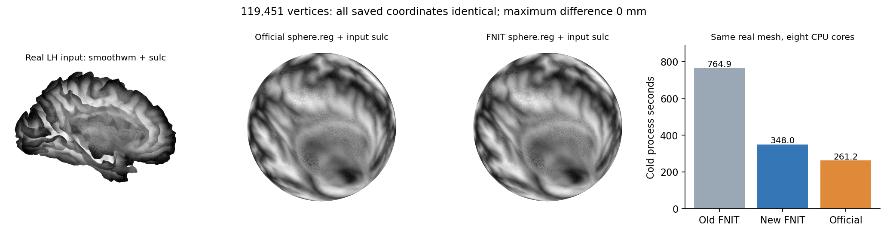

# 球面配准中的有序梯度平均

## 1. 功能简介

`RegistrationGradientAverager` 按固定邻接顺序，反复计算每个顶点及其邻点的梯度平均。每轮读取上一轮完整结果，再写入另一缓冲区；各顶点可并行，顶点内逐次 FP32 加法和最后的 FP32 乘法保持原规则。它是球面配准内部步骤，输入梯度的坐标系和单位由调用者保留。

2026-10-04 候选 `fc2abc94966150906f4f3421f23aab235b64dd8d` 为大网格的多轮 CPU 调用增加自有 C++ 内核：一支 OpenMP 线程组完成全部轮次，减少逐轮调度。原 NumBa 内核继续承担小调用和不支持的环境。CUDA 使用既有 Triton 实现。2026-10-05 正式源码的实际 H100 回归，以及完整 CPU ABBA 的数值、源码和相同资源门均已通过；完整阶段中位墙钟仍未提速。当前时钟和此前原型结果见第 5 节。

## 2. Python 调用、输入与输出

```python
from pathlib import Path
import numpy as np
import torch
from fnit.recon_all.mris_register_average_numba import RegistrationGradientAverager

# 读取同一真实网格保存的梯度与有序邻接；保留顶点顺序和原数据类型。
state_directory = Path("/path/to/saved_registration_state")
gradient = torch.from_numpy(np.load(state_directory / "gradient.npy"))  # FP32，(N,3)
neighbors = torch.from_numpy(np.load(state_directory / "neighbors.npy"))  # int64，(N,K)
degrees = torch.from_numpy(np.load(state_directory / "degrees.npy"))  # int64，(N,)
iterations = 256  # 非负整数；配准调用者负责按原尺度设置轮数

previous_torch_threads = torch.get_num_threads()
try:
    torch.set_num_threads(8)  # 本次 CPU 预算；支持其他正整数预算
    averager = RegistrationGradientAverager(
        neighbors=neighbors, degrees=degrees, device="cpu")
    averaged_gradient = averager(gradient=gradient, iterations=iterations)
finally:
    torch.set_num_threads(previous_torch_threads)
```

参数与输出：

| 名称 | 格式与含义 |
| --- | --- |
| `neighbors` | `torch.int64`，`(N,K)`；每行原有邻点顺序，前 `degrees[v]` 列有效。有效索引须在 `[0,N)`；其余填充列不参与计算。CPU 调用使用 CPU 张量。 |
| `degrees` | `torch.int64`，`(N,)`；每个顶点有效邻点数，范围 `0..K`。孤立顶点只保留自身。 |
| `device` | 构造参数，默认 `"cpu"`；显式 `"cuda:0"` 等选择既有 GPU 实现，构造时搬运并复用邻接。不改变全局 TF32 设置。 |
| `gradient` | `torch.float32`，`(N,3)`；与邻接完全相同的顶点顺序。返回结果的单位与三个轴的意义和输入一致。 |
| `iterations` | 每次调用的非负整数，无默认值；`0` 返回输入副本。每轮加入自身及全部有效邻点，再乘原 FP32 倒数。 |
| `averaged_gradient` | 与输入同 shape、dtype、device 的新张量；不修改梯度、邻接或有效列数。CUDA 输入来自 CPU 时，结果完成必要 D2H 同步。 |

`average_gradients_exact_cpu(gradient=..., neighbors=..., degrees=..., iterations=...)` 是相同 CPU 步骤的函数入口。公开平均类检查 shape、dtype、有效索引和非负轮数；该内部函数要求有效 CPU 输入。该功能不提供梯度反向传播。

CPU 线程预算沿用原规则：不超过当前 Torch 线程数与 NumBa 配置池上限；小于 8,192 个顶点用一线程。调用后恢复进入前的 NumBa 掩码。C++ 每次接收该预算，仅对本次 OpenMP 区域设置 `num_threads`，不修改全局 OpenMP 设置；运行时若限制线程组大小，实际数量可小于请求数量。

### 可选 CPU 编译与回退

Linux x86-64、原生 FP32 输入、至少 8,192 个顶点且至少 16 轮时，才尝试编译。主页 `environment.yml` 已含 `cxx-compiler`、`gcc_linux-64=11`、`gxx_linux-64=11`，无需新增 Python 依赖。先使用 `CXX` 指定的单个可执行程序，否则查找现有 Conda 环境及 PATH 的 C++ 编译器；命令以参数数组运行。

缓存默认在用户缓存目录的 `fnit/average_cpu`；`FNIT_AVERAGE_CPU_CACHE` 可指定其他目录。目录、锁和产物必须属于当前用户且不允许组或其他用户访问，符号链接入口不接受。缓存键包含自有源码、编译选项、编译器路径/版本/二进制 SHA、平台与 ABI。并发构建通过文件锁串行，产物核对 ABI、大小和 SHA 后原子发布；构建超时 60 s，锁等待与 GPFS `ENOLCK` 重试共用 15 s 期限。

找不到编译器、平台或数据类型不支持、缓存不合要求、构建失败时执行原 NumBa。相同构建身份失败后，本进程不重复尝试；进程重启或源码、编译器、缓存位置改变可重新尝试。NaN/Inf 输入保留 NumBa 的位模式处理；调用线程或任一 OpenMP 工作线程启用 FTZ/DAZ 或非最近舍入时也回退。默认浮点政策下的 subnormal 和 signed zero 已局部逐位验证。内核不修改调用者或工作线程的浮点政策。

诊断时可在 CPU 调用后读取私有 `fnit.recon_all._average_cpu_cpp.backend_info()`：记录当前 Python 线程最近一次尝试的实际后端、回退原因、请求/实际线程数及源码/编译器/缓存绑定。编译库 SHA 与大小保存在 `library` 路径对应的同名 `.json` 中。该私有诊断接口不改变公共调用参数。显式 CUDA 平均不导入或编译 CPU helper。

## 3. 命令行调用

平均步骤没有独立 CLI。完整球面配准使用已有入口，所有输入必须属于同一半球、保留同一顶点对应关系：

```bash
# sphere/smoothwm 是表面网格，sulc 是对应顶点的标量，atlas 是半球 folding TIFF。
# output 的父目录须已存在；报告包含两遍配准的轨迹、输入输出 SHA 与时间。
OMP_NUM_THREADS=8 MKL_NUM_THREADS=8 NUMBA_NUM_THREADS=8 \
python -m fnit.recon_all.mris_register_run \
  /path/to/surf/lh.sphere \
  /path/to/surf/lh.smoothwm \
  /path/to/surf/lh.sulc \
  /path/to/average/lh.folding.atlas.acfb40.noaparc.i12.2016-08-02.tif \
  /path/to/output/lh.sphere.reg \
  --averaging-device cpu --overlap-device cpu \
  --report /path/to/output/lh.registration.json
```

这里 `--averaging-device` 仅控制梯度平均，`--overlap-device` 控制末尾相交清理；完整目标函数和步长决策保持既有 CPU 算法。GPU 平均在相同入口设置 `--averaging-device cuda:0`。

## 4. 对应原软件调用

`MRISaverageGradients` 是内部步骤，没有单独命令。固定官方完整阶段参考为：

```text
mris_register -curv -threads 8 \
  surf/lh.sphere \
  average/lh.folding.atlas.acfb40.noaparc.i12.2016-08-02.tif \
  surf/lh.sphere.reg
```

该命令还读取同一半球的 `smoothwm` 与 `sulc`。它只用于隔离的官方 benchmark；FNIT 调用本页自有代码。原命令的位置参数与 `-curv` 含义见 [FreeSurfer 命令页](https://surfer.nmr.mgh.harvard.edu/fswiki/mris_register)。

## 5. 真实数据精度与时间

新版生产候选绑定与局部测试见[独立交付记录](../../../validation/smri_cpu/average_cpu_persistent_20261004/README.md)。以下为已读原报告中的真实原型证据：nodecw7 同八核，公开 ds000114 v1.0.2 完整左半球，119,451 顶点、238,898 面。原型 C++ SHA 为 `8fb858ea0caee073b3af01d6787a883a50b32c3b0d6678cdcd5c18b629e5e9d6`，与本页候选包含安全 guards 的正式源码不同。

| 验证范围 | 结果 |
| --- | --- |
| 同一真实梯度，0/1/16/256/16,384 轮，旧→原型→原型→旧 | 输入不变，输出数值与全部 FP32 位模式相同。 |
| 同输入完整 LH 连续配准原型 | 与既有 accepted/native 参考的坐标、面顺序、解码 geometry 相同；sulc seed 与完整接受步长/轮数/清理轨迹相同；负面积面 0。 |
| 原型完整调用的平均累计时间，包含首调用 | 既有参考 48.069 s，原型 20.127 s。两次不是相邻完整配对。 |
| 原型完整 API 时间，含读写 | 既有参考 345.714 s，原型 448.403 s；未改刚体搜索从 49.294 s 波动至 196.200 s。不能据此宣称完整配准提速。 |
| 正式 `fc2abc94` GPU 实际回归 | H100，完整真实梯度 1/16/256 轮 ABBA，旧/新输出 SHA、逐调用 allocated/reserved 完全相同；CPU helper 未导入。 |
| 正式 `fc2abc94` 完整 CPU ABBA | 1,239 个冻结文件、四臂接受轨迹、坐标、有序面、几何及相同 CPU 资源门通过；两个候选臂各 67 次大循环实际 CPP8。同输入保存官方坐标逐点相同，负面积面 0。平均中位 55.151→26.447 s，完整冷进程 914.965→963.223 s，未达到完整阶段提速门。 |

原型[算子报告](../../../validation/smri_cpu/recon_fixes_20261004/results/persistent_average_prototype.public.json)和[完整阶段报告](../../../validation/smri_cpu/recon_fixes_20261004/results/persistent_registration_pilot.public.json)保留输入、程序、原型和时钟。正式 [CPU ABBA 报告](../../../validation/smri_cpu/average_cpu_persistent_20261004/CPU_ABBA.public.json)单独绑定实际候选，不证明右半球或原始 T1 全部 recon-all。NumBa 基线的八线程配置由执行源码、环境和亲和性验证，没有逐调用观察线程组人数；CPP 的实际八线程则在每次大循环直接记录。

正式 [GPU 报告](../../../validation/smri_cpu/average_cpu_persistent_20261004/gpu.public.json)绑定新 wrapper SHA `956616a920f751f49d201bf5a0a17867084a4b8e810336ab849d29fb60b0648b`，每次调用 allocated 25,273,344 B、reserved 46,137,344 B，均与旧版相同。该报告中的首次调用共用同一进程和 Triton 缓存，不能用于声称 CUDA 冷启动加速；短时钟受共享 GPU 负载影响。



图中灰度来自同一真实 sulc，图片对应此前 accepted 完整阶段，不改标为本次正式候选脑图。完整阶段、平均算子和全 recon-all 的结论分别记录。

## 6. 最近版本与 benchmark

| 版本 | 更新与验证 |
| --- | --- |
| 2026-10-01 既有 Triton/有序 NumBa | 已有 GPU 逐顶点保序平均及完整阶段记录，见[原功能说明](../../../docs/recon_all/SPHERE_REGISTRATION_PERFORMANCE.md)。 |
| 2026-10-04 已接受 NumBa 顶点并行 | 完整 LH 与官方坐标/轨迹相同；平均累计 227.280→48.069 s。既有完整时间受刚体搜索波动，原报告保留。 |
| 2026-10-04 独立 persistent 原型 | 相同真实算子及完整 LH 结果相同，平均累计 20.127 s；原型不能直接替代正式源码绑定。 |
| `fc2abc94966150906f4f3421f23aab235b64dd8d` | 自有 persistent 内核、CPU 懒加载、安全缓存/锁/超时、原 NumBa 回退、浮点政策保护；29 项新增测试与原 3 项线程测试通过。后续正式 CPU 数值/源码/资源门及 H100 算子回归通过；完整阶段速度门尚未达到。 |

这次处理成熟 CPU 子函数的逐轮并行调度开销，没有识别或修改平均数学语义 bug。原内核保留为兼容回退和逐位参考，GPU 类、CUDA 源码及接口未改。

## 7. 原实现与参考文献

原软件固定源码为 [FreeSurfer d932c45b](https://github.com/freesurfer/freesurfer/tree/d932c45b7941662ea380a05efef580568b98d41a)，注册入口位于 [mris_register](https://github.com/freesurfer/freesurfer/tree/d932c45b7941662ea380a05efef580568b98d41a/mris_register)，内部计算位于 `utils`。本次 `.cpp` 是 FNIT 独立编写的必要平均内核，不复制官方源码或二进制。已有 FreeSurfer 移植的许可见 [THIRD_PARTY_NOTICES](../../../THIRD_PARTY_NOTICES.md) 和 [FreeSurfer 许可](../../../licenses/FreeSurfer.txt)。编译器和 OpenMP 运行库使用既有 Conda 依赖，不随此 helper 发布编译器、运行库或缓存二进制。

Fischl B, Sereno MI, Tootell RBH, Dale AM. *High-resolution intersubject averaging and a coordinate system for the cortical surface.* Human Brain Mapping 8(4), 272–284 (1999). [论文索引](https://pubmed.ncbi.nlm.nih.gov/10619420/)。
