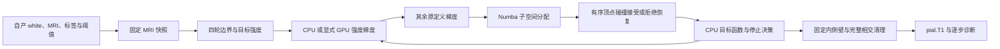

# 表面放置：固定 MRI 采样与子空间分配（2026-10-02）

## 1. 功能简介与流程

本更新优化两处内部计算：将子空间顶点分配的 Python 循环编译为 Numba；为完整四轮 pial 提供显式选择的 GPU 强度采样和梯度。它保留逐顶点有序接受、动态碰撞、拒绝试步恢复、四轮边界刷新、固定顶点与最终相交清理。没有改动生产的 Conda white.preaparc、最终 white、pial 调度；完整 white 自有实现尚未补齐，现有 white prefix 仍只用于首轮诊断。



GPU 后端属于专项候选。普通 Torch 批处理的真实首轮测试比 CPU 慢，不能因为使用 GPU 就启用；融合 Triton 后端已通过两例四半球真实算子回归。单个算子的加速不能代表完整表面阶段或 recon-all 提速。

## 2. Python 调用、输入输出和参数

```python
from fnit.recon_all.place_pial_python import place_pial_t1

placement_result = place_pial_t1(
    subject="/data/subject_fnit",       # 已按生产阶段顺序生成前置文件的被试目录
    hemisphere="lh",                  # 半球：lh 或 rh
    output="/results/lh.pial.T1",      # 独立结果路径；None 默认写回被试 surf 目录
    max_steps=200,                     # 总接受步数上限，必须为正；未完成四轮时报错
    sampling_backend="triton",        # cpu（默认）、torch 或 triton
    candidate_backend="snapshot",     # tree（默认）或试步内快照CSR+Numba有序更新
    device="cuda:0",                  # GPU 后端必须显式给出逻辑设备编号
    trace_callback=None,              # 可选诊断回调；默认不保存每步网格
)
```

输入文件逐项为：

- `surf/H.white`：FreeSurfer 三角表面，顶点 `(N,3)`、面 `(F,3)`，保留有序对应和体积几何；坐标为 surface RAS，单位 mm。
- `surf/autodet.gw.stats.H.dat`：自产自动阈值文本，含 MID_GRAY 与 pial 内外强度阈值。
- `label/H.cortex.label`：最终内侧壁固定所用的顶点编号。
- `label/H.cortex+hipamyg.label`：参与放置的顶点集合；集合外为 ripped。
- `mri/brain.finalsurfs.mgz`：自产强度 MRI，保持原网格；强度使用原 uint8 采样语义。
- `mri/wm.mgz`：自产 WM，用于构造放置强度。
- `mri/aseg.presurf.mgz`：自产解剖分割标签，用于边界限制。

输出为 `H.pial.T1`，有序面、顶点数、volume geometry 与额外 footer 保持输入表面结构。返回字典包含 output、hemisphere、steps、pass_ends（四轮结束步）、cleanup（相交前后与清理次数）、sampling_backend、candidate_backend、device、seconds。trace_callback 接收 `(step, pass_index, coordinates_copy, diagnostics)`；其中 pass_index 从 0 开始，coordinates_copy 是 `(N,3)` float32 的独立拷贝，diagnostics 含 sse、rms、dt、reductions、stop，回调异常向外传播。回调仅用于诊断，不进入接受决策。

GPU 底层可独立调用：

```python
from fnit.recon_all.place_surface_sampling import PlacementSampling

sampling_context = PlacementSampling(
    volume=placement_volume,              # (W,H,D) uint8 放置 MRI；上下文拥有独立副本
    affine=surface_ras_to_voxel_affine,     # (4,4) float32，surface RAS/mm 转 voxel
    device="cuda:0",                     # 必须是显式 CUDA 设备编号
    chunk_size=16384,                     # 正整数；仅 Torch 后端的临时分块上限
    implementation="triton",             # torch（默认）或 triton；Triton 使用固定128线程块
)

sampled_values = sampling_context.sample(
    vertices=current_vertices,            # 有限 (N,3) float32 surface RAS/mm 坐标
)                                         # 输出 (N,) float64 强度，包含边界与越界零填充

intensity_displacement = sampling_context.gradient(
    vertices=current_vertices,            # 当前坐标；每次调用重新传入，不缓存动态网格
    normals=current_normals,              # (N,3) float32 当前原定义法向
    ripped=ripped_vertices,               # (N,) bool；True 顶点梯度为零
    target_values=target_intensities,      # (N,) float32；负值顶点梯度为零
    vertex_sigma=vertex_sigmas,            # (N,) float32，各顶点平滑尺度
    voxel_sizes=voxel_sizes_mm,            # (3,) voxel 尺寸/mm，取最小值的一半作为步长界
    weight=0.2,                           # 原强度项权重，按 float32 转换
    sigma_global=2.0,                     # sigma 近零时的全局后备值；仍近零时使用0.25
)                                         # 输出 (N,3) float32 位移/mm
```

内部将 MRI、affine 与内核输入规范为 C 连续存储，Fortran/切片输入不改变空间坐标含义。MRI 与 affine 变化时必须重建上下文；动态坐标和法向不缓存。无 CUDA、非显式设备、不支持的后端、非法形状、非有限坐标/参数会报错，不静默回退。活动顶点非正 sigma 会报错，避免原 CPU 源码负 sigma 的非终止循环。Torch 后端按 chunk_size 返回完整结果；Triton 不裁剪采样候选、sigma 范围或顶点数。坐标矩阵乘法保留逐项 FP32 舍入，插值/指数/距离累加沿用原 FP64，结果写回 FP32；禁用 Triton 乘加融合，不使用 FP16/BF16，不改变全局 TF32/autocast。

`candidate_backend="snapshot"` 在每次首轮试步按完整候选构建 CSR，并在 Numba 中依原顶点序逐个更新。动态面几何仍来自当时已接受的坐标；每面保留原查询半径过滤和相交谓词。候选球以本试步最大位移的两倍加0.01mm作为保护界，中心变化不超过界、半径变化不超过两倍界，因此原球扩展三倍界覆盖全部动态查询。投影终点超过界时抛 ValueError，不裁剪候选。拒绝试步有 retained-MHT 状态及 slow 诊断仍走原 tree 路径；不跨试步或动态坐标版本复用候选。此选择与 sampling_backend 独立，默认 tree。

子空间 `_assign_vertices(face_svi, incident, offsets, ripped)` 是内部函数：输入分别是每面 int32 子空间、原序关联面 CSR 编号、长度 N+1 的 int64 偏移及 N 个 bool。输出 N 个 int32 编号；无关联面/已 ripped 为 -1，不同关联面空间为 64，同空间保留原编号。它不读写坐标，不做接受更新，无动态索引缓存；对外 `subvolume_assignment` 和 `asynchronous_first_step` 接口保持不变。

## 3. 命令行与复现

采样/强度梯度属于放置内部步骤，没有独立生产 CLI。上述函数可用 Python 脚本调用。专项脚本：

```bash
PYTHONPATH=src python validation/recon_all/optimizations/20261002_parallel/task_02/benchmark_sampling.py \
  --subjects "$SUBJECT_ONE" "$SUBJECT_TWO" \
  --output "$NEW_OPERATOR_REPORT_DIR" \
  --device cuda:0 --implementation triton --commit "$RUNNING_COMMIT"

PYTHONPATH=src python validation/recon_all/optimizations/20261002_parallel/task_02/benchmark_full_pial.py \
  --subject "$SUBJECT_ONE" --hemi lh \
  --frozen-collision "$FROZEN_COLLISION_SOURCE" \
  --output "$NEW_FULL_PIAL_REPORT_DIR" --device cuda:0 --commit "$RUNNING_COMMIT"
```

计时命令在协调者提供的共享锁内运行，CPU 总线程4，GPU 可见设备固定为批准 UUID；公开复现命令使用变量，不包含服务器凭据。output 必须是新目录。第一脚本使用真实 MRI、white、pial 和标签，记录输入/源码 SHA-256、JIT 冷热、AB/BA 暖计时及数值；第二脚本将冻结碰撞实现仅用于隔离 CPU 基线，再跑候选，保存逐步 hash、接受状态、每步/最终坐标差和 cleanup。monitor_command.py 同期采样命令整个进程树显存，记录采样间隔、失败与外部占用；零个样本不当作零显存。

## 4. 原软件对应

这些算子对应 FreeSurfer `mris_place_surface` 内部 MRI 强度梯度和异步时间步子空间分配，没有独立官方算子命令。完整 pial 的参考命令示意（仅隔离 benchmark）：

```bash
mris_place_surface --pial --lh --i "$SUBJECT_DIR/surf/lh.white" \
  --o "$OUTPUT_SURFACE" --invol "$SUBJECT_DIR/mri/brain.finalsurfs.mgz" \
  --wm "$SUBJECT_DIR/mri/wm.mgz" --seg "$SUBJECT_DIR/mri/aseg.presurf.mgz" \
  --adgws-in "$SUBJECT_DIR/surf/autodet.gw.stats.lh.dat" --threads 4
```

实际完整 FNIT 固定调用还有标注与 rip 参数，参见当前 `_run_native_pial`；上述示意不能代替绑定程序/参数的回归。生产 Conda 程序仍由现有流程调用，不从系统预装目录借用二进制。

## 5. 精度、运行时间与脑图

最新实测和失败尝试在 `validation/recon_all/optimizations/20261002_parallel/task_02/`，每份报告绑定实际运行源码 hash。首轮两例四半球已测：Torch GPU 梯度逐元素一致，但比 CPU 慢约2–3倍；Numba 子空间分配逐元素一致，原0.39–0.45秒/次降至约0.0017–0.0021秒/次。融合 Triton 在同一四半球上采样、梯度逐元素一致，暖梯度中位数为0.0030–0.0049秒，CPU为0.2966–0.3321秒；仅这一算子为61–109倍。进程树同瞬间GPU峰值为507,510,784字节；142次外部采样，最大间隔1.73秒。测量源码为4674cc2，11项专项测试通过。完整四轮回归仍以其实际运行报告为准。尚未执行的官方/Conda/完整自有 white 三方、第二半球与第二例完整 pial、连续链、两例空目录整例、138严格诊断和逐区统计不得视为完成；总体指标等效保持 not_assessed。

只发布统计和许可允许的脑图，真实影像/表面留在授权服务器。若完整轨迹逐元素相同，脑图使用公开的差异统计图展示最大误差与逐轮状态；不能用首轮图证明完整 white/pial 几何等效。

## 6. 版本与 benchmark 记录

- 本轮冻结起点：f07cf59c7f51ae1393e2578f141b4d130ed7801a，包含协作规则；原生产 main 基线6f67cc06。
- 2026-10-02 第一轮：Torch 首轮四半球数值exact；性能无收益。首次 CUDA 初始化 OOM 与报告 UUID 序列化失败保留，未标成成功完整报告。
- 2026-10-02 本更新：Numba 顶点子空间分配；显式 Torch/Triton MRI 快照；试步内完整候选 CSR 与编译有序更新；完整 pial opt-in 后端与每接受步诊断接口。最终 commit 和实际收益由专项报告记录。
- 旧 native CUDA intensity pilot 与20261001完整Python pial记录保留原版本和范围，不改标为本轮结果。

## 7. 安装、资源、原实现与参考文献

使用现有 environment.yml：PyTorch2.5.1、Numba>=0.59、nibabel>=5，及其已声明 Triton3.1.0。没有新增下载、权重、模板、编译器安装或私有资源再分发。Triton按需导入，CPU路径不需要它；Conda原生环境的可选依赖接入由协调者统一维护。本实现根据已有 FNIT/FreeSurfer公式改写，遵循仓库 licenses/FreeSurfer.txt 与 THIRD_PARTY_NOTICES.md。

- FreeSurfer固定源：d932c45b7941662ea380a05efef580568b98d41a；[mris_place_surface](https://github.com/freesurfer/freesurfer/blob/d932c45b7941662ea380a05efef580568b98d41a/mris_make_surfaces/mris_place_surface.cpp)、[强度梯度](https://github.com/freesurfer/freesurfer/blob/d932c45b7941662ea380a05efef580568b98d41a/utils/mrisurf_compute_dxyz.cpp)、[有序时间步](https://github.com/freesurfer/freesurfer/blob/d932c45b7941662ea380a05efef580568b98d41a/utils/mrisurf_timeStep.cpp)。
- Fischl B, Dale AM. Measuring the thickness of the human cerebral cortex from magnetic resonance images. PNAS97:11050–11055 (2000). [doi:10.1073/pnas.200033797](https://doi.org/10.1073/pnas.200033797)。
- [Triton JIT官方说明](https://triton-lang.org/main/python-api/generated/triton.jit.html)。

2026-10-02接口修复：GPU入口拥有连续布局副本，支持Fortran数组及反向切片；直接传负步长NumPy数组给PyTorch的错误已修复。最新布局与梯度fallback回归另排入独占GPU测试窗口，不把旧源码的通过结果改标到新提交。原生control/candidate已完成隔离编译，候选能力查询实际通过；完整三阶段精度和耗时仍待锁内实测。
