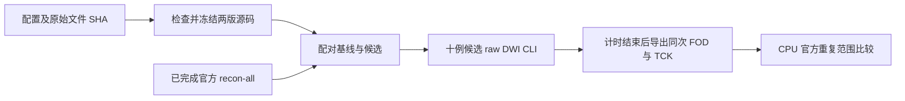

# 原始 DWI 精度整合评测

## 1. 功能与流程

`benchmark_connectome_accuracy_cohort.py` 在 GPU 主机执行冻结的精度候选。它复用真实原始 BIDS wall worker，显式绑定已经完成的官方 FreeSurfer subject；重新运行 TOPUP、EDDY、建模、追踪、atlas 与四种矩阵。参考结果只由后续比较工具读取。



## 2. Python 调用、输入与输出

```python
from tools.benchmark_connectome_accuracy_cohort import execute

# 配置必须先固定实际文件、源码和任务顺序，输出目录必须尚不存在。
configuration_path = "/absolute/path/accuracy_configuration.json"
exit_code = execute(configuration_path)
```

输入为 JSON 配置：

- `raw_manifest`：`path` 与 `sha256`，指向十例原始 AP/PA DWI、梯度、JSON、T1 和数据许可清单。
- `input_bindings`：`path` 与 `sha256`，绑定每例实际已完成 GPU 报告、官方 FreeSurfer 文件和独立官方链。旧报告只证明实际输入来源，不冒充本轮执行。
- `sources`：`baseline`、`candidate` 两个冻结源码目录。
- `declared_source_manifests`：两目录的实际科学代码及环境文件清单，由现有 `source_manifest()` 产生。
- `execution_order`：逐项 `version`、`case_id`；十例候选必须全部覆盖，计时基线必须有相应候选，不接受重复路径冒充重复实验。
- `accuracy_coordinator_sha256`、`worker_script`、`worker_script_sha256`、`wall_script`、`wall_script_sha256`：预先声明控制器、实际加载的 worker 和 wall 工具的路径及身份；启动时核对，不替换已声明的 SHA。
- `run_root`：新的绝对输出目录。
- 其余字段沿用 [raw cohort 工具](../docs/connectome/raw_cohort_benchmark.md)：GPU Python、UUID、共享锁、CPU 线程、权重及模板路径、atlas 列表、播种数、种子和 EDDY GP 种子。

输出为 `status.json`、`configuration.json`、`frozen_sources.json`；每个 `version/case_id` 下有 `gpu_report.json`、`raw_bids_wall.json`、日志、`connectome/` 和 `returned_result/`。后者保留本次返回对象的归一化 WM FOD、FA、mask、5TT、GMWMI、几何、TCK 与轨迹标量；不伪造未导出的 response 或归一化过程张量。

`execution_completed` 仅代表计划执行完成。精度和速度字段在独立比较前保持 `not_assessed`。

## 3. 命令行与参数

```bash
python tools/benchmark_connectome_accuracy_cohort.py \
  --configuration /absolute/path/accuracy_configuration.json
```

`--configuration` 是唯一参数。GPU 任务使用配置中的固定 UUID、同一把排他锁、线程和种子。CPU 比较另用 `benchmark_connectome_raw_cohort_envelope.py` 及 `benchmark_connectome_tracking_population.py`。矩阵比较不计算轨迹分布；只有实际保存的同次 TCK 才可进入 population 对照。

`analyze_connectome_accuracy_cohort.py` 将上述两个既有比较器应用于实际新输出：

```bash
CUDA_VISIBLE_DEVICES= python tools/analyze_connectome_accuracy_cohort.py \
  --configuration /absolute/path/accuracy_configuration.json \
  --output-dir /absolute/path/new_cpu_analysis
```

`--output-dir` 必须为新目录；可选 `--case-id sub-CON03` 只分析已完成子集，明确不标为完整十例。候选和计时基线都须匹配冻结计划、病例、版本、运行前后 source、实际 CLI、wall 路径与计时；运行前后 FreeSurfer 文件 SHA 也须一致。工具另核对原始文件、官方 TCK、计时后文件 SHA 和返回对象端点回读，保留原指标定义，输出逐例矩阵/population 报告、真实群体脑图和计时摘要。Python 对应为 `analyze_connectome_accuracy_cohort.execute(configuration, output_dir, case_ids=None)`。只有一个 FNIT seed 时，自身重复性保持未评估。

## 4. 对应官方命令

官方链保持既有真实 `topup`、`eddy`、`dwi2tensor`、`tensor2metric`、`dwi2response dhollander`、`dwi2fod msmt_csd`、`mtnormalise`、`tckgen -algorithm iFOD2 -act ...`、`tcksift2`、`tcksample -precise` 和 `tck2connectome` 命令，完整参数及二进制 SHA 由每例原官方 `reference_manifest.json` 绑定。它们不在本工具的 FNIT 计算进程中执行；官方 recon-all 结果为明确提供的前置输入。

## 5. 精度、计时与脑图

采用原有逐例、逐模板官方五次重复范围，不更改阈值或统计定义。wall 时间涵盖从原始 DWI 到完整矩阵的实际 CLI；已完成 recon-all、排队等待、文件 SHA 和计时后导出分别报告。导出仅保留原返回对象引用，计时内不复制张量或增加 CUDA 同步。

本工具的结果见 [本轮精度记录](../docs/connectome/ACCURACY_OPTIMIZATION_20261003.md)。未完成的计划、组件测试和已有旧结果不能当作本轮整链结果。共享 GPU 下用本轮配对计时判断速度保持，不能直接用历史时间计算加速比。

## 6. 更新与 benchmark 记录

- 2026-10-03：加入固定原始数据、已完成官方 anatomy、冻结源码和实际输出绑定；新增计时后同次返回对象导出。本轮使用十例候选及 CON01/CON03 的反向运行顺序配对基线。
- 2026-10-02：原 raw cohort worker 已用于 ds001226 十例、八 atlas、四矩阵；本工具复用其实际输入和显存检查。

## 7. 原实现与参考文献

[UKB-connectomics](https://github.com/sina-mansour/UKB-connectomics)、[MRtrix3](https://github.com/MRtrix3/mrtrix3)、[FSL EDDY](https://fsl.fmrib.ox.ac.uk/fsl/docs/diffusion/eddy/index.html)。Tournier JD et al. *NeuroImage* 202, 116137 (2019)；Andersson JLR, Sotiropoulos SN. *NeuroImage* 125, 1063–1078 (2016)；Smith RE et al. *NeuroImage* 119, 338–351 (2015)。
