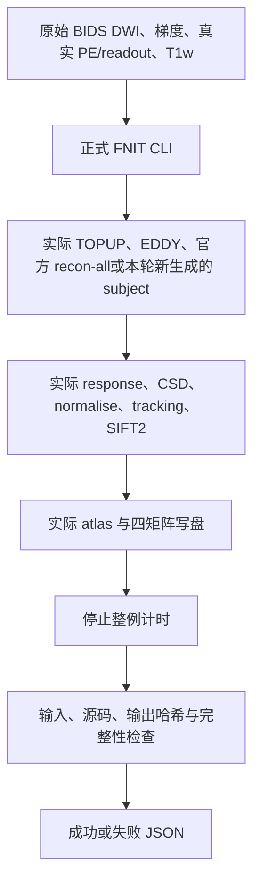

# 原始 BIDS connectome 整例评测工具

## 1. 功能和计时边界

`benchmark_connectome_raw_bids.py` 在同一 Python 进程调用实际 `fnit.cli.main()`。它不替换科学函数的输入或返回值，不读官方结果辅助计算，不减少体素、流线点或迭代，不更改 dtype/TF32。基线和候选使用**同一份工具**，由调用者的 `PYTHONPATH` 选择真实 FNIT 源码；工具不添加自己的 `src` 到搜索路径。



`wall` 是正式性能运行：不新增阶段 CUDA 同步，不导出检查点；只附加实际预处理状态、EDDY 种子默认策略、分配器峰值账本和独立显存采样。`diagnostic` 包装实际阶段，在阶段边界同步指定 GPU；嵌套父阶段已包含子阶段，不能求和。检查点只允许诊断模式，额外导出墙钟单列，诊断总耗时不能作为正式速度比。

总计时从 `torch`/FNIT CLI 导入前开始，到真实 CLI 结束和必要包装退出为止，包含加载、实际计算与正常输出写盘。报告生成、输入/源码/输出 SHA-256、检查点哈希、输出检查、采样线程退出及外部 GPU 排队不计入。工具自己的 Python/标准库启动在计时前；完整进程启动成本由外层 cohort 编排另计。

如果传入本轮在 nodecw10 新生成的 `--freesurfer-subject-dir`，工具记录 `recon_all=supplied`。此工具的 wall 此时不包含官方 recon-all，外层编排必须记录官方阶段、调度等待和实际跨节点总墙钟。不要将这些阶段中位数相加冒充实测完整整例耗时。

## 2. Python 调用、输入和输出

```python
from pathlib import Path
import importlib.util

benchmark_tool_path = Path("tools/benchmark_connectome_raw_bids.py")
benchmark_spec = importlib.util.spec_from_file_location("raw_bids_benchmark", benchmark_tool_path)
benchmark_module = importlib.util.module_from_spec(benchmark_spec)
benchmark_spec.loader.exec_module(benchmark_module)
exit_code = benchmark_module.main([
    "--mode", "wall",                         # 正式整例运行，不新增阶段同步
    "--report", "/private/C01/baseline.json", # 私有报告，不发布个体路径
    "--eddy-gp-seed", "12345",               # 两版相同 GP 选点默认种子
    "--", "UKBConnectome_pipeline",
    "--bids-root", "/private/raw_bids",
    "--subject", "C01", "--direction", "AP",
    "--n-seeds", "100000", "--seed", "0",
    "--atlas", "fs-aparc", "fs-aparc-a2009s",
    "--device", "cuda:0", "--output-dir", "/private/C01/baseline_outputs",
])
```

输入是正式 pipeline 的原始 BIDS 根目录及原 CLI 参数。DWI NIfTI 必须为完整原始 4D，bval/bvec 体积数匹配；JSON 必须有真实 `PhaseEncodingDirection`、`TotalReadoutTime` 或 `EffectiveEchoSpacing`。有反向 PE 时使用原始对应 EPI；T1w 使用原始 acquisition，不能替换为去脑/校正 T1。BIDS `DatasetType=raw` 声明本身不能证明未经处理，外层输入 manifest 须记录原归档成员、同 visit 配对和运行前哈希。

工具参数：

| 参数 | 含义 |
|---|---|
| `--mode wall/diagnostic` | 必填；正式墙钟或同步阶段诊断 |
| `--report` | 必填；私有 JSON，原子替换该路径；失败也写入 |
| `--eddy-gp-seed` | 默认 12345，合法范围 1..2³²−1；仅为缺失/None 的实际 `TorchEDDY.run(gp_seed=...)` 补默认值；已显式提供的非 None 值保持原值并记录 |
| `--checkpoint-dir` | 可选，仅诊断；要求不存在或为空，额外导出时间单列 |
| `--gpu-uuid` | 可选物理目标 UUID；使用 `CUDA_VISIBLE_DEVICES` 时推荐显式填写；不指定时仅在生产自行初始化 CUDA 后读取 Torch device UUID，不主动初始化 |
| `--memory-sample-interval` | 默认 0.5 s，必须有限且 >0；NVML/SMI独立线程的采样等待间隔 |
| `--` 后参数 | 实际 `UKBConnectome_pipeline` CLI 参数，可带前缀 `fnit`；必须有 `--bids-root`，其余见正式 pipeline 文档 |

报告主要字段：

- `status`、`exit_code`：CLI 执行成功/失败；失败包含异常字符串和 traceback。
- `total_runtime_seconds`：上述实际计时边界；`stages` 仅诊断模式填充，含次数和每次 inclusive 秒数。
- `preprocessing`：真实返回的 TOPUP/EDDY/recon-all `completed/skipped/supplied/no_reverse_pe` 状态；已有输出可能跳过，不能作为本轮 raw 全阶段执行证据。
- `actual_eddy_gp_seeds`：实际每次 EDDY run 使用的 GP 种子；tracking 的原 CLI seed 不变。
- `stage_qc`：实际 EDDY QC、诊断时捕获的 TOPUP 九层 QC；不把内部不含读写的耗时称完整阶段。
- `cuda_allocator`：原有每次 peak reset 前及退出时的 allocated/reserved 最大值，字节、GB、GiB及原始区间；取最大值，不求和。
- `gpu_process_memory`：同一目标 GPU 上当前 PID 与活着的子进程同时占用最大采样值，UUID、backend、间隔、最大实际间隔、失败/未识别次数；NVML不可用时尝试 `nvidia-smi`。不可用填 null，不写零；采样最大值不能证明采样间隙从未超限。
- `memory_budget`：20,000,000,000字节、严格小于的观察值比较；分配器与驱动采样边界分开，`continuous_process_tree_bound_verified=false`，不会由不足采样宣称严格连续全链上界。
- `provenance`：实际载入 FNIT 模块路径/SHA、Git commit/工作区状态/diff SHA、工具/Python 程序 SHA、Torch/Python/CUDA、主机、线程配置与退出精度策略。
- `inputs`、`outputs`：计时后输入/正常输出大小与 SHA；矩阵检查有限、对称及节点维度。`outputs.status=complete` 仅表示文件及基本矩阵契约，不表示官方一致性。
- `checkpoints`、`checkpoint_export_seconds`：自产检查点清单、哈希及额外导出墙钟。`status=completed` 与输出完整、数值等价、性能收益分别判定。

检查点保留原输出 dtype，二值 mask 用 uint8 无损编码；空间使用实际返回 affine：

```text
gradients.npz                 # 原 bvals、MRtrix世界方向
geometry.npz                  # 原始float64 DWI/5TT affine、DWI→T1矩阵
response.npz                  # shells、WM/GM/CSF响应，float64
response_mask.nii.gz           # 实际response输入mask
response_voxels_*.nii.gz       # 实际选中响应体素；response_safe_mask.nii.gz
fod_mask.nii.gz                # 实际CSD输入mask
wm_raw.nii.gz / gm_raw.nii.gz / csf_raw.nii.gz
normalise_mask.nii.gz          # 实际normalise输入mask
wm_fod_normalized.nii.gz       # 最终WM SH [X,Y,Z,45]
fa.nii.gz / brain_mask.nii.gz
five_tissue.nii.gz / gmwmi.nii.gz  # T1网格、DWI世界affine
tracks.tck                    # 实际自产路径，逐轨流式写出RAS mm
track_metrics.npz             # 同顺序weights(float64)、lengths、mean_fa、endpoints
dwi_to_t1_world.csv            # 实际4×4世界变换，17位有效数字
```

导出器不长期保留参数或张量，只保存小型路径清单和 affine；原科学返回值不变。NIfTI-1 header本身保存float32几何，组合后的5TT世界affine若需要算子级精确复用，读取`geometry.npz`原始float64矩阵，不能把header舍入当优化引入的误差。原始或校正 DWI、recon-all输入不复制进检查点，报告记录其真实路径/哈希。受控原始影像、个体矩阵、TCK、脑图和私有路径不能随工具提交公开。

## 3. 命令行

```bash
FNIT_BASELINE_SOURCE=/private/checkouts/fnit_baseline/src # 冻结源码
RAW_BIDS_DIRECTORY=/private/cohort_raw_bids              # 原始配对DWI/T1
CASE_OUTPUT_DIRECTORY=/private/C01/baseline_outputs      # 正式评测必须全新
CASE_REPORT_JSON=/private/C01/baseline_wall.json
GPU_DEVICE_UUID=GPU-REPLACE_WITH_VERIFIED_UUID             # 用实际GPU UUID替换
PYTHONPATH="$FNIT_BASELINE_SOURCE" python tools/benchmark_connectome_raw_bids.py \
  --mode wall --report "$CASE_REPORT_JSON" --eddy-gp-seed 12345 \
  --gpu-uuid "$GPU_DEVICE_UUID" -- \
  UKBConnectome_pipeline --bids-root "$RAW_BIDS_DIRECTORY" --subject C01 \
  --direction AP --atlas fs-aparc fs-aparc-a2009s \
  --n-seeds 100000 --seed 0 --device cuda:0 --output-dir "$CASE_OUTPUT_DIRECTORY"
```

诊断另用新输出目录，添加 `--mode diagnostic --checkpoint-dir "$PRIVATE_CHECKPOINT_DIRECTORY"`；不要把启用导出后的时间与不导出的正式 wall 比较。外层脚本负责 GPU 锁、节点执行、官方 recon-all线程/版本、输入许可、资产校验、10例的前后配对和匿名汇总。

## 4. 对应原软件及验证用途

工具自身是评测器，没有独立 FSL/MRtrix 等价命令。正式执行仍是 `fnit UKBConnectome_pipeline ...`。诊断可记录实际官方 `recon-all -sd "$SUBJECTS_DIRECTORY" -s "$SUBJECT_NAME" -i "$RAW_T1W" -all` 调用，工具不会伪造、补跑或改变其参数。FSL/MRtrix参考流程在独立 benchmark 环境生成；固定中间输入对照和独立追踪重复性对照分别进行，不能以固定 TCK 矩阵相同替代整例结果。

## 5. 当前验证状态

本工具新增的 CPU 回归检查：正式 wall 不新增 CUDA同步、默认/显式 GP seed、异常恢复和失败报告、跨 peak reset最大值、其他卡排除、不可用显存为 null、严格 JSON、自产 TCK及dtype/affine导出、缺失/非有限矩阵识别。模拟对象只验证评测器契约，不是神经影像 benchmark。10例原始输入、实际精度、耗时及脑图由本轮 cohort 运行结果提供；未执行前不填速度数字或宣称优化通过。

## 6. 更新记录

- 2026-10-02：新增独立 raw BIDS 评测器；没有改标旧 corrected-DWI benchmark，没有改生产 pipeline。基线/候选共用固定 EDDY GP默认策略，阶段诊断与正式墙钟分开，峰值reset前汇聚、报告失败与完整性。

## 7. 源码和参考

- 正式流程：[FNIT connectome](../docs/connectome/README.md)，源码 [pipeline.py](../src/fnit/connectome/pipeline.py)、[bids.py](../src/fnit/connectome/bids.py)。
- 历史固定输入对照：[benchmark_connectome_end_to_end.py](benchmark_connectome_end_to_end.py)、[lossless诊断](benchmark_connectome_lossless.py)。
- 原 UKB流程：[UKB-connectomics](https://github.com/sina-mansour/UKB-connectomics)。
- BIDS格式：[BIDS diffusion specification](https://bids-specification.readthedocs.io/en/stable/modality-specific-files/magnetic-resonance-imaging-data.html#diffusion-imaging-data)。
