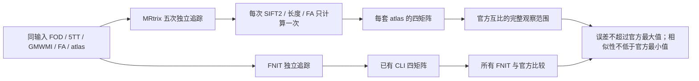

# Connectome 随机重复对照工具

## 1. 功能和策略

本工具读取已有四矩阵及 TCK，比较官方 MRtrix 自身重复与 FNIT—MRtrix 差异。另提供 CPU 只读合同审计，核对已完成命令、输入影像和文件摘要。至少提供三次官方重复，本轮计划使用五次，即种子 `0..4`、每次 **100000 次播种尝试**。`-select 0` 不固定接受轨迹数。



误差低于官方最小值、相似性高于官方最大值均可通过；不用要求 FNIT 超过 MRtrix 重复性。原最小—最大值、每个官方互比、每个交叉比较、FNIT 自身互比仍全部保留。至少两次 FNIT 时，单列 `fnit_reproducibility_status` 按同一门槛验收其自身重复；只有一次时该项为 `not_assessed`。无法定义的指标为 `null/not_assessed`。这是有限次数的实际观察范围，**不是总体置信区间**；门槛在读取本轮真实比较结果之前确定，不根据结果事后调节。矩阵验收不代表两个 RNG 相同，也不替代解剖学和完整 pipeline 验证。

## 2. Python、输入和输出

```python
from pathlib import Path
from tools.benchmark_connectome_seven_atlas_envelope import compare

# 官方五次独立输出，每个目录包含 atlases/<名称>/{count,sift2_fbc,mean_length,mean_fa}.csv。
official_repeat_directories = [Path("reference") / f"seed-{seed}" for seed in range(5)]
# FNIT 当前 CLI 输出，无需重跑矩阵；也可提供多个 FNIT 重复目录。
fnit_connectome_directories = [Path("fnit_connectome")]
repeat_report = compare(
    official_repeat_directories,
    fnit_connectome_directories,
    dataset="OpenNeuro ds001226 sub-CON03 ses-preop",  # 实际数据标签
    n_seeds=100000,                                    # 播种尝试数
    official_seeds=[0, 1, 2, 3, 4],                    # 对应目录的真实种子
    fnit_seeds=[0],                                    # 对应 FNIT 目录
    atlases=None,                                      # 默认检查全部输出模板；可显式选择子集
)
```

输入支持以下格式，不改变节点编号、已有边的矩阵值或统计量：

- 当前 FNIT：`atlases/<名称>/connectome_count.csv`、`connectome_sift2_fbc.csv`、`connectome_mean_length.csv`、`connectome_mean_fa.csv`；同目录 `atlas_dwi.nii.gz`、`nodes.tsv`、`region_labels.csv` 提供节点和来源信息。
- 官方：同样的 profile 目录，四个 CSV 可以没有 `connectome_` 前缀；`atlas.sha256`、`nodes.tsv`、`nodes.txt` 提供来源信息。
- 旧七 atlas benchmark：`report.json` 的 `profiles` 表和 `<profile>.npz`，保留兼容。
- 单 atlas 工具还支持 `candidate_` 前缀和官方 `matrices/` 子目录。

`nodes.tsv` 的列为 `index / original_label / hemisphere / name`，必须按 `1..K` 排列并与矩阵维度一致。有节点表或 atlas SHA 时校验同一节点顺序和来源；缺少来源信息明确标为 `not_fully_available`，不伪称已验证。显式选择模板子集时在报告保留实际名称，默认要求所有重复包含相同完整模板集合。

比较工具拒绝重复的实际目录（含符号链接别名）和提供的重复种子标签。不同目录本身不能证明独立运行；独立性为调用者声明，完整官方执行由参考工具的命令和 manifest 提供证据。如果 atlas 的最后几个 canonical 节点在 DWI 网格中完全缺失，MRtrix 输出维度可小于 `K`。参考工具在明确节点表与实际标签范围验证后，保留原 CSV，另写 canonical CSV，只为这些确实不存在的末尾节点补零行/列；记录原维度、缺失节点和两种文件 SHA，不改变 atlas 或现有边的值。

输出 JSON 包括：`dataset`、种子、四矩阵摘要、节点/atlas 来源、`pairwise`、`ranges` 和 `matrix_envelope_status`。`ranges` 同时保留 `official_min_max`、`official_values`、`fnit_vs_official`、`inside_count`（描述原双侧范围）、`comparison_accepted`（真正的单侧验收）。对角线单独报告；主要边集为严格上三角。count/FBC 使用全部非对角边；FA/长度主要误差只使用两份 count 均非零的边。原工具的归一化定义保留，单 atlas 的全上三角 FA/长度 L1 另外作为包含支持集差异的指标记录。

### 已有轨迹和执行合同

```python
from tools.benchmark_connectome_tracking_population import compare as compare_population

# 五份官方 TCK 和一或多份 FNIT TCK，全部处于同一世界坐标系。
population_report = compare_population(
    [directory / "tracks.tck" for directory in official_repeat_directories],
    [Path("fnit_checkpoints/tracks.tck")],
    grid=Path("reference/inputs/wm_fod.nii.gz"),  # 完整公共 FOD 网格
    dataset="OpenNeuro ds001226 CON03",
    n_seeds=100000, official_seeds=[0, 1, 2, 3, 4], fnit_seeds=[0],
    return_data=False,  # True 时另外返回绘图使用的长度/端点/点访问计数数组
)
```

population 输出每轮接受数和接受率、完整长度分位数、全部官方/跨软件/FNIT 内部 pair、完整范围与单侧判断。接受率差使用绝对差，分母是 `n_seeds` 播种尝试数，不能使用 TCK 的 `total_count` 代替。长度为已保存 polyline 的长度，使用原有双样本 KS；端点为世界坐标中 8 mm 共同直方图。轨迹密度诊断继续使用保存点逐点 `np.rint` 访问计数，**不是 MRtrix `tckmap` 的流线/线段密度**。粗网格仍按原来 4×4×4 体素求和，实际毫米尺寸另记录；CON03 的 2.5 mm 体素对应约 10 mm。空集/常量相关性为 `null/not_assessed`。没有减少体素或变更生产追踪。

`tools/reference/audit_connectome_repeats.py` 读取已完成 `reference_manifest.json`、同轮 `checkpoint-dir` 和 FNIT CLI 输出；检查计划/实际 argv、exit code、源 PT/core/程序/官方输出 SHA，逐份复核 NIfTI-2 体素位、sform 3×4 位、真实 MRtrix header 记录和节点/atlas 身份。`--reference-script` 可选，用于核对执行时冻结的工具源码摘要。输出 `contract_status` 只说明输入/执行合同，不代替随机追踪或全流程科学验收；不调用官方程序或 GPU。

## 3. 命令行

```bash
python tools/benchmark_connectome_seven_atlas_envelope.py \
  --official reference/seed-0 reference/seed-1 reference/seed-2 reference/seed-3 reference/seed-4 \
  --fnit fnit_connectome \
  --dataset 'OpenNeuro ds001226 sub-CON03 ses-preop' \
  --n-seeds 100000 --official-seeds 0 1 2 3 4 --fnit-seeds 0 \
  --output repeat_envelope.json --figure repeat_envelope.png
```

单 atlas 使用 `benchmark_connectome_tracking_100k_envelope.py`，将路径指向对应模板目录。多 atlas 可加 `--atlas fs-aparc aparc+tian-s1` 明确选择子集。`--figure` 为可选的矩阵/误差图，不是新的脑影像 benchmark；标题和点数随实际数据、节点数和重复次数变化。`--official-seeds`、`--fnit-seeds` 可省略，此时只标记运行序号，不猜测种子。

```bash
# population 的 --official/--fnit 可以接多个 TCK；--fnit-repeat 兼容旧调用。
python tools/benchmark_connectome_tracking_population.py \
  --official reference/seed-0/tracks.tck reference/seed-1/tracks.tck \
             reference/seed-2/tracks.tck reference/seed-3/tracks.tck reference/seed-4/tracks.tck \
  --fnit fnit_checkpoints/tracks.tck --grid reference/inputs/wm_fod.nii.gz \
  --dataset 'OpenNeuro ds001226 CON03' --n-seeds 100000 \
  --official-seeds 0 1 2 3 4 --fnit-seeds 0 \
  --output population_envelope.json --figure tractogram_population.png

# 对已经完成的真实输出做 CPU 只读审计，所有参数均为实际路径。
CUDA_VISIBLE_DEVICES='' python tools/reference/audit_connectome_repeats.py \
  --manifest reference/reference_manifest.json \
  --checkpoint-dir fnit_checkpoints --fnit-dir fnit_connectome \
  --reference-script frozen_tools/tools/reference/benchmark_connectome_repeats_official.py \
  --output contract_audit.json
```

`--grid` 为公共 NIfTI 网格；`--dataset` 为真实数据标签；`--n-seeds` 为每轮尝试数（默认 100000）；两个 `--*-seeds` 为可选运行种子标签。`--output` 必需，`--figure` 可选；绘图只依赖项目已声明的 matplotlib，数值分析不需导入它。CPU 工具不重新运行追踪、SIFT2 或矩阵构造。

本轮 CON03 的独立参考计划（执行前需确认真实检查点已生成）：

```bash
fnit_repository_dir=/path/to/Fudan-Neuroimaging-toolkit  # 本轮实际代码检出/工具部署目录
benchmark_root=/cwStorage/home/gongwk/Notebook_code/fnit_connectome_tenraw_20261002
benchmark_python=/cwStorage/home/gongwk/Notebook_code/fnit_conda_env_956b1a9/bin/python
mrtrix_binary_directory=/public/software/apps/MRtrix3/3.0.3/bin
checkpoint_directory="$benchmark_root/root_diagnostic_CON03_v2/checkpoints"
fnit_output_directory="$benchmark_root/root_diagnostic_CON03_v2/connectome"
official_output_directory="$benchmark_root/reference_CON03_five_repeats_v2"  # 必须是新目录

# 在 nodecw10 使用独立官方软件；默认 dry-run 不运行命令、不创建输出。
"$benchmark_python" "$fnit_repository_dir/tools/reference/benchmark_connectome_repeats_official.py" \
  --mrtrix-bin "$mrtrix_binary_directory" \
  --checkpoint-dir "$checkpoint_directory" \
  --fnit-dir "$fnit_output_directory" \
  --output-dir "$official_output_directory" \
  --dataset 'OpenNeuro ds001226 sub-CON03 ses-preop' \
  --n-seeds 100000 --seeds 0 1 2 3 4 --downstream-threads 8 \
  --atlas fs-aparc aparc+tian-s1 aparc.a2009s+tian-s1 glasser+tian-s1 glasser+tian-s4 \
          schaefer200+tian-s1 schaefer500+tian-s4 schaefer1000+tian-s4 \
  --dry-run
# 核对计划后去掉 --dry-run 执行；该脚本不进入 FNIT 运行时。
```

参考工具只允许新输出目录；失败留下明确日志和失败命令。参数 `--tracking-inputs` 可覆盖默认 `checkpoint-dir/tracking_inputs.pt`；`--seeds` 默认 `0..4`、至少三次且不能重复；`--downstream-threads` 默认 8；`--atlas` 默认全部 CLI 模板。实际绑定的 `tracking_kwargs` 决定步长、最小/最大长度、转角、cutoff、power，并验证 `n_seeds` 与检查点一致。保存版本、可执行文件和输入 SHA、逐命令 argv、时间/RSS 和输出检查。主入口时间包含检查与导出，不包含 Python 导入启动。

`tracking_inputs.pt` 在追踪调用前原子写出，单独出现不表示追踪结束。参考执行前还要求同轮 `geometry.npz`、`fa.nii.gz`、非空 `tracks.tck`、`track_metrics.npz` 和所选模板的完整输出齐备，并检查实际仿射、轨迹数和后处理向量维度。该状态为 `computed_outputs_ready`，只说明组件输入完成；不代替端到端状态或 `<20 GB` 显存门槛。保留并记录原 FA 的非有限值及坐标，不过滤、裁剪或改成零。最终四矩阵仍须满足既有有限数值契约。

## 4. 对应官方命令和几何

实际 nodecw10 参考程序为 MRtrix **`3.0.3-103-g026e850d`**；每次运行仍重新记录 `tckgen -version` 和程序 SHA。本轮 FOD 体素为 2.5 mm、默认步长 1.25 mm、ACT 默认最小长度 5 mm；脚本从实际 PT 仿射计算有效值，不把这些数值写死。

```bash
MRTRIX_RNG_SEED=0 tckgen -algorithm iFOD2 \
  -seed_gmwmi gmwmi.nii.gz -act five_tissue_act.nii.gz \
  -seeds 100000 -select 0 -maxlength 250 -minlength 5 -step 1.25 \
  -angle 45 -cutoff 0.1 -samples 3 -power 0.5 \
  -trials 1000 -max_attempts_per_seed 1000 -downsample 2 -nthreads 0 \
  -config NIfTIUseSform 1 wm_fod.nii.gz tracks.tck
tcksift2 tracks.tck wm_fod.nii.gz weights.txt -act five_tissue_sift2.nii.gz -nthreads 8
tckstats -dump lengths.txt tracks.tck -nthreads 8
tcksample -precise -stat_tck mean tracks.tck fa.nii.gz mean_fa.txt -nthreads 8
tck2connectome -symmetric -assignment_radial_search 4 tracks.tck atlas.nii.gz count.csv -nthreads 8
tck2connectome -symmetric -assignment_radial_search 4 -tck_weights_in weights.txt \
  tracks.tck atlas.nii.gz sift2_fbc.csv -nthreads 8
tck2connectome -symmetric -assignment_radial_search 4 -tck_weights_in weights.txt \
  -scale_file lengths.txt -stat_edge mean tracks.tck atlas.nii.gz mean_length.csv -nthreads 8
tck2connectome -symmetric -assignment_radial_search 4 -tck_weights_in weights.txt \
  -scale_file mean_fa.txt -stat_edge mean tracks.tck atlas.nii.gz mean_fa.csv -nthreads 8
```

保留最大 1000 次方向尝试与 rejection trials；`samples=3` 对应 downsample factor 2。显式 `cutoff=.1`、`power=.5` 覆盖 ACT/算法默认值，不额外乘 0.5。不添加 backtrack、crop-at-GMWMI、mask 或 `zero_diagonal`。追踪 `-nthreads 0` 保留参考 RNG 的禁多线程语义，下游 8 线程不影响播种顺序。相同整数种子不能产生与 PyTorch 逐条相同的轨迹。

四矩阵的统计量为：count 是已分配轨迹数，FBC 是 `Σw`，平均长度是 `Σ(w × length) / Σw`，平均 FA 是 `Σ(w × precise_streamline_mean_fa) / Σw`。MRtrix `-tck_weights_in ... -scale_file ... -stat_edge mean` 的分母累加权重，符合 FNIT 的 SIFT2 加权均值；不按轨迹数归一。未分配轨迹丢弃，自连接保留。

精确输入来自 `tracking_inputs.pt`，不用将诊断 NIfTI-1 的舍入仿射说成精确内部几何。参考工具导出 NIfTI-2，检查数组的原始位（包括 NaN payload）和 sform 可表示的前 **3×4 Float64 位**。NIfTI sform 的末行为格式隐含的 `[0,0,0,1]`，不能存完整源矩阵末行；实际矩阵求逆与乘法可能使源末行出现机器舍入残差。工具仅接受固定 dtype 机器界限 `γ4 = 4 × eps / (1 − 4 × eps)` 内的末行残差（Float64 约 `8.88e-16`），超出则拒绝 projective/non-affine 输入。原完整 4×4、原末行、文件可表示 4×4、隐含末行和机器界限全部保留，不声称完整 4×4 在文件中逐 bit 一致。这是格式序列化契约，不是科学比较容差，也不修改 FNIT 实际 Tensor。

ACT 5TT 保留原 header spacing；SIFT2 5TT 和 GMWMI 的可表示 sform 保留调用时原始前三行。FA 用检查点数组和实际 FOD 几何，atlas 用 CLI 标签数组和同一 DWI 几何。原 CLI atlas 摘要标识源文件；导出文件摘要/仿射差异单独记录。

官方程序直接读取这些 NIfTI-2，避免额外 MIF 中转。追踪前对 5 份公共影像及每套 atlas 执行实际 `mrinfo -json_all`，检查读入文件、shape、轴变换、dtype 和强度缩放，分别记录完整源矩阵、文件矩阵、FNIT 算子矩阵和官方 transform/spacing、角点差异。官方 NIfTI reader 将 sform 列方向归一，并按原有 pixdim/sform 规则选 spacing；这些读入语义单独记录，不改 FNIT 实际追踪输入，也不新增观察结果之后选择的精度容差。JSON 中的几何数值经过文本序列化，不能声称与内部浮点数逐 bit 一致。

## 5. 验证和实测状态

本次新增小数组测试只覆盖工具格式、错误处理、边集定义、单侧门槛、五次重复、几何导出和实际命令参数。它们不构成科学精度/耗时 benchmark。本轮十例整例和五次官方重复的真实结果由总控制在运行完成后写入 cohort 报告；本工具不预填通过结果，不沿用 ds004666 旧数值作为新数据结论。

2026-10-02 在实际 nodecw10 只读执行 `tckgen -version/-help`，确认上述参考版本、步长、ACT 最小长度、samples/power/trials/downsample 和 `-nthreads 0` 参数语义。CPU 工具回归与原矩阵比较测试 **19 passed、1 skipped，3.17 秒**；跳过项是可选绘图，需要项目已声明的 matplotlib。本轮共享测试环境尚缺此依赖，不改动正在运行整例所用的环境。以上耗时是工具测试时间，不是追踪或 pipeline benchmark。

2026-10-03 在 nodecw10 对本轮公开 CON03 的已有真实 FOD 和原生 recon-all segmentation 做 CPU header/readback 检查。这是读取算子检查，未运行 CON03_v2 追踪，也不是完整流程 benchmark。实测额外 `mrconvert → MIF` 将 FOD spacing 的细小浮点尾数写成 `2.5`，角点变化 `1.08258e-5 mm`；直接读 NIfTI-2 的 `mrinfo -json_all` 保留了原 spacing 尾数，FOD 角点差 `3.57538e-13 mm`，原生分割角点差 `6.56166e-13 mm`。已查对应 MIF writer：`vox` 使用普通流精度，transform 才使用 FullPrecision，因此去掉本工具中不必要的 MIF 中转；不修改 FNIT、FOD 数组或验收门槛。真实 CON03_v2 的读入几何和五次追踪结果仍由实际执行记录确认。

最新 CPU 工具回归与原矩阵比较测试 **22 passed、1 skipped，2.61 秒**；跳过原因仍为可选 matplotlib 绘图。同一官方版本的小输入命令契约回归确认 `-stat_edge mean` 的加权均值分母为 `Σw`，自连接保留；这是参数/命令语义测试，不作为真实数据 benchmark。

修正末行序列化契约后，对真实 `root_diagnostic_CON03_v2` 的 13 份输入（FOD、ACT 5TT、SIFT2 5TT、GMWMI、FA、8 套 atlas）在 CPU 完整重验：**13/13 体素位一致、13/13 前 3×4 sform 位一致**。源 5TT 仿射末行最大残差 `5.551115123125783e-16`，小于固定 Float64 γ4 界限 `8.88178419700126e-16`；原 FA 的 1 个 NaN 保留。原 PT 和失败 v1 manifest 摘要不变，未执行任何官方命令或 GPU。核验记录位于本轮 `root_repeat_input_export_CON03_v2/export_verification.json`，这只证明实际输入序列化契约，不是随机追踪通过结果。新增舍入边界、projective 拒绝和 sform 一位变化拒绝的 CPU 回归后，**25 passed、1 skipped，2.70 秒**。

### CON03 v2 最新真实结果

2026-10-03，官方 nodecw10 已完成种子 0..4 的 **198/198 条命令，全部 exit0**；输入合同审计通过（13/13 数据位及 sform 3×4 位、节点/atlas 来源与摘要一致，原 FA 的 1 个 NaN 保留）。FNIT 当前完整种子 0 的接受率为 **11.606%**，官方为 **11.475–11.843%**。但长度 KS、端点直方图和部分 point-visit 密度比较越界，`population_envelope_status=failed`。

八套模板的预先定义六指标共 240 个跨比较，**233 通过、7 越界**；fs-aparc、aparc+Tian S1、Glasser+Tian S1、Schaefer200+Tian S1 全部通过，其余四套有 count 相关性、支持 Dice 或 Glasser+Tian S4 平均 FA 误差越界，`matrix_envelope_status=failed`。只有一份 FNIT 完整结果，`fnit_reproducibility_status=not_assessed`。未按观察结果放宽门槛，也不能用此组件对照宣布十例 raw pipeline 已通过。

完整逐项数值、真实脑图、CPU 只读复现命令和分阶段官方耗时见 [CON03 五次官方参考报告](../validation/connectome/tenraw_20261002/task_04_repeat_reference/README.md)。新工具回归与原矩阵比较测试 **29 passed、1 skipped，3.96 秒**（gpucw1 CPU、CUDA 不可见；唯一跳过项为专用环境中缺少可选 matplotlib）。绘图实际使用已有 base Python 的 matplotlib，不修改正在运行正式任务的 Conda 环境。

## 6. 更新记录

- 2026-10-02：三次固定输入改为至少三次、默认计划五次；支持任意 FNIT 重复和当前 CLI 多 atlas CSV；去掉旧数据/20 节点硬编码；修正单侧验收，新增空值和对角报告；独立官方参考共用每次追踪的后处理，保留精确检查点几何和完整来源。
- 2026-10-03：核对实际 tracking 默认值和加权均值公式；补上同轮 core 输出就绪检查；直接 NIfTI-2 参考输入、追踪前官方 header readback、保留原 NaN；CON03 计划路径更新为 v2。没有据此宣称随机追踪或十例流程已经通过。
- 2026-10-03：真实参考 v1 在 NIfTI-2 导出时误把齐次末行机器残差判为数据变化，尚未执行任何参考命令。改为严格校验可表示的 3×4 sform 和体素位，按固定 dtype γ4 界限检查原末行，完整记录源/文件/FNIT 算子几何。原失败目录保留，不改原 Tensor、ACT spacing 或科学门槛。
- 2026-10-03：泛化人口分布工具为任意 ≥3 官方/≥1 FNIT；保留 KS/端点/点访问计数定义，修正四体素块的物理尺寸标签；新增 CPU 只读完成/输入合同审计，发布真实 CON03 五轮完整失败/通过指标，不改生产数值或科学门槛。
- 旧报告继续绑定旧代码/数据，历史 `inside_count` 仍表示双侧观察范围；新版 `comparison_accepted` 才用于本轮验收。没有重新运行旧结果或改写旧结论。

## 7. 参考和源码

- [MRtrix tckgen](https://mrtrix.readthedocs.io/en/latest/reference/commands/tckgen.html)、[tck2connectome](https://mrtrix.readthedocs.io/en/latest/reference/commands/tck2connectome.html)、[tcksift2](https://mrtrix.readthedocs.io/en/latest/reference/commands/tcksift2.html)、[MRtrix3 源码](https://github.com/MRtrix3/mrtrix3)。实际默认值同时核查独立参考源码的 `tracking/tractography.h`、`tracking/shared.cpp`、`algorithms/iFOD2.h`、`seeding/seeding.cpp`，并以运行程序版本/SHA 为准。
- Tournier et al. MRtrix3. *NeuroImage* (2019). [doi:10.1016/j.neuroimage.2019.116137](https://doi.org/10.1016/j.neuroimage.2019.116137)。Smith et al. ACT. *NeuroImage* (2012). [doi:10.1016/j.neuroimage.2012.06.005](https://doi.org/10.1016/j.neuroimage.2012.06.005)。Smith et al. SIFT2. *NeuroImage* (2015). [doi:10.1016/j.neuroimage.2015.06.092](https://doi.org/10.1016/j.neuroimage.2015.06.092)。
- [OpenNeuro ds001226 原仓库](https://github.com/OpenNeuroDatasets/ds001226)，本轮只使用新下载的公开原始 DWI/T1w；数据下载和输入摘要另见十例 cohort manifest。
