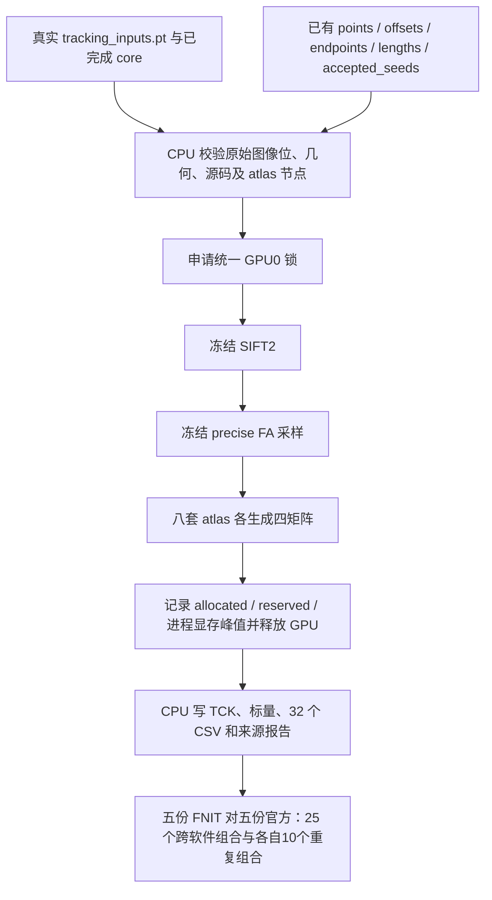

# 已有真实轨迹的五种子 GPU 后处理对照

## 1. 功能与流程

`benchmark_connectome_fnit_repeats.py` 读取已经完成的 FNIT 追踪，使用冻结版本的 SIFT2、精确 FA 采样和矩阵构造函数。每个种子单独申请共享 GPU 锁，不重新追踪。



此工具检验已有轨迹的下游计算。其耗时和显存不代表从原始 BIDS 开始的连续 pipeline。

## 2. Python 调用、输入与输出

该工具属于独立验证工具，不是生产 API。Python 可以加载文件后调用 `run(configuration, seed, tracking_directory, output_directory)`。配置必须在运行前冻结；仅填写路径不能通过真实文件校验。

输入：

- `checkpoint_dir`：本轮 core 的 `tracking_inputs.pt`、`geometry.npz`、`fa.nii.gz`、`tracks.tck`、`track_metrics.npz`。PT 提供原始 Float64 affine、FOD、5TT、GMWMI、完整追踪参数。
- `fnit_dir`：本轮真实 CLI 输出；`atlases/<profile>/` 提供 `atlas_dwi.nii.gz`、`nodes.tsv`、四矩阵及可选 `region_labels.csv`。
- `tracking_directory`：`points.npy [P,3] float32`、`offsets.npy [T+1] int64`、`endpoints.npy [T,2,3] float32`、`lengths_mm.npy [T] float32`、`accepted_seeds.npy [T,3] float32` 和真实 `report.json`。`accepted_seeds` 是世界坐标，不是种子索引。
- `configuration`：固定原输入 SHA、追踪 worker/source SHA、冻结 baseline 全部 Python 与必要数据资源 SHA、源码 archive/identity SHA、官方 manifest SHA、工具 SHA、GPU UUID 与统一锁路径。示例 CON03 配置已逐一校验 447 个源码/资源文件。

输出：

- `tracks.tck`：原有 points 的逐位坐标读回校验，未重新生成轨迹。
- `track_metrics.npz`、`sift2_weights.txt`、`lengths.txt`、`mean_fa.txt`：已有长度和新计算的冻结下游标量，顺序与 TCK 一致。
- `atlases/<profile>/connectome_{count,sift2_fbc,mean_length,mean_fa}.csv`：行列严格由原 `nodes.tsv` 定义，共八套 atlas、32 个 CSV。自连接保留，未分配轨迹丢弃，长度和 FA 为 SIFT2 加权均值。
- `report.json`：来源、图像 dtype/shape、非有限值数量、实际 GPU 步长、各阶段时间、allocated/reserved 与采样进程显存峰值、全部输出 SHA。

原始 FA 中存在的非有限值完整保留，并在输入/标量 QC 中记录；不剪裁或替换。最终四矩阵必须有限。源 atlas、节点表和图像位必须与固定官方对照来源一致。

## 3. 命令行与参数

```bash
# 固定配置与已有真实 seed0 轨迹；路径由本轮实际部署产生。
configuration_path=/path/to/frozen_tools/config.json
tracking_directory=/path/to/actual_tracking/seed0
output_directory=/path/to/new_postprocessing/seed-0

CUDA_VISIBLE_DEVICES=GPU-actual-uuid \
PYTORCH_CUDA_ALLOC_CONF=expandable_segments:True \
python tools/reference/benchmark_connectome_fnit_repeats.py \
    --config "$configuration_path" \
    --seed 0 \
    --tracking-dir "$tracking_directory" \
    --output-dir "$output_directory"
```

- `--config`：冻结 JSON，工具核对其中的实际文件和源码 SHA。
- `--seed`：必须是配置允许的种子，且与真实追踪报告及完整 kwargs 相符。
- `--tracking-dir`：实际完成轨迹目录；不接受未完成追踪。
- `--output-dir`：全新输出目录，避免覆盖已有失败或成功记录。
- `--dry-run`：只进行真实 CPU 合同检查，CUDA 不初始化，不写输出，不作为科学 benchmark。

`run_connectome_fnit_repeat_postprocessing.py` 是 CPU 控制器，依次等待 seed0–4 的实际文件，再启动上述 worker；参数为 `--config`、`--config-sha256`、`--tracking-root`、`--output-root`、`--python`。每个 worker 自行取得同一共享锁。严格门槛为三种实际峰值均 `<20,000,000,000 bytes`，采样失败或未知峰值不能通过；NVML/SMI 是采样观测，报告采样间隔及失败数量。

## 4. 对应官方命令

固定输入官方工具 `benchmark_connectome_repeats_official.py` 为每种子运行：

```bash
tckgen wm_fod.nii.gz tracks.tck -algorithm iFOD2 \
    -act five_tissue_act.nii.gz -seed_gmwmi gmwmi.nii.gz \
    -seeds 100000 -select 0 -maxlength 250 -cutoff 0.1 \
    -power 0.5 -samples 3 -trials 1000 -max_attempts_per_seed 1000 \
    -downsample 2 -nthreads 0

tcksift2 tracks.tck wm_fod.nii.gz sift2_weights.txt \
    -act five_tissue_sift2.nii.gz -nthreads 8

tcksample tracks.tck fa.nii.gz mean_fa.txt -precise -stat_tck mean -nthreads 8
tckstats tracks.tck -dump lengths.txt -nthreads 8

tck2connectome tracks.tck atlas_dwi.nii.gz mean_fa.csv \
    -symmetric -assignment_radial_search 4 -tck_weights_in sift2_weights.txt \
    -scale_file mean_fa.txt -stat_edge mean -nthreads 8
```

实际固定输入工具还显式绑定 PT 推导的 `-step/-minlength` 和 `NIfTIUseSform=1`，完整 argv 以真实 manifest 为准。追踪 `-nthreads 0` 保持官方 RNG 执行语义，下游八线程。相同整数种子不表示 MRtrix 与 PyTorch 使用同一随机流。四矩阵定义：count 为轨迹数，FBC 为 `sum(w)`，长度/FA 为 `sum(w*scalar)/sum(w)`。

## 5. 真实数据对照与当前结论

CON03 使用本轮新下载 OpenNeuro `ds001226` 的真实 T1/DWI 和真实追踪，不用模拟数据替代 benchmark。已有一份 FNIT seed0 对官方 seed0–4 的独立报告：

- 官方 198/198 个实际命令 exit0，全部输入序列化与来源审计通过。
- 八 atlas 主矩阵门槛 233/240 个比较通过、7 个未通过；接受率、长度、端点和点访问直方图共 10/25 通过、15 个未通过。
- FNIT 自身重复当时只有一个种子，状态为 `not_assessed`。当前五份真实轨迹已通过 CPU TCK 坐标位读回；完整人口分布为跨软件72/125通过、自身47/50通过，均failed。五种子GPU后处理已全部真实完成并通过显存门槛；完整矩阵cross1091/1200、自身412/480通过，整体failed。

[已有机器报告与真实图](../../validation/connectome/tenraw_20261002/task_04_repeat_reference/README.md)。该结果不能表述为已经匹配官方。有限五次重复范围是观测 envelope，不是总体置信区间；错误不超过官方最大错误，相似性不低于官方最小相似性，门槛不会随真实结果调整。

[最新五种子人口分布、真实图与分箱来源说明](../../validation/connectome/tenraw_20261002/task_04_repeat_fivefnit_reference/README.md)。`prepare_connectome_existing_tracks_population.py` 仅在CPU复用真实合同，独立保存实际轨迹TCK并验证float32 bits；不初始化CUDA、不算SIFT2、不生成矩阵。

GPU身份检查严格比较128位UUID与固定expected、实际logical cuda:0和同PID NVIDIA物理设备。PyTorch2.5.1现场返回`torch._C._CUuuid`及16uint8 bytes，[官方Module.cpp](https://github.com/pytorch/pytorch/blob/v2.5.1/torch/csrc/cuda/Module.cpp#L905)说明该表示；工具仅做表示归一化，不以环境变量或物理index推断设备。旧失败发生在SIFT2之前且保留，新运行仍使用原冻结baseline科学函数。

真实独立审计 `audit_connectome_fnit_repeats.py --config/--config-sha256/--output-root/--cpu-preparation-root/--output` 核对全部源、五份已完成输出、三种显存峰值与原seed0格式重放；CUDA必须隐藏。旧seed0的32份最终dtype矩阵bits相同，原CLI格式重放也逐字节相同；Float64权重末位差另记录，无新容差。完整参数、实际耗时与source/config/identity证据见上面的单一最新报告。

## 6. 更新与 benchmark 记录

- 2026-10-03：完成五种子GPU后处理与25cross/10self矩阵gate；allocated2.16GB/reserved2.54GB/本进程采样4.44GB；整体科学gate失败如上，生产科学数值未更改。
- 2026-10-03：增加冻结已有轨迹 GPU 后处理与五种子控制器；31 个 CPU 工具契约回归通过、1 个可选绘图依赖跳过。CON03 seed0 实际 CPU 预检通过，GPU worker 按统一锁排队。该条不代表五种子已完成。
- 2026-10-03：提交实际 CON03 官方五重复审计及 FNIT seed0 科学失败报告，保留先前失败目录。
- 先前：支持任意重复数、当前 CLI CSV、完整节点元数据、单侧经验门槛及独立 FNIT 自身重复状态。

## 7. 原软件与参考文献

- [MRtrix3 代码](https://github.com/MRtrix3/mrtrix3)，本轮实际二进制 `3.0.3-103-g026e850d`；算法 flags 按该版本核对。
- [tckgen](https://mrtrix.readthedocs.io/en/latest/reference/commands/tckgen.html)、[tcksift2](https://mrtrix.readthedocs.io/en/latest/reference/commands/tcksift2.html)、[tcksample](https://mrtrix.readthedocs.io/en/latest/reference/commands/tcksample.html)、[tck2connectome](https://mrtrix.readthedocs.io/en/latest/reference/commands/tck2connectome.html)。实际版本 manifest 优先于在线最新文档。
- Tournier et al. (2019), MRtrix3, *NeuroImage* 202:116137；Smith et al. (2012), ACT, *NeuroImage* 62:1924–1938；Smith et al. (2015), SIFT2, *NeuroImage* 119:338–351。
