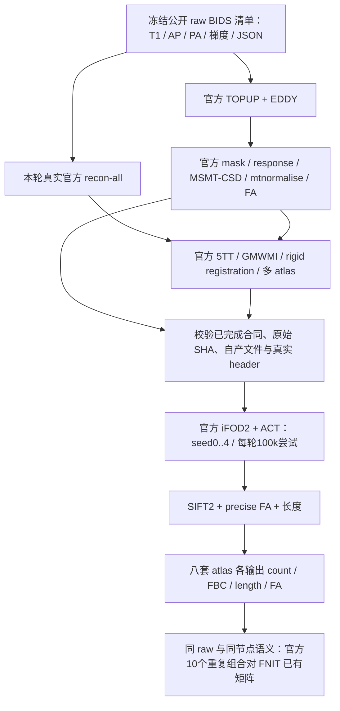

# 同一原始病例的独立官方 connectome 对照

## 1. 功能与流程

`benchmark_connectome_raw_official.py` 从本轮官方自产 DWI 和解剖合同继续执行 MRtrix 追踪、SIFT2、FA/长度采样及八套 atlas 矩阵。它是独立 benchmark 工具，不进入 FNIT 运行时，也不读取 FNIT 的 FOD、FA、atlas 或 PT 检查点。



本轮显式选择已完成的官方 modeling 与官方 anatomy consumer 合同；上游路径以本轮交接为准，不能自动回退。CON01/03 原始选帧匹配；后八例按正式 FNIT 已冻结的原始 B0 frame index 作为共同输入参数，从原始文件由 `fslroi/fslmerge` 重建。这一输入适配及逐位抽帧检查保留在 producer 报告；官方仍自产 TOPUP field、mask、EDDY、FOD、FA 与 atlas，不称两条链独立选择 B0。早先失败或尚未完成的目录保留原状，不回退消费。若上游明确启用真实 `eddy_cpu` fallback，必须显式绑定其新完成合同；报告保留 CPU solver、host 与实际时间，GPU solver 的时间和 UUID 分开记录。

## 2. Python、输入格式与输出

官方执行器支持 `main(argument_list)`，同原始病例矩阵工具支持：

```python
from pathlib import Path
from tools.benchmark_connectome_raw_cohort_envelope import compare

# 路径对应已经完成的真实输出；本函数只读矩阵和来源，不重新计算影像。
comparison_report = compare(
    official_root=Path("official_tracking/sub-CON03"),
    fnit_dirs=[Path("fnit/sub-CON03/connectome")],
    fnit_reports=[Path("fnit/sub-CON03/gpu_report.json")],
    manifest_path=Path("frozen/input_manifest.json"),
    manifest_sha256="原始清单的完整64位SHA256",
    case_id="sub-CON03",
    fnit_seeds=[0],
)
```

官方执行输入：

- **原始清单**：JSON 的 `cases[].case_id/subject/session/input_files[]`；每个原始 T1、AP/PA NIfTI、bval、bvec、JSON 均有真实路径与 SHA。数据集、snapshot 与许可由清单记录。原始文件在运行前后重新校验。
- **官方 DWI consumer contract**：`scope=official_self_produced_raw_dwi_chain`，同 case、`state=completed`。提供 `files.wm_fod_normalized`、`files.FA` 及原始官方 rawprep 报告路径与 SHA。每项文件含 path、size_bytes、sha256 和实际 grid/readback。
- **官方解剖 consumer contract**：`scope=official_self_produced_fresh_fs_anatomy_and_raw_dwi_atlases`，同 case、`state=completed`。提供 `five_tissue_dwi_world`、`gmwmi_dwi_world`、八 atlas 的 NIfTI 与 nodes.tsv，并绑定原始 T1、真实 fresh FS、prepared/complete 报告及所消费 DWI 合同 SHA。
- **已经审计的固定输入官方 manifest**：只用于核对本轮 MRtrix 二进制及命令规划器身份；其中的 FNIT 图像不作为新官方链输入。

5TT 是自身 native 结构格点上的五通道 NIfTI，GMWMI 保持其格点；world affine 映射到 DWI 世界坐标。FOD 为 `[X,Y,Z,45]`、lmax8；FA 为三维标量图；atlas 为三维非负整数标签，节点连续编号 1…K，由 `nodes.tsv` 的 index/original_label/hemisphere/name 四列定义。工具记录原始非有限值，完整消费原文件。5TT 的第四轴是组织通道，部分官方文件将该非空间轴的 spacing 写为 NaN。报告仅把这一未定义 metadata 写为 `null`，另列轴号和原 NaN 标记并绑定原文件/原 mrinfo JSON SHA；三空间轴仍要求有限正值，图像数据、affine 和官方命令不变。

输出：

- `inputs/`：指向官方自产原图像的软链接，没有重导出或变更图像数值/几何。
- `seed-0/` … `seed-4/`：真实 `tracks.tck`、SIFT2 权重、原始长度与 precise FA 文本；`atlases/<profile>/` 各有四 CSV、原节点表和来源摘要。
- `reference_manifest.json`：全部计划与实际命令、returncode、log/time 文件、每项 reader 几何、原始/自产来源 SHA、每轮接受数及标量非有限值 QC。耗时只包括本工具的追踪/下游阶段，上游 rawprep、recon-all、建模与解剖分别保留其实际时间。
- 同病例比较 JSON：官方自身全部组合、跨软件全部组合、FNIT 自身组合、完整范围与单侧门槛、节点语义和两条链各自 atlas SHA。

正式 FNIT CLI 当前保存四矩阵和影像，不保存 TCK/FOD。因此十例正式结果只做已有矩阵对照；人口分布诊断来自实际保留 TCK 的 pilot 五种子，分开报告。

## 3. 命令行及参数

```bash
# 所有路径来自本轮实际产物。old reference只用于二进制/helper身份校验。
raw_manifest=/path/to/frozen/input_manifest.json
raw_manifest_sha256=完整64位SHA256
anatomy_contract=/path/to/current_completed_official_anatomy/sub-CON03/consumer_contract.json
dwi_contract=/path/to/current_completed_official_modeling/sub-CON03/consumer_contract.json
verified_reference_manifest=/path/to/audited_fixed_reference/reference_manifest.json
verified_reference_manifest_sha256=完整64位SHA256
mrtrix_binary_directory=/path/to/pinned/MRtrix3/bin
new_output_directory=/path/to/new_official_tracking/sub-CON03

python tools/reference/benchmark_connectome_raw_official.py \
    --raw-manifest "$raw_manifest" --raw-manifest-sha256 "$raw_manifest_sha256" \
    --anatomy-contract "$anatomy_contract" --dwi-contract "$dwi_contract" \
    --verified-reference-manifest "$verified_reference_manifest" \
    --verified-reference-manifest-sha256 "$verified_reference_manifest_sha256" \
    --case-id sub-CON03 --mrtrix-bin "$mrtrix_binary_directory" \
    --n-seeds 100000 --seeds 0 1 2 3 4 --downstream-threads 8 \
    --output-dir "$new_output_directory"
```

- `--raw-manifest` / `--raw-manifest-sha256`：固定原始清单及其完整 SHA。
- `--anatomy-contract` / `--dwi-contract`：真实完成合同，解剖合同必须绑定这里传入的同一 DWI 合同。
- `--verified-reference-manifest` / 对应 SHA：已经成功审计的官方版本身份；所有七个二进制、helper SHA 和实际版本必须一致。
- `--case-id`：原始清单中的唯一病例 ID。
- `--mrtrix-bin`：已固定官方二进制目录。
- `--n-seeds`：每轮尝试种子数，不是接受轨迹数；默认 100000。
- `--seeds`：至少三种不同的非负种子；本轮预定 0–4。
- `--downstream-threads`：本轮固定 8。追踪固定 0，保持官方单线程 RNG 执行语义。
- `--output-dir`：全新目录。
- `--dry-run`：真实来源与文件检查加命令计划，不执行官方程序，不作为 benchmark。

`run_connectome_raw_official_cohort.py` 是 CPU 调度器：另传 `--official-dwi-root`、`--official-anatomy-root`、`--output-root`、`--python`，其余身份/种子参数相同；可用 `--case-ids` 选择原始清单病例。默认逐例、下游八线程；`--poll-seconds` 默认 15。它只等待明确传入的合同目录，源与清单发生变化则停止，不隐式重试或回退到旧结果。

```bash
python tools/benchmark_connectome_raw_cohort_envelope.py \
    --official-root /path/to/new_official_tracking/sub-CON03 \
    --fnit /path/to/fnit/sub-CON03/connectome \
    --fnit-gpu-reports /path/to/fnit/sub-CON03/gpu_report.json \
    --raw-manifest "$raw_manifest" --raw-manifest-sha256 "$raw_manifest_sha256" \
    --case-id sub-CON03 --fnit-seeds 0 --output /path/to/comparison/sub-CON03.json
```

这里要求 FNIT `gpu_report.json` 同病例且实际 exit0，原始输入在 before/after 逐项校验，读到的矩阵、atlas 和 nodes 文件摘要属于该真实输出报告。尝试数和种子标签核对实际 CLI command。

`preflight_connectome_raw_reference.py --config <冻结JSON> --config-sha256 <完整SHA> --output <新报告>` 只读核对真实工具/二进制、`-version`、原始文件与实际完成合同。配置列出源码 SHA、已审计 reference manifest 和 SHA、MRtrix 目录、raw manifest 和 SHA、明确 modeling/anatomy 根目录。加载器错误保留实际 returncode 与输出并使 `program_dependencies_ready=false`；合同未齐则 `required_dependency_ready=false`，不会因此启动计算或切换二进制。

### 两组 CPU 流水与真实输出来源

十例预定分为两个互斥组：A 为 CON01/04/06/08/10，B 为 CON03/05/07/09/11。每组运行原控制器，使用相同冻结 worker、helper、二进制、原始清单和 producer 根目录；`--case-ids` 写清本组的 `sub-CONxx`，`--output-root` 使用独立新目录。各组扫描全部病例，跳过未完成合同，因此某一病例尚未准备好不会挡住同组的其他 ready 病例。每例五个种子仍按 0–4 顺序运行；tracking `-nthreads 0`、下游 8 线程。只有对应组首个真实完成 consumer 到达后才启动该组，不等待另一组准备好。

`bind_connectome_raw_reference_origins.py` 为两组产物建立来源表和受控软链接，便于现有逐病例矩阵工具读取。它只处理文件元数据，不运行官方命令、GPU 或矩阵重计算：

```bash
# 先冻结实际两组启动配置、源码 SHA 和当前完成 producer 的明确路径。
origin_configuration=/path/to/frozen/case_origin_configuration.json
origin_configuration_sha256=完整64位SHA256
controlled_official_view=/path/to/new_controlled_official_view

python tools/reference/bind_connectome_raw_reference_origins.py \
    --config "$origin_configuration" \
    --config-sha256 "$origin_configuration_sha256" \
    --output-root "$controlled_official_view" --watch --poll-seconds 15
```

配置 JSON 的字段如下：

- `raw_manifest` 与 `verified_reference_manifest`：各包含实际 `path` 和 `sha256`，分别绑定 canonical raw 清单和已审计官方身份。
- `source_files`：冻结源码的绝对路径到 SHA 的映射，包含原控制器、raw worker、官方命令 helper 和 `connectome_repeat_common.py`；不能运行中替换。
- `n_seeds=100000`、`seeds=[0,1,2,3,4]`、`expected_eddy_solver="cpu"`：本轮预先固定的尝试数、重复标签与上游 CPU solver 来源。
- `groups.A` 与 `groups.B`：分别包含 `case_ids`、实际 `output_root` 和 `launch_configuration={path,sha256}`。两组必须互斥并覆盖 canonical 清单全部病例。每组启动配置除 `case_ids/output_root` 外完全一致，包含实际 `official_dwi_root/official_anatomy_root`、原始及 reference SHA、种子参数。

输出 `case_origin_binding.json` 保留每组实际 controller PID、状态文件 SHA、启动配置与源码 SHA。病例只有在实际 worker returncode=0、全部官方命令完成、`reference_manifest.execution_completed=true`，且 raw/合同/源码身份一致时，才建立 `controlled_official_view/sub-CONxx → group实际目录/sub-CONxx`。表中同时保存目标路径、reference manifest SHA、真实 DWI/anatomy consumer SHA、EDDY CPU 来源和选帧记录。尚未启动或尚未完成的病例记录等待状态，不创建结果软链接；已有错误目录或指向其他产物的链接会报错。

该来源表的 `execution_completed` 仅表示两组真实参考产物已齐，`scientific_parity` 仍是 `not_assessed`。是否进入官方重复范围由矩阵 envelope 独立判断。解析器测试只验证来源协议，不能替代真实十例 benchmark。


### 已完成参考的只读审计

`audit_connectome_raw_repeats.py` 接收已完成 `--manifest`、canonical `--raw-manifest/--raw-manifest-sha256`、唯一 `--case-id`、实际冻结 `--worker` 和新 `--output`。它不执行官方命令或 GPU，重验原始/producer/源码/二进制/输入 reader/TCK/标量/矩阵 SHA，保存各轮实际时间及官方自身十对完整范围。未提供 FNIT 结果时，cross 和 FNIT 重复状态保持 `not_assessed`。首两例实际完成结果见 [CON01/CON03 独立 raw 五重复审计](../../validation/connectome/tenraw_20261002/task_04_raw_reference_first_cases/README.md)。

`run_connectome_raw_readonly_audit_cohort.py --config <冻结JSON> --config-sha256 <完整SHA> --poll-seconds 30` 持续读取上述 origin 表，只审计已完成病例。配置字段是 `raw_manifest={path,sha256}`、`case_origin_configuration={path,sha256}`、`official_view`、`source_files={absolute_path:sha256}`、`audit_worker`（只读审计器）、`producer_worker`（当时官方 worker）、`python`、全新 `output_root`；可用 `completed_audits={case_id:{path,sha256}}` 显式绑定此前已完成审计。它不会复制已有报告；来源表保存实际原路径。新报告逐例执行一次只读审计，不启动官方命令、追踪、矩阵计算或 GPU。输出 `cohort_status.json` 记录实际来源、摘要和等待/失败状态，`scientific_parity` 始终为 `not_assessed`。

## 4. 官方步骤与命令

| 阶段 | 本工具消费或执行的官方步骤 |
|---|---|
| 原始预处理 | 独立官方 TOPUP、EDDY 产物合同 |
| 解剖 | 真实官方 recon-all，随后官方配准、5TT、GMWMI、atlas 合同 |
| 建模 | 官方 Dhollander、MSMT-CSD、mtnormalise、张量 FA 合同 |
| 追踪 | `tckgen -algorithm iFOD2 -act 5tt -seed_gmwmi gmwmi -seeds 100000 -select 0 -maxlength 250 -angle 45 -cutoff 0.1 -power 0.5 -samples 3 -trials 1000 -max_attempts_per_seed 1000 -downsample 2 -nthreads 0` |
| SIFT2 | `tcksift2 tracks.tck wm_fod weights.txt -act 5tt -nthreads 8` |
| 标量 | `tckstats -dump lengths.txt`；`tcksample -precise -stat_tck mean` |
| 矩阵 | `tck2connectome -symmetric -assignment_radial_search 4`；FBC加 `-tck_weights_in`；长度/FA再加 `-scale_file -stat_edge mean` |

新官方自产链让已固定 C++ solver 从自己的真实 header 计算默认步长（0.5 voxel）和 ACT 最短长度（2 voxels），并记录实际 TCK header。固定 FNIT PT 的旧工具仍显式传入 PT 推导参数，保持原本算子定位设置。完整 argv、环境种子和各阶段参数以机器 manifest 为准。

四矩阵定义保持：轨迹数、`sum(w)`、`sum(w*length)/sum(w)`、`sum(w*preciseFA)/sum(w)`。自连接保留，未分配轨迹丢弃，不重新构造或改变已保存矩阵。

## 5. 精度、时间与真实图

新十例逐病例官方完整链产物齐备后进行真实矩阵评测。首 CON01/CON03 已完成各五轮参考，详见上述实物审计。工具验收的是同原始病例和严格节点语义；两条独立处理链的中间图像及 atlas 内容分别记录。已有固定输入报告继续要求跨软件 atlas 来源 SHA 相同。

预先定义门槛：错误不超过官方自身最大观测错误，相似性不低于官方自身最小观测相似性。完整五次重复范围保留，不要求 FNIT 超过 MRtrix 自身重复；范围是有限样本观测，不是总体置信区间。共同 count 边上的 length/FA、全部严格上三角 count/FBC、support Dice 与 count Pearson 的数值定义复用原工具。

此前固定输入 CON03 的单次 FNIT seed0 对官方五份在八 atlas 主矩阵中 233/240 比较通过，7 个未通过；后续五份 FNIT 的全部交叉/自身重复结果见 [五种子实物报告](../../validation/connectome/tenraw_20261002/task_04_repeat_fivefnit_reference/README.md)。这些结果用于算子定位，与独立 raw 全链报告分开。已有 [真实点访问与人口分布图](../../validation/connectome/tenraw_20261002/task_04_repeat_reference/tractogram_population.png) 及 [矩阵图](../../validation/connectome/tenraw_20261002/task_04_repeat_reference/matrix_envelope.png)。

此前只读依赖预检：nodecw10 的七个固定二进制版本调用均 exit0，101 个原始唯一文件 SHA/header 已核对；当时 producer 合同未齐，`required_dependency_ready=false`。随后首四例真实合同就绪，两 CPU 组已启动，首两例参考完成；来源和精确时间以阶段报告为准。gpucw1 的旧系统 C++ 加载器失败独立保留，未改原程序或运行库。详见 [实际预检记录](../../validation/connectome/tenraw_20261002/task_04_raw_reference_preflight/README.md)。这不是追踪耗时或科学一致性结果。

## 6. 版本与 benchmark 记录

- 2026-10-03：两互斥 CPU 组使用同一冻结配置，首 CON01/CON03 各五轮 198 命令全部 exit0；增加只读实物审计，保留官方自身范围与 `not_assessed` cross 状态。原 5TT 非空间 channel `spacing=NaN` 的 JSON 修正仅影响 metadata，原影像/reader 文件不变，19 CPU 契约测试通过。

- 2026-10-03：增加独立官方原始链执行器、显式合同 CPU 控制器和同 raw/节点语义矩阵 envelope；最新 32 个 CPU 工具契约回归通过、1 个可选绘图库跳过，3.94 s。这些小数组检验工具协议，不是科学 benchmark。
- 2026-10-03：真实 fresh FS anatomy CON03 的官方 native atlas 已在另一阶段完成；官方 rawprep retry、modeling v2 与完整 DWI atlas 合同尚在推进。本工具不会提前写 completed。
- 既有固定输入和 FNIT 五种子 GPU 后处理分别保留 [独立说明](benchmark_connectome_fnit_repeats.md) 与实际结果命名空间。

## 7. 原代码与文献

- [UKB-connectomics](https://github.com/sina-mansour/UKB-connectomics)；[MRtrix3](https://github.com/MRtrix3/mrtrix3)，本轮已审计版本 `3.0.3-103-g026e850d`。
- [FSL](https://fsl.fmrib.ox.ac.uk/fsl/docs/)、[FreeSurfer](https://surfer.nmr.mgh.harvard.edu/)、[OpenNeuro ds001226 固定 snapshot](https://github.com/OpenNeuroDatasets/ds001226/tree/fb4d0fda44f2ab7a732fb4ab6cd62add09dc1cd7)。原始清单逐文件 SHA 与原 snapshot/下载来源分别记录。
- Tournier et al. (2019), MRtrix3, *NeuroImage* 202:116137；Smith et al. (2012), ACT, *NeuroImage* 62:1924–1938；Smith et al. (2015), SIFT2, *NeuroImage* 119:338–351；Jeurissen et al. (2014), MSMT-CSD, *NeuroImage* 103:411–426。
