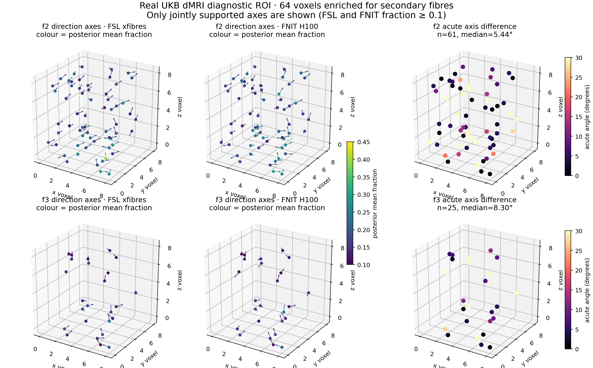

# TorchBEDPOSTX 验证

[`report.public.json`](report.public.json) 保存 gpucw1 上 FSL 与当前 TorchBEDPOSTX 的真实 UK Biobank dMRI 诊断裁剪结果，包括 CPU/GPU 时间、输出一致性、链稳定性、纤维支持控制、源码 hash 和 FSL `probtrackx2` 互操作检查。方法和边界见 [功能说明](../../docs/bedpostx/README.md)。

公开内容包括一例 UK Biobank 数据中 14 个弱纤维体素和 64 个 FSL 富集交叉纤维体素的汇总统计，以及 64 体素裁剪的去标识方向轴图。原始 DWI 和完整后验保留在授权服务器。

该图直接读取生成 [`report.public.json`](report.public.json) 所用的 FSL seed 8665904 与当前 FNIT H100 输出，没有重新拟合模型。图中 f2 的共同支持体素数与夹角中位数为 61 和 5.444097°，f3 为 25 和 8.299760°，与报告完全一致。报告绑定的当前数值核心 SHA-256 为 `87eedd3c10d1a393b499ca6c397aa22ea375f37afc2982fc8e2aa7f7414c80e0`；去除 PNG 元数据后的图像 SHA-256 为 `e233adab3703fc8eb4581a4cd8967debf735eca962674a1fdfd087b55ea95241`。

这 64 个体素按 FSL 后验图富集选择，用于检验真实交叉纤维区域，不代表无偏全脑精度；14 体素裁剪的 f2/f3 没有共同的分数 ≥0.1 支持。当前真实 benchmark 的结论只适用于报告中的诊断 ROI。[`synthetic_example.py`](../../docs/bedpostx/synthetic_example.py) 与 [`synthetic_example.png`](../../docs/bedpostx/synthetic_example.png) 只检验已知双交叉纤维信号。
