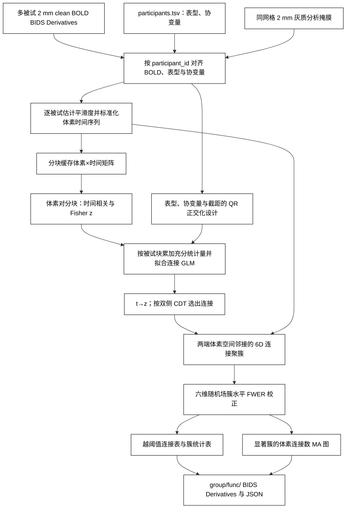
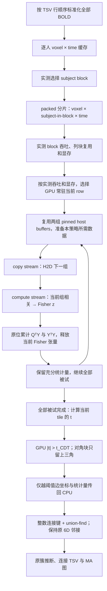

# 2026-10-05 README 历史归档

本页保留迁移前说明与历史证据，功能用法以[当前用户手册](../../docs/bwas/README.md)为准。迁移只整理文档，原始 benchmark、代码、影像和资源不变。

# BWAS：全脑体素连接的群体关联

[返回主页](../../README.md) · [验证代码](benchmark_abide.py)

`run_bwas` 接收已经完成预处理、位于 MNI152NLin6Asym 2 mm 空间的多被试 BOLD。它逐人计算体素对的时间相关并作 Fisher z 变换，再对每条连接拟合“表型 + 协变量 + 截距”的线性模型。高于连接定义阈值（CDT）的连接按两端体素的空间邻接关系聚簇，使用原版 BWAS 的六维高斯随机场公式计算簇水平 FWER p 值。运行时使用 PyTorch、NumPy、SciPy、Nibabel 和 Numba；Numba 用于精确连接聚类，已包含在主页 Conda 环境中。不调用原版 BWAS 或 FSL。

## 流程策略



## 输入与输出

输入目录是 BIDS Derivatives；每个 `participant_id` 必须恰好对应一份 `sub-*/[ses-*]/func/*_space-MNI152NLin6Asym_res-2_desc-clean_bold.nii.gz`。所有 BOLD 与 3D 分析掩膜必须有相同的 shape、affine 和 2 mm 体素。`participants.tsv` 的 `participant_id` 与 BIDS 目录名精确匹配，不依赖文件排序；表型和协变量必须是数值列，设计矩阵需满秩。不同被试的时间帧数可以不同。若有多个 site，把 site 编码为哑变量并省略一个参考 site。

```text
derivatives/fnit-volume/
├── dataset_description.json
├── sub-001/func/sub-001_task-rest_space-MNI152NLin6Asym_res-2_desc-clean_bold.nii.gz
└── sub-002/func/sub-002_task-rest_space-MNI152NLin6Asym_res-2_desc-clean_bold.nii.gz

participants.tsv: participant_id  case  age  sex  site_01  site_02  ...
graymatter_mask.nii.gz: 与 BOLD 同网格的 2 mm 灰质二值掩膜
```

`output_root` 使用 BIDS Derivatives 的数据集说明与 `group/func/` 布局；BWAS 组水平文件名是本工具的自定义扩展。以 `task-rest` 为例：

```text
derivatives/fnit-bwas/
├── dataset_description.json
└── group/func/
    ├── task-rest_space-MNI152NLin6Asym_res-2_desc-BWASedges_relmat.tsv.gz
    ├── task-rest_space-MNI152NLin6Asym_res-2_desc-BWASclusters_stat.tsv
    ├── task-rest_space-MNI152NLin6Asym_res-2_desc-BWASMA_statmap.nii.gz
    └── task-rest_space-MNI152NLin6Asym_res-2_desc-BWASMA_statmap.json
```

| 文件 / 返回值 | 内容与解读 |
|---|---|
| `result.edges`：`BWASedges_relmat.tsv.gz` | 每行一条 `|z| > CDT` 的无序体素对。`voxel1_i/j/k`、`voxel2_i/j/k` 是 NIfTI 体素坐标，可用掩膜 affine 换算成 MNI 毫米坐标；`cluster` 是从 1 开始的连接簇编号。`z` 是控制协变量后的**群体表型效应统计量**，不是某个人的功能连接 Fisher z。若 `case=1` 表示病例，正 z 表示病例的连接 Fisher z 较高，负 z 表示对照较高。此表包含所有越过 CDT 的边，包括未达到簇水平显著性的边。 |
| `result.clusters`：`BWASclusters_stat.tsv` | 每簇一行。`edges` 为簇内边数，`p_fwer` 为六维随机场校正后的簇水平 p 值，`p_uncorrected` 为未校正 p 值；`max_z` 是簇内带符号 z 的最大值，`region1_voxels`、`region2_voxels` 描述两端体素。通常以 `p_fwer < 0.05` 筛选显著簇。 |
| `result.ma_map`：`BWASMA_statmap.nii.gz` | 与输入掩膜同网格的 float32 3D NIfTI。每个体素值是其参与 `p_fwer < 0.05` 连接簇的边数，供定位和绘图；它不是逐体素 z 图，也不是体素×体素矩阵。若没有显著簇，全图为零。 |
| `result.metadata`：`BWASMA_statmap.json` | 记录被试 ID、设计列、阈值、FWHM、设备、分块、精度、耗时与显存峰值；包含被试标识，分享时应先核查。 |
| `dataset_description.json` | 记录生成软件和 BIDS Derivatives 基本信息。 |
| `plot_bwas_connectivity` 返回的 PNG（可选） | 多视角脑表面连接示意图。默认显示筛选后的少量体素对；`all_clusters=True` 则汇总并显示每个显著连接簇。PNG 是可视化，不是逐边统计数据或解剖纤维束。 |

`BWASResult` 另返回 `subjects`、`voxels` 和 `suprathreshold_edges` 三个计数。没有显著簇时，越阈值连接表和簇表仍保留，MA 图为零。

## Python 调用

```python
import csv
from pathlib import Path
from fnit import run_bwas

bids_root = Path("/data/derivatives/fnit-volume")  # 输入：含各被试 2 mm clean BOLD 的 BIDS Derivatives 根目录
participants_tsv = Path("/data/participants.tsv")  # 输入：participant_id、case、age、sex 与 site 哑变量
graymatter_mask = Path("/data/MNI152_2mm_graymatter_mask.nii.gz")  # 输入：与 BOLD 同网格的二值灰质掩膜
output_root = Path("/data/derivatives/fnit-bwas")  # 输出：不存在或为空的 BIDS Derivatives 目录

with participants_tsv.open(newline="") as stream:
    site_columns = tuple(name for name in csv.DictReader(stream, delimiter="\t").fieldnames
                         if name.startswith("site_"))  # 数值哑变量；已省略一个参考 site

result = run_bwas(
    bids_root=bids_root,
    participants_tsv=participants_tsv,
    mask_file=graymatter_mask,
    output_root=output_root,
    phenotype="case",  # 表型列；0/1 病例对照或连续数值
    covariates=("age", "sex", *site_columns),  # 数值协变量列，自动加截距
    cdt=5.0,  # 双侧 |z| 连接定义阈值；原版建议正式分析不低于 5
    block_size=4096,  # 本次全脑 benchmark 的最优已验证块宽
    subject_block_size=16,  # 缓存、传输和相关批次；GLM 保持 16 人归约
    column_tiles=2,  # 相邻两个 column tiles 共用 row 数据
    gpu_row_cache=True,  # 全部被试的当前 row 留在 GPU，后续列块复用
    num_workers=8,  # 并发读取、平滑度估计与时间序列标准化的被试数；占用更多主机内存
    cache_root=Path("/data/local-scratch"),  # 可选：本地临时盘；需容纳全部被试的标准化 BOLD
    device="cuda:0",  # PyTorch 设备；无 CUDA 时可用 "cpu"
    fwhm=None,  # 默认从所有输入 BOLD 估计平均空间平滑度；已知时可填体素单位的正数
    validate_direct_ols=False,  # 研究验证时可逐连接比较直接回归；会增加主机内存与耗时
)
print(result.edges, result.clusters, result.ma_map)
```

| 参数 | 含义 |
|---|---|
| `bids_root` | 输入 BIDS Derivatives 根目录，含 `dataset_description.json`。 |
| `participants_tsv` | 按 `participant_id` 列关联影像的 TSV；行顺序决定回归行顺序。 |
| `mask_file` | 2 mm MNI 分析掩膜，只检验非零体素间连接。 |
| `output_root` | 新建结果目录；不覆盖已有文件。 |
| `phenotype` | 欲检验的单个数值列名；系数对应模型第一列。 |
| `covariates` | 数值协变量列名元组；函数自动追加截距。多类别 site 需先转换为哑变量。 |
| `cdt` | 对双侧 z 值取绝对值的连接阈值，默认 `5.0`；原版建议正式全脑分析不低于 `5`。 |
| `block_size` | 每个体素轴的块宽。默认 `None`：CUDA 上以真实缓存测量候选块的吞吐和显存，选择最快的安全配置；CPU 上使用 `128`。显式整数固定块宽。 |
| `subject_block_size` | 每个缓存、H2D 和相关批次的被试数。默认 `None`：CUDA 上比较 8、16、32 人批次的实测耗时；CPU 上使用 `16`。小数据集的候选批次不超过实际人数。CUDA GLM 独立保持原来的 16 人累加顺序，避免传输批次变化影响靠近 CDT 的边。 |
| `column_tiles` | 同时累积的列块数，可选 `1` 或 `2`；默认 `None` 由 GPU pilot 选择。两个列块共用 row，但各有独立 GLM 充分统计量。 |
| `gpu_row_cache` | 默认 `None`，由实测吞吐和显存决定是否将全部被试的当前 row 常驻 GPU。`True` 固定开启，`False` 固定关闭。显式开启仍受 `17 GB` allocator 上限约束。 |
| `num_workers` | 读取、平滑度估计和标准化 BOLD 的并发 worker 数，默认 `1`；增大可缩短准备时间，但会增加主机内存和磁盘负载。 |
| `cache_root` | 可选临时缓存目录，默认使用 `output_root`。CUDA 路径先生成标准化逐人缓存，再合并为 voxel-major 分片，需同时容纳两种布局；分片内不同扫描长度用零补齐。运行结束自动清理临时缓存。建议使用本地高速盘。 |
| `device` | 默认 `cuda:0`。 |
| `fwhm` | 三轴共用的空间平滑度，单位为体素；默认从所有 BOLD 估计并至少取 `2`。 |
| `validate_direct_ols` | 默认关闭。开启后，对每个无序体素对比较被试分块与一次性直接回归的 z 值，并记录平均/最大误差及 CDT 判定分歧；额外主机内存上限约为 `8 × 被试数 × block_size²` 字节。 |

体素块和被试块共同限制显存。每块仅存当前被试组的 Fisher 连接和回归充分统计量 `QᵀY`、`YᵀY`；其中 `Q` 来自对表型和协变量的 QR 正交化，避免站点哑变量造成的病态矩阵逆。连接和群体回归保持现有普通 float32；本功能关闭 TF32，不使用 float16。没有减少体素、连接或被试，也没有低秩近似。
超过 512 人时，Linux 版本会把当前进程的文件描述符软上限提高到 `被试数+128`；若系统硬上限仍不足，会在计算前报错并说明所需数量。

单站点的命令行调用：

```bash
fnit-bwas --bids-root /data/derivatives/fnit-volume \
  --participants /data/participants.tsv \
  --mask /data/MNI152_2mm_graymatter_mask.nii.gz \
  --output-root /data/derivatives/fnit-bwas \
  --phenotype case --covariate age --covariate sex \
  --cdt 5 --block-size 4096 --subject-block-size 16 \
  --column-tiles 2 --gpu-row-cache --num-workers 8 \
  --cache-root /data/local-scratch --device cuda:0
```

多站点时为每个额外 site 列重复一次 `--covariate site_XX`。原版对应调用为：

```bash
python BWAS_main.py -toolbox_dir /path/to/BWAS \
  -image_dir /path/to/ordered_2mm_bold -output_dir /path/to/reference_output \
  -mask_file /path/to/graymatter_mask.nii.gz \
  -target_file /path/to/case.npy -cov_file /path/to/age_sex_site_dummies.npy \
  -CDT 5 -memory_limits 16 -ncore 8
```

原版按影像文件名排序读取 `target`/`covariates` 行；使用它作对照时必须先按相同排序生成 `.npy`。FNIT 的 TSV 通过 `participant_id` 显式关联。为了复现原版统计输出，FNIT 同样先以 `n-p` 估计 t 值，再以原版代码中的 `n-p-1` 自由度转成 z 值；这是与通常单一残差自由度写法不同的原版数值约定。

## 单 GPU 数据流与 profiling

CUDA 计算只使用 `device` 指定的一张卡。PyTorch allocator 上限设为十进制 `17 GB`，为 CUDA context 等开销留出空间。自动调优以实际吞吐选择块宽和同时处理的列块数，包含最长扫描所在的被试组；候选无法放入 allocator 时予以排除。调优和正式计算的 allocated/reserved 峰值都记录到 JSON。显式设置过大的块会报显存不足，应缩小块宽或被试批次。



分片保留 TSV 中的被试顺序和各人的真实扫描长度。补齐的零不进入相关系数的分母。Fisher 的截断约定、QR 设计矩阵、残差自由度、CDT、簇邻接和六维随机场公式沿用原实现。GPU threshold 用与原 t→z 变换等价的 t 阈值，仍由 SciPy 将选中的 t 转为原输出 z。

同一 row block 可以在一个被试组内供相邻的两个 column blocks 使用，读入和 H2D 一次后计算两个 tile。显存允许且实测吞吐更好时，调参器还可将全部被试的当前 row 留在 GPU，供后续所有 column blocks 复用。每个 tile 的 `QᵀY`、`YᵀY` 独立累积；CUDA 路径把任意传输批次分割或拼接为按原行顺序排列的 16 人 GLM 块，末块使用余下人数。这样保持原 GLM 的浮点归约顺序，不增加容差或修改 CDT。两套 host/GPU buffers 用 CUDA events 保护生命周期，避免下一批覆盖正在使用的数据。聚类以整数 `voxel1 × nvox + voxel2` 查找连接，并使用原版端点间 18 邻域及自身的组合；未增加角点邻接。

输出 JSON 额外记录：

| 字段 | 含义 |
|---|---|
| `VoxelBlockSize`、`SubjectBlockSize`、`ColumnTilesPerRowBatch` | 正式计算最终使用的块参数。 |
| `GLMSubjectBlockSize` | GLM 的实际归约人数；正式 CUDA 路径固定 `16`，独立于缓存及传输批次。 |
| `GPUResidentRowBlock` | 是否将全部被试的当前 row 保留在 GPU。 |
| `BlockTuning` | 预热后的两次实测 pilot 耗时及峰值显存；第二次反转候选顺序。voxel pilot 同时记录完整 row 加载耗时、按被试数估计的完整 tile 耗时和吞吐，用于选择参数。 |
| `StageSeconds.cache_read` | 主机从 packed memory maps 复制到 pinned buffers 的 wall time，包含可能发生的文件读取。 |
| `StageSeconds.h2d` | CUDA events 测量的传输时间。 |
| `StageSeconds.correlation` | CUDA events 测量的相关计算与原截断操作时间。 |
| `StageSeconds.fisher_glm` | Fisher 变换及充分统计量累积的 CUDA events 时间。 |
| `StageSeconds.threshold` | 计算 tile 的 t、筛选和选中边传回 CPU、转成 z 的 wall time。 |
| `StageSeconds.clustering` | 完整 6D 聚类及簇统计表计算时间，含首次 Numba 编译。 |
| `PackedCacheBuildSeconds` | 标准化逐人缓存合并成分片的额外准备时间。 |
| `ElapsedSeconds` | 整个函数的 wall time，包含 BIDS 检查、缓存准备、调优、计算、聚类和输出。 |
| `PeakCUDAAllocatedBytes`、`PeakCUDAReservedBytes` | 当前进程 PyTorch 峰值；GB 按 `10⁹` 字节换算。 |
| `RuntimeVersions` | NumPy、SciPy、PyTorch 与 CUDA 版本，供同环境数值对照。 |

CPU 准备、H2D 和 GPU 计算可重叠，因此各阶段耗时**不能相加当作总耗时**。CUDA context 和其他用户进程不计入 PyTorch allocator 数值；独立 benchmark 另检查本进程的驱动侧显存。CPU 路径及直接 OLS 验证路径保持原逐人布局；上述细分 GPU 时间针对正式 packed CUDA 路径。

将 `block_size`、`subject_block_size`、`column_tiles`、`gpu_row_cache` 均设为 `None`，可重新测量本机的安全配置；CLI 中省略相应四个参数即可。pilot 预热后测量两次，并反转第二次候选顺序。调参不会减少正式分析的被试、体素或连接。

## 绘制灰质体素连接

`plot_bwas_connectivity` 读取 `run_bwas` 的连接表、簇表和 MA 图。`all_clusters=True` 时，它扫描**全部显著簇内连接**，从每个簇按固定随机种子抽取真实体素对；显示额度按簇内边数的平方根分配，因此大簇显示更多线，同时每个簇至少保留一条。每条线的两端仍是原始体素的 MNI 坐标，只在中段向该簇全部连接的平均路径靠拢。同一簇的正负 z 分开集束。黄色点是真实体素端点；弯线表示**群体 FC 统计连接**，不代表解剖纤维。`voxel_edge_budget` 控制整张图的线数，默认 600；所有显著簇都会出现，但图中并未逐条画出全部连接。默认单边模式仍可用 `top_k` 选择强连接。

建议同时提供**同网格的全脑掩膜与带脑沟的解剖参考网格**。`brain_mask_file` 使用与 BOLD 同空间、同网格的 2 mm 全脑二值 NIfTI，例如 [FSL 标准模板](https://git.fmrib.ox.ac.uk/fsl/data_standard)中的 `MNI152_T1_2mm_brain_mask.nii.gz`。它与分析灰质掩膜取并集形成外轮廓，保留有效分析体素，并逐视角检查端点覆盖。仅提供掩膜时，显示其轻度平滑后的表面；未提供全脑掩膜或参考网格时，只显示分析灰质范围。

`brain_surface_file` 和 `cerebellum_surface_file` 可读取 [BrainNet Viewer `.nv` 网格](https://github.com/mingruixia/BrainNet-Viewer/tree/master/Data/SurfTemplate)，呈现清晰的脑沟与小脑，须使用与影像一致的 MNI 毫米坐标。与全脑掩膜合用时，参考网格沿用浅灰配色 `#aeb3b5` 和原来的光照，外轮廓的不透明度为 `surface_opacity × 0.15`；解剖细节来自参考网格，端点覆盖检查使用同网格的外轮廓。两者有局部形状差异，因此参考网格用于解剖定位，不代表每个分析体素的精确皮层表面。仅使用外置网格时，它必须覆盖各视角的全部显示端点，否则报错并提示补充 `brain_mask_file`。

模板和网格须从原作者获取，不随 FNIT 分发。函数不自动配准、移动或删除端点；点标记半径为 `0.25–0.50 mm`，随 MA 增大。运行时只用 Nibabel、PyVista/VTK 读取和绘图，不调用 FSL、MATLAB、BrainNet Viewer 或 BrainGL。正 z 为红色，负 z 为蓝色，采用 [FSLeyes 的红蓝配色名称](https://github.com/pauldmccarthy/fsleyes/blob/main/fsleyes/assets/colourmaps/order.txt)所对应的视觉约定。

主页的 `environment.yml` 已包含 PyVista/VTK；单独安装可用 `pip install '.[bwas-visualization]'`。绘图无需 CUDA 计算，但 VTK 需要 OpenGL；无界面服务器可使用 EGL 或 OSMesa。

原 BrainNet Viewer 的对应 MATLAB 调用是 `BrainNet_MapCfg('BrainMesh_ICBM152.nv','nodes.node','edges.edge','Cfg.mat')`，需先生成节点和邻接矩阵文件。FNIT 的 Python 函数直接读取 BWAS 输出 TSV，不调用该程序。

```python
from pathlib import Path
from fnit.bwas import plot_bwas_connectivity

bwas_output_root = Path("/data/derivatives/fnit-bwas")  # 已完成的 run_bwas 输出根目录
gray_matter_mask_file = Path("/data/MNI152_2mm_graymatter_mask.nii.gz")  # 与统计结果同网格的输入灰质掩膜
brain_mask_file = Path("/data/templates/MNI152_T1_2mm_brain_mask.nii.gz")  # 与分析掩膜同 shape、affine 的全脑二值掩膜，包含小脑
brain_surface_file = Path("/data/templates/BrainMesh_ICBM152.nv")  # BrainNet 原作者提供的 MNI 解剖参考网格
cerebellum_surface_file = Path("/data/templates/BrainMesh_Cerebellum.nv")  # 同空间的小脑参考网格
output_png = (bwas_output_root / "group" / "figures" /
              "task-rest_space-MNI152NLin6Asym_desc-BWASvoxelBundles_figure.png")  # 新图像路径

figure_path = plot_bwas_connectivity(
    bwas_output_root=bwas_output_root,  # 自动寻找该目录中唯一一组 BWAS 结果文件
    gray_matter_mask_file=gray_matter_mask_file,  # 2 mm 体素坐标参考；须与 MA 图同网格
    output_png=output_png,  # 写出 PNG；已存在时不覆盖
    cluster_p_max=0.05,  # 只显示簇水平 FWER p < 0.05 的连接
    all_clusters=True,  # 所有显著簇都显示真实体素级连接
    voxel_edge_budget=600,  # 全图显示 600 条体素对；大簇按比例显示更多
    bundle_strength=0.95,  # 仅使每条线中段靠近本簇平均路径，两端保持原坐标
    brain_mask_file=brain_mask_file,  # 同网格外轮廓；保证有效端点的显示覆盖
    brain_surface_file=brain_surface_file,  # 保留清晰脑沟与原来的浅灰轮廓风格
    cerebellum_surface_file=cerebellum_surface_file,  # 叠加清晰的小脑解剖参考
    surface_opacity=0.10,  # 解剖网格不透明度；此时外轮廓为 0.015
    colorbar_max_abs_z=8.0,  # 红蓝色条范围固定为 -8 到 +8；None 使用数据范围
    show_colorbar=True,  # 是否显示 signed z 色条
    view="signed_six",  # 一张六联图：上排正 z、下排负 z；每排左/俯/右视
)
print(figure_path)
```

| 绘图参数 | 含义 |
|---|---|
| `bwas_output_root` | 已完成的单组 BWAS 输出根目录。 |
| `gray_matter_mask_file` | 与 MA 图相同 shape、affine 的 2 mm 灰质掩膜，提供体素坐标。 |
| `output_png` | 新 PNG 文件路径，已存在时不覆盖。 |
| `cluster_p_max` | 簇水平 FWER p 的严格上限，取 `(0, 1]`，默认 `0.05`。 |
| `all_clusters` | 默认 `False`；开启后从每个显著簇按比例抽取真实体素对并集束，忽略 `top_k`。 |
| `voxel_edge_budget` | 全簇模式的总显示线数，默认 `600`；须不小于显著簇及 z 符号组数，较大值会增加遮挡。 |
| `brain_mask_file` | 推荐提供同网格的全脑二值 NIfTI 掩膜；与分析灰质掩膜取并集形成显示轮廓。默认 `None`；与外置网格合用时，提供很淡的完整外轮廓并用于端点覆盖检查。 |
| `brain_surface_file` | 可选 BrainNet Viewer `.nv` 解剖参考网格，须使用影像的 MNI 毫米坐标；可与全脑掩膜叠加显示脑沟。仅使用网格时须覆盖全部端点。 |
| `cerebellum_surface_file` | 可选同空间的小脑 `.nv`，增加解剖细节；全脑掩膜本身已包含小脑范围。 |
| `surface_opacity` | 灰色脑表面不透明度，取 `[0, 1]`；默认外置网格 `0.23`、仅掩膜表面 `0.12`；叠加时外轮廓为此值的 `15%`。 |
| `colorbar_max_abs_z` | 可选正数；将红蓝色条设为对称的 `[-值, +值]`，超过范围的 z 在端色饱和；默认按图中 z 自动取值。 |
| `show_colorbar` | 默认 `True`，控制是否显示 signed z 色条。 |
| `view` | `montage` 四联图；`six` 为六个独立方向；`signed_six` 为正负分行、每行左/俯/右视，仅与 `all_clusters=True` 联用；也可取 `left`、`right`、`superior`、`inferior`、`anterior`、`posterior`、`oblique` 单视角。 |
| `top_k` | 默认 `500`，单边模式最多显示的 `|z|` 最高边数；全簇模式不使用。 |
| `cluster_id` | 单边模式可指定一个已显著的正整数簇编号；默认 `None`。不能与 `all_clusters=True` 合用。 |
| `min_abs_z` | 单边模式可附加非负的 `|z|` 下限；默认 `None`。不能与全簇模式合用。 |
| `bundle_strength` | 集束弯曲程度，取 `[0, 1]`，不改变体素端点；默认单边模式 `0`、全簇模式 `0.85`，显式传 `0` 可关闭集束。 |

下图来自 ABIDE I+II 的 1748 人全脑结果。`p_fwer < 0.05` 的 **60 个显著 FC 簇**共含 **1,154,192 条连接**；图中按比例显示 600 条真实体素对连接，其中最小簇 3 条、最大簇 62 条。正负结果分行，线条在本簇内集束；黄色点保留各条线的真实体素端点。红色表示病例组连接 Fisher z 较高，蓝色表示较低。带脑沟的浅灰表面为解剖参考，很淡的外层表面来自同空间全脑掩膜。图中没有个体影像、逐边矩阵或被试标识。


[同一批体素级连接的六个独立视角：左、俯、右、后、仰、前](../../docs/bwas/figures/abide_voxel_bundles_mni_mask_six.png)。两张图使用 `bundle_strength=0.95`、`surface_opacity=0.10`，保留原版网格的脑沟和红蓝配色；外轮廓不透明度为 `0.015`。参考脑掩膜 SHA-256 为 `b71a9f2015bd10262c37e51b4d17a655d0eb0a0dec4ba48322fb5af55c86b97c`；它与分析掩膜同网格，并集额外保留 142 个有效分析体素。

[真实端点与轮廓覆盖检查](surface_outline.json)使用 1097 个不同端点。检查图为 1200×1200 的实心表面投影；正式图为 2700×1800。端点位移为 `0 mm`；最近端点到全脑外轮廓的距离为 `1.08 mm`，大于点标记的最大半径 `0.50 mm`。仅使用旧网格会被覆盖检查拒绝；与同网格外轮廓叠加后，原网格的形状保留。PyVista 0.49 / VTK 9.7.1 在共享 H100 服务器上通过 EGL 渲染；正负分行六联图耗时 `14.54 s`，六方向图耗时 `13.80 s`，均含结果表读取、表面生成、覆盖检查与 PNG 写出。

| 超出显示轮廓的端点中心 | 仅原 BrainNet 网格 | 全脑外轮廓 + 解剖参考 |
|---|---:|---:|
| 侧视 | 5 | 0 |
| 俯视 | 97 | 0 |
| 前视 | 90 | 0 |

## ABIDE 真实数据 benchmark

32 人检查使用 ABIDE II 同一站点的真实预处理 BOLD（16 病例、16 对照），插值到 2 mm 后取 512 个灰质体素；`CDT=3` 只用于核对越阈值边与聚簇。全脑实验使用 ABIDE I+II 的 1778 份预处理 BOLD 与官方表型表。以本地 FSL 2 mm 灰质概率图 `>0.5` 定义初始 128,190 体素掩膜；该模板不随 FNIT 分发。预先固定每人至少 120,000 个有效灰质体素的质量标准后，保留 1748 人（792 病例、956 对照）和共同的 112,215 个灰质体素。模型包含年龄、性别、35 个站点哑变量和截距，正式连接阈值为 `CDT=5`。[BIDS 准备](prepare_abide.py)、[全量运行](run_abide_full.py)与[原版对照](benchmark_full_seed.py)脚本提供复核步骤。

| float32 精度检查 | 对照范围 | z 值 MAE / 最大差 | 阈值与簇 |
|---|---:|---:|---|
| [FNIT 对原版，32 人](abide32_summary.json) | 130,816 条无序体素对 | `3.70×10⁻⁶` / `7.75×10⁻⁵` | CDT 3 判定分歧 0；双方均有 777 条边、40 个同大小连接簇。 |
| [FNIT 对原版，1748 人](abide_full_seed_fp32_summary.json) | 两枚 seed→全灰质，共 224,428 条 | `3.34×10⁻⁶` / `3.78×10⁻⁵` | CDT 3：双方均 1850 条边、分歧 0；CDT 5：双方均 0 条边。 |
| [16 人分块对一次性回归](abide_full_seed_direct_fp32_summary.json) | 同上，共 224,428 条 | `5.64×10⁻⁷` / `2.43×10⁻⁵` | CDT 3/5 判定分歧均为 0。 |

| 速度与资源 | 原版 CPU | FNIT | 计时范围 |
|---|---:|---:|---|
| 32 人、512 体素 | `1.05 s` | `1.79 s` | 原版仅核心计算；FNIT 一次 `run_bwas` 含 BIDS 读写、平滑度、聚类和输出。 |
| 1748 人、两枚 seed→全灰质 | 核心 `354.12 s`；另有缓存布局转换 `320.13 s` | GPU 核心 `302.35 s` | 从预先准备的缓存计算相关、回归和 z 值；共享服务器上的一次观测。 |
| 1748 人、112,215 体素全对全 | 未运行原版全对全对照 | `3828.74 s`；CUDA 峰值已分配 `11.66 GB` | `run_bwas` 含连接、回归、聚类、结果写出；不含 BIDS 读取及缓存准备。 |

全对全 FNIT 运行计算了 `6,296,047,005` 条无序体素对，得到 `1,235,519` 条越过 CDT 5 的连接、`5,133` 个连接簇；MA 图有 `31,359` 个非零体素。见[全量汇总](abide_full_summary.json)和[输出文件验收](abide_full_artifact_check.json)。原版 CPU 逐值比较覆盖两枚 seed 到全灰质，未覆盖全部 62.96 亿条连接；上述耗时的计时范围不同，不应直接计算端到端加速比。实验不上传个体影像、表型行或连接矩阵。

### 当前推荐的单 GPU 策略

目前完整全脑实验中耗时最低的配置为 **4096 体素块、16 人 I/O 批次、两个 column tiles、GPU row 常驻**。正式实现使用 packed voxel-major 缓存、持久 pinned/GPU buffers、copy stream、流式 Fisher/GLM、GPU threshold 和整数键聚类。保持普通 float32、`TF32=False` 和原统计定义。

[完整结果](single_gpu/full-row-v4.json)与[独立驱动显存记录](single_gpu/full-row-driver-memory.json)覆盖全部 `6,296,047,005` 条无序体素对：

| 完整全脑计算 | 原 FNIT 记录 | 最优已验证配置 |
|---|---:|---:|
| 时间，含连接、GLM、聚类和写出 | 3828.74 s | **2452.32 s** |
| PyTorch 峰值 allocated / reserved | 11.66 GB / 未记录 | 15.11 / 15.12 GB |
| 本进程驱动侧显存峰值 | 未记录 | **17.09 GB** |
| CDT 5 连接数 | 1,235,519 | 1,235,519；端点坐标与判定一致 |
| z 平均 / 最大绝对差 | 参考 | `4.39×10⁻⁹` / `3.99×10⁻⁶` |
| 簇分区、大小、p 值与端点数量 | 参考 | 完全一致 |
| MA 图值与 affine | 参考 | 逐值一致 |

这是共享 H100 PCIe 上的实际观测，耗时比原记录减少约 `36%`，落在 `1500–2500 s` 目标内。它使用已标准化并已合并的缓存；首次生成 `packed-b16` 另需约 `835.65 s`、`165.45 GB`，不能省略首次准备成本。不同 voxel block 沿用原 tile 遍历和簇编号规则，文件行顺序及同大小簇的编号可能改变；统计对照按端点坐标和簇分区匹配。

自动入口也已通过[完整全脑验收](single_gpu/automatic-canonical.json)：本次选择 4096/32、单列、row 常驻，GLM 仍为 16 人。包含调参的时间为 `2607.34 s`，allocated/reserved 为 `16.96/16.99 GB`，[驱动显存峰值](single_gpu/automatic-canonical-driver.json)为 `18.94 GB`，CDT、簇统计和 MA 一致。该次未达到 2500 s；共享服务器上这些单次结果不能证明某个被试批次在所有负载下都更快。

### 瓶颈与数值保护

初始真实 `5120 × 5120` tile、全部 1748 人的 profile 为 `29.52 s`：缓存准备 `15.48 s`、pin memory `0.99 s`、H2D `0.63 s`、相关 `4.96 s`、Fisher/GLM `5.87 s`。因此优化重点是数据准备、复用和充分统计量。最优完整运行的阶段时间如下；传输与计算可重叠，**不能将各行相加**。

| 阶段 | 最优完整运行 |
|---|---:|
| cache/read | 762.15 s |
| H2D | 48.16 s |
| correlation | 1136.42 s |
| Fisher/GLM | 778.56 s |
| threshold | 11.38 s |
| clustering | 14.80 s |

对同一完整越阈值边集合，旧聚类约 `197.53 s`，整数键 union-find 约 `14.56 s`，簇标签逐值一致。原 6D 邻接保留端点 18 邻域及自身的组合，排除 3D 角点。

传输批次与 GLM 归约批次必须分开。此前直接按 32 人归约会改变 8 条临界边；正式 CUDA 路径按原顺序组装 16 人 GLM 块，末块处理剩余被试。[真实 8 个完整 tile 的诊断](single_gpu/canonical-glm-tiles.json)使用全部 1748 人，对 8/16/32 人 I/O 批次得到相同 CDT 边，全部 `67,062` 个选中 z 值逐值一致；自动入口的完整全脑验收确认修复有效。

已完成的串行消融也说明不能只改块大小：[本轮基线](single_gpu/ablation-baseline.json)为 `4472.99 s`，[流式 Fisher/GLM](single_gpu/ablation-streaming-glm.json)为 `4106.24 s`；[4096/32 用于原缓存](single_gpu/ablation-block-tuning.json)反而为 `5376.88 s`，主要增加主机数组准备开销。该原缓存策略没有被采用为正式优化路径。剩余消融按用户要求停止，未发布未完成阶段的结果。

### 复核完整结果

[`benchmark_optimized_full.py`](benchmark_optimized_full.py)运行全部无序体素对，读取固定参考结果的相同表型、协变量、CDT 和 FWHM，比较 CDT 边、z、簇分区、簇大小、p 值、端点数量及 MA 图；[`monitor_gpu_process.py`](monitor_gpu_process.py)另检查本进程驱动显存，达到十进制 `20 GB` 或观测到超过一张 GPU时停止验证。正式入口设置 `17 GB` allocator 上限，独立监测为 benchmark 验收证据。

```bash
repository_root=/path/to/Fudan-Neuroimaging-toolkit  # 本仓库根目录
bids_root=/data/derivatives/fnit-volume  # 全部真实被试的 BIDS Derivatives BOLD
participants_tsv=/data/participants.tsv  # 固定行顺序及表型、协变量
analysis_mask=/data/graymatter_mask.nii.gz  # 固定的全脑分析掩膜
normalized_cache=/data/local-scratch/bwas-normalized  # 同 TSV 顺序的 subject-N.npy，voxel × time
packed_cache=/data/local-scratch/bwas-packed16  # 同输入的 voxel-major 分片
reference_root=/data/benchmark/bwas-reference  # 原 FNIT 的完整输出目录
candidate_root=/data/benchmark/bwas-optimized  # 新建私有结果目录
subject_count=1748  # 本例 TSV 中的真实被试数
summary_json=/data/benchmark/bwas-summary.json  # 对外仅分享核查后的汇总指标
memory_json=/data/benchmark/bwas-memory.json  # 本进程驱动显存汇总

PYTHONPATH="$repository_root/src" python "$repository_root/validation/bwas/pack_cache.py" \
  --source-dir "$normalized_cache" --packed-dir "$packed_cache" \
  --subjects "$subject_count" --subject-block-size 16
CUDA_VISIBLE_DEVICES=0 PYTHONPATH="$repository_root/src" python \
  "$repository_root/validation/bwas/monitor_gpu_process.py" --output-json "$memory_json" -- \
  python "$repository_root/validation/bwas/benchmark_optimized_full.py" \
  --bids-root "$bids_root" --participants "$participants_tsv" --mask "$analysis_mask" \
  --cache-dir "$normalized_cache" --packed-cache-dir "$packed_cache" \
  --baseline-root "$reference_root" --output-root "$candidate_root" --summary "$summary_json" \
  --block-size 4096 --subject-block-size 16 --column-tiles 2 --gpu-row-cache
```

正式数值验收统一使用 NumPy `1.26.4`、SciPy `1.17.1`、PyTorch `2.5.1`、CUDA `11.8`；尤其保持参考与候选的 SciPy 相同，保留原 `t.cdf → norm.ppf`。结果目录含被试标识和连接表，应放在私有存储；仓库仅保存汇总 JSON。

[回归检查记录](single_gpu/regression.json)：最终 BWAS 单 GPU 测试 `6 passed`；合入最新 main 并补齐其声明依赖后，全仓库 `1017 passed / 76 skipped / 1 failed`。唯一失败是原有 GEMS 的 `surfa` 导入静态检查；该代码和检查与基线相同。全仓库测试尚未全部通过。

## 来源

- [原版 weikanggong/BWAS](https://github.com/weikanggong/BWAS) 的 [BWAS_cpu.py](https://github.com/weikanggong/BWAS/blob/master/BWAS_cpu.py) 与 [BWAS_main.py](https://github.com/weikanggong/BWAS/blob/master/BWAS_main.py)（Python 源文件头标注 Apache 2.0；参考源码 SHA-256 `1b78a98efb04ae5c1b764b101ec434ed8c8277f815481ae0ca940ebd910323c2`）。原版背景影像 `braingl_bg.nii.gz` 没有随这项源码授权，不纳入 FNIT。
- Gong W, et al. [Statistical testing and power analysis for brain-wide association study](https://doi.org/10.1016/j.media.2018.03.014). *Medical Image Analysis* 47 (2018): 15–30.
- [BrainGL 源码](https://github.com/rschurade/braingl)与 [Connexel visualization 论文](https://doi.org/10.3389/fnins.2014.00015)：用于区分统计簇与显示线集束；FNIT 未纳入其运行时或逐行移植集束算法。
- [BrainNet Viewer 官方源码与 ICBM152 表面](https://github.com/mingruixia/BrainNet-Viewer)、[Xia 等的工具论文](https://doi.org/10.1371/journal.pone.0068910)：提供外置网格格式与多视角展示参考；FNIT 未复制其 MATLAB 绘图代码，也不分发网格。
- [PyVista](https://docs.pyvista.org/) 和 [VTK](https://vtk.org/) 官方文档：灰质等值面、多视角离屏渲染与三维连线。
- [ABIDE II 表型变量释义](https://fcon_1000.projects.nitrc.org/indi/abide/ABIDEII_Data_Legend.pdf)。
- [ABIDE I 官方表型表](https://s3.amazonaws.com/fcp-indi/data/Projects/ABIDE_Initiative/Phenotypic_V1_0b_preprocessed1.csv)和[ABIDE II 官方表型表](https://fcon_1000.projects.nitrc.org/indi/abide2/release/phenotypic_data/ABIDEII_Composite_Phenotypic.csv)。
