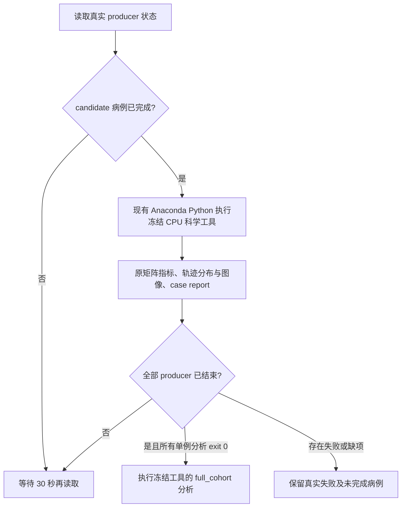

# CPU 矩阵与轨迹报告：v2 部署修复实测

## 1. 功能简介

本页保留 v2 首次恢复 CON01 报告时的实际快照。CON03 随后触发可选基线计时状态问题，控制器已由 [v3](../cpu_matrix_deployment_v3/README.md) 替代；下面的 PID 和运行状态均属于 v2 记录。

2026-10-03，nodecw10 的 v1 只读报告控制器使用 FNIT GPU Python；CON01 在绘图处报 `ModuleNotFoundError: No module named 'matplotlib'`。本次将**分析进程**切换到已安装完整报告依赖的 Anaconda Python，另建 `root_matrix_analysis_v2`。生产 GPU 进程、科学比较工具、冻结配置和包环境未修改。

v1 PID 163744 的实际命令和属主核对后，仅对此控制器发送 SIGTERM；其脚本、状态、失败报告与日志保留。v2 在 nodecw10 后台运行，启动 PID 为 **3130**。



## 2. Python 调用、输入与输出

这是本轮私有部署控制器，无库函数接口。以下展示实际 Python 调用方式；现有 v2 已在运行，复现时须使用尚不存在的输出目录，不能重复启动当前 v2。

```python
import subprocess

analysis_python = "/cwStorage/home/gongwk/anaconda3/bin/python3.11"  # 现有报告环境
controller_script = "/cwStorage/home/gongwk/Notebook_code/fnit_connectome_accuracy_20261003_v1/run_cpu_matrix_analysis_v2.py"  # 固定本轮控制器
subprocess.run([analysis_python, controller_script], check=True)  # 等待真实病例并生成报告
```

- 输入：冻结 `accuracy_configuration.json`；其 `run_root/status.json` 中真实完成的 candidate；同一次运行导出的矩阵、TCK 与轨迹指标；冻结清单绑定的官方五 seed 结果。没有新增追踪或采样。
- 输出：新目录 `root_matrix_analysis_v2` 下的控制器 `status.json`、`deployment_provenance.json`、单例日志与 `sub-CON01/report.json`；科学工具的病例产物位于 `sub-CON01/sub-CON01/`。
- 全队列输出：只有实际 producer 全部结束且各单例分析成功后，才执行 `full_cohort`。提交时仍等待其他病例，CON01 不代表全队列验收。
- 运行设置：`CUDA_VISIBLE_DEVICES=''`、`MPLBACKEND=Agg`、OMP/OpenBLAS/MKL/NumExpr 各 8 线程；Matplotlib 缓存位于新的 `root_matrix_analysis_v2/matplotlib_config`。
- 控制器无命令行参数；路径、解释器和两项冻结 SHA 均在源码中显式声明。每次分析前后核对科学工具及配置 SHA，变化时报错。

## 3. 命令行调用

实际控制器命令如下，启动收据见 [v2 launch receipt](cpu_matrix_controller_v2_launch_receipt.json)。

```bash
CUDA_VISIBLE_DEVICES='' /cwStorage/home/gongwk/anaconda3/bin/python3.11 \
  /cwStorage/home/gongwk/Notebook_code/fnit_connectome_accuracy_20261003_v1/run_cpu_matrix_analysis_v2.py
```

CON01 实际分析命令的完整 argv 保留在 [status 快照](status.json) 中。科学工具参数仍为 `--configuration`（原冻结配置）、`--output-dir`（新的单例输出目录）、`--case-id sub-CON01`（真实完成病例）。未修改配置中的 `gpu_python`。

## 4. 原软件调用与映射

本控制器是 FNIT 验证部署工具，没有对应的原软件命令。它读取已完成且有清单绑定的官方五 seed benchmark 产物；矩阵和轨迹科学比较仍执行原冻结工具。官方链映射及独立 benchmark 范围见 [本轮精度说明](../../../../docs/connectome/ACCURACY_OPTIMIZATION_20261003.md)。

## 5. 最新实测：部署完成与科学判定

现有解释器实际版本为 Python **3.11.7**、nibabel **5.4.0**、NumPy **1.26.4**、SciPy **1.11.4**、Matplotlib **3.8.0**，见 [部署 provenance](deployment_provenance.json)。未安装或升级包。

CON01 分析开始于 `2026-10-03T07:41:13.894563+00:00`，结束于 `07:41:21.804631+00:00`；工具内 CPU 分析 **7.916934 s**，控制器所计子进程 **8.813560 s**，返回码 0。v1 子进程 7.314633 s 后失败，两者不能构成科学流程提速比较。

实际输出 14,431 条轨迹。矩阵 **187 通过、53 失败，共 240 项**；轨迹分布 **13 通过、12 失败，共 25 项**。两类科学状态均为 `failed`；`analysis_completed` 仅表示 CPU 报告已执行完成。FNIT 自重复性仍为 `not_assessed`，因为只有一个实际 candidate seed。

下表每格为通过数/5，直接计数原 `comparison_accepted`，未重算指标或改变门槛。

| Atlas | Count L1 | FBC L1 | Support Dice | Pearson | Length MAE | FA MAE | 合计 |
| --- | ---: | ---: | ---: | ---: | ---: | ---: | ---: |
| aparc+tian-s1 | 5/5 | 2/5 | 4/5 | 5/5 | 5/5 | 5/5 | 26/30 |
| aparc.a2009s+tian-s1 | 3/5 | 5/5 | 5/5 | 4/5 | 5/5 | 3/5 | 25/30 |
| fs-aparc | 4/5 | 1/5 | 5/5 | 5/5 | 5/5 | 5/5 | 25/30 |
| glasser+tian-s1 | 1/5 | 5/5 | 5/5 | 3/5 | 5/5 | 2/5 | 21/30 |
| glasser+tian-s4 | 3/5 | 5/5 | 5/5 | 4/5 | 4/5 | 3/5 | 24/30 |
| schaefer1000+tian-s4 | 0/5 | 2/5 | 0/5 | 0/5 | 4/5 | 5/5 | 11/30 |
| schaefer200+tian-s1 | 5/5 | 5/5 | 5/5 | 5/5 | 5/5 | 5/5 | 30/30 |
| schaefer500+tian-s4 | 4/5 | 4/5 | 4/5 | 4/5 | 5/5 | 4/5 | 25/30 |

六字段完整变量名依次为 `count_relative_l1`、`sift2_fbc_relative_l1`、`count_support_dice`、`count_pearson`、`mean_length_common_normalized_mae`、`mean_fa_common_normalized_mae`。逐项原值、门槛与所有失败项见 [matrix_envelope.json](sub-CON01/matrix_envelope.json)；计数结构见 [matrix_decision_counts.json](sub-CON01/matrix_decision_counts.json)。

[原 case report](sub-CON01/report.json)、[原 population_envelope.json](sub-CON01/population_envelope.json) 与图像均按原字节保存。正式 rawCLI 时间和三种显存原值保留在 case report，此环境修复没有重新执行 GPU benchmark。


## 6. 版本与失败记录

| 项目 | 实际记录 |
| --- | --- |
| v1 控制器 | SHA `24dca0c719a72f9479fffce2ba65646311844d0ea9e15309b0df644f354e834b`，[原脚本](v1_failure/run_cpu_matrix_analysis.py) |
| v1 失败 | [原 report](v1_failure/report.json)、[原 log](v1_failure/sub-CON01.log)、[原 status](v1_failure/status.json)，缺失 matplotlib |
| 仅停止 v1 PID 163744 | [精确命令、SIGTERM 与文件哈希收据](cpu_matrix_controller_v1_stop_receipt.json) |
| v2 控制器 | SHA `b23cb86c4570f9c4587cf42f30f4025ca732386ed89b897414db803d8620a814`，[实测源码](run_cpu_matrix_analysis_v2.py) |
| 原科学工具 | SHA `02f5e22f91f423f17d8d0ee429e0a702c0ac6a64baa8e76b06238e3c297cf446` |
| 原冻结配置 | SHA `f8eba1cbf3eab2baa549172b32be2c9d3b1014ad478f6e3702d7987378f52f8c` |

[v2 实际绑定收据](cpu_matrix_controller_v2_binding_receipt.json) 核对 v1 原文件未变、v2 实际进程命令、原科学工具与配置 SHA；[CON01 status 快照](status.json) 保留分析前后绑定。此提交只包含部署控制器及其证据，未改 production 或正在执行的冻结来源。

## 7. 工具、依据与后续入口

- [冻结科学分析工具的仓库来源](../../../../tools/analyze_connectome_accuracy_cohort.py)：决定矩阵与轨迹比较、实际 producer 绑定和报告结构。
- [矩阵比较工具](../../../../tools/benchmark_connectome_raw_cohort_envelope.py) 与 [轨迹分布比较工具](../../../../tools/benchmark_connectome_tracking_population.py)：原比较定义保持。
- [本轮总说明](../../../../docs/connectome/ACCURACY_OPTIMIZATION_20261003.md)：raw12 运行、官方映射、最终 cohort 精度与耗时验收由 root 汇总。本记录只证明 CON01 的 CPU 报告部署恢复。
