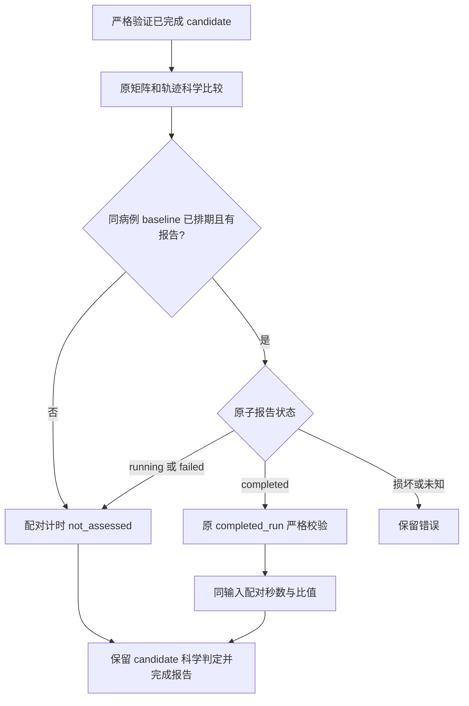

# CPU 精度报告 v3：可选 baseline 配对计时修复

## 1. 功能简介

2026-10-03，v2 已完成 CON03 的 candidate 矩阵与轨迹比较，却在可选计时分支失败：baseline GPU 报告已创建、状态仍为 `running`，原代码仅判断报告文件存在，立即读取尚未生成的 `raw_bids_wall.json`。真实错误是 `FileNotFoundError`，见 [v2 原失败报告](v2_failure/report.json) 和 [原日志](v2_failure/sub-CON03.log)。

公共工具只新增 `optional_baseline_timing` 并替换原可选计时分支。candidate 完成检查、`completed_run`、矩阵与轨迹指标及原门槛未改。未排期、未开始、运行中、失败的 baseline 均返回 `baseline_timing_status='not_assessed'`；只有同病例已完成 baseline 才经过原严格检查后计算配对时间。损坏 JSON、未知状态及已完成报告的校验错误继续报错。



只停了核对精确命令后的 nodecw10 CPU 控制器 PID 3130。原 v2 全部文件保留；新控制器 PID **41614** 使用独立 `root_matrix_analysis_v3` 与 `private_cpu_tools_v3`。正在运行的 GPU phase、其他 component controller、冻结目录和配置未修改。

## 2. Python 调用、输入与输出

```python
import json
from pathlib import Path
from tools import analyze_connectome_accuracy_cohort as analysis

configuration_path = Path("/cwStorage/home/gongwk/Notebook_code/fnit_connectome_accuracy_20261003_v1/formal_frozen_v1/accuracy_configuration.json")
configuration = json.loads(configuration_path.read_bytes())  # 本轮原冻结配置
raw_manifest = analysis.driver.bound(configuration["raw_manifest"])  # 校验原清单 SHA
input_bindings = analysis.driver.bound(configuration["input_bindings"])  # 校验输入绑定
planned_cases = analysis.driver.validate_plan(configuration, raw_manifest, input_bindings)
case_configuration = planned_cases["sub-CON03"]  # 使用同一病例完整计划
anatomy_directory = input_bindings["cases"]["sub-CON03"]["anatomy"]["directory"]  # 原完成解剖结果
candidate_report, _, _ = analysis.completed_run(configuration, case_configuration, "candidate", anatomy_directory)
timing_result = analysis.optional_baseline_timing(
    config=configuration, case=case_configuration, anatomy_directory=anatomy_directory,
    candidate_seconds=candidate_report["raw_dwi_cli_total_runtime_seconds"],  # 真实 candidate CLI 墙钟，秒
)
```

四个参数：`config` 是原配置字典，含 `execution_order` 和 `run_root`；`case` 是同病例完整计划；`anatomy_directory` 是该病例解剖目录，在已完成 baseline 校验中使用；`candidate_seconds` 是真实已完成 candidate CLI 墙钟，单位秒。没有新增追踪、seed、矩阵计算或精度参数。

输出是计时字典：`baseline_scope` 保留原范围语义；`baseline_timing_status` 为 `not_assessed` 或 `assessed`；`baseline_status` 区分 `not_scheduled`、`not_started`、`running`、`failed`、`completed`；存在报告时 `baseline_observation` 保存实际原子快照的路径与 SHA。仅完成并通过原检查后增加 `baseline_raw_dwi_cli_seconds`、`baseline_memory` 和 `candidate_to_baseline_ratio`。未完成时不读取 baseline wall 或计时字段。

原子快照读取时仍运行的 baseline 可在本次暂未评估。控制器在全部 producer 结束后调用新的 `full_cohort` 分析，重新读取届时完成的 baseline；不复用单例的未评估计时。

## 3. 命令行调用

科学工具 CLI 的参数保持为 `--configuration`、`--output-dir`、可选 `--case-id`。v3 实际 CON03 命令如下；现有输出已创建，不能在该目录重复执行。

```bash
CUDA_VISIBLE_DEVICES='' \
PYTHONPATH=/cwStorage/home/gongwk/Notebook_code/fnit_connectome_accuracy_20261003_v1/formal_frozen_v1/tools_source/tools \
/cwStorage/home/gongwk/anaconda3/bin/python3.11 \
  /cwStorage/home/gongwk/Notebook_code/fnit_connectome_accuracy_20261003_v1/private_cpu_tools_v3/tools/analyze_connectome_accuracy_cohort.py \
  --configuration /cwStorage/home/gongwk/Notebook_code/fnit_connectome_accuracy_20261003_v1/formal_frozen_v1/accuracy_configuration.json \
  --output-dir /cwStorage/home/gongwk/Notebook_code/fnit_connectome_accuracy_20261003_v1/root_matrix_analysis_v3/sub-CON03 \
  --case-id sub-CON03
```

后台控制器设置 Agg 绘图、8 CPU 线程、`PYTHONDONTWRITEBYTECODE=1`，Matplotlib 缓存位于新输出目录。实际解释器为现有 Anaconda Python 3.11.7，包版本仍为 nibabel 5.4.0、NumPy 1.26.4、SciPy 1.11.4、Matplotlib 3.8.0。完整命令与环境见 [provenance](deployment_provenance.json)、[launch receipt](cpu_matrix_controller_v3_launch_receipt.json) 和 [status 快照](status.json)。

## 4. 原软件调用与映射

本 helper 是报告控制逻辑，没有对应原软件独立命令。官方五 seed benchmark 仍读取原冻结产物；driver、矩阵、轨迹与公共比较定义均从原 `formal_frozen_v1/tools_source/tools` 加载。v3 明确核对三个主模块的实际路径，并记录六个实际导入工具的 SHA。本轮官方链映射见 [总精度说明](../../../../docs/connectome/ACCURACY_OPTIMIZATION_20261003.md)。

## 5. 实际报告、CPU 时间与原图

nodecw10 实际 **38 项 CPU 协议与严格绑定回归通过**，见 [protocol_tests.json](protocol_tests.json)。覆盖未排期、缺同病例报告、running 且无 wall、failed 且 wall 损坏、正常 completed、缺 completed wall/校验异常传播、损坏 JSON 与缺失/未知状态。原 10 类 source/case/version/CLI/anatomy/计时污染回归保留。协议字节 fixture 不代表 MRI benchmark。

| 实际病例 | v3 分析执行 | 工具 CPU 秒 | 子进程墙钟秒 | 矩阵通过/总数 | 轨迹分布通过/总数 | 配对计时 |
| --- | --- | ---: | ---: | ---: | ---: | --- |
| CON01 | exit 0 / analysis_completed | 7.271386 | 7.895251 | 187/240 | 13/25 | baseline completed，assessed |
| CON03 | exit 0 / analysis_completed | 6.818335 | 7.458623 | 190/240 | 3/25 | baseline running，not_assessed |

两例矩阵和轨迹科学状态仍均为 `failed`，FNIT 自重复性仍为 `not_assessed`。CON03 共 11,582 条轨迹，50 个矩阵失败项、22 个轨迹分布失败项全部保留。v2 CON03 在 6.890550 秒后因部署时序失败，本次恢复报告不构成科学计算提速证据。

CON03 新 [case report](sub-CON03/report.json) SHA 为 `ca9b7b68bb28a091b62679a2f5f14690fa842249efec703d6f95a4862fd891d6`；其 baseline 运行中原子快照见 [snapshot](baseline_CON03_running_snapshot.json)。报告不含 baseline 秒数、显存或比值。CON01 新 [case report](sub-CON01/report.json) 的配对秒数、显存和比值与此前相同。

[逐字节同一性收据](scientific_identity_receipt.json) 证明两例各三项原科学产物与 v2 完全同 SHA：矩阵 JSON、轨迹分布 JSON、PNG。CON03 矩阵 SHA `137984666d257f4ff2e00c2f1246fa82fc63c9bf552388678c71fd5779c36bde`，轨迹分布 SHA `f05c5996d2e9f289ae39c63347e286a707cf36c70bcac73398dce0eb70f19590`。原文件保存在 [matrix_envelope.json](v2_failure/matrix_envelope.json) 和 [population_envelope.json](v2_failure/population_envelope.json)，所有原值与门槛未改。


## 6. 最近版本与失败记录

- v1：缺 matplotlib，完整失败证据见 [v2 部署记录](../cpu_matrix_deployment_v2/README.md)。
- v2：使用现有 Anaconda，CON01 成功；CON03 可选 baseline 计时误读运行中 wall，原 report SHA `1b8b989d18cfb645add4bc3987dd1b85a4c5aa311f55a8667ad669cb68ad2a36`。
- v3：helper SHA `a443c401b68bb8b88f1c31aedd37b534ddf6ea3a5e9d7d4d08bccf4b1ffc8521`；controller SHA `5ee2e9a6007c4f816523c719c5fff3eeffa95d6d2dbafb2288a10867ecf53fba`。只读 reviewer 检查 source diff、协议 tests、控制器与真实报告，未发现阻断问题。

[停止 v2 的收据](cpu_matrix_controller_v2_stop_for_v3_receipt.json) 和 [最终同一性收据](scientific_identity_receipt.json) 复核 v2 原文件未变。v3 两次真实分析前后，新 helper、原六个 imported tools 与配置 SHA 全部一致；原冻结分析工具仍为 `02f5e22f91f423f17d8d0ee429e0a702c0ac6a64baa8e76b06238e3c297cf446`，配置仍为 `f8eba1cbf3eab2baa549172b32be2c9d3b1014ad478f6e3702d7987378f52f8c`。当前 v3 控制器继续等待真实 producer，全队列科学验收尚未完成。

## 7. 代码与参考入口

- [公共分析工具](../../../../tools/analyze_connectome_accuracy_cohort.py)、[新增 focused tests](../../../../tests/connectome/test_accuracy_optional_baseline_timing.py)、[原严格绑定 tests](../../../../tests/connectome/test_accuracy_cohort_bindings.py)。
- [实测 v3 控制器源码](run_cpu_matrix_analysis_v3.py)、[本轮总精度说明](../../../../docs/connectome/ACCURACY_OPTIMIZATION_20261003.md)。
- 矩阵与轨迹定义继续来自 [原矩阵工具](../../../../tools/benchmark_connectome_raw_cohort_envelope.py) 和 [原轨迹工具](../../../../tools/benchmark_connectome_tracking_population.py)；本修复没有新的科学方法或原软件代码复制。
