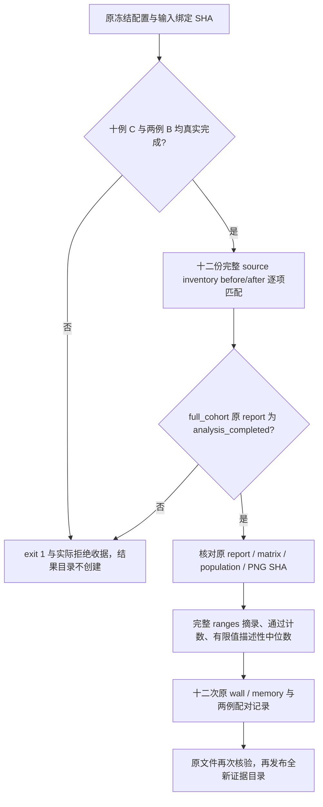
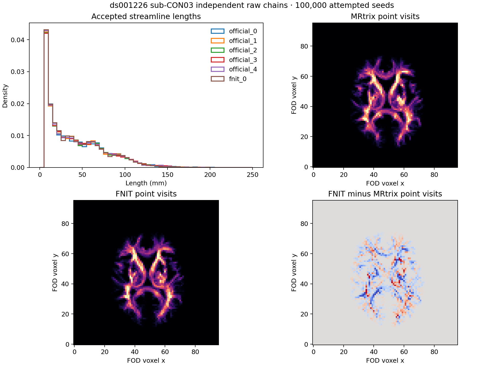

# 最终十例 cohort 原报告摘录与来源核验

## 1. 功能与流程

本目录从 Git `b9068f21bfde09829292551488bbd61a4444c565` 的独立 worktree 汇总最终证据，只读取实际 JSON/PNG。工具使用 Python 标准库，保留原指标值、原门槛和逐项判定，仅新增通过计数与描述性中位数。正式 12 次 raw 调用与十例 CPU full_cohort 已全部结束，两项最终工具真实 exit 0；生产、冻结源码、配置、科学比较工具和原运行控制器未修改。

统一服务器入口是 `/cwStorage/home/gongwk/Notebook_code/FNIT`，先读取其中 README/INDEX。本任务索引为 `FNIT/workspaces/fnit_connectome_accuracy_20261003_v1`，它与原 `Notebook_code/fnit_connectome_accuracy_20261003_v1` 是同一实体；上一轮 tenraw 链接也已核对，见[只读统一入口收据](unified_entry_receipt.json)。正在运行的任务、freeze 与实际 Conda prefix 保持原路径，原收据字节未改。



`analysis_completed` 表示 CPU 分析执行完成，原矩阵/轨迹科学状态可以仍是 `failed`。摘录成功不改变这些状态，也不等于科学等效或提速验收通过。每病例只有一个 FNIT seed，自重复性继续为 `not_assessed`。

## 2. Python 调用、输入与输出

[extract_completed_cohort.py](extract_completed_cohort.py) 的四个必需参数如下。

| 参数 | 输入/输出及约束 |
| --- | --- |
| `--configuration` | 原 `formal_frozen_v1/accuracy_configuration.json`。要求 SHA `f8eba1cbf3eab2baa549172b32be2c9d3b1014ad478f6e3702d7987378f52f8c`，从它读取原 raw manifest、input bindings、12 次计划、参数和完整源码清单。 |
| `--analysis-report` | v3 实际 `full_cohort/report.json`。要求十个病例完整、`analysis_completed`，配置/输入 SHA 与原分析 helper SHA `a443c401b68bb8b88f1c31aedd37b534ddf6ea3a5e9d7d4d08bccf4b1ffc8521` 一致。 |
| `--output-dir` | 必须不存在的结果目录。仅全部严格检查通过后创建；磁盘写入失败会在收据保留 `failed`，不把部分文件标为完成。 |
| `--receipt` | 必须不存在、且位于结果目录之外的 JSON 收据。记录命令、解释器、主机、工具 SHA、实际 phase 快照、成功/失败原因及输出 SHA。父目录应已存在。 |

```python
import os
import subprocess
from pathlib import Path

accuracy_root_directory = Path("/cwStorage/home/gongwk/Notebook_code/fnit_connectome_accuracy_20261003_v1")
extraction_directory = accuracy_root_directory / "final_cohort_summary_v1"
anaconda_python_executable = "/cwStorage/home/gongwk/anaconda3/bin/python3.11"  # 已有 CPU 解释器
extraction_command = [
    anaconda_python_executable,
    str(extraction_directory / "extract_completed_cohort.py"),
    "--configuration", str(accuracy_root_directory / "formal_frozen_v1/accuracy_configuration.json"),
    "--analysis-report", str(accuracy_root_directory / "root_matrix_analysis_v3/full_cohort/report.json"),
    "--output-dir", "/absolute/new/cohort_excerpt",  # 示例：另选不存在的目录，不能覆盖已完成结果
    "--receipt", "/absolute/new/cohort_extraction_receipt.json",  # 示例：已有父目录中的全新文件
]
cpu_environment = dict(os.environ, CUDA_VISIBLE_DEVICES="", PYTHONDONTWRITEBYTECODE="1")
# 如需另一次只读摘录，使用全新目录；未齐、原 SHA 不符或已有目标会明确报错。
subprocess.run(extraction_command, env=cpu_environment, check=True)
```

输出结构：

- `ranges_excerpt.json`：十例、每例八 atlas × 六字段的 **48 条完整原 ranges**，原 self-repeat ranges、population 五条 ranges、原门槛/逐项判定/状态、原 matrix/population/PNG 与 full report 的路径/大小/SHA；另有 12 次 producer 来源、wall/memory 原值与两例原配对 timing。省略原大 `pairwise/provenance` 列表，完整原文件仍在服务器，按 SHA 可追溯。
- `case_atlas_counts.csv`：80 行逐例逐 atlas 的原判定计数，每行 30 项；`case_counts.csv`：逐例 matrix 240 项与 population 25 项；`atlas_cohort_counts.csv`：同 atlas 的十例合计。计数取 `comparison_accepted` 的 `true/false/null`，不使用 `inside_count` 代替原验收。
- `matrix_descriptive_medians.csv`：六字段的官方自身 10 对、FNIT 对官方 5 对描述性中位数；逐例逐 atlas 960 行、同 atlas 十例原 pair 池合计 96 行。每行同时给出 `n_total/n_finite/n_null/n_nonfinite`。合计池的中位数是描述性统计，不是新门槛、置信区间或每病例中位数的中位数。
- `sub-CON01_population.png`、`sub-CON03_population.png`：从 full_cohort 拷贝的两张原图，逐字节 SHA 绑定，不重新绘图。

原 ranges 字典完整保留，包括未定义 `null`、原 nonfinite 值、`not_assessed` 和自重复空列表；Python JSON 若原值含 NaN/Infinity 则保留相同非标准数值 token，不改成零。有限值中位数明确记录覆盖数，不能替代全值 FA、全部边或全部体素指标。`mean_fa_common_normalized_mae` 原范围仅为共同非零 count 边上的矩阵 FA 比较。

## 3. 实际命令行与执行收据

以下两条命令均已在实际 12 次调用和 full_cohort 结束后执行。实际顺序为来源核验、原报告摘录；[原命令与 exit 0](actual_completed/waiter_status.json) 保留完整 argv。目标现已存在，不能直接重复执行这些命令。

```bash
accuracy_root_directory=/cwStorage/home/gongwk/Notebook_code/fnit_connectome_accuracy_20261003_v1
# 先核验最终来源；其通过不代替精度、时间或显存判定。
/cwStorage/home/gongwk/anaconda3/bin/python3.11 \
  "$accuracy_root_directory/final_source_acceptance_v1/verify_source_acceptance.py" \
  --source "$accuracy_root_directory/formal_frozen_v1/candidate" \
  --configuration "$accuracy_root_directory/formal_frozen_v1/accuracy_configuration.json" \
  --test-directory "$accuracy_root_directory/root_integrated_tests_v3" \
  --check-producers --require-complete \
  --output "$accuracy_root_directory/final_source_acceptance_v1/final_completed_source_receipt.json"

CUDA_VISIBLE_DEVICES='' PYTHONDONTWRITEBYTECODE=1 \
  /cwStorage/home/gongwk/anaconda3/bin/python3.11 \
  "$accuracy_root_directory/final_cohort_summary_v1/extract_completed_cohort.py" \
  --configuration "$accuracy_root_directory/formal_frozen_v1/accuracy_configuration.json" \
  --analysis-report "$accuracy_root_directory/root_matrix_analysis_v3/full_cohort/report.json" \
  --output-dir "$accuracy_root_directory/final_cohort_summary_v1/completed_excerpt" \
  --receipt "$accuracy_root_directory/final_cohort_summary_v1/final_completed_extraction_receipt.json"
```

最终目录已经存在时拒绝覆盖；原报告缺文件、SHA 不符、来源/CLI/输入/已完成 FS 绑定不符、field 缺失及全队列未完成均失败。baseline `CON01/03` 在完整报告中真实为 `assessed`；另外八例未排期 baseline 的计时仍 `not_assessed`。

[wait_for_completed_cohort.py](wait_for_completed_cohort.py) 是新增的 CPU 部署等候器，nodecw10 原 PID 107317，55 秒读取一次实际状态。它只在 raw `execution_completed`、full_cohort `analysis_completed` 和十例/12 次覆盖齐全后顺序执行原工具；两个工具之后才评原显存资格。显存门失败继续保留科学摘录，不能解释为显存验收通过。两原工具字节始终未改。

## 4. 原软件调用与映射

本摘录步骤无对应原软件 solver 命令。原独立官方五 seed 产物由 matrix/population 原报告绑定；这里只保留其比较结果。正式 raw producer 的原 CLI、EDDY GP seed、已供给完成的 FS、原始 acquisition SHA 和完整 source inventory 仍严格检查。

population 的 `tdi` 保留原定义：存储点的 world-to-grid `np.rint` point visits，native voxel 与四体素块相关性；它不是 MRtrix `tckmap` 的连续线段或超采样积分。原 `metric_policy`、grid 结构、输入路径与 SHA 随摘录保留。其他原软件映射见[本轮精度说明](../../../../docs/connectome/ACCURACY_OPTIMIZATION_20261003.md)。

## 5. 最新实际结果、时间、显存与原图

nodecw10 / gongwk 的已有 Anaconda Python **3.11.7** 完成最终核验与摘录。extractor SHA 为 `2b781c2f147c5b1282f877ac3764236c7c935ea4d91aa2736c4ee8b2d514274d`，source verifier 为 `9d004bd1832fa6ad979e9e0452ffcd1ad5ba201e0a92a4ab03059a88fd662e08`。候选及现存测试 checkout 的 1,211 文件指纹均为 `a27fe1ad0aca34c23b62017dc0bacb6b7a4c44d3423bf855a840509ffc1b6e82`；12 次 producer 的完整 before/after 清单逐项匹配，见[最终来源收据](actual_completed/final_completed_source_receipt.json)。测试期间的历史 before/after 未记录这一原界限继续保留，不用现存 checkout 补造历史。

| 实际最终步骤 | 执行状态 | 时间（秒） |
| --- | --- | ---: |
| v3 十例 full_cohort 科学报告 | analysis_completed，原科学失败状态保留 | 原工具 CPU 69.093771 |
| 最终来源核验 `--require-complete` | exit 0；12/12 来源完成 | 子进程墙钟 1.278788 |
| 原报告摘录 | exit 0；原文件结束后 SHA 再核验 | 子进程墙钟 0.701444 |

完整原[full_cohort report](actual_completed/full_cohort_report.json) SHA 为 `4169754096002cf299fadfb7223aad436e02f10b625ff7c293cc4d3d554398c1`。[摘录收据](actual_completed/final_completed_extraction_receipt.json) 在 **2026-10-03 11:53:03 UTC** 开始，11:53:04 UTC 完成。源文件、原 v3 helper、原 frozen helper、七个 frozen 工具及配置在等候/执行前后 SHA 均相同，记录在 [waiter 状态](actual_completed/waiter_status.json)。

[ranges_excerpt.json](actual_completed/ranges_excerpt.json) 为 **1,660,760 字节**，SHA `dfa42e47ebf30ba8a4cf540d81def0ac4c20107dcaa3b01a66386f9fa38c6fa9`，没有复制十份约 2.8 MB 的大原 matrix JSON。[独立原值核对收据](actual_completed/completed_original_binding_receipt.json) 再次核对 59 份原文件，480 条 matrix ranges、50 条 population ranges 与所有 self-repeat ranges 逐项等于原报告，grid 与 point-visit 定义不变。[拷贝清单](actual_completed/copy_inventory.json) 核对收据、CSV 与原 PNG 的大小和 SHA。

### 原科学判定与前轮对照

下列数字是进入官方有限重复范围的**比较判定数**，不是生物学精度、分类准确率或全链等价比例。旧十例并非本轮十个新配对基线，当前不能声称总体 SC 改善。

| 实际来源与范围 | matrix 通过 / 总数 | population 通过 / 总数 |
| --- | ---: | ---: |
| 前轮 2026-10-02，同十例两版各一 FNIT seed | 每版 1391 / 2400（57.96%） | 前轮未评估 |
| 本轮 2026-10-03，同十例当前候选 | 1388 / 2400（57.83%） | 85 / 250 |
| 本轮真实两例新 baseline → candidate | 379 → 377 / 480 | 9 → 16 / 50 |

原前轮 CSV 的判定求和与本轮两份已完成 baseline 原报告已独立读取并绑定 SHA，见[历史与本轮配对上下文收据](actual_completed/historical_and_same_phase_pair_context_receipt.json)、[前轮正式结果](../../../../docs/connectome/FINAL_RAW_MATRIX_RESULTS.md)和[本轮两例真实基线](../root_baseline_matrix_analysis_v1/README.md)。本轮十例 matrix 均 `failed`，合计 **1,012** 项失败；population 均 `failed`，合计 **165** 项失败。一个 FNIT seed 的 self-repeat 仍未评估。

| 本轮病例 | matrix 通过 / 240 | population 通过 / 25 | 同次轨迹条数 |
| --- | ---: | ---: | ---: |
| CON01 | 187 | 13 | 14431 |
| CON03 | 190 | 3 | 11582 |
| CON04 | 143 | 4 | 12460 |
| CON05 | 208 | 11 | 19299 |
| CON06 | 126 | 13 | 19002 |
| CON07 | 94 | 5 | 14113 |
| CON08 | 107 | 10 | 17598 |
| CON09 | 116 | 9 | 13089 |
| CON10 | 93 | 1 | 18179 |
| CON11 | 124 | 16 | 19587 |

逐例逐 atlas 全部计数见[80 行 CSV](actual_completed/case_atlas_counts.csv)。十例每 atlas 的通过/300 分别为 fs-aparc **210**、aparc+tian-s1 **215**、aparc.a2009s+tian-s1 **172**、glasser+tian-s1 **152**、glasser+tian-s4 **155**、schaefer200+tian-s1 **188**、schaefer500+tian-s4 **159**、schaefer1000+tian-s4 **137**；失败与未评估计数见[合计 CSV](actual_completed/atlas_cohort_counts.csv)。

### 六字段描述性中位数

[完整 CSV](actual_completed/matrix_descriptive_medians.csv) 有 1,056 行，逐例层 7,200 个原 pair 值均有限，`n_null/n_nonfinite` 在这一范围均为 0；原记录仍保留未定义/未评估支持。这不证明全部 FA 体素有限。以下仅展示 fs-aparc 十例原 pair 池，官方自身每字段 100 值、FNIT 对官方每字段 50 值；其他 atlas 和各病例的全部中位数/覆盖数在 CSV。

| 原字段 | 官方自身 | FNIT 对官方 |
| --- | ---: | ---: |
| count_relative_l1 | 0.303521 | 0.323509 |
| sift2_fbc_relative_l1 | 0.336051 | 0.357991 |
| count_support_dice | 0.775299 | 0.773406 |
| count_pearson | 0.976531 | 0.974845 |
| mean_length_common_normalized_mae | 0.151864 | 0.152516 |
| mean_fa_common_normalized_mae | 0.061428 | 0.063047 |

这些中位数只描述原比较值，没有用 pooled 值替换每例每 atlas 的原门槛，也没有改原 failed 判定。

### 配对 wall 与原显存资格

| 本轮原配对 | baseline CLI 秒 | candidate CLI 秒 | 原 C/B 比值 |
| --- | ---: | ---: | ---: |
| CON01，B 后 C | 2200.811193 | 2072.132814 | 0.941531387 |
| CON03，C 后 B | 2033.586431 | 2043.839205 | 1.005041721 |

两例合计观察减少 118.426 秒，CON03 增加 10.253 秒；共享 GPU 负载随时间变化，该观察不能证明受控速度保持。其余八例没有本轮配对 baseline。12 次原 GPU/wall 路径、SHA、原 CLI 秒数、post-timing 导出/锁等待及两例完整 timing/memory 字典均在原摘录。

12 次 raw-DWI 的三类记录值均低于 **20,000,000,000 字节**，但原监测资格门为 **failed**：C09/C10 的 `memory_budget.status='not_fully_measured'`；其余十次 `monitor_issues=[]`。C11 没有本轮原采样错误。

| 原调用 | allocated 字节 | reserved 字节 | process-tree 字节 | 原 monitor_issues |
| --- | ---: | ---: | ---: | --- |
| C09 | 14681255936 | 17628659712 | 19815989248 | failed_samples, errors |
| C10 | 14681969664 | 17607688192 | 19795017728 | failed_samples, errors, sampling_gap |

不能把已有峰值小于预算解释为这些调用得到完整监测。组件峰值不能当整链峰值，采样峰值不是连续数学上界；原 scope/monitor issues 全部保留。独立 NVML 补测由 root 另行归档、链接其资格报告，不替换本次正式科学、wall、memory 或任何原收据。

### 真实原图与准备阶段记录



[CON01 原图](actual_completed/sub-CON01_population.png)与 CON03 PNG 均逐字节来自完成的 full_cohort，SHA 分别为 `3ae3b1989537464068ca51b2d0556cba5d766906512087272d975156059ae2c7`、`1905d14bde4ab9eac51b24212e516cd6d8bf6c39081bc3d578a78c7707d7f17c`。图中显示的保存点访问与长度分布遵循原定义；MRI 脑图和局部精度见[原 task 01 诊断](../task_01/README.md)。未绘制新图。

较早的实际准备检查仍保留[原部署收据](actual_preparation/deployment_actual_final_receipt.json)与[拒绝日志](actual_preparation/extract_completed_cohort_final.log)：

| 实际准备检查 | 结果 | 子进程墙钟秒 |
| --- | --- | ---: |
| 已有两例原 schema、四次完成 producer 来源/CLI/wall/memory 元数据检查 | exit 0；19 个原文件结束后重新核验 | 0.126669 |
| 完整队列摘录 guard | exit 1；4/12 完成、C04 running，full_cohort 不存在；结果目录未创建 | 0.064399 |

这些秒数是只读元数据操作，不是 MRI pipeline 时间或提速证据。实际拒绝发生于 **2026-10-03 08:51:46 UTC**，见 [partial guard 收据](actual_preparation/actual_partial_guard_final_receipt.json)。该时刻之后的运行进度由实际 producer 报告确定。

[已有真实报告 schema 收据](actual_preparation/available_actual_schema_final_receipt.json) 核对原值：

| 原单例分析快照 | matrix 通过 / 失败 / 总数 | population 通过 / 失败 / 总数 | 原快照 baseline timing |
| --- | --- | --- | --- |
| CON01 | 187 / 53 / 240 | 13 / 12 / 25 | assessed |
| CON03 | 190 / 50 / 240 | 3 / 22 / 25 | not_assessed；当时 B03 running |

旧 CON03 单例快照的 baseline timing `not_assessed` 原字节继续保留；本次完整报告重新读取实际完成 B03，另存真实配对值，没有反填旧快照。

## 6. 最近版本与证据状态

- 2026-10-03：准备 stdlib extractor 与真实 schema 检查器，未改科学代码、依赖或算法预算。原分析 helper、七个 frozen 工具、配置及两份准备脚本在本次两命令前后 SHA 一致。
- 同日：实际 4/12 部分覆盖触发拒绝，留下 source-bound 原收据/日志；没有生成完整摘录。初版准备命令及源码在服务器保留，提交记录使用最终脚本的实际收据。
- 同日：CPU 等候器只在全 12 与 full_cohort 真实结束后执行两项最终工具；source gate 完成、摘录 exit 0，原科学比较失败和两例原显存监测缺口保留。两份原工具 SHA 与冻结配置均未改。
- 本次证据包已完成；root 审查科学/速度边界，并另行维护独立 NVML 补测资格链接。补测不回写本次原 JSON/CSV/PNG 或收据。

## 7. 代码与参考

- [原 CPU 科学分析器](../../../../tools/analyze_connectome_accuracy_cohort.py)、[原 matrix 定义](../../../../tools/benchmark_connectome_raw_cohort_envelope.py)、[原 population 定义](../../../../tools/benchmark_connectome_tracking_population.py)：本工具不改这些指标或门槛。
- [原正式 driver](../../../../tools/benchmark_connectome_accuracy_cohort.py)、[严格 raw worker 检查](../../../../tools/benchmark_connectome_raw_cohort.py)、[最终来源核验](../final_source_acceptance_v1/README.md)。
- [CPU 部署 v3 原说明与失败证据](../cpu_matrix_deployment_v3/README.md)、[真实 freeze 与回归来源](../root/execution_v1/README.md)、[完整精度说明](../../../../docs/connectome/ACCURACY_OPTIMIZATION_20261003.md)。
- 官方代码：[MRtrix3 实际 benchmark commit](https://github.com/MRtrix3/mrtrix3/tree/026e850d171ec2a12f09865d31b8332d23d7ecf6)；Tournier JD et al. MRtrix3. *NeuroImage* 202, 116137 (2019)。数据：[OpenNeuro ds001226](https://openneuro.org/datasets/ds001226)，实际许可 CC0、快照与输入 SHA 在原 manifest。
