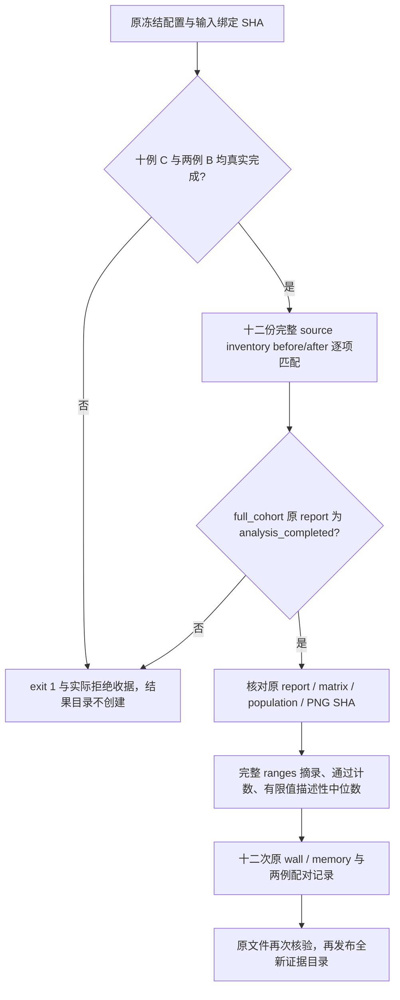

# 最终十例 cohort 原报告摘录准备

## 1. 功能与流程

本目录从 Git `b9068f21bfde09829292551488bbd61a4444c565` 的独立 worktree 准备最终证据汇总，只读取实际 JSON/PNG。工具使用 Python 标准库，保留原指标值、原门槛和逐项判定，仅新增通过计数与描述性中位数。生产、冻结源码、配置、科学比较工具和运行控制器均未修改。



`analysis_completed` 表示 CPU 分析执行完成，原矩阵/轨迹科学状态可以仍是 `failed`。摘录成功不改变这些状态，也不等于科学等效或提速验收通过。每病例只有一个 FNIT seed，自重复性继续为 `not_assessed`。

## 2. Python 调用、输入与输出

[extract_completed_cohort.py](extract_completed_cohort.py) 的四个必需参数如下。

| 参数 | 输入/输出及约束 |
| --- | --- |
| `--configuration` | 原 `formal_frozen_v1/accuracy_configuration.json`。要求 SHA `f8eba1cbf3eab2baa549172b32be2c9d3b1014ad478f6e3702d7987378f52f8c`，从它读取原 raw manifest、input bindings、12 次计划、参数和完整源码清单。 |
| `--analysis-report` | v3 实际 `full_cohort/report.json`。要求十个病例完整、`analysis_completed`，配置/输入 SHA 与原分析 helper SHA `a443c401b68bb8b88f1c31aedd37b534ddf6ea3a5e9d7d4d08bccf4b1ffc8521` 一致。 |
| `--output-dir` | 必须不存在的结果目录。仅全部严格检查通过后创建；磁盘写入失败会在收据保留 `failed`，不把部分文件标为完成。 |
| `--receipt` | 必须不存在、且位于结果目录之外的 JSON 收据。记录命令、解释器、主机、工具 SHA、实际 phase 快照、成功/失败原因及输出 SHA。父目录应已存在。 |

```python
import os
import subprocess
from pathlib import Path

accuracy_root_directory = Path("/cwStorage/home/gongwk/Notebook_code/fnit_connectome_accuracy_20261003_v1")
extraction_directory = accuracy_root_directory / "final_cohort_summary_v1"
anaconda_python_executable = "/cwStorage/home/gongwk/anaconda3/bin/python3.11"  # 已有 CPU 解释器
extraction_command = [
    anaconda_python_executable,
    str(extraction_directory / "extract_completed_cohort.py"),
    "--configuration", str(accuracy_root_directory / "formal_frozen_v1/accuracy_configuration.json"),
    "--analysis-report", str(accuracy_root_directory / "root_matrix_analysis_v3/full_cohort/report.json"),
    "--output-dir", str(extraction_directory / "completed_excerpt"),  # 必须全新
    "--receipt", str(extraction_directory / "final_completed_extraction_receipt.json"),  # 必须全新
]
cpu_environment = dict(os.environ, CUDA_VISIBLE_DEVICES="", PYTHONDONTWRITEBYTECODE="1")
# 此命令待全队列真实结束后执行；未齐时 check=True 会明确报错。
subprocess.run(extraction_command, env=cpu_environment, check=True)
```

输出结构：

- `ranges_excerpt.json`：十例、每例八 atlas × 六字段的 **48 条完整原 ranges**，原 self-repeat ranges、population 五条 ranges、原门槛/逐项判定/状态、原 matrix/population/PNG 与 full report 的路径/大小/SHA；另有 12 次 producer 来源、wall/memory 原值与两例原配对 timing。省略原大 `pairwise/provenance` 列表，完整原文件仍在服务器，按 SHA 可追溯。
- `case_atlas_counts.csv`：80 行逐例逐 atlas 的原判定计数，每行 30 项；`case_counts.csv`：逐例 matrix 240 项与 population 25 项；`atlas_cohort_counts.csv`：同 atlas 的十例合计。计数取 `comparison_accepted` 的 `true/false/null`，不使用 `inside_count` 代替原验收。
- `matrix_descriptive_medians.csv`：六字段的官方自身 10 对、FNIT 对官方 5 对描述性中位数；逐例逐 atlas 960 行、同 atlas 十例原 pair 池合计 96 行。每行同时给出 `n_total/n_finite/n_null/n_nonfinite`。合计池的中位数是描述性统计，不是新门槛、置信区间或每病例中位数的中位数。
- `sub-CON01_population.png`、`sub-CON03_population.png`：从 full_cohort 拷贝的两张原图，逐字节 SHA 绑定，不重新绘图。

原 ranges 字典完整保留，包括未定义 `null`、原 nonfinite 值、`not_assessed` 和自重复空列表；Python JSON 若原值含 NaN/Infinity 则保留相同非标准数值 token，不改成零。有限值中位数明确记录覆盖数，不能替代全值 FA、全部边或全部体素指标。`mean_fa_common_normalized_mae` 原范围仅为共同非零 count 边上的矩阵 FA 比较。

## 3. 命令行与最终触发

以下是**待实际 12 次运行与 full_cohort 都结束后**使用的命令。本次准备没有执行成功的完整摘录。

```bash
accuracy_root_directory=/cwStorage/home/gongwk/Notebook_code/fnit_connectome_accuracy_20261003_v1
CUDA_VISIBLE_DEVICES='' PYTHONDONTWRITEBYTECODE=1 \
  /cwStorage/home/gongwk/anaconda3/bin/python3.11 \
  "$accuracy_root_directory/final_cohort_summary_v1/extract_completed_cohort.py" \
  --configuration "$accuracy_root_directory/formal_frozen_v1/accuracy_configuration.json" \
  --analysis-report "$accuracy_root_directory/root_matrix_analysis_v3/full_cohort/report.json" \
  --output-dir "$accuracy_root_directory/final_cohort_summary_v1/completed_excerpt" \
  --receipt "$accuracy_root_directory/final_cohort_summary_v1/final_completed_extraction_receipt.json"

# 单列最终来源核验；其通过不代替精度、时间或显存判定。
/cwStorage/home/gongwk/anaconda3/bin/python3.11 \
  "$accuracy_root_directory/final_source_acceptance_v1/verify_source_acceptance.py" \
  --source "$accuracy_root_directory/formal_frozen_v1/candidate" \
  --configuration "$accuracy_root_directory/formal_frozen_v1/accuracy_configuration.json" \
  --test-directory "$accuracy_root_directory/root_integrated_tests_v3" \
  --check-producers --require-complete \
  --output "$accuracy_root_directory/final_source_acceptance_v1/final_completed_source_receipt.json"
```

最终目录已经存在时拒绝覆盖；原报告缺文件、SHA 不符、来源/CLI/输入/已完成 FS 绑定不符、field 缺失及全队列未完成均失败。baseline `CON01/03` 必须完成并在 full report 中为 `assessed`；另外八例未排期 baseline 的计时保留 `not_assessed`。

## 4. 原软件调用与映射

本摘录步骤无对应原软件 solver 命令。原独立官方五 seed 产物由 matrix/population 原报告绑定；这里只保留其比较结果。正式 raw producer 的原 CLI、EDDY GP seed、已供给完成的 FS、原始 acquisition SHA 和完整 source inventory 仍严格检查。

population 的 `tdi` 保留原定义：存储点的 world-to-grid `np.rint` point visits，native voxel 与四体素块相关性；它不是 MRtrix `tckmap` 的连续线段或超采样积分。原 `metric_policy`、grid 结构、输入路径与 SHA 随摘录保留。其他原软件映射见[本轮精度说明](../../../../docs/connectome/ACCURACY_OPTIMIZATION_20261003.md)。

## 5. 本次实际检查、时间与图

nodecw10 / gongwk 的已有 Anaconda Python **3.11.7** 实际执行结果见 [部署检查收据](actual_preparation/deployment_actual_final_receipt.json) 与[原日志](actual_preparation/extract_completed_cohort_final.log)。工具 SHA 为 `2b781c2f147c5b1282f877ac3764236c7c935ea4d91aa2736c4ee8b2d514274d`；本地、部署文件与实际命令收据一致。

| 实际准备检查 | 结果 | 子进程墙钟秒 |
| --- | --- | ---: |
| 已有两例原 schema、四次完成 producer 来源/CLI/wall/memory 元数据检查 | exit 0；19 个原文件结束后重新核验 | 0.126669 |
| 完整队列摘录 guard | exit 1；4/12 完成、C04 running，full_cohort 不存在；结果目录未创建 | 0.064399 |

这些秒数是只读元数据操作，不是 MRI pipeline 时间或提速证据。实际拒绝发生于 **2026-10-03 08:51:46 UTC**，见 [partial guard 收据](actual_preparation/actual_partial_guard_final_receipt.json)。该时刻之后的运行进度由实际 producer 报告确定。

[已有真实报告 schema 收据](actual_preparation/available_actual_schema_final_receipt.json) 核对原值：

| 原单例分析快照 | matrix 通过 / 失败 / 总数 | population 通过 / 失败 / 总数 | 原快照 baseline timing |
| --- | --- | --- | --- |
| CON01 | 187 / 53 / 240 | 13 / 12 / 25 | assessed |
| CON03 | 190 / 50 / 240 | 3 / 22 / 25 | not_assessed；当时 B03 running |

两例原科学状态均 `failed`；没有把已结束 B03 的新 wall 值反填旧单例分析快照。最终 full_cohort 将由原 v3 分析器重新读取完成报告，本摘录仅读取该真正结束的报告。四次已完成 producer 的 1,211 文件 source before/after 与各自原声明逐项一致。

原两例 matrix/population/PNG 的 SHA、大小和逐 atlas 判定计数均在 schema 收据，未复制大原 JSON。真实原图见 [CON03 原 population 图](../cpu_matrix_deployment_v3/v2_failure/population.png)，MRI 脑图和局部精度见[原 task 01 诊断](../task_01/README.md)。本次未生成新图；最终成功摘录才复制两张已绑定原 PNG。

显存只摘录同一次完整 raw-DWI 的原 `memory_budget`、allocated/reserved、采样 process-tree 和原 scope/monitor issues。原预算为 20,000,000,000 字节；组件峰值不能当整链峰值，采样峰值不是连续数学上界。post-timing 导出、锁等待和 worker 时间另列，不混作 CLI 秒数。

## 6. 最近版本与证据状态

- 2026-10-03：准备 stdlib extractor 与真实 schema 检查器，未改科学代码、依赖或算法预算。原分析 helper、七个 frozen 工具、配置及两份准备脚本在本次两命令前后 SHA 一致。
- 同日：实际 4/12 部分覆盖触发拒绝，留下 source-bound 原收据/日志；没有生成完整摘录。初版准备命令及源码在服务器保留，提交记录使用最终脚本的实际收据。
- 后续待办：实际全 12、full_cohort `analysis_completed` 后执行第 3 节两项命令，保存原最终 report SHA、完整摘录、CSV、原 PNG 和最终来源收据，再由 root 汇总科学、速度、显存验收。当前不填写十例成功或提速结论。

## 7. 代码与参考

- [原 CPU 科学分析器](../../../../tools/analyze_connectome_accuracy_cohort.py)、[原 matrix 定义](../../../../tools/benchmark_connectome_raw_cohort_envelope.py)、[原 population 定义](../../../../tools/benchmark_connectome_tracking_population.py)：本工具不改这些指标或门槛。
- [原正式 driver](../../../../tools/benchmark_connectome_accuracy_cohort.py)、[严格 raw worker 检查](../../../../tools/benchmark_connectome_raw_cohort.py)、[最终来源核验](../final_source_acceptance_v1/README.md)。
- [CPU 部署 v3 原说明与失败证据](../cpu_matrix_deployment_v3/README.md)、[真实 freeze 与回归来源](../root/execution_v1/README.md)、[完整精度说明](../../../../docs/connectome/ACCURACY_OPTIMIZATION_20261003.md)。
- 官方代码：[MRtrix3 实际 benchmark commit](https://github.com/MRtrix3/mrtrix3/tree/026e850d171ec2a12f09865d31b8332d23d7ecf6)；Tournier JD et al. MRtrix3. *NeuroImage* 202, 116137 (2019)。数据：[OpenNeuro ds001226](https://openneuro.org/datasets/ds001226)，实际许可 CC0、快照与输入 SHA 在原 manifest。
