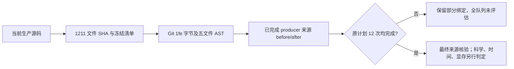

# 最终科学源码验收准备：只读核验

## 1. 功能与流程

独立 worktree 从 `f980007a9cc547f17791cc20566211e394f17b60` 创建。本记录核对最终生产科学代码、冻结 archive 与已结束 CPU/CUDA 回归的来源；未重跑 GPU、测试或 MRI solver，未改生产和冻结字节。



当前生产源码及 `pyproject.toml`、`environment.yml` 相对科学来源 `1fe86ab8347b29d9c47be8109627736576222912` 无差异。当前 1,211 个文件与冻结候选指纹 `a27fe1ad0aca34c23b62017dc0bacb6b7a4c44d3423bf855a840509ffc1b6e82` 完全一致，五个变更文件的完整字节和 AST 均一致。此一致性比较的是 FNIT 最终版本与已运行的冻结 FNIT 来源，不是与官方实现等价。

## 2. Python 调用、输入与输出

[verify_source_acceptance.py](verify_source_acceptance.py) 只使用 Python 标准库，可通过 `subprocess.run` 调用。输入为 `--source` 候选源目录、`--configuration` 原冻结配置；可选 `--repository` 增加 Git 来源字节/AST核对，`--test-directory` 核对现存测试 checkout。`--check-producers` 只读取配置 `run_root` 下实际 GPU 报告；`--require-complete` 要求计划 12 次 producer 均完成且 phase 状态为原 driver 的 `execution_completed`。

输出 `--output` 是全新 JSON 收据，已有文件会拒绝替换。它包含实际文件数量、指纹、五文件 SHA/AST、producer 原报告路径与 SHA、完整清单 before/after 逐项匹配标记及覆盖范围。它不计算精度、运行时间或显存判定。

```python
import subprocess
from pathlib import Path

repository_directory = Path("/absolute/Fudan-Neuroimaging-toolkit")  # 已验收 Git checkout
evidence_directory = repository_directory / "validation/connectome/accuracy_20261003"
verification_script = evidence_directory / "final_source_acceptance_v1/verify_source_acceptance.py"
configuration_file = evidence_directory / "root/execution_v1/formal_frozen_v1/accuracy_configuration.json"
new_receipt = Path("/absolute/new/local_source_receipt.json")  # 必须不存在
subprocess.run(["python3", str(verification_script), "--source", str(repository_directory),
                "--repository", str(repository_directory), "--configuration", str(configuration_file),
                "--output", str(new_receipt)], check=True)
```

## 3. 命令行与最终复用

以下命令用于服务器实际 raw phase 全部结束后，生成新的最终来源收据。当前尚未满足完成条件；脚本拒绝把未完成覆盖记为最终通过。

```bash
accuracy_root=/cwStorage/home/gongwk/Notebook_code/fnit_connectome_accuracy_20261003_v1
/cwStorage/home/gongwk/anaconda3/bin/python3.11 \
  "$accuracy_root/final_source_acceptance_v1/verify_source_acceptance.py" \
  --source "$accuracy_root/formal_frozen_v1/candidate" \
  --configuration "$accuracy_root/formal_frozen_v1/accuracy_configuration.json" \
  --test-directory "$accuracy_root/root_integrated_tests_v3" \
  --check-producers --require-complete \
  --output "$accuracy_root/final_source_acceptance_v1/final_completed_source_receipt.json"
```

本次实际运行去掉了 `--require-complete`，见 [服务器来源快照收据](server_current_source_receipt.json)：采集时 3/12 producer 完成且完整来源 before/after 匹配，B-CON03 正在运行，其余未开始，最终来源 gate 为 `not_assessed`。没有用 running 报告补造 after。

## 4. 原软件与生产差异审查

本核验工具无对应原软件命令，没有运行官方 solver。相对 `7af34e6d072e843fb2558c931bb2781f1d4b0be9`，生产仅改五个文件：

| 文件 | 真实变更 |
| --- | --- |
| cli.py | 缓存 key 增加 numerical revision，阻止复用旧数值版本矩阵；已有输出按现有规则需 `--overwrite` |
| pipeline.py | 梯度元数据 Float64、affine 列归一化后极分解、原 MRtrix Auto norm² 梯度解释；数值 revision |
| response.py | 同一 Auto 梯度解释及非零方向归一化，保留张量 estimator |
| mtnormalise.py | 四分位数下标改为 C++ 正半数舍入 |
| tracking.py | SGM 截断最小指标使用内部 incoming chord，而非 proposal tangent |

后四项含有明确的科学计算语义修复；最终源码与冻结 `1fe` 完全一致。依赖声明未改，新增导入仅为现有 FNIT 内部 helper。DWI/SH 保持 Float32、默认 TF32；梯度元数据提高到 Float64，没有 float16/bfloat16 降级。原 seed、播种数、每弧 1000 次候选尝试、arc_proposals=16、IWLS 两次更新、normalise 15×最多7次、mask、步长/长度/角度及 CSD/SIFT2 预算未减少。

同次结果导出 hook 位于验证工具 `benchmark_connectome_raw_bids.py`，不在上述生产文件。hook 只调用原 core 一次，保留原返回对象，在墙钟与显存监测停止后导出；导出时间单列，不能混作受监测 CLI 时间或预算。只读独立 reviewer 未发现新增实质 bug。

## 5. 现有 CPU/CUDA 证据及界限

| 实际 gate | 原结果 | pytest 秒 / 子进程墙钟秒 | 实际范围 |
| --- | --- | ---: | --- |
| CPU retry2 | 752 passed、63 skipped、362 subtests passed | 42.78 / 43.491999 | connectome、EDDY、TOPUP |
| CUDA retry2 | 717 passed、7 skipped、362 subtests passed | 74.50 / 75.689586 | connectome |

[实际日志/状态来源收据](regression_provenance_receipt.json) 核对原文件 SHA、命令与 exit 0；[CUDA launcher 原状态快照](actual_cuda_launcher_status_snapshot.json) 保留已完成 gate 和仍运行 raw phase 的原值。现存测试 checkout 的 1,211 个科学文件和冻结目录同为 `a27`；候选 archive 1211 文件也逐字节匹配，见 [archive 与 baseline 收据](archive_and_baseline_receipt.json)。baseline 全清单与 `7af` 对应，指纹为 `328c398496c5b90f459381ca462ba6597cbbe5f2e9700f0b1a273f1408962bac`。

两次 regression launcher 未保存测试期间科学源码 inventory before/after。CPU 的 `science_origin_commit` 和现今 checkout 的同字节证据均真实，但不能补造那段历史快照；这些 gate 也不覆盖之后新增的所有报告工具。正式 raw producer 则有严格清单绑定的 before/after。测试通过不代表整链矩阵与轨迹进入官方重复范围。

没有精度降级不等于所有实际误差改善：已有 task02 记录仍含 CON11 FA 最大误差增加、CON07 尾部未改善；`b<50` 零方向约定与异常梯度拒绝边界保留。raw FA 全值含 NaN 时，有限对诊断不能代替全值统计。组件峰值、分阶段 allocator 峰值及同输入阶段速度不能当作 whole/raw 峰值或整链时间；实际整链的 sampled process-tree 与 allocated/reserved 另看同次报告，采样峰值也不是连续数学上界。真实脑图见 [本轮精度总说明](../../../../docs/connectome/ACCURACY_OPTIMIZATION_20261003.md)，本记录不生成新图。

## 6. 最近核验与状态

- 本地 [源码/AST 收据](local_science_identity_receipt.json)：Git `f980` 科学树等于 `1fe`，五文件逐字节/AST匹配，生产差异范围正好五文件。
- nodecw10 [源目录与 producer 快照收据](server_current_source_receipt.json)：冻结源和现存测试 checkout 完整指纹同一；采集时已完成三次来源匹配；最终 12 次 gate 待完成。
- 原失败回归日志仍保留于 `root/execution_v1`；本次未重跑测试或修改部署环境。公共报告 helper 的额外回归见 [CPU 部署 v3](../cpu_matrix_deployment_v3/README.md)。

## 7. 代码与依据

- [源码清单算法](../../../../tools/benchmark_connectome_raw_cohort.py)、[正式 phase driver](../../../../tools/benchmark_connectome_accuracy_cohort.py)：脚本复用相同清单定义与实际 terminal 状态。
- [原 CPU retry2 launcher](run_cpu_regression_retry2.py)、[原 CUDA/raw retry2 launcher](run_formal_phase_retry2.py)：原源码保留，CPU launcher SHA 与原 status 记录一致。
- [已保存的冻结配置与原回归日志](../root/execution_v1/README.md)、[总精度说明](../../../../docs/connectome/ACCURACY_OPTIMIZATION_20261003.md)：最终科学/速度/显存验收由 root 汇总。
