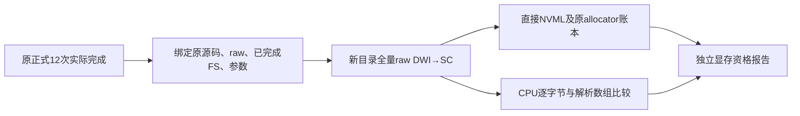
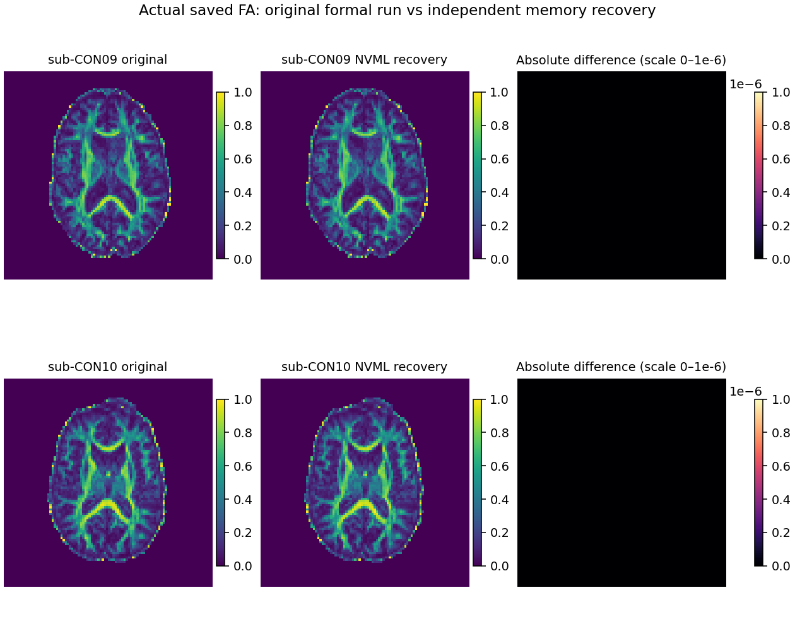

# 实际 raw CON09 / CON10 独立显存补测

## 1. 功能简介

原正式 12 次 raw DWI→SC 已完成。C09、C10 科学运行成功，三类观测峰值低于 `20,000,000,000` 字节，但原 `nvidia-smi` 监控发生超时，因此其原显存状态仍为 `not_fully_measured`。本目录使用既有直接 NVML 监控环境，在独立输出目录重新执行两例完整 raw DWI→SC，核验显存测量资格与科学产物一致性。原正式精度、耗时和失败记录保留。



## 2. Python 调用、输入与输出

这是独立验证工具，生产 FNIT 源码没有修改。`recovery_controller.py` 通过实际冻结的 `benchmark_connectome_raw_cohort.worker` 执行。输入来自原 `accuracy_configuration.json`（SHA `f8eba1cbf3eab2baa549172b32be2c9d3b1014ad478f6e3702d7987378f52f8c`）、原 raw manifest、逐例 completed FS 绑定和终态 12 行报告。候选源码指纹为 `a27fe1ad0aca34c23b62017dc0bacb6b7a4c44d3423bf855a840509ffc1b6e82`，科学提交为 `1fe86ab8347b29d9c47be8109627736576222912`。

输出位于 `/cwStorage/home/gongwk/Notebook_code/FNIT/runs/connectome-accuracy-memory-recovery-20261003-v1`：

- `frozen_recovery_plan.json`：原实际终态、原监控问题、两例选择及解释器身份。
- `candidate/sub-CON09`、`candidate/sub-CON10`：全新 connectome、原冻结 wall/GPU 报告、同次结果导出。
- `*_original_before.json`、`*_original_after.json`：原报告、原全部产物、raw、FS、资源和解释器的 SHA 核验。
- `science_comparison.json`：所有产物字节比较，以及 MRI/affine、NPZ、数值文本、TCK 全部保存点与轨迹边界的无容差比较。
- `load_snapshots.jsonl`：共享 GPU 负载观察，独立于冻结显存门槛。

固定科学参数：8 atlas，`n_seeds=100000`（尝试数）、`seed=0`、`eddy_gp_seed=12345`、`device=cuda:0`、原 CUDA UUID、默认 TF32、`compile_arc=False`、8 CPU 线程、`PYTORCH_CUDA_ALLOC_CONF=expandable_segments:True`。原共享 `flock` 串行执行。

```python
import os
import subprocess

# 先核对原正式12行实际完成；控制器会再次核对源码、输入及原显存问题。
original_conda_python = "/cwStorage/home/gongwk/Notebook_code/fnit_conda_env_956b1a9/bin/python"
memory_recovery_directory = "/cwStorage/home/gongwk/Notebook_code/FNIT/runs/connectome-accuracy-memory-recovery-20261003-v1"
controller_path = memory_recovery_directory + "/recovery_controller.py"
controller_environment = dict(os.environ, CUDA_VISIBLE_DEVICES="", PYTHONDONTWRITEBYTECODE="1")
subprocess.run([original_conda_python, controller_path, "--execute-after-formal"],
               env=controller_environment, check=True)
```

## 3. 命令行调用

`--prepare` 仅新建唯一目录并追加 FNIT 索引；默认仅检查实际正式状态；`--execute-after-formal` 仅在本次已完成的正式 12 行后执行两例补测；本次没有提前启动等待 GPU 的进程。已存在的补测 namespace、计划或输出不会被覆盖。

```bash
original_conda_python=/cwStorage/home/gongwk/Notebook_code/fnit_conda_env_956b1a9/bin/python
memory_recovery_directory=/cwStorage/home/gongwk/Notebook_code/FNIT/runs/connectome-accuracy-memory-recovery-20261003-v1
# 本次启动前已有真实 execution_completed + 12 completed 的终态收据。
CUDA_VISIBLE_DEVICES= PYTHONDONTWRITEBYTECODE=1 "$original_conda_python" \
  "$memory_recovery_directory/recovery_controller.py" --execute-after-formal

# GPU运行实际完成后，在nodecw10只读比较保存产物。
cpu_analysis_python=/home1/gongwk/anaconda3/bin/python3.11
CUDA_VISIBLE_DEVICES= PYTHONDONTWRITEBYTECODE=1 "$cpu_analysis_python" \
  "$memory_recovery_directory/compare_original_recovery.py"
```

科学 worker 命令只允许四处路径改变：监控解释器、`--report`、`--result-export-dir`、`--output-dir`。两处 `--eddy-gp-seed 12345`、全部 atlas 与 raw/FS 路径保留。既有 NVML venv 的 `sys.prefix` 为原 venv，`base_prefix` 仍原 Conda；Python 二进制、科学模块、扩展及 20 个 Torch/NumPy 共享库的实际路径和 SHA 全部相同。未安装新依赖或移动 prefix。

## 4. 原软件调用

本补测不运行新的 FSL、FreeSurfer 或 MRtrix3 参考链。原 official recon-all 已完成，其结果通过既有 FS 文件 SHA 绑定；本轮独立官方参考精度与五次轨迹来自原正式报告。完整原软件命令见本仓库 [本轮精度说明](../../../../docs/connectome/ACCURACY_OPTIMIZATION_20261003.md) 和原参考 manifest。本补测不替换其科学指标。

直接监控使用原已核验 `nvidia-ml-py 13.580.82`，调用 `nvmlDeviceGetComputeRunningProcesses` 统计指定 GPU 上当前 wall 进程及其存活子进程。PyTorch allocator 峰值仍来自冻结 wall 工具既有的 reset 前及退出账本。

## 5. 最新真实精度、时间、显存与图

**两例独立 NVML 显存监控健康；全部科学数组严格一致门未通过。** 原正式显存失败状态保留，独立测量不替换原报告。

| 原正式候选 | 原CLI秒 | allocated GB | reserved GB | process GB | 原显存状态 |
|---|---:|---:|---:|---:|---|
| CON09 | 1477.911278 | 14.681256 | 17.628660 | 19.815989 | not_fully_measured；failed_samples/errors |
| CON10 | 653.421259 | 14.681970 | 17.607688 | 19.795018 | not_fully_measured；failed_samples/errors/sampling_gap |

| 独立补测 | 新CLI秒（单列） | allocated GB | reserved GB | process GB | NVML 状态 |
|---|---:|---:|---:|---:|---|
| CON09 | 679.306905 | 14.681256 | 17.628660 | 19.815989 | observed_below_budget；issues=[] |
| CON10 | 579.509230 | 14.681970 | 17.607688 | 19.795018 | observed_below_budget；issues=[] |

每例 105 个科学目录产物中 99 个文件 SHA 相同；82 项解析科学产物中 81 项全部 bits 相同。完整 corrected DWI、rotated bvecs、MRI、FA、FOD、5TT/GMWMI、8 atlas、32 矩阵 CSV、TCK 全部保存点和每条轨迹边界均完全相同。两例返回轨迹数分别为 13089、18179；端点从 TCK 回读，与同次导出的 endpoints bits 及各标量长度一致。

唯一科学差异为 `returned_result/track_metrics.npz` 中 Float64 `weights`：

| case | weights值不同数 / 总数 | 最大绝对差 | lengths / mean_fa / endpoints |
|---|---:|---:|---|
| CON09 | 8343 / 13089 | 1.3322676295501878e-15 | 全部 bits 相同 |
| CON10 | 6986 / 18179 | 1.7763568394002505e-15 | 全部 bits 相同 |

[完整无容差数组比较](science_comparison.json) 的 `all_scientific_array_bits_equal=false` 原样保留；不增加容差，不推测差异原因。另有 5 个 JSON 文件字节不同，分别为独立运行的 EDDY QC、mask report、EDDY/TOPUP 状态和 run_state 时间/路径记录；其逐字节、逐结构比较也保留。原 raw/FS/resource、原 GPU/wall、原全部产物及原源码前后 SHA 核验通过，见 [源码保护收据](final_source_protection_receipt.json) 和两例 `*_original_before/after.json`。

两次补测时间独立列出，不纳入原正式 12 次，不计算旧超时监控与新 NVML 监控之间的速度比。共享 GPU 下的 wall 是实际观察；显存为采样最大值与 allocator 账本，保留原严格 `<20e9` 门槛，不宣称数学上的连续上界。原科学 accuracy gate 和原全 cohort memory gate 均不改标。



图为同一保存 DWI 体素网格中央 k 切面，未重采样；全 FA 体积 bits 相同另由完整报告验证。它展示同算法复现，不代表与原软件全值精度匹配。图及原 FA SHA 见 [图收据](real_FA_array_comparison_receipt.json)。

## 6. 更新和 benchmark 记录

- 原正式科学源码 `1fe86ab8` 保持冻结。C11 原监控完整、三峰 `<20e9`，不重跑。
- 原12行终态 SHA `7a7cb4b9cfd4754dde629b50ab33d595939e2fe914b4ed1b3b8b9e7a75303b83`；实际结束 `2026-10-03T11:50:34.314699+00:00`。独立控制器在 `11:51:44 UTC` 才启动。
- 本次 CPU 解释器/科学库身份及 6 秒直接 NVML probe 收据 SHA `627b26ef0a9abc47d0d5bcf626487b5e239cee783c22a14f9529d973437506bc`；12 次采样，最大间隔 `0.502109` 秒，无 error/failed/unresolved，CUDA 前后未初始化。probe 的零内存读数不作 case 显存资格。
- 原 pipeline 的 raw staging 合法使用 5 个输入符号链接；验证工具保存其实际目标及字节 SHA。它们是 raw 输入，不是复用旧 corrected DWI。
- 私有 v1 验证工具在 C09 科学运行结束后误拒绝：wrapper 的 `inputs` 还包括每次自产的 `prepared/dwi`、`prepared/bvecs`，两个路径必须随新输出目录改变，其字节 SHA 实际全等。v1 source SHA `333dc44f5bc8adbec2299f3e8fbf945f410a60bbb1cf19082bd3ab7a5c02a331`、失败 JSON、CPU 停机记录及原状态快照保留。独立 v2 SHA `632cc053f7985740d0084d813ae39e96504918e955ecc32e128694054cfb7d0a` 仅允许这两项绑定各自 job 中的确切自产路径，并要求 size/SHA 及两边 GPU producer `outputs` 记录全同；其余 61 个 external 输入仍要求路径和字节全同。8 项 CPU 协议检查通过，拒绝 raw 路径/size/SHA、prepared 旧路径/size/SHA 和 producer SHA 替换。已完成 C09 不重跑，v2 只续跑当时未派发的 C10。生产源码、冻结 worker/wall/config 没有更改。
- CPU 守卫核验：严格拒绝峰值 `>=20e9`、无效/缺失三峰、以及宣称终态但存在未完成行；running 状态不会调度 GPU。新 run 已在中央 INDEX 同锁追加登记，保留并发其他条目。
- 提前启动未来调度控制器曾被自动审批拒绝；该命令未执行，之后读取实际原终态再启动。冻结生产代码、正式 config/helper、原 C09/C10 报告均未修改。
- 最终 CPU launcher 的一次 shell 引号错误发生在解析阶段，未执行数组比较；`CPU_final.log` 和初次 launch 收据保留。随后使用保存的 `CPU_final_controller_v2.py` 在 nodecw10 实际完成严格审计与图输出，见 `CPU_final_status.json`。这项私有调度修复未修改科学代码、指标或产物。
- 独立共享负载快照中，`12:11:16 UTC` 那条仍按 v1 PID 识别进程，没有识别 v2 子进程；原记录保留，不用于外部负载汇总。后续快照记录两份真实 controller PID，冻结 wall 的独立 process-tree NVML 门槛不受此快照工具影响。
- 新归档为 `FNIT/archive/transfers/connectome-accuracy-memory-recovery-20261003-v1-evidence.tar`，SHA `d26ba7a19b3992cc995130742fd14d44ed0565df8f9d480cca13864e03529685`；42 个 manifest 文件逐字节校验，见 [传输收据](final_transfer_receipt.json)。中央 INDEX 的原条目保留并追加本次独立观察状态。

## 7. 参考与代码库

- [PyTorch CUDA memory API](https://docs.pytorch.org/docs/stable/cuda.html#memory-management)：allocator 统计语义。
- [NVIDIA NVML](https://developer.nvidia.com/management-library-nvml)：独立 process-tree 监控。
- [nvidia-ml-py](https://pypi.org/project/nvidia-ml-py/)：既有已校验可选监控包，未加入生产依赖。
- [nibabel](https://nipy.org/nibabel/)：MRI 与 TCK 解析。
- [MRtrix3](https://github.com/MRtrix3/mrtrix3)、[FreeSurfer](https://github.com/freesurfer/freesurfer)、[FSL](https://fsl.fmrib.ox.ac.uk/fsl/)：原独立参考链；不进入 FNIT 运行时。
