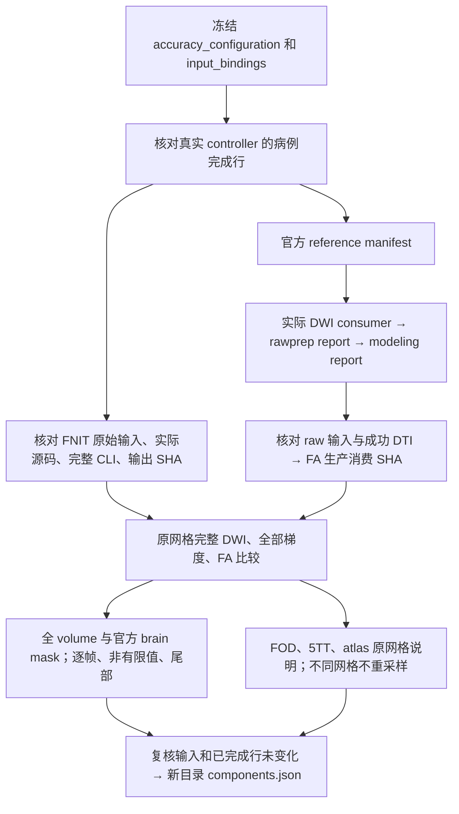
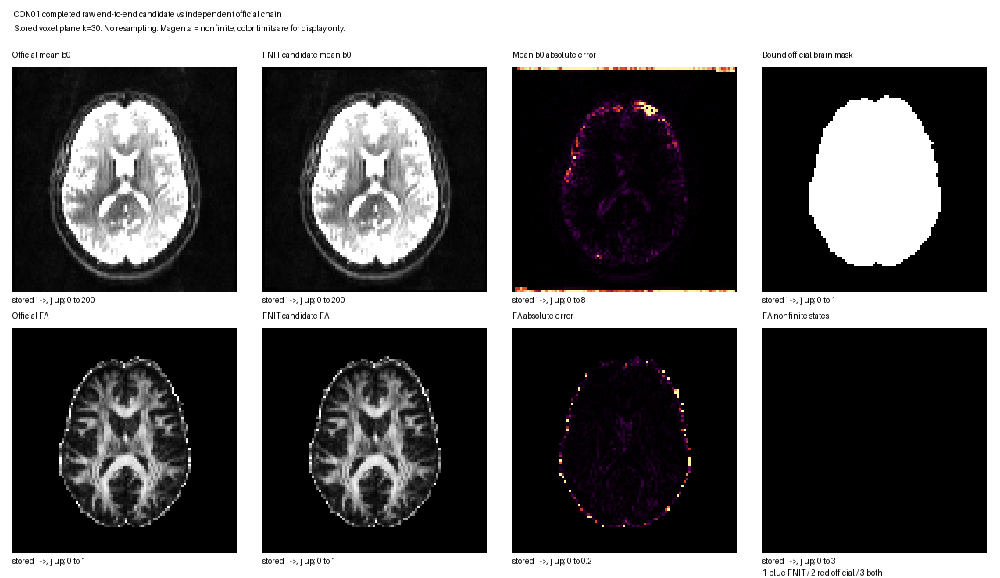

# raw-DWI 阶段的 CPU 只读比较器

## 1. 功能与流程

`compare_raw_components.py` 读取本轮已经完成的 FNIT raw-DWI 运行，比较完整校正 DWI、全部旋转梯度及 FA。官方参考从每个病例实际使用的 `reference_manifest` 取得 DWI consumer、rawprep 和 modeling report，并核对实际路径、SHA 和成功命令。CON11 沿自己的 producer 目录读取，不套用另外九例的目录。



本工具不运行配准、追踪、GPU 或原软件；`scientific_parity` 保持 `not_assessed`。不同校正 DWI、mask 和旋转梯度上的 FA 差异是 raw 全链阶段差异，固定输入 DTI 精度由 task_02 的独立验证报告说明。

## 2. Python 调用、输入与输出

```python
import importlib.util
from pathlib import Path

repository_directory = Path("/absolute/Fudan-Neuroimaging-toolkit")
comparison_script = repository_directory / "validation/connectome/accuracy_20261003/root/compare_raw_components.py"
module_specification = importlib.util.spec_from_file_location("raw_component_comparison", comparison_script)
comparison_module = importlib.util.module_from_spec(module_specification)
module_specification.loader.exec_module(comparison_module)

accuracy_configuration_file = Path("/absolute/new_accuracy_phase/formal_frozen_v1/accuracy_configuration.json")
accuracy_configuration_sha256 = "ACTUAL_FROZEN_CONFIGURATION_SHA256"  # 用正式冻结值，不用猜测值。
comparison_output_directory = Path("/absolute/new_accuracy_phase/components_CON01_candidate_v1")
comparison_report = comparison_module.execute(
    configuration=accuracy_configuration_file,
    digest=accuracy_configuration_sha256,
    output_dir=comparison_output_directory,  # 必须全新，并与 source/run/raw 目录隔离。
    case_ids=["sub-CON01"],
    versions=["candidate"],
)
```

参数及数据结构：

|参数|格式与含义|
|---|---|
|`configuration`|正式 JSON 的绝对路径；声明 `run_root`、科学源码 inventory、raw manifest、input bindings 和执行顺序。|
|`digest`|该配置的完整 SHA-256。配置、输入绑定和原始文件均复读核验。|
|`output_dir`|本轮新 namespace 内的全新目录；拒绝覆盖旧报告或写入源码、raw、官方 producer、实际 run 目录。|
|`case_ids`|病例 ID 列表；默认 canonical manifest 的全部病例。未知 ID 拒绝。|
|`versions`|`baseline`、`candidate` 列表；默认只比较 candidate。没有安排的组合列为 `not_scheduled`。|

实际读取的 DWI 是原保存的 NIfTI 4D、梯度是 FSL `3×N` bvec 与 `N` bval，`N` 必须等于全部 DWI 帧数。FA 是原保存的 NIfTI 3D；脑 mask 是官方 consumer 明确绑定的 binary volume，使用全部非零支持，不与 FNIT mask 求交。

输出 `components.json`：

- `coverage`：真正比较的病例/版本与未完成、未安排的组合。未完成 producer 不产生数值结果。
- `cases`：每例的候选/官方 producer、文件 SHA、DWI、旋转梯度、FA 和附属网格信息。
- `corrected_dwi`：全部原帧、全空间体素及官方 brain mask 的整体和逐帧统计，最大有限误差的原始 `ijk`。
- `rotated_gradients`：全部原帧的原向量、bval、norm、finite、exact-zero 支持、`b<50` 标签及有向/反向等价角度；不先把向量单位化或调换符号。
- `FA`：全体素和官方 mask 统计，原数组的精确 50/95/99/99.9 分位误差。
- `ancillary_geometry`：FOD、5TT 和八个 atlas 的原 shape/affine。不同网格为 `not_comparable_grid`；同网格为 `same_grid_not_numerically_assessed`，不冒充已比较数值。原 5TT 第四轴是 tissue channel；其未定义 spacing 报告为 `null`，同时保留 axis/type 和原 header 值。数组、header 与 affine 不修改。
- `immutable_files_verified_before_after`：实际复读文件的 path/size/SHA。其它病例可以进展，但选中病例已完成行必须保持相同。

`MAE=mean(abs(candidate-reference))`，`RMSE=sqrt(mean((candidate-reference)^2))`；相对 RMSE 的分母是官方值 RMS。分母为零返回 `null`，不引入任意常数。Pearson 使用 Double 分块中心矩合并，保留原数据精度。

任何非有限值仍计入全部体素/帧数，并分别列出 NaN、正负 Inf 与状态不一致数量。主统计遇到非有限值为 `null`；`finite_pair_diagnostic` 另列其实际分母。FA 全值分位数遇到非有限误差也为 `null`。不补零、不删异常体素或帧。网格容差为明确记录的 `1e-5 mm` affine 数值差，仅允许 header 浮点舍入；不交换数组轴或插值。

## 3. 命令行调用

```bash
accuracy_configuration_file=/absolute/new_accuracy_phase/formal_frozen_v1/accuracy_configuration.json
accuracy_configuration_sha256=ACTUAL_FROZEN_CONFIGURATION_SHA256
comparison_output_directory=/absolute/new_accuracy_phase/components_CON01_candidate_v1

# producer 的实际 completed 状态核验成功后才读取并比较其输出。
python validation/connectome/accuracy_20261003/root/compare_raw_components.py \
  --configuration "$accuracy_configuration_file" \
  --configuration-sha256 "$accuracy_configuration_sha256" \
  --case-id sub-CON01 --version candidate \
  --output-dir "$comparison_output_directory"
```

`--case-id` 与 `--version` 可以重复。只有 `baseline` 和 `candidate` 两种版本。依赖为主页 Conda 已包含的 NumPy/nibabel；比较过程关闭 GPU 即可运行。

### CPU 后台控制器

`control_raw_components.py` 是本轮私有验证控制器，源码 SHA 为 `9499c20c21b313a008e115b4b25df413638fcfd648d7d1ac14e6b3828d15b999`。它读取同一冻结配置，按实际计划处理十例 candidate 和两个配对 baseline；每 45 秒检查完成状态，不运行 MRI 求解器。实际完成后才调用上面的比较器，并核对 helper/configuration SHA、原 producer 完成行及成功报告 SHA。

本轮 CON01 baseline 的 v2 原报告复用；只复读其原报告、GPU/wall receipt 和全部 1,319 个绑定文件 SHA，不重新执行 MRI 计算。其它完成的组合各有独立 `results/<version>/<case>/components.json` 与 `receipts/<version>/<case>`，保存实际命令、CPU 环境、stdout/stderr、receipt 和 summary SHA。未完成或失败的 producer 保持 `not_assessed`，不读取 MRI 数组，不填结果。某次比较器自身失败为 `analysis_failed`，保留日志并不覆盖失败目录。

控制器状态在新 namespace `root_component_analysis_v1/status.json`。只有十例 candidate 的实际成功报告、原完成行、helper/config 和报告字节均通过核验，才创建 `all10_candidate_summary.json`；它仍保留 `scientific_parity=not_assessed`，不代替科学验收。12 个实际组合全部成功才标记 `all_twelve_actual_pairs_compared`。

复现启动参数由 `controller_v1_launch.json` 完整记录，包括正式配置 SHA、helper SHA、控制器 SHA、原 CON01 baseline v2 报告 SHA 和独立输出目录。启动需要 `CUDA_VISIBLE_DEVICES` 为空，CPU 线程各 1；输出目录必须全新，拒绝覆盖任何既有运行证据。

### 原报告的 CPU 收集器

`collect_raw_component_evidence.py` 只收集成功原报告，源码 SHA 为 `35496ed07b66e269e97b50efaaaad4d2ce4081fe78ce25b61dbbe22dead64a99`。它沿实际 controller status 中的 path/SHA 读取原 `components.json`、case summary、receipt 和 stdout/stderr，逐字节复制到独立的新目录；不按文件名猜 producer，不读取 MRI 数组、不执行求解或重采样。

默认请求十例 candidate，必须等实际 `all10_summary` 存在并精确覆盖十例，才收集。显式 `--case-id` / `--version` 可请求已经完成的子集或 CON03 配对；任一所请求组合未完成即拒绝，不为缺失病例填数。所有原 receipt 必须 exit 0、helper 前后 SHA 一致，且 producer 完成行和原报告 snapshot 相同。case summary 与原报告的非有限值统计逐项核对；原审核的全部 source/input/output 再做文件 SHA before/after 核验。

```bash
# 正式十例实际完成后，使用全新 output-dir；这是收集命令，不是 MRI pipeline 命令。
CUDA_VISIBLE_DEVICES= python validation/connectome/accuracy_20261003/root/collect_raw_component_evidence.py \
  --analysis-dir /absolute/new_accuracy_phase/root_component_analysis_v1 \
  --configuration /absolute/new_accuracy_phase/formal_frozen_v1/accuracy_configuration.json \
  --configuration-sha256 f8eba1cbf3eab2baa549172b32be2c9d3b1014ad478f6e3702d7987378f52f8c \
  --helper-sha256 08015c11c2662cb2f8115843414ed9148c1dadc60c175b66dcf20f51381c18ce \
  --output-dir /absolute/new_accuracy_phase/root_component_evidence_collection_all10_v1
```

输出每组合的原 bytes、`collection.json` 的原/复制文件 SHA、精确完成 coverage 和原非有限值统计；`scientific_parity` 仍为 `not_assessed`。该工具没有改原 reports、controller、冻结配置或科学源码。

## 4. 对应原软件调用

比较器不调用官方程序。实际官方命令和哈希来自成功的 producer，写入每例报告中的 `official_gradient_command`、`official_FA_command`。本轮原参考命令结构为：

```bash
# 此处是独立参考链的命令结构，生产 FNIT 不调用这些软件。
mrinfo corrected_dwi.nii.gz \
  -fslgrad eddy_rotated.bvec dwi.bval \
  -bvalue_scaling no -export_grad_mrtrix gradient_mrtrix.txt -nthreads 8
dwi2tensor corrected_dwi.nii.gz tensor.nii.gz \
  -grad gradient_mrtrix.txt -mask brain_mask.nii.gz -nthreads 8
tensor2metric tensor.nii.gz -fa fa.nii.gz -vector direction.nii.gz \
  -modulate none -mask brain_mask.nii.gz -nthreads 8
```

`-bvalue_scaling no` 只陈述本轮实际已保存的原参考命令，不改变 FNIT 新 `_gradients` 的官方 Auto 解释规则。比较器还验证 FA 消费的 tensor SHA 对应同一次成功 `DTI` 命令，及其 corrected DWI/mask/gradient 输入 SHA；不因文件名相同认定来源相同。

## 5. 最新精度、耗时和真实脑图

**目前完成本轮 CON01 baseline 与 candidate 的实际阶段比较；其它九例尚未由本工具分析。** 结果来自已经完成的 raw-DWI CLI，未重新运行求解或官方软件。下面区分协议核验和 MRI 输出比较：

|实际核验|覆盖|结果与 CPU 墙钟|
|---|---|---|
|初始 focused CPU tests，GPU 禁用|17 项|17 passed，1.16 s；原日志 `focused_cpu_v3.log`。|
|真实 source 空包标记问题的回归|21 项|21 passed，0.45 s；`focused_cpu_v4.log`。|
|真实 5TT undefined channel spacing 问题的回归|23 项|23 passed，0.51 s；`focused_cpu_v5.log`。受控 Inf affine 测试产生一条预期 NumPy warning，网格仍明确不可比较。|
|CPU 后台控制器与比较器协议回归|7 项控制器 + 23 项比较器|30 passed，0.46 s；`controller_cpu_v1.log`。包含未完成/失败不能汇总、原报告不可改标、非有限主统计保持 null 的回归。|
|原 bytes 收集器协议回归|7 项收集器 + 7 项控制器|14 passed，0.23 s；`collector_cpu_v1.log`。覆盖未完成 producer、篡改 summary、错误 helper SHA、输出隔离及 byte-for-byte 复制。|
|真实当前 all10 尚未完成的保护检查|真实冻结配置、controller source 和当前状态|按预期拒绝，输出目录未创建；`collector_all10_not_completed_guard_v1.json`。这是协议核验，不是十例收集结果。|
|官方真实 producer 与文件核验 v1|十例 CON01/03/04/05/06/07/08/09/10/11|325 个实际文件 before/after SHA，6.71859 s。|
|原 eeb 脚本的官方真实 producer 与文件核验 v2|同十例|325 个实际文件 before/after SHA，6.56676 s；`reference_gate_v2.json`。|
|实际 baseline CON01 MRI 比较|全部 102 帧、全 552,960 体素、官方 mask 115,226 体素|1,319 个文件 before/after SHA；比较器内计时 20.22309 s，nodecw10 进程墙钟 20.34487 s。|
|实际 candidate CON01 MRI 比较|同一完整采集及同一实际官方参考|1,319 个文件 before/after SHA；比较器内计时 20.45769 s，CPU 控制器记录进程墙钟 20.62075 s。|

**当前 helper SHA**：`08015c11c2662cb2f8115843414ed9148c1dadc60c175b66dcf20f51381c18ce`。成功原报告 `baseline_CON01_components_v2.json` 的 SHA 为 `1fa40b59e1e7e4db893a62737e388b1873cc4058cfaffe705dc1fb29ce6b335b`，远端原目录为 `root_components_CON01_baseline_v2`，本地副本保留原字节。冻结配置 SHA 为 `f8eba1cbf3eab2baa549172b32be2c9d3b1014ad478f6e3702d7987378f52f8c`。

`reference_gate_v2.json` 仍绑定旧 eeb 脚本 `eebd3ebe7308c0caf2d36bd0e6a501aef8a350017fe7261f9348fafe1a6a1e0f`，audit JSON SHA `865378820202c39e64478123c69a151b962a8e6d1a2ea607ba6243af8daa5a00`；没有将旧核验改标为新脚本运行。v1 原 JSON 也保留。二者计时仅为文件核验。

candidate 成功原报告 [`candidate_CON01_components_v1.json`](candidate_CON01_components_v1.json) SHA 为 `507cc3e8d99a57650521642f2ea98572308e794c9ab63c9a91b846c1f004e63c`。它的原 [`component summary`](candidate_CON01_component_summary.json) SHA 为 `264bf08cc71025705ef46e803452965ba49b2e46079ba3299a588ef2d13ac4c6`；原 [`receipt`](candidate_CON01_receipt.json) SHA 为 `b7dc25ce2f1c74a7aa15159749b3e461004fd691981dc3b3bfffdff972da451b`。三者均保留远端原 bytes；receipt 记录 exit 0、实际命令/CPU 环境、前后 helper SHA 及未变化的真实 producer 完成行。

|CON01 baseline 与实际官方原链|全 volume|官方 brain mask|
|---|---:|---:|
|DWI 全值 RMSE|1.56737662|1.06746881|
|DWI 全值相对 RMSE|3.94837685%|1.28319119%|
|DWI 全值 Pearson r|0.999087013|0.999869251|
|DWI 非有限值，双方各自|0 / 0|0 / 0|
|FA NaN，FNIT / 官方|36 / 37|35 / 37|
|FA 非有限状态不一致|3|2|
|FA **全值** RMSE / 相关性|`null` / `null`|`null` / `null`|
|FA 有限对诊断分母|552,922|115,189|
|FA **有限对诊断** RMSE|0.03072483|0.05449217|
|FA **有限对诊断** 最大误差|1.22474372|1.22469568|

全部 102 个 bval 逐值一致；全部 bvec/bval/norm 都是 finite，exact-zero 与 `b<50` 支持不一致均为 0。bvec 最大分量差 `0.004052603`，最大有向夹角 `0.314093906°`，norm 最大差 `7.61098e-8`。FA 的主统计保持 `null`，没有删除 NaN 后把有限对诊断冒充全值结果。FOD 与八个 atlas 仅核对同网格；5TT 为不同网格，不重采样比较。

**CON01 candidate 与 baseline 的核对：** 官方 producer 和所有官方文件相同；FNIT 的 corrected DWI、全部 bvec、bval 与 mask 文件 SHA 也分别相同。因此 DWI 全 volume/官方 mask 的完整统计及全部梯度行、finite/norm/zero/b0 支持检查，与上表 baseline 逐项相同。

|CON01 raw 全链 FA 对同一官方输出的比较|baseline|candidate|候选减基线|
|---|---:|---:|---:|
|全 volume：FNIT / 官方 NaN|36 / 37|36 / 37|数量和位置不变|
|官方 mask：FNIT / 官方 NaN|35 / 37|35 / 37|数量和位置不变|
|全 volume / mask 非有限状态不一致|3 / 2|3 / 2|0 / 0|
|全值主统计 MAE、RMSE、max、相关性|均 `null`|均 `null`|不计算|
|全 volume 有限对分母|552,922|552,922|0|
|全 volume **有限对诊断** RMSE|0.0307248276885|0.0307237379371|-1.08975132e-6|
|全 volume **有限对诊断** 最大误差|1.22474372387|1.22474265099|-1.07288361e-6|
|官方 mask 有限对分母|115,189|115,189|0|
|官方 mask **有限对诊断** RMSE|0.0544921716023|0.0544893720651|-2.79953720e-6|
|官方 mask **有限对诊断** 最大误差|1.22469568253|1.22469568253|0|

完整原 FA 数组另作 CPU 只读核对：baseline/candidate 的 NaN 支持和全部非有限支持均逐体素相同。该检查及误差差值保存在 [`candidate_CON01_baseline_comparison.json`](candidate_CON01_baseline_comparison.json)，SHA `ceac455b1edc42d3d255929983f4c204d36573192dd6b501eb8e93ae7bf71835`。有限对 RMSE 的下降很小，较大尾部仍存在；不能称 raw 全链已经与官方匹配。

这张图直接读取成功报告绑定的 CON01 baseline 与原官方 DWI/FA/mask，显示原保存网格 `k=30` 切片；无重采样，紫色明确表示非有限 FA。显示范围仅用于图像，不参与全部体素误差计算。


candidate 的同一原网格、同一 `k=30` 示例直接读取实际成功报告绑定的文件；图前后 SHA 核验、原图 SHA 和 slice/display 策略写入 [`candidate_CON01_brain_receipt.json`](candidate_CON01_brain_receipt.json)。PNG SHA 为 `a3056761195177c9cf154c2abfad348b811fa3305410b12bac9b63aaad013c2a`。



同例 raw CLI 实际耗时 baseline `2200.811193 s`、candidate `2072.132814 s`，单次顺序观测下降 `5.84686%`；共享负载下该数值不能独自归因于代码优化，也不是全十例的速度验收。双方报告的 allocator 与 sampled process-tree 均观察到低于预算；连续 process-tree 严格上界未证明。两次组件 CPU 比较的约 20 s 不计入 raw CLI 速度结论。

这些结果是不同校正 DWI/mask/旋转梯度的 **raw 全链阶段差异**，不代表固定输入 DTI 的误差。本工具不定义额外科学验收门槛，`scientific_parity=not_assessed`；完整 raw10 与原官方链的重复性、速度和 `<20e9` 显存验收由总控制执行。

## 6. 最近版本和 benchmark 记录

- 2026-10-03 v1：沿实际 `reference_manifest.source.official_dwi_contract` 实现严格来源核对。原 manifest 不含 `status` 或 `raw_case_binding.source_consumers`，使用实际 `state`/`execution_completed` 和存在的 producer 绑定。
- 同日：补齐官方 tensor → FA 生产/消费 SHA、原始 raw 文件实际 SHA 和 candidate corrected 文件所属实际 job 的检查；不改生产 `src`/`tools`。
- 同日 v2：未安排 baseline 组合明确列为 `not_scheduled`，不会把没有 producer 的组合当已比较。新增单元测试后，协议 fixture 缺少新增要求的 `input_files` 导致一次测试失败；补 fixture 后 17 项全通过，来源检查没有放宽。
- 保留 v1/v2 原 audit 与最终 CPU 测试日志；所有记录都明确 `scientific_parity=not_assessed`。本工具不改变本轮冻结的科学源码、旧 reference 或旧 frozen 配置。
- 实际 baseline 首次比较失败：冻结 source inventory 含合法零字节 `__init__.py`，原通用非空 producer guard 误拒绝。现仅科学源码 inventory / loaded-source 允许零字节，仍要求 exact SHA 和 before/after 文件不变；raw、MRI、contract 和输出继续要求非空。原 eeb 源码快照与 `baseline_CON01_initial_failure.json` 保留。
- 修正后实际比较第二次失败：原官方 5TT header 的 channel spacing 为 NaN，严格 JSON 序列化拒绝。原中间 0f9 源码快照、真实 stderr 与 `baseline_CON01_serialization_failure.json` 保留；失败的空 `root_components_CON01_baseline_v1` 未覆盖。新 helper 只显式记录未定义元数据，并在创建输出目录前完成严格 JSON 序列化，不改 header、数组、网格判定或统计。
- 最新 23 项 CPU 回归后，在全新 `root_components_CON01_baseline_v2` 完整重做来源及文件 before/after 核验，成功返回 exit 0。本地完整原报告、执行日志和摘要均保存实际 SHA；没有为失败目录补造完成记录。
- CPU 后台控制器实际启动于 nodecw10，PID 185524，使用最终 helper/configuration SHA。bootstrap 时原 CON01 baseline 报告及全部 1,319 个绑定文件复核完成，4.98121 s；candidate CON01 当时仍在运行，其余 producer 未启动，`all10_summary=null`。`controller_v1_bootstrap_snapshot.json` 是该时刻的实际状态快照，不能当未来完成结果；运行中的实际状态以远端 `status.json` 为准。
- CON01 candidate 的实际 producer 完成后，后台控制器于 UTC `2026-10-03T07:29:09` 启动 CPU 比较，UTC `07:29:30` 完成。原报告、summary 与 receipt 复制保留原字节；公开示例仅包含原网格脑切片，没有复制发布完整 MRI 数组。控制器和科学冻结源码/配置没有改动，继续等待其它病例；此处覆盖仍为 CON01 baseline + candidate，不代表十例完成或整链匹配。
- 准备原 bytes 收集器：独立 nodecw10 CPU 工具目录，复用相同 SHA 的 controller source gates；14 项 CPU 协议回归通过。真实全十例请求在 `all10_summary=null` 时明确拒绝，保留原 log/receipt 且没有创建集合目录。CON03 候选已完成的数据只作只读核验汇报；其配对 baseline 未完成时不在这里添加配对数字或重复复制大 JSON。完整配对与十例收集等待真实 producer 完成。

## 7. 参考文献与原软件代码库

- [MRtrix3 实际精确 commit 026e850d](https://github.com/MRtrix3/mrtrix3/tree/026e850d171ec2a12f09865d31b8332d23d7ecf6)。
- [gradient.cpp](https://github.com/MRtrix3/mrtrix3/blob/026e850d/core/dwi/gradient.cpp)、[dwi2tensor.cpp](https://github.com/MRtrix3/mrtrix3/blob/026e850d/cmd/dwi2tensor.cpp)、[tensor2metric.cpp](https://github.com/MRtrix3/mrtrix3/blob/026e850d/cmd/tensor2metric.cpp)。
- [nibabel](https://github.com/nipy/nibabel)，本工具沿用 FNIT 的 nibabel 数据读写策略。
- Tournier JD et al. MRtrix3: A fast, flexible and open software framework for medical image processing and visualisation. *NeuroImage*, 2019, 202:116137。
- [OpenNeuro ds001226](https://openneuro.org/datasets/ds001226)；原始下载、snapshot 和 CC0 许可由原 canonical raw manifest 绑定。本提交只有比较代码、协议测试、来源记录和已有公开脑图链接，未复制发布受试者完整体积或上游程序。
