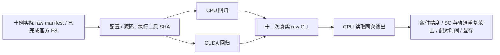

# 正式精度运行的来源与回归记录

## 1. 功能与流程

这里保存实际冻结配置、输入绑定和结束的回归日志。真实 raw-DWI 求解及其后续 CPU 比较另存报告；测试通过不代表整链已进入官方重复范围。



科学基线为 `7af34e6d072e843fb2558c931bb2781f1d4b0be9`，候选来源为 `1fe86ab8347b29d9c47be8109627736576222912`。后续说明和验证代码提交不改变这份候选科学源码。

## 2. Python 读取、输入与输出

```python
import hashlib
import json
from pathlib import Path

evidence_directory = Path("/absolute/Fudan-Neuroimaging-toolkit/validation/connectome/accuracy_20261003/root/execution_v1")
configuration_file = evidence_directory / "formal_frozen_v1/accuracy_configuration.json"
configuration_bytes = configuration_file.read_bytes()
assert hashlib.sha256(configuration_bytes).hexdigest() == "f8eba1cbf3eab2baa549172b32be2c9d3b1014ad478f6e3702d7987378f52f8c"
accuracy_configuration = json.loads(configuration_bytes)
print(accuracy_configuration["execution_order"])  # 实际十二次安排，不等同于十二次已完成。
```

- 配置 JSON：实际服务器路径、双版本源码 SHA inventory、工具和 archives SHA、参数及执行顺序。`git_origin_commit` 是 archive 的来源；archive 目录没有 Git 时不伪造其 `git_commit`。
- `input_bindings_v1.json`：逐例实际原始输入、已完成官方 anatomy、前轮运行及官方独立 producer 的路径和 SHA。
- `inventory.json`：复制前后核验的原文件位置、大小和 SHA。正文记录的时间只取对应实际日志。
- `regression/`：原失败与成功日志分别存放；没有将失败文件改名为成功。

配置 SHA 如上；两份科学源码指纹为 baseline `328c398496c5b90f459381ca462ba6597cbbe5f2e9700f0b1a273f1408962bac`、candidate `a27fe1ad0aca34c23b62017dc0bacb6b7a4c44d3423bf855a840509ffc1b6e82`。输入 raw manifest SHA 为 `cc33e925a9e07362103b51f7bb70363a380d89b11a19545837676ba9a4ffae70`。

## 3. 命令行调用

实际 CPU 回归在 nodecw10，GPU 回归在 gpucw1，共用主页 Conda 环境和独立测试 checkout。原命令与进程时间在各自 `status.json`；CPU 命令如下：

```bash
test_checkout_directory=/absolute/root_integrated_tests_v3
cd "$test_checkout_directory"
# CPU gate；测试 checkout 同时包含项目既有 validation 和 atlas 测试资源。
CUDA_VISIBLE_DEVICES= PYTHONPATH="$test_checkout_directory/src" \
  python -m pytest -q tests/connectome tests/eddy tests/topup
```

CUDA gate 使用已核实 H100 UUID、共享 flock 和 `python -m pytest -q tests/connectome`。CPU 比较器的正式运行见[输入与命令](../RAW_COMPONENT_COMPARATOR.md)。产品使用方法见[完整 pipeline 文档](../../../../../docs/connectome/README.md)。

## 4. 原软件调用

这些回归没有运行 FSL/MRtrix/FreeSurfer solver。官方参考是绑定的已完成独立 raw 链；各命令和二进制 SHA 取自对应实际 producer。组件新执行的官方命令见[五项精度验证](../../../../../docs/connectome/ACCURACY_OPTIMIZATION_20261003.md#4-对应官方步骤)。

## 5. 实际回归结果、时间与脑图

| gate | 范围 | 实际 pytest 结果 | pytest 时间 / 外层进程时间 |
|---|---|---|---|
| CPU retry2 | connectome、EDDY、TOPUP | 752 passed、63 skipped、362 subtests passed | 42.78 / 43.492 s |
| CUDA retry2 | connectome | 717 passed、7 skipped、362 subtests passed | 74.50 / 75.690 s |

CPU 比较器另有 17 项协议回归，1.16 s，见上层 `focused_cpu_v3.log`。回归时间不是原始数据 pipeline 时间；回归没有代替整链显存或科学验收。

最初 collection 缺少既有 validation 下载脚本，随后 fixture 缺少 Tian S1 atlas。部署实际已有测试资源后 retry2 通过；科学源码仍是原冻结版本。失败日志保留其原名，缺少的 launcher 状态也不补造。

真实 MRI 脑图及同输入精度见[本轮总说明](../../../../../docs/connectome/ACCURACY_OPTIMIZATION_20261003.md)与 task 1–5。此目录不使用测试数组制作 benchmark 脑图。

## 6. 最近记录

- 2026-10-03：科学源码、实际配置及输入绑定冻结；两次部署 gate 失败均阻止正式 raw 运行。
- 同日：补齐既有测试资源；CPU/CUDA gate 通过后开始正式十二次运行。
- 同日：收集结束的 regression logs，所有十份复制文件前后 SHA 一致。实际 raw 结果及其联合判定待运行和比较完成后补充。

## 7. 参考与原实现

- [UKB-connectomics](https://github.com/sina-mansour/UKB-connectomics)
- [MRtrix3 实际参考 commit](https://github.com/MRtrix3/mrtrix3/tree/026e850d171ec2a12f09865d31b8332d23d7ecf6)
- [OpenNeuro ds001226](https://openneuro.org/datasets/ds001226)：前轮新下载，CC0，实际快照和文件 SHA 在 raw manifest。
- Tournier JD et al. MRtrix3. *NeuroImage* 202, 116137 (2019)。
