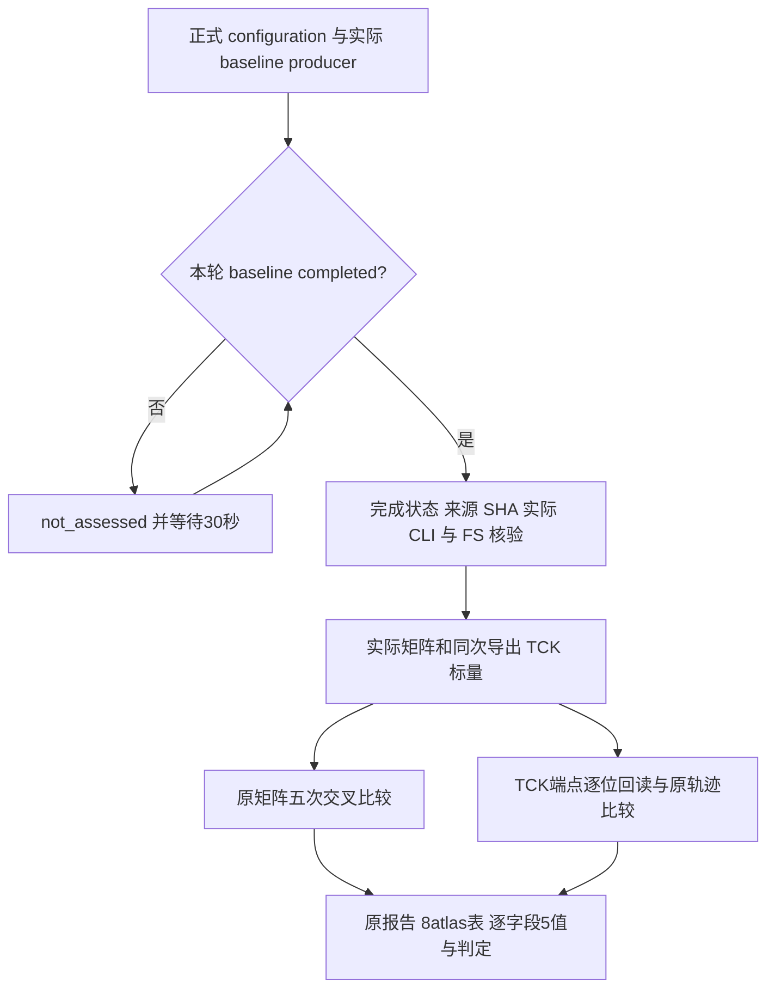
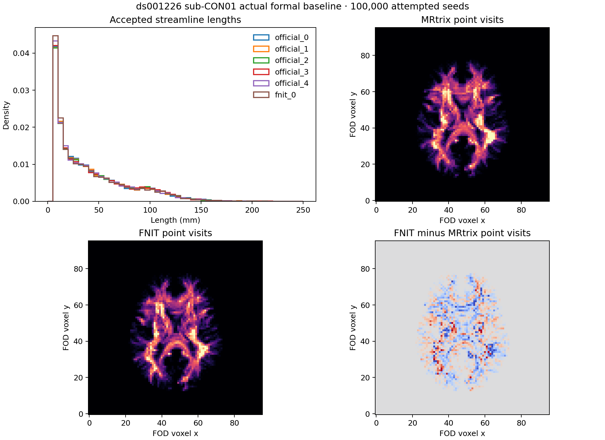

# 本轮实际 baseline 的矩阵与轨迹比较

## 1. 功能简介

从正式 `raw12` 中读取实际 baseline CON01/03，对各自已完成的官方五 seed 参考，复用冻结分析器的矩阵与轨迹验收。生产代码、配置、官方来源、指标和门槛不变；只在 nodecw10 CPU 读取已经保存的输出。CON01 已完成本轮分析，CON03 尚未完成 baseline，当前记录为 `not_assessed`。



每例只有一个实际 FNIT seed，自重复性保留 `not_assessed`。`analysis_completed` 表示读取和比较完成；当前两臂的整体科学状态仍均为 `failed`。

## 2. Python 调用、输入与输出

这是私有 CPU 控制器，没有新增公共库接口。实际解释器为 nodecw10 已有 Anaconda Python 3.11.7，NumPy 1.26.4、nibabel 5.4.0、SciPy 1.11.4、Matplotlib 3.8.0；没有安装新包。

```python
import os
import subprocess

analysis_environment = dict(os.environ, CUDA_VISIBLE_DEVICES="")  # 显式隐藏GPU
analysis_command = [
    "/home1/gongwk/anaconda3/bin/python3.11",
    "/data/private_cpu_tools/analyze_actual_baselines.py",        # 本记录的控制器
    "--configuration", "/data/formal_frozen/accuracy_configuration.json",  # 原冻结配置
    "--frozen-tools", "/data/formal_frozen/tools_source/tools",   # 读取原科学工具
    "--output-dir", "/data/new_baseline_matrix_analysis",        # 必须不存在的新目录
    "--poll-seconds", "30",                                    # 仅状态等待，不增加科学预算
    "--timeout-hours", "24",                                   # 未完成时保存not_assessed
]
subprocess.run(analysis_command, env=analysis_environment, check=True)
```

输入分别为：原 configuration；本轮 `formal_accuracy_raw_v1/baseline/CASE/gpu_report.json` 与 wall；同次 `connectome` 四矩阵、atlas/nodes；同次导出的 `tracks.tck`、WM FOD 网格和 `track_metrics.npz`；逐例原官方 manifest 与五份 TCK。数据由原 `completed_run(config, case, 'baseline', actualFSdir)`、`verified_export`、`matrix.compare`、`population.compare` 和 `decisions` 验证。TCK 回读端点与返回对象保存的端点 dtype/数值逐位一致，weights/lengths/mean_fa/endpoints 数量必须与轨迹数相同。

服务器新输出为 `newroot/root_baseline_matrix_analysis_v1`，其中 `newroot=/cwStorage/home/gongwk/Notebook_code/fnit_connectome_accuracy_20261003_v1`。目录包含逐例原 `matrix_envelope.json`、`population_envelope.json`、PNG、`case_report.json`、`eight_atlas_summary.csv` 和 `five_comparisons_by_field.json`。控制器 `report.json` 包含真实 argv、配置/辅助源码/TCK 的前后 SHA、原输入来源、两例状态与实际 CPU 时间。本提交按原字节保存 CON01 文件及 [CON03 等待快照](evidence/first_controller_report.json)，原体积与 TCK 不复制进仓库。

## 3. 命令行调用及参数

实际命令和 PID 11158 见 [启动收据](candidate_CON01_binding_receipt.json)。复现须使用新的输出目录，不重复启动当前控制器。

```bash
CUDA_VISIBLE_DEVICES='' PYTHONDONTWRITEBYTECODE=1 \
/home1/gongwk/anaconda3/bin/python3.11 \
  /data/private_cpu_tools/analyze_actual_baselines.py \
  --configuration /data/formal_frozen/accuracy_configuration.json \
  --frozen-tools /data/formal_frozen/tools_source/tools \
  --output-dir /data/new_baseline_matrix_analysis \
  --poll-seconds 30 --timeout-hours 24
```

`--configuration`、`--frozen-tools`、`--output-dir` 均必填，含义如上一节。`--poll-seconds` 默认30，允许1–60秒；`--timeout-hours` 默认24，允许大于0且不超过48小时。两例固定为 CON01/03，不增加其他 baseline。正式 config SHA 必须为 `f8eba1cbf3eab2baa549172b32be2c9d3b1014ad478f6e3702d7987378f52f8c`，科学 baseline fingerprint 必须为 `328c398496c5b90f459381ca462ba6597cbbe5f2e9700f0b1a273f1408962bac`；100k seeds、seed0 保持。等待时没有 GPU 作业或 SSH channel 长期占用。

## 4. 对应原软件调用

控制器只比较已有结果，没有对应的原软件求解命令。参考源由原官方 manifest 绑定为独立 raw DWI + official FS 全链，保留当时实际命令、全部输出 SHA 和五 seed 来源；原 MRtrix3 binary 为 `3.0.3-103-g026e850d`。对应追踪形式为：

```bash
MRTRIX_RNG_SEED=0 tckgen wm_fod_norm.nii.gz tracks.tck \
  -algorithm iFOD2 -seed_gmwmi gmwmi.nii.gz -act five_tissue.nii.gz \
  -seeds 100000 -select 0 -maxlength 250 -cutoff 0.1 -samples 3 -power 0.5
```

原五次使用各自已记录的 seed。实际参考目录是 `oldroot/task_04/official_raw10_cpu_group_A_v3/sub-CON01`，其中 `oldroot=/cwStorage/home/gongwk/Notebook_code/fnit_connectome_tenraw_20261002`；manifest SHA 为 `64b9066e465ddc1ae8e688c1fec48b2a5611a6312b8637a302fb5404e7d7ca5a`。所有比较先检查 canonical raw 及官方 producer/实际执行来源；不以固定 FNIT 中间输入的 operator 参考替换官方 wholechain 来源。

## 5. 最新真实结果、耗时与图

### 本轮 CON01 baseline 对官方五次

[本轮运行收据](evidence/sub-CON01/run_receipt.json) 保存实际 argv、raw/FS来源及前后科学源；[原GPU报告](evidence/sub-CON01/original_gpu_report.json) 与 [原wall报告](evidence/sub-CON01/original_wall_report.json) 按原字节保留。实际 baseline 保留 **14,300** 条轨迹。矩阵 **180/240** 项通过、60失败；population **4/25** 项通过、21失败，均无未评估项。原报告分别为 [matrix](evidence/sub-CON01/matrix_envelope.json)、[population](evidence/sub-CON01/population_envelope.json)。完整五比较值/门槛/判定在 [48个字段记录](evidence/sub-CON01/five_comparisons_by_field.json)，每个字段含五个原官方 seed 的比较；[CSV](evidence/sub-CON01/eight_atlas_summary.csv) 每行一套atlas。

每格为通过数/5，合计分母30：

| Atlas | Count L1 | FBC L1 | Dice | Pearson | Length MAE | FA MAE | 合计 |
|---|---:|---:|---:|---:|---:|---:|---:|
| aparc+tian-s1 | 5/5 | 5/5 | 3/5 | 5/5 | 5/5 | 2/5 | 25/30 |
| aparc.a2009s+tian-s1 | 3/5 | 3/5 | 4/5 | 1/5 | 5/5 | 4/5 | 20/30 |
| fs-aparc | 5/5 | 3/5 | 4/5 | 5/5 | 5/5 | 2/5 | 24/30 |
| glasser+tian-s1 | 2/5 | 5/5 | 2/5 | 5/5 | 3/5 | 3/5 | 20/30 |
| glasser+tian-s4 | 2/5 | 5/5 | 2/5 | 5/5 | 3/5 | 2/5 | 19/30 |
| schaefer1000+tian-s4 | 3/5 | 5/5 | 1/5 | 1/5 | 5/5 | 2/5 | 17/30 |
| schaefer200+tian-s1 | 5/5 | 5/5 | 5/5 | 5/5 | 4/5 | 5/5 | 29/30 |
| schaefer500+tian-s4 | 5/5 | 5/5 | 3/5 | 4/5 | 5/5 | 4/5 | 26/30 |

### 本轮 CON01 baseline 与已绑定 candidate

[C 原报告](candidate_CON01_report.json) 的 actual GPU/wall、配置、科学源和输出 SHA 已再次只读核验，见 [绑定收据](candidate_CON01_binding_receipt.json)；它保留 **14,431** 条轨迹。双方都来自当前正式 `formal_accuracy_raw_v1`，不是前轮 baseline。下表由原报告的判定直接汇总；[比较摘要](CON01_same_phase_comparison_summary.json) 保留数值、门槛身份与原 C 报告 SHA。

| 矩阵字段（各/40） | 本轮B | 本轮C | 通过数变化 |
|---|---:|---:|---:|
| count_relative_l1 | 30 | 25 | -5 |
| sift2_fbc_relative_l1 | 36 | 29 | -7 |
| count_support_dice | 24 | 33 | +9 |
| count_pearson | 31 | 30 | -1 |
| mean_length_common_normalized_mae | 35 | 38 | +3 |
| mean_fa_common_normalized_mae | 24 | 32 | +8 |
| 合计（/240） | 180 | 187 | +7 |

两臂48组矩阵字段的官方 pair 值与门槛完全相同。Count L1、FBC L1 和 Pearson 通过数下降；Dice、Length、FA 通过数增加，没有所有指标都改善的结论。

| Population字段（各/5） | 本轮B | 本轮C |
|---|---:|---:|
| accepted_fraction_absolute_difference | 2 | 5 |
| length_ks | 1 | 5 |
| endpoint_8mm_histogram_pearson | 0 | 2 |
| tdi_native_voxel_pearson | 0 | 1 |
| tdi_four_voxel_block_pearson | 1 | 0 |
| 合计（/25） | 4 | 13 |

轨迹工具的8mm endpoint bins 由每次比较中全部运行的端点 extrema 独立构建，其他病例或运行可不同。本例实际逐项核对 B/C `endpoint_bin_edges_mm`、公共网格 shape/affine 及五字段官方 pair 值/门槛，均完全相同。接受比例差上限为 `.00223`，length KS 上限为 `.01620673531708`。本例 `+9` 是原五字段比较的通过判定数变化，不能称为总体准确率或完全匹配。Native/coarse TDI 仍是保存采样点逐个 `np.rint` 到公共网格的 point visits，定义未改成 tckmap。

本次 baseline CPU 分析 **6.832 s**；candidate 已有 CPU 分析 **7.917 s**，二者读取范围/前后复核不同，不作为性能比较。正式 raw-DWI CLI B为 **2200.811 s**，C为 **2072.133 s**；导出在计时结束后另计 **5.383/5.080 s**。这是共享负载下的当前CON01配对观察，整体速度判断由正式两例AB/BA及后续汇总负责。三类GPU显存 ledger/采样数据保留原 GPU/wall 报告，本 CPU 比较不产生新的GPU显存测量。



图中 `fnit_0` 为本轮baseline；中间FOD voxel z附近五层 point visits 原样汇总，只作展示，所有判定使用完整轨迹和网格。

## 6. 更新记录与待完成部分

- 科学起点 `7af34e6d`，正式配置 `f8eba1cb`，两例baseline科学fingerprint `328c3984`。
- 当前独立worktree从 `b2d1476f93614c9359025a969c50d3c2ac5879ac` 开始，只增加私有 CPU 控制器与本目录证据。
- CON01：实际完成且所有原报告/export/helper/config/TCK前后SHA通过，端点和标量数量通过。控制器SHA `30a11ba5c31d5ab023bd73479961ff710a1cacbaf052e822345b559b5ffdbfdc`。
- CON03：本次提交时实际baseline未完成，快照保留 `not_assessed`；PID11158继续等待。后续只在本轮实际completed后另提交其原报告，未增建十例baseline或修改门槛。

## 7. 工具、原实现及参考依据

- [冻结分析器的仓库来源](../../../../tools/analyze_connectome_accuracy_cohort.py)：`completed_run`、同次导出与原判定聚合。
- [矩阵比较](../../../../tools/benchmark_connectome_raw_cohort_envelope.py)、[重复范围](../../../../tools/connectome_repeat_common.py)、[轨迹比较](../../../../tools/benchmark_connectome_tracking_population.py)：定义、原始来源核验与有限官方重复范围。
- [本轮总说明](../../../../docs/connectome/ACCURACY_OPTIMIZATION_20261003.md)、[十例实际来源说明](../../../../docs/connectome/actual_cohort_comparison.md)：raw/FS来源及完整pipeline科学验收。
- [MRtrix3原代码库026e850d](https://github.com/MRtrix3/mrtrix3/tree/026e850d)、[iFOD2原实现](https://github.com/MRtrix3/mrtrix3/blob/026e850d/src/dwi/tractography/algorithms/iFOD2.h)、[ACT原实现](https://github.com/MRtrix3/mrtrix3/blob/026e850d/src/dwi/tractography/ACT/method.h)。模型文献与参数的完整说明见总说明参考文献；本 CPU 控制器未移植或重新执行原求解器。
