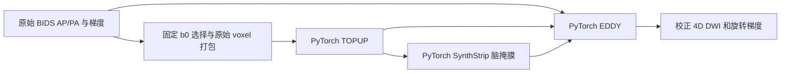
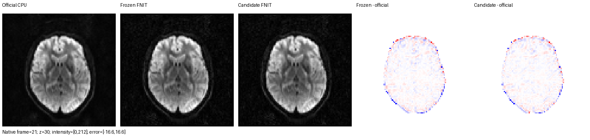
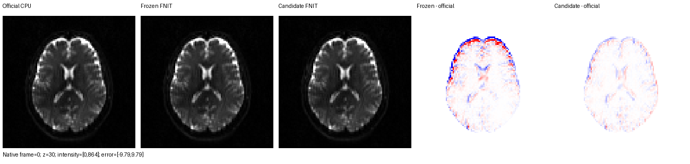

# raw BIDS 输入与 EDDY 数值精度诊断：两种候选均拒绝

## 1. 功能简介

本轮从 `7af34e6d072e843fb2558c931bb2781f1d4b0be9` 核对十例真实 ds001226 数据的 TOPUP→SynthStrip→EDDY 输入，定位 EDDY 的刚体旋转数值误差，并做 CON01/03 完整 EDDY 同输入验证。两种候选均未通过两例联合精度门槛，生产科学文件保持原版。原始 BIDS、metadata、b0 选择、网格、readout、GP seed、八轮 schedule 均按冻结合同使用。

成熟子函数 `fsl_rotation_matrix` 的具体问题：坐标 GEMM 已局部采用 FP32，`Rx @ Ry @ Rz` 仍使用 TF32。近单位旋转的余弦在乘法前被截断，产生随运动增大的固定参数渲染偏差。候选 v1 在两个矩阵产品中关闭 TF32，并在 `finally` 恢复调用者状态。候选 v2 另复用现有 TOPUP periodic CUDA cubic sampler，以 float32 输入/输出和 double 权重/累加渲染。接口、角度、旋转顺序和算法预算均未改变，无新增依赖。

固定官方参数时，两种候选显著减少渲染误差；完整优化后的 CON03 图像 RMSE 却增加 17.16%/44.55%，outlier 差异也增加。局部数学修正没有取得当前完整算法的精度收益，因此保留候选 patch 和实验工具，撤回生产修改及 EDDY 缓存 revision。优化轨迹与官方的差异仍需定位。

输入准备路径如下；本报告只交付前处理子任务，完整连接组 CLI 验收由总任务汇总。



## 2. Python 调用、输入与输出

```python
from fnit import TorchEDDY

corrected_result = TorchEDDY(
    device="cuda:0",  # 实际目标 GPU；本轮用 CUDA_VISIBLE_DEVICES 绑定 H100 UUID
).run(
    imain="/data/raw/AP.nii.gz",            # 原网格 4D DWI，最后一维为 N 帧
    mask="/data/eddy/nodif_brain_mask.nii.gz",  # 同网格 3D 二值脑掩膜
    acqp="/data/topup/acqparams.txt",       # 每行 PE 三向量与秒单位总 readout
    index="/data/eddy/eddy_index.txt",      # N 个从 1 开始的 acqp 行号
    bvecs="/data/raw/AP.bvec",              # 3×N 梯度；在输入存储 voxel 轴下定义
    bvals="/data/raw/AP.bval",              # N 个 b 值，单位 s/mm²
    topup="/data/topup/fieldmap_out",       # 自产 TOPUP fieldcoef/movpar 的共同前缀
    ref_scan_no=76,                         # 从 0 开始的参考帧；CON01=76，CON03=0
    gp_seed=12345,                          # 同输入精度 benchmark 固定 GP 选点种子
    out="/data/eddy/data",                  # 所有 EDDY 输出共同前缀
    overwrite=False,                       # 已有目标输出时拒绝覆盖
)
```

输入和输出保持 [EDDY 功能说明](../../../../docs/eddy/README.md) 的完整公开结构：校正 NIfTI shape 与原 DWI 相同；`data.eddy_rotated_bvecs` 为 3×N；`data.eddy_parameters` 每帧 16 列，为六个运动参数（mm/rad）和十个二次 EC 参数；`data.eddy_outlier_map` 为 N×Z，b0 行为零；另含离群强度、报告、相对/绝对运动 RMS 和 QC。缺少必需文件、网格/帧数不匹配或非法参考帧会报错。

内部 `fsl_rotation_matrix(angles)` 的唯一参数 `angles` 为 `(...,3)` PyTorch tensor，三列按 x/y/z 弧度排序；返回同设备、同 dtype 的 `(...,3,3)`，采用 FSL 的 `Rx Ry Rz` 顺序。拒绝的候选采用局部精度例外，默认全局 TF32 保留。实验 patch 见 [candidate_rotation_v1.patch](candidate_rotation_v1.patch) 和 [candidate_fused_v2.patch](candidate_fused_v2.patch)。

候选曾给 EDDY stage 指纹加入 `numerical_revision`，使 EDDY 重算而复用同输入 TOPUP/已完成解剖结果；该修改随候选撤回。[候选阶段回归](experiment_cache_candidate_v2.py) 与已有 BIDS 回归共 13 项通过。所有候选测试位于本实验目录，只能对下述冻结候选源运行，未加入产品测试；实验文件名不进入默认 pytest 自动搜集，显式指定冻结源和文件才运行。

十例当前审计见 [raw_contract_audit_v1.json](raw_contract_audit_v1.json)：实际重读 110 个冻结 raw 文件 SHA-256，全部匹配。两侧 TOPUP 打包数组/affine、acqparams、EDDY index 一致；每例 DWI/bval/bvec 均为 102 帧，参考帧属于 b<100 的 b0，掩膜保留 AP 网格。AP/PA 打包继续按已披露的 AP-first header 直接保留 voxel；本次原 JSON 的 `.0266003` 与 legacy stage `.0266` 单列，不通过改 metadata 提高当前 oracle 指标。

## 3. 命令行调用

旋转子函数没有独立 CLI。现有 `fnit eddy` 入口调用同一 EDDY 后端；完整参数见功能说明。私有 benchmark 工具不接入生产入口。

```bash
# 在 FNIT 主页 Conda 环境中运行；所有目录先创建于新的 benchmark 根。
CUDA_VISIBLE_DEVICES=GPU_UUID PYTORCH_CUDA_ALLOC_CONF=expandable_segments:True \
python validation/connectome/accuracy_20261003/task_01/benchmark_eddy_pair.py \
  --baseline-source /data/frozen_baseline \
  --candidate-source /data/frozen_candidate \
  --reference-root /data/private_official_reference \
  --output /data/new_EDDY_pair --subjects CON01 CON03

# 只读核对 raw 文件、packing、metadata、梯度和帧约定，不调用任何 GPU 算子。
python validation/connectome/accuracy_20261003/task_01/audit_raw_contract.py \
  --manifest /data/frozen_input_manifest.json \
  --routes /data/explicit_official_case_routes.json \
  --output /data/new_raw_contract_audit.json

# v2 分别补 CON01/03 一臂，不作为新的配对计时或 ABBA。
CUDA_VISIBLE_DEVICES=GPU_UUID PYTORCH_CUDA_ALLOC_CONF=expandable_segments:True \
python validation/connectome/accuracy_20261003/task_01/benchmark_eddy_single.py \
  --source /data/frozen_rotation_fused_candidate \
  --reference /data/private_official_reference/sub-CON01 \
  --paired-summary /data/immutable_pair_CON01.json \
  --subject CON01 --output /data/new_v2_CON01_arm

# 完整输出逐帧梯度验收；所有文件只读，输出为新 JSON。
python validation/connectome/accuracy_20261003/task_01/audit_saved_gradients.py \
  --reference /data/private_official_reference/sub-CON03/eddy/data.eddy_rotated_bvecs \
  --bvals /data/private_official_reference/sub-CON03/raw/AP.bval \
  --run baseline=/data/new_EDDY_pair/CON03/baseline/data.eddy_rotated_bvecs \
  --run candidate=/data/new_v2_CON03_arm/data.eddy_rotated_bvecs \
  --output /data/new_gradient_audit.json
```

配对工具的 `--baseline-source` / `--candidate-source` 为含 `src/` 的冻结源码根；`--reference-root` 为独立官方结果根；`--output` 为必须不存在的新输出目录；`--subjects` 默认 CON01/CON03。其内部 `--worker`、`--reference`、`--ref-scan-no` 由父进程传递。正式 EDDY stage 分别运行于独立进程，八个 CPU 线程，固定 `gp_seed=12345` 和同 ref。GPU 工作均持共用 `flock`，锁等待与 stage wall 分开。监测每 0.5 秒请求一次 nvidia-smi，并记录实际最大间隔、失败样本和单 worker GPU process-tree；该 worker 不启动 GPU 子进程。

审计工具三个参数均必填：`--manifest` 为原 raw 冻结清单，`--routes` 为逐例实际官方/已有 FNIT 根路由，`--output` 必须为新 JSON。源影像与已有产物均只读。

补充臂工具四个路径参数均必填：`--source` 为冻结 v2 源码根，`--reference` 为该例官方根，`--paired-summary` 为已完成两臂的不可变报告，`--output` 为新目录；`--subject` 可选 CON01/CON03，默认 CON01。工具核验原 worker 的代码 SHA 与官方输入 SHA，保留八轮、GP seed、参考帧、线程和监测约定，并绑定实际全部 Python 源文件；该臂用于决定备选，不重新标记旧计时。第一 CON01 启动因合法 raw symlink 的路径检查失败，发生于 GPU 计算之前；修正为检查 staging 位置并核验 symlink 内容 SHA 后在新目录重试，科学源和 worker 未变。

梯度验收工具的 `--reference` 为官方旋转 bvec 文件，`--bvals` 为同输入原 bval，`--run` 可重复传入 `名称=bvec文件`，`--output` 为必须不存在的新 JSON。它逐帧检查 shape、有限值、b<100 的零支持和 DWI 单位 norm，任何不符即报错。`eddy_solver_diagnostics.py --reference` 指向官方 EDDY 根，`--run` 可重复传 `名称=输出根`，`--output` 为新 JSON；输出影像/affine/各数组检查及 16 列参数误差，保留 mm、rad、Hz 和 polynomial 单位。

固定参数工具 `frozen_probe_v3.py` 的 `--reference-root` 为同官方根，`--output` 为新 JSON，`--subjects` 默认 CON01/CON03。应以 `PYTHONPATH` 指定 `fixed_render_v1/src` 冻结原版，外层持共用 GPU flock；工具在内存中逐一比较候选，不改原源码。`isolate_outlier_slices.py` 的 `--reference` 为官方 EDDY 根，`--mask` 为同网格官方 mask，`--run` 可重复传 `名称=EDDY输出根`，`--output` 为新 JSON；输出完整/共同切片的诊断及逐帧误差，不改变完整验收。

## 4. 对应原软件调用

实际核对 `/public/software/apps/FSL/6.0.7.4/etc/fslversion` 为 6.0.7.4。独立参考使用 CPU8 EDDY、同 raw、fieldcoef、mask、gradient、index、seed 和参考帧；程序 SHA 与输入 SHA 见旧官方合同和新配对报告。官方文件只在 benchmark 隔离诊断中读取。

```bash
eddy_cpu --imain=AP.nii.gz --mask=nodif_brain_mask.nii.gz \
  --topup=fieldmap_out --acqp=acqparams.txt --index=eddy_index.txt \
  --bvecs=AP.bvec --bvals=AP.bval --out=data \
  --ref_scan_no=76 --initrand=12345 --flm=quadratic --resamp=jac --slm=linear \
  --niter=8 --fwhm=10,8,4,2,0,0,0,0 --ff=10 --sep_offs_move \
  --nvoxhp=1000 --repol --rms
```

CON03 将参考帧设为 0。内部旋转构造对应 `TOPUP::MovePar2Matrix` / `MISCMATHS::construct_rotmat_euler`，没有单独官方命令。生产继续使用 nibabel + FNIT PyTorch，官方输出不进入生产调用。

## 5. 最新真实精度、时间和脑图

### 固定官方参数的隔离 oracle

[fixed_render_v3.json](fixed_render_v3.json) 固定官方 TOPUP coefficients、EDDY parameters、outlier-free 输入帧、acqparams 与 mask，对六个真实 b0 渲染；不运行优化器。实际执行脚本为 [frozen_probe_v3.py](frozen_probe_v3.py)，源 SHA 见 [source_snapshots.json](source_snapshots.json)。结果由 FSL CPU 输出约束。

| 对照 | CON01 脑内 b0 RMSE | CON03 脑内 b0 RMSE |
|---|---:|---:|
| 冻结 FNIT | 0.829193 | 0.165636 |
| v1 仅旋转矩阵局部 FP32 | 0.001229 | 0.001383 |
| v2 局部 FP32 + 成熟 double taps | 0.000960 | 0.000972 |

固定 TOPUP 官方系数/运动的 iout render 脑内 RMSE 为 0.000554/0.000789；fieldcoef decode 相对官方 dense fout 为 3.03e-6/4.14e-6 Hz。TOPUP 自估计差异主要位于参数估计过程，尚未取得有效修复。只替换 EDDY sampler 时 CON01 RMSE 微增；Mirror Jacobian 候选几乎不影响脑内误差，均未采用。

固定 render ABBA 暖 wall（CON01/03）：原路径分别 0.33386/0.33282 s 和 0.32285/0.32771 s；v1 为 0.33713/0.33427 s 和 0.33104/0.33024 s；v2 为 0.29380/0.28422 s 和 0.29400/0.29356 s。该 scope 包含六帧 prefilter/render，未包含 DWI 优化或写盘；process-tree 峰值约 2.24 GB，allocator 峰值不足 0.4 GB。该局部结果不能替代以下完整阶段。

### 完整 EDDY 同输入阶段：联合门槛失败

v1 的完整八轮 pair 见 [eddy_pair_v1.json](eddy_pair_v1.json)。v2 用完全相同 worker、官方 field/mask/输入、seed 和 schedule 分别补一臂，见 [CON01](eddy_single_v2_CON01.json)、[CON03](eddy_single_v2_CON03.json)。v2 是补充臂，未重新运行 baseline，未标记为新的 ABBA。全部 brain 指标覆盖原官方脑掩膜及完整 102 帧，没有删掉误差大的帧或离群切片。

| 病例 | 版本 | 脑内 RMSE | P99 绝对误差 | 最大绝对误差 | outlier 图不等数 |
|---|---|---:|---:|---:|---:|
| CON01 | 原版 | 1.075057 | 3.662452 | 123.864594 | 2 |
| CON01 | v1 仅旋转 | 0.757103 | 2.400619 | 92.901878 | 0 |
| CON01 | v2 旋转+融合 | 0.821728 | 2.605888 | 93.136795 | 1 |
| CON03 | 原版 | 0.909807 | 2.992950 | 117.864468 | 3 |
| CON03 | v1 仅旋转 | 1.065940 | 3.482422 | 118.191868 | 4 |
| CON03 | v2 旋转+融合 | 1.315159 | 4.364577 | 117.839336 | 4 |

| 病例 | 版本 | 梯度最大夹角（°） | 梯度 RMS 夹角（°） |
|---|---|---:|---:|
| CON01 | 原版 | 0.500399 | 0.092520 |
| CON01 | v1 仅旋转 | 0.160519 | 0.072800 |
| CON01 | v2 旋转+融合 | 0.167783 | 0.079429 |
| CON03 | 原版 | 0.250722 | 0.050616 |
| CON03 | v1 仅旋转 | 0.096387 | 0.054186 |
| CON03 | v2 旋转+融合 | 0.084024 | 0.040064 |

| 病例 | 版本 | 完整进程 wall（s） | API 含读写 wall（s） | b0 八轮（s） | DWI 八轮（s） |
|---|---|---:|---:|---:|---:|
| CON01 | 原版 | 529.814 | 526.367 | 12.5 | 442.4 |
| CON01 | v1 仅旋转 | 530.906 | 527.368 | 12.3 | 441.1 |
| CON01 | v2 旋转+融合 | 439.070 | 435.061 | 11.1 | 364.4 |
| CON03 | 原版 | 534.955 | 531.554 | 13.1 | 449.6 |
| CON03 | v1 仅旋转 | 539.180 | 535.542 | 12.5 | 445.6 |
| CON03 | v2 旋转+融合 | 446.317 | 442.229 | 12.0 | 375.3 |

迭代 wall 为同一 worker 日志打印的累计值，见 [stage_timings_receipt_v1.json](stage_timings_receipt_v1.json)，完整进程 wall 还包含 Python 启动、载入、拟合准备、最终渲染及写盘。所有 GPU 计算持共用 flock，锁等待另计。CON01 pair 两臂间等待 1,646.05 s。目标 H100 UUID 为 `GPU-e25cac06-0ce8-a833-abf9-09ab18c9c9ba`，同期其他进程持续占用约 35 GB/100% utilization，各次完整监测样本保存在报告中。v2 的 wall 比原版减少约 17.13%/16.57% 是这几次共享负载下的观察，未证明稳定速度收益。

| 病例 | 版本 | allocated 峰值（GB） | reserved 峰值（GB） | GPU worker process-tree 峰值（GB） |
|---|---|---:|---:|---:|
| CON01 | 原版 | 3.361145 | 3.703570 | 5.614076 |
| CON01 | v1 仅旋转 | 3.361145 | 3.703570 | 5.614076 |
| CON01 | v2 旋转+融合 | 3.361145 | 3.745513 | 5.656019 |
| CON03 | 原版 | 3.361145 | 3.724542 | 5.635047 |
| CON03 | v1 仅旋转 | 3.361145 | 3.724542 | 5.635047 |
| CON03 | v2 旋转+融合 | 3.361145 | 3.556770 | 5.467275 |

GB 按 1e9 bytes 计。三类显存峰值均低于 20e9 bytes；worker 为单个 Python GPU 进程且没有 GPU 子进程，process-tree 监测每 0.5 s 请求一次并保留实际间隔及失败样本。两例 v2 的全部 457 个 Python 源文件运行前后 SHA 均匹配，整体源绑定为 `adf6c8cf10925b684e0b74ea772e8edb43f12539717447680f6bf9fd64a9dce0`；TF32 状态均恢复。

**结论：两种候选均拒绝。** CON01 的 v1/v2 RMSE 比原版降低 29.58%/23.56%，outlier 差异减少；CON03 却分别增加 17.16%/44.55%，outlier 差异从 3 增至 4。v2 通过局部采样回归、显存约束并有较短 wall，仍未通过完整图像精度门槛。[joint_gate_v2.json](joint_gate_v2.json) 保留三臂原值和明确拒绝判定。完整连接组 CLI 比较由总任务另行交付，本子任务不把 EDDY 阶段计时合成为新 raw 端到端计时。

### 官方阶段耗时与当前产物复核

只读提取旧真实官方报告并核验产物见 [official_reference_receipt_v1.json](official_reference_receipt_v1.json)：FSL 6.0.7.4、CPU8 EDDY，两例官方 TOPUP/SynthStrip 沿用当时成功产物，EDDY 为新 CPU8 作业。它不是一次不中断的 raw 端到端计时。本轮直接使用这些完成结果，没有重新执行原软件。

| 病例 | 官方 TOPUP（s） | 官方 SynthStrip CPU（s） | 官方 EDDY CPU8（s） | 本轮原版 FNIT EDDY GPU（s） |
|---|---:|---:|---:|---:|
| CON01 | 159.875 | 35.558 | 2550.451 | 529.814 |
| CON03 | 161.148 | 35.089 | 2550.927 | 534.955 |

原版 FNIT 对这些官方 EDDY 输出的完整精度为上表 baseline 行。官方和 FNIT 的时间来自不同日期/负载及 CPU/GPU 设备，不能据此宣称稳定加速比例。本轮没有重新测 FNIT TOPUP/SynthStrip 的阶段耗时，未给其性能改进结论。

两例三臂的 [CON01 solver 诊断](solver_CON01_v2.json)、[CON03 solver 诊断](solver_CON03_v2.json) 均确认影像/参数/梯度/离群图有限，原网格 affine 和所有数组形状正确。逐帧 [CON01 gradient 检查](gradient_audit_CON01_v1.json)、[CON03 gradient 检查](gradient_audit_CON03_v1.json) 确认 3×102，六帧 b0 零向量与原 bvals 和官方一致，96 帧 DWI norm 最大偏差 <9.15e-8；角度统计未漏掉异常帧。阶段后重核两例 18 个声明输入 SHA 全匹配，见 [input_after_v2_receipt.json](input_after_v2_receipt.json)；另核每例 27 个官方完成合同的现存产物均匹配，包括参数、旋转梯度和 outlier 图，见官方收据。这些是前后核验，没有连续监控文件字节。

### 真实脑图与尚未定位的问题



这张图选择 CON03 v2 对官方脑内 RMSE 最大的原始 frame 21（该帧 RMSE 2.63924），选择规则及逐帧值见 [selection](brain_CON03_rotation_fused_v2_selection.json)。三张灰度图共享 [0,212.24] 范围，两张脑内有符号误差图共享 ±16.63；原 voxel z=30，无空间重采样。完整 shape/affine、输入 SHA 与色标见 [脑图收据](brain_CON03_rotation_fused_v2.json)。frame 选择只用于展示，联合门槛仍为完整 102 帧。



CON01 的正向例子保留原标签与 [收据](brain_CON01_rotation_v1.json)，不能代表 CON03 或说明候选已采用。`plot_stage_brain.py` 的 `--reference`、`--baseline`、`--candidate` 为同网格 4D NIfTI，`--mask` 为官方同网格 3D mask，`--output` 为新 PNG；`--frame` 默认 0，`--slice` 默认 30。只有 nearest 显示放大，没有数据重采样。

CON03 v1 的退化不限于 outlier 不同切片：[只读隔离](outlier_isolation_CON03_v1.json) 去掉同一 union 的四个不同 frame/slice 后，原版/v1 RMSE 仍为 0.87279/1.02917。这个限制区诊断没有替换验收指标。CON03 完整 solver 的 tx/ty 参数 RMSE 由 0.012675/0.089766 mm 变为 v2 的 0.055504/0.232983 mm；若干旋转和梯度指标同时改善。CON01 v2 的 ty/rz 参数 RMSE 也高于原版。各列完整数值保留于 solver 诊断，不宣称参数逐列一致。

已确认 TF32 Euler products 影响固定参数渲染。更精确的局部渲染为何改变完整 IWLS/GP/shell/outlier 优化后的误差，尚未定位；其他刚体中心乘法、rereference、shell composition 及 bvec 产品仍有 TF32 使用点，未在本轮扩改。没有增加迭代、播种、改网格、梯度/S2V/GP solver 预算或精度下降来取得指标。

## 6. 最近版本和 benchmark 记录

- 起点 `7af34e6d`：十例旧 raw 合同与官方结果保留。旧全链指标和本轮同官方 field/mask 的 EDDY 指标属于不同 scope，不合并比较。
- `fixed_render_v1/v2`：隔离 spline 与 Mirror Jacobian，候选无一致官方收益；保留 [v1](fixed_render_v1.json)、[v2](fixed_render_v2.json)。
- `fixed_render_v3`：确认 Euler matrix TF32 的固定参数渲染误差；局部 render 和暖 ABBA 证据保留，未替代完整优化验收。
- `rotation_candidate_v1`：两例完整 EDDY pair；CON01 改善、CON03 退化，拒绝生产。
- `rotation_candidate_v2`：成熟 periodic fused sampler + rotation，两例各补一臂；CON01 改善、CON03 进一步退化，拒绝生产。最后控制器 49253 exit0、数据比较完成，无剩余 GPU 作业。
- 候选回归：[CPU 58 passed/16 CUDA skipped](CPU_regression_v2.log)；[CUDA EDDY+旋转 61 passed](GPU_regression_v2.log)；[CUDA B=2/padding/短轴/SciPy/coeff-gradient 回退 4 passed](GPU_sampler_regression_v1.log)；[CPU BIDS/cache 13 passed](CPU_cache_regression_v2.log)。这些回归验证候选兼容性，未代替真实精度门槛。测试分别为 [rotation](experiment_rotation_candidate_v1.py)、[cache](experiment_cache_candidate_v2.py)、[sampler](experiment_sampler_cuda_v1.py)，限定对应冻结候选源。
- 最终只提交本目录的诊断、反证、复现工具和图；`bids.py`、`geometry.py`、`spline.py` 均恢复起点科学版本，EDDY 缓存 revision 没有进入生产。源快照、失败启动及成功重试 lineage 均保留于 [source_snapshots.json](source_snapshots.json) 和对应报告。

所有新增科学输出位于服务器新根 `/cwStorage/home/gongwk/Notebook_code/fnit_connectome_accuracy_20261003_v1/task_01`；源快照运行时冻结。原始 NIfTI、权重、许可证及旧结果没有改写；本仓库只收聚合 JSON、复现工具与脑图。

## 7. 参考文献和原软件代码库

- Andersson JLR, Skare S, Ashburner J. 2003. How to correct susceptibility distortions in spin-echo echo-planar images. NeuroImage 20:870–888. [TOPUP 用户手册](https://fsl.fmrib.ox.ac.uk/fsl/docs/diffusion/topup/users_guide/index.html)。
- Andersson JLR, Sotiropoulos SN. 2016. An integrated approach to correction for off-resonance effects and subject movement in diffusion MR imaging. NeuroImage 125:1063–1078. [EDDY 用户手册](https://fsl.fmrib.ox.ac.uk/fsl/docs/diffusion/eddy/users_guide/index.html)，[EDDY 原实现](https://git.fmrib.ox.ac.uk/fsl/eddy)，[TOPUP 原实现](https://git.fmrib.ox.ac.uk/fsl/topup)，[MISCMATHS 原实现](https://git.fmrib.ox.ac.uk/fsl/miscmaths)。
- [ds001226 冻结原数据](https://github.com/OpenNeuroDatasets/ds001226/tree/fb4d0fda44f2ab7a732fb4ab6cd62add09dc1cd7)，CC0。本轮未下载或重新发布原始影像；图像仅展示真实脑内切片。
- SynthStrip 标准权重由既有 FNIT resolver 校验。本轮又只读核验服务器已有 `synthstrip.1.pt`，大小 30,851,709 bytes，SHA-256 `37417f802196186441aae3e7f385d94f8a98c64a88acaeaa2723af995c653e33`，见[当前收据](SynthStrip_local_asset_receipt.json)。原环境的 `FNIT_WEIGHTS` 目录沿用；本诊断无新权重、模板、运行依赖或上游代码复制。
