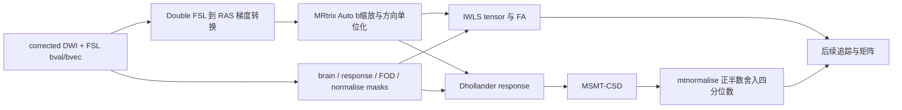

# DTI、response、CSD、mtnormalise：2026-10-03 精度修复

## 1. 功能与本轮策略

从已校正 DWI、梯度和同网格掩膜开始，计算 FA/主方向、Dhollander 三组织响应、MSMT-CSD 和三组织归一化。本轮修复两个成熟子函数的梯度解释及一个四分位数下标问题，保留现有 GPU 算法、Float64 求解、TF32 默认、两次 IWLS 更新与全部体素。



### 成熟实现中特别修复的问题

- `fit_mrtrix_dhollander_tensor()`：原先直接使用 MRtrix 十位有效数字导出的方向。官方重新读入时会 Double 单位化。新增私有解释函数，不修改调用者输入。
- `pipeline._gradients()`：原先 Float32 读入，并对包含体素尺寸的 affine 直接做极分解。现在 Double 读入，先单位化 affine 每列，再 Double 极分解；FSL 右手图像的 x 翻转保留。非单位方向按官方默认 Auto 缩放 b 值；最大 `abs(log(norm²)) > 0.01` 时才触发，正常 eddy 输出的十例 b 值不变。
- `normalise_mrtrix_three_tissue()`：Python `round()` 在 `.5` 处取偶数，官方 `std::round()` 对正半数向上。修复下标计算，仍用原 15 次主更新和最多 7 次组织平衡更新。

当前 `b<50` 向量置零及零 diffusion 方向报错规则保留。官方可保留任意 b0 方向，并可仅警告非零 b 的零向量，这一更广义输入差异单列保留。FNIT 病态法方程的现有 QR fallback 也保留；官方 Eigen LLT 未检查失败状态，不能把其一次失败后的偶然数值当成稳定目标。

## 2. Python 调用、输入与输出

```python
from pathlib import Path
import nibabel as nib
import numpy as np
import torch
from fnit.connectome.response import fit_mrtrix_dhollander_tensor

device = torch.device('cuda:0')
corrected_dwi_path = Path('/data/sub-CON03/corrected_dwi.nii.gz')
gradient_mrtrix_path = Path('/data/sub-CON03/gradient_mrtrix.txt')
brain_mask_path = Path('/data/sub-CON03/brain_mask.nii.gz')
corrected_dwi_image = nib.load(corrected_dwi_path)
# 读写用 nibabel；DWI 保持 Float32，梯度与回归运算用 Float64。
corrected_dwi = torch.as_tensor(
    corrected_dwi_image.get_fdata(dtype=np.float32), device=device,
)
gradient_mrtrix = torch.as_tensor(
    np.loadtxt(gradient_mrtrix_path), dtype=torch.float64, device=device,
)
brain_mask = torch.as_tensor(
    np.asarray(nib.load(brain_mask_path).dataobj) > 0, device=device,
)
fractional_anisotropy, principal_direction = fit_mrtrix_dhollander_tensor(
    signal=corrected_dwi,
    grad_mrtrix=gradient_mrtrix,
    safe_mask=brain_mask,
    batch_size=4096,  # 一批最多求解的体素数；不裁减掩膜。
)
```

|名称|格式与含义|
|---|---|
|`signal`|Float32 `[X,Y,Z,N]`，topup/eddy 校正后的完整 DWI，CPU/CUDA|
|`grad_mrtrix`|`[N,4]`，RAS 方向 xyz 和 b 值；内部转换 Float64，Auto 解释|
|`safe_mask`|bool `[X,Y,Z]`，与 DWI 轴、体素中心和 affine 对齐；不重新采样|
|`batch_size`|正整数，默认 4096；改变分批不改变估计器或迭代次数|
|FA 输出|Float32 `[X,Y,Z]`，掩膜外 0；没有正信号的体素沿用 NaN 行为|
|主方向输出|Float32 `[X,Y,Z,3]`，RAS 单位向量；正负方向等价，掩膜外 0|
|response 输出|shell 中心及 WM/GM/CSF 响应系数、实际组织选择掩膜|
|CSD 输出|WM SH `[X,Y,Z,45]`，GM/CSF `[X,Y,Z]`，默认 lmax 8|
|normalise 输出|上述归一化图、Float32 field、bool accepted mask、Double 三个平衡因子|

响应、CSD 与归一化的完整参数说明沿用 [`README_official_chain.md`](../../tenraw_20261002/task_02/README_official_chain.md) 和相应函数 docstring。本轮未更改这些函数的公共参数。

## 3. 命令行与复现实验

正式入口仍为 `fnit UKBConnectome_pipeline`；无需新增参数即可采用修复。

```bash
fnit UKBConnectome_pipeline \
  --dwi /data/sub-CON03/corrected_dwi.nii.gz \
  --bvals /data/sub-CON03/dwi.bval \
  --bvecs /data/sub-CON03/eddy_rotated.bvec \
  --freesurfer-subject-dir /data/freesurfer/sub-CON03 \
  --atlas fs-aparc --n-seeds 100000 --device cuda:0 \
  --output-dir /data/connectome/sub-CON03
```

基准脚本均为验证代码，不属于生产运行时。`--output` 必须为新目录；原始数据和旧结果只读。

|脚本|参数与用途|
|---|---|
|`benchmark_tensor_gradient_fix.py`|`--case-map` 实际十例 completed consumer/producer 映射；`--baseline`/`--candidate` 冻结 response 文件；`--cases` 病例列表；`--paired-cases` 默认 CON01/03；`--abba-rounds` 默认 4；`--output` 新输出目录。完整 tensor 捕获在独立调用，ABBA 使用未插桩原函数|
|`prepare_formal_tensor_reference.py`|`--old-root` 已完成正式输出根目录；`--pipeline` 必须为冻结旧版本文件；`--mrtrix-bin` CPU 官方 bin；`--output` 新 reference。验证实际报告及准备输入 SHA 后执行官方 CPU 命令|
|`diagnose_formal_gradient_fix.py`|`--reference-root` 上述成功 reference；`--baseline-response`/`--candidate-response`、`--baseline-pipeline`/`--candidate-pipeline` 为冻结文件；`--device` 默认 CPU；`--output` 新目录。实际 GPU table 若与 CPU oracle 不同，不借用该 oracle|
|`diagnose_normalise_quartiles.py`|`--source` 必须为冻结旧 mtnormalise；`--case-map` 实际 consumer 映射；`--device` 默认 CPU；`--output` 新目录。只比较四例完整官方 CSD 输入|
|`diagnose_tensor_arithmetic.py`|算术次序候选诊断，`--contract` 实际 completed consumer；`--source` 冻结旧 response；`--device`/`--batch-size`/`--threads`；`--modes` 候选；`--output` 新目录。basis/RHS 候选已拒绝，未进入产品|
|`inspect_saved_tensor_tails.py`|`--report` 十例已保存 report；`--cases` 默认 CON07/11；`--output` 新 JSON。只读完整输出和原 DWI，在全部原掩膜中报告 worst FA/方向坐标、batch 行、信号有效性与保存 tensor|
|`make_precision_images.py`|`--reference-root`/`--diagnostic-root` 为同例实际输出；`--output` 新 PNG；统一误差色标，不以模拟数据替代|

GPU 评测遵守共享 flock，固定已核实 GPU UUID，`PYTORCH_CUDA_ALLOC_CONF=expandable_segments:True`。监测 Torch allocated/reserved 和 NVML 本进程；tensor 运算不启动 CUDA 子进程。共享负载、采样间隔和失败采样保留在报告。

## 4. 对应官方命令

```bash
# 同一真实 corrected DWI、旋转 bvec、bval 和掩膜；本轮 reference 在 nodecw10 CPU8。
mrinfo corrected_dwi.nii.gz -fslgrad eddy_rotated.bvec dwi.bval \
  -export_grad_mrtrix gradient_mrtrix.txt -nthreads 8
dwi2tensor corrected_dwi.nii.gz tensor.nii.gz \
  -fslgrad eddy_rotated.bvec dwi.bval -mask brain_mask.nii.gz -nthreads 8
tensor2metric tensor.nii.gz -fa fa.nii.gz -vector direction.nii.gz \
  -modulate none -mask brain_mask.nii.gz -nthreads 8
dwi2response dhollander corrected_dwi.nii.gz wm.txt gm.txt csf.txt \
  -fslgrad eddy_rotated.bvec dwi.bval -mask response_mask.nii.gz -nthreads 8
dwi2fod msmt_csd corrected_dwi.nii.gz wm.txt wm_raw.nii.gz \
  gm.txt gm_raw.nii.gz csf.txt csf_raw.nii.gz \
  -fslgrad eddy_rotated.bvec dwi.bval -mask fod_mask.nii.gz -nthreads 8
mtnormalise wm_raw.nii.gz wm_norm.nii.gz gm_raw.nii.gz gm_norm.nii.gz \
  csf_raw.nii.gz csf_norm.nii.gz -mask normalise_mask.nii.gz -nthreads 8
```

归档中十位梯度导出的命令显式用了 `-bvalue_scaling no`；后续 `dwi2tensor -grad` 仍按 Auto 再解释。正式路径本轮 reference 的 `dwi2tensor -fslgrad` 使用默认 Auto。这是两个具体 reference 的实际参数，不用于推断旧正式 FNIT 私有入口的科学定义。

## 5. 真实精度、时间与脑图

### 正式调用输入，CPU 同输入 tensor 对照

两例均读取已完成正式 FNIT corrected DWI、真实旋转梯度和其 brain mask；SHA 与正式 `raw_bids_wall.json`/`gpu_report.json` 绑定。官方 CPU reference 独立执行，保存 bin SHA/version、argv、所有输入输出 SHA。主表包含全部掩膜，不删除负信号体素。

|实际正式输入|原 FNIT 对官方 FA max|修复后 FA max|原/新 `abs(error)>1e-5` 体素|修复后 P99|非有限值错配|
|---|---:|---:|---:|---:|---:|
|CON03，98,625 体素|0.002352715|0，逐值相同|172 / 0|0|0|
|CON10，115,626 体素|1.015095688|0.0000120401|183 / 1|0|0|

### 正式调用输入，最新 CUDA 同输入对照

|实际正式输入|原 GPU FNIT 对官方 FA max|修复后 FA max|原/新 `abs(error)>1e-5` 体素|修复后 P99|
|---|---:|---:|---:|---:|
|CON03，98,625 体素|0.046248853|0，逐值相同|196 / 0|0|
|CON10，115,626 体素|0.921168730|0.00000536442|70,227 / 0|0|

两例非有限值错配均为 0。旧 GPU caller 的实际梯度表与冻结 CPU 表不同，`cpu_float32_oracle_table_identical=false`，因此没有借用 CPU table 的官方输出；直接比较实际 `dwi2tensor -fslgrad` 结果。CPU 和 GPU 新 Double 梯度表分别有 242 / 268 项尾数不同，最大 `6.11e-16 / 1.22e-15`。将元数据计算改至 CPU 不能满足最终 GPU 表逐值保持，本轮不采用该速度候选。

仅冻结同一 Float32 caller table、单独修 response，CON03 FA 逐值相同，CON10 最大差 `1.90735e-6`。这将 tensor 解释和梯度导入两个差异分别验证。原 Float32 world 方向对官方单位化导出表最大差 `1.17e-7 / 1.53e-7`；Double 导入为 `5.89e-11 / 5.23e-11`，受官方十位文本导出精度限制。


### 官方 own-corrected 输入，十例真实 GPU tensor 隔离

以下采用每例已完成官方 corrected DWI、十位梯度表及原脑掩膜，只测试梯度单位化修复，独立于上述正式 caller 对照。所有掩膜体素保留；CON11 有 29 个两侧一致的非有限 FA，主表同时记录其余 105,741 个有限体素。

|病例|原 FA max|单位化修复 FA max|原/新 `abs(error)>1e-5`|修复后主方向最大夹角，正负等价|
|---|---:|---:|---:|---:|
|CON01|0.00720798969|1.1920929e-06|7 / 0|2.95755867e-06°|
|CON03|9.05990601e-06|0|0 / 0|1.20741827e-06°|
|CON04|0.0373284817|0.00076341629|10 / 2|1.90909591e-06°|
|CON05|0.0010227561|4.17232513e-07|12 / 0|2.49792634e-05°|
|CON06|0.0100548267|4.75645065e-05|20 / 1|0.00714247913°|
|CON07|0.0478248257|0.0478248261|19 / 1|83.0171111°|
|CON08|0.000649094582|0|5 / 0|3.07832466e-06°|
|CON09|0.00135159492|0.000366449356|18 / 1|1.58038526°|
|CON10|0.245667815|0.000373721123|8 / 1|1.70754729e-06°|
|CON11|3.27825546e-05|6.90817833e-05|2 / 1|0.533877145°|

十例 FA P99 均为 0，非有限值错配均为 0。CON11 最大 FA 误差增大，CON07 最大 FA 没有改善；不能据此宣称所有尾部都已匹配。CON07 `(66,42,12)` 是 mask 行 98,970、4096 批的第 24 批第 666 行，102 个测量中有 97 个负值；候选 FA 约 `3.51e-15`、官方约 `0.047824826`，方向差 83.017°。CON11 `(24,37,16)` 是 mask 行 2,069、第 0 批第 2,069 行，102 个测量中有 101 个负值；候选/官方 FA 为 `0.895630717 / 0.895561635`、方向差 0.533877°。完整原信号有效性、三套保存 tensor/FA/方向和 eigenvalues 见 `tail_rows.json`；这些是保存 Float32 tensor 的复核，不冒充官方 LLT 求解状态 trace。

basis/RHS 乘法次序候选在 CON10 GPU 将最大误差增至约 `0.00077`，未采用。旧历史数字与本次 saved tensor、掩膜及实际 batch 行分别报告，不跨输入归因。

CON01/03 各四轮 ABBA（每版本 8 次）使用完整原函数、同驻留输入和边界同步；tensor 插桩抓取另行调用：

|病例|原函数中位 s|单位化候选中位 s|变化|
|---|---:|---:|---:|
|CON01|0.753054|0.848510|增加 0.095456 s，12.7%|
|CON03|0.726241|0.823080|增加 0.096840 s，13.3%|

同期外部 GPU 作业持续满负载，报告保留所有进程采样；这些是共享环境算子观察，不能推断空闲设备速度。修复有明确精度收益，但本次 tiny GPU 梯度解释使该算子多约 0.1 秒，未宣称算子速度无回归。用户整链速度门槛由协调者真实整链比较决定。十例 Torch allocated 最大 581,333,504 字节、reserved 最大 660,602,880 字节、NVML 本进程最大 2,558,525,440 字节，均 `<20e9`；采样失败和最大间隔在 JSON 中保留，没有 CUDA 子进程。正式 caller CUDA 诊断未另做 NVML 采样，不把十例隔离的显存当作完整 pipeline 显存。

### mtnormalise，四例完整固定官方 CSD 输入

|病例|官方零起点 quartile 下标|WM 对官方最大差|accepted mask XOR|修复前/后 CPU s，单轮诊断|
|---|---|---:|---:|---:|
|CON03|20106 / 60317|5.960464e-8|0|0.248 / 0.307|
|CON04|20708 / 62123|5.960464e-8|0|0.233 / 0.254|
|CON07|22431 / 67292|1.192093e-7|0|0.231 / 0.273|
|CON11|21521 / 64562|1.192093e-7|0|0.230 / 0.229|

四例 WM/GM/CSF/field/accepted-mask 修复前后逐位相同；CON04/07 平衡因子仅约 `2e-15 / 1.92e-13` 变化。此修复保证 C++ 下标语义，不声称该四例最终图精度提高或单轮速度提高。官方平衡因子文本为有限有效位数，报告中的几 e-6 差不能解释为真实求解误差；全场 field 最大差保留在 JSON，不只截取掩膜。

最新完整 connectome CPU 测试：`653 passed, 29 skipped, 362 subtests passed`，51.21 秒；最新 focused CUDA 测试：`38 passed`，6.69 秒。测试源码绑定已合入的修复版本，测试环境补齐仓库已有工具及许可资产后完成；初次缺测试支持文件的失败不作为算法失败。十例 GPU tensor、CON01/03 ABBA 与正式 caller GPU 已完成。全链时间、精度和严格 `<20e9` 三类显存验收仍由总控制实测补齐。

`formal_tensor_reference_cpu_v1` 只用于精度；其验证脚本计时边界包含随后 `-version` 身份探测，不作为官方 solver 性能数字。脚本已修正未来运行的时间边界，原 v1 报告和 SHA 保留。成对 GPU 时间使用实际 solver 边界，与此问题无关。

数据为新下载公开 OpenNeuro ds001226 十例 CON01/03/04/05/06/07/08/09/10/11；许可证与原始下载出处见前一轮实际来源记录。完整数组保留新服务器目录，不将受试者体积复制进仓库；提交报告、脚本及公开脑图。旧 frozen config、旧 producer 和旧路径未补写。

## 6. 更新与 benchmark 记录

- 基线：`7af34e6d072e843fb2558c931bb2781f1d4b0be9`，保留其 CSD 有序 active-set 缓存与 batch4096。
- 2026-10-03：实际 bin `3.0.3-103-g026e850d` 与安装目录陈旧 Git HEAD 分开审计，按精确 commit 核对。
- 同日：拒绝 basis/RHS 数学相同但尾部变坏的算术候选；只采用已证实梯度解释修复。
- 同日：闭合 CON03/10 正式 caller CPU 输入，修复私有 Double FSL 导入；四例 mtnormalise 半数舍入语义修复并保存全场结果。
- 同日：完成十例 GPU tensor、CON01/03 四轮 ABBA、正式 CON03/10 caller GPU 和完整 CPU/CUDA 回归；保留 CON07/11 具体尾部与算子约 0.1 秒增加，不改历史报告。

## 7. 参考文献与原实现

- [MRtrix3 实际精确 commit 026e850d171ec2a12f09865d31b8332d23d7ecf6](https://github.com/MRtrix3/mrtrix3/tree/026e850d171ec2a12f09865d31b8332d23d7ecf6)。安装目录 Git HEAD 不作为已编译来源证据。
- [gradient.cpp：FSL 导入、Double 单位化、Auto b scaling](https://github.com/MRtrix3/mrtrix3/blob/026e850d/core/dwi/gradient.cpp)，[NIfTI affine 列单位化](https://github.com/MRtrix3/mrtrix3/blob/026e850d/core/file/nifti_utils.cpp)。
- [dwi2tensor.cpp](https://github.com/MRtrix3/mrtrix3/blob/026e850d/cmd/dwi2tensor.cpp)，[tensor.h：FA 与主方向](https://github.com/MRtrix3/mrtrix3/blob/026e850d/src/dwi/tensor.h)。
- [Dhollander](https://github.com/MRtrix3/mrtrix3/blob/026e850d/lib/mrtrix3/dwi2response/dhollander.py)，[dwi2fod](https://github.com/MRtrix3/mrtrix3/blob/026e850d/cmd/dwi2fod.cpp)，[mtnormalise](https://github.com/MRtrix3/mrtrix3/blob/026e850d/cmd/mtnormalise.cpp)。
- Tournier JD et al. MRtrix3: A fast, flexible and open software framework for medical image processing and visualisation. *NeuroImage*, 2019, 202:116137.
- Jeurissen B et al. Multi-tissue constrained spherical deconvolution for improved analysis of multi-shell diffusion MRI data. *NeuroImage*, 2014, 103:411–426.
- Dhollander T et al. Unsupervised 3-tissue response function estimation from single-shell or multi-shell diffusion MR data without a co-registered T1 image. ISMRM Workshop, 2016；single-fibre 改进 ISMRM 2019。
- Raffelt D et al. Bias field correction and intensity normalisation for quantitative analysis of apparent fibre density. ISMRM 2017；Dhollander T et al. Mtnormalise ISMRM 2021。

精确上游源码只存独立 oracle 目录，不随本项目复制发布。生产函数不调用 MRtrix/FSL/FreeSurfer 或其包装包。
