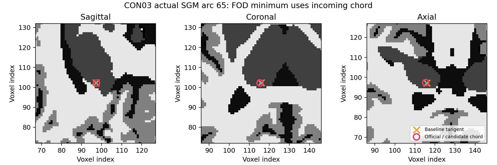

# iFOD2 / ACT 的 SGM 截断精度修正（2026-10-03）

## 1. 功能简介

`probabilistic_tractography` 从归一化白质 FOD、5TT 和 GMWMI 生成 RAS 毫米坐标流线。本次修复项目已有 PyTorch 追踪中的一个具体差异：退出皮层下灰质（SGM）时，截断位置须按**当前内部顶点与前一内部顶点的弦方向**计算 FOD 幅值，再选择 SGM 段内的最小值。基线用了圆弧切线方向；这两个方向会给出不同的 FOD 幅值及截断位置。

对应实际参考二进制为 MRtrix3 `3.0.3-103-g026e850d`，精确源提交为 `026e850d171ec2a12f09865d31b8332d23d7ecf6`。`Exec::truncate_exit_sgm` 在降采样之前使用相邻内部顶点的差；`iFOD2::get_metric` 在该方向评价 FOD。本次沿用现有 Torch 采样和 SH 算子，只对实际移动、处于 SGM 的顶点评价弦方向 FOD。

另将每步校准限制在仍活跃的行。校准不消费随机数；提案、拒绝采样及 Generator 消费位置保持原规则。100k 配对用于单独检查这项优化的逐值一致性与耗时。当前已使用连续初始方向和校准拒绝采样：`arc_proposals=16` 是 GPU 候选块宽度，每弧仍至多尝试 1000 次。

运行时保持 PyTorch float32、仿射 float64、CUDA TF32，未引入依赖。路径概率仍使用起点半份、中点一份、终点半份贡献；圆弧概率继续用切线，SGM 截断单独用弦。本页是组件修正报告，最终流线分布、SIFT2 和 SC 的五次官方重复范围由整链报告验收。

## 2. Python 调用、输入、输出与参数

```python
import nibabel as nib
import numpy as np
import torch
from fnit.connectome.tracking import probabilistic_tractography

tracking_device = torch.device("cuda:0")
fod_image = nib.load("wm_fod.nii.gz")
five_tissue_image = nib.load("five_tissue_act.nii.gz")
gmwmi_image = nib.load("gmwmi.nii.gz")
streamlines = probabilistic_tractography(
    wm_sh=torch.as_tensor(np.asarray(fod_image.dataobj, dtype=np.float32), device=tracking_device),
    fod_affine=torch.as_tensor(fod_image.affine, dtype=torch.float64, device=tracking_device),
    five_tissue=torch.as_tensor(np.asarray(five_tissue_image.dataobj, dtype=np.float32), device=tracking_device),
    five_tissue_affine=torch.as_tensor(five_tissue_image.affine, dtype=torch.float64, device=tracking_device),
    gmwmi=torch.as_tensor(np.asarray(gmwmi_image.dataobj, dtype=np.float32), device=tracking_device),
    n_seeds=100000,                    # 播种尝试预算
    lmax=8,                           # 45 个偶数阶实 SH 系数
    five_tissue_spacing_mm=tuple(float(x) for x in five_tissue_image.header.get_zooms()[:3]),
    fa=None,                          # 可选同 FOD 网格 FA
    seed=0, batch_size=8192,           # 固定随机 seed 和批量
    arc_proposals=16,                 # 每块候选宽度，非总尝试数
    max_length_mm=250.0, min_length_mm=None,
    step_mm=None, max_angle_degrees=45.0,
    cutoff=0.1, power=0.5, compile_arc=False,
)
print(streamlines.seeds_attempted, len(streamlines.paths))
```

| 输入 | 格式与含义 |
| --- | --- |
| `wm_sh` | float32 `[XF,YF,ZF,C]`；归一化 WM FOD，偶数 `l`、每阶 `m=-l…l` 顺序，`C=(lmax+1)*(lmax+2)//2`。 |
| `fod_affine` | `[4,4]`；FOD 体素中心到 RAS-mm，函数内部 float64。 |
| `five_tissue` | float32 `[XA,YA,ZA,5]`；依次 cGM、sGM、WM、CSF、病理组织。 |
| `five_tissue_affine` | `[4,4]`；5TT 体素中心到同一 RAS-mm 空间，函数内部 float64。 |
| `gmwmi` | float32 `[XA,YA,ZA]`；与 5TT 同网格的播种权重。 |

全部张量在同一 CPU/CUDA 设备，FOD 与 5TT 可使用不同网格，世界坐标必须一致。GMWMI 与 5TT 网格匹配。

| 参数 | 默认值及含义 |
| --- | --- |
| `n_seeds` | 必填正整数；尝试的种子数，不以接受数提前终止。 |
| `lmax` | `8`；非负偶数 SH 阶数，须与系数数目一致。 |
| `five_tissue_spacing_mm` | `None`；用仿射列范数；传入三轴 header 间距时用于 ACT 采样几何。 |
| `fa` | `None`；可选 FOD 网格 `[XF,YF,ZF]`，计算每条路径点采样平均 FA。 |
| `seed` | `0`；单个 PyTorch Generator 种子，与 MRtrix 数值同 seed 不产生同一轨迹。 |
| `batch_size` | `8192`；种子批量，改变它会改变 RNG 消费顺序。 |
| `arc_proposals` | `16`；拒绝采样块宽度，每弧尝试上限仍为 1000。 |
| `max_length_mm` | `250.0`；总路径最大长度，毫米。 |
| `min_length_mm` | `None`；FOD 几何平均体素尺寸的两倍。 |
| `step_mm` | `None`；FOD 几何平均体素尺寸的一半。 |
| `max_angle_degrees` | `45.0`；每弧起止方向最大夹角，度。 |
| `cutoff` | `0.1`；初始方向和传播使用的 FOD 阈值。 |
| `power` | `0.5`；路径概率幂。 |
| `compile_arc` | `False`；CUDA 可选圆弧核编译；本轮固定关闭。 |

| `Tractogram` 输出字段 | 结构 |
| --- | --- |
| `paths` | 长度 N 的 tuple；每条 float32 `[Pi,3]`，RAS-mm。 |
| `endpoints` | float32 `[N,2,3]`，RAS-mm；与路径起止点对应。 |
| `lengths_mm` | float32 `[N]`，接受路径长度。 |
| `mean_fa` | 给定 FA 时为 float32 `[N]`，否则 `None`。 |
| `accepted_seeds` | float32 `[N,3]`，与输出路径顺序对应。 |
| `seeds_attempted` | Python int，原播种预算。 |

新内部函数 `_ifod2_sgm_chord_metrics(points, incoming, sample_fod, lmax=...)` 输入选中的 RAS-mm 顶点 `[N,3]`、它与前一内部顶点的差 `[N,3]`、返回 `[N,C]` 的 FOD 采样函数及 SH 阶数，输出 `[N]` 弦方向 FOD 幅值。它不生成随机数。

## 3. 命令行调用与复现

生产 CLI 沿用 `fnit UKBConnectome_pipeline`，参数完整定义见[主说明](../../../../docs/connectome/README.md)。使用已完成的官方 FreeSurfer subject：

```bash
export PYTORCH_CUDA_ALLOC_CONF=expandable_segments:True
fnit UKBConnectome_pipeline \
  --bids-root /data/ds001226 --subject CON03 \
  --freesurfer-subject-dir /data/freesurfer/sub-CON03 \
  --atlas fs-aparc --n-seeds 100000 --seed 0 --eddy-gp-seed 12345 \
  --device cuda:0 --output-dir /data/fnit_accuracy/CON03_candidate
```

`bids-root` 是原始 BIDS 根目录，`subject` 是不带 `sub-` 的受试者标签，`freesurfer-subject-dir` 为完整 subject；`atlas` 指定模板，`n-seeds` 和 `seed` 控制追踪，`eddy-gp-seed` 固定 EDDY 的独立随机选点，`device` 指定设备，`output-dir` 必须是本轮新目录。本轮不加 `--compile-arc`。

同输入 worker 复用已有 [run_tracking_seed_repeat.py](../../tenraw_20261002/task_03/run_tracking_seed_repeat.py)，分别在全新目录调用 `run`，随后 `compare`。`source` 是只包含冻结 `fod.py`、`tracking.py` 的目录，`source-commit` 记录版本；`checkpoint` 是完整实际追踪输入 PT，`manifest` 是原始数据清单，`output` 为独立产物目录。其余参数省略即复用检查点的 100k、seed0、batch8192、`compile_arc=False`。严禁将官方 FOD oracle 的输入与 FNIT raw 检查点的计时混用。

```bash
flock /tmp/fnit-recon-five-20261002-gongwk.gpu.lock \
  env CUDA_VISIBLE_DEVICES=GPU-e25cac06-0ce8-a833-abf9-09ab18c9c9ba \
  python validation/connectome/tenraw_20261002/task_03/run_tracking_seed_repeat.py run \
  --source /data/accuracy/source_baseline --source-commit 7af34e6d072e843fb2558c931bb2781f1d4b0be9 \
  --checkpoint /data/accuracy/tracking_inputs.pt --manifest /data/accuracy/manifest.json \
  --output /data/accuracy/CON03_baseline
```

真实固定弧 oracle 的复现工具为 [generate_real_cases.py](oracle/generate_real_cases.py)、[fnit_tracking_semantics_oracle.cpp](oracle/fnit_tracking_semantics_oracle.cpp)、[add_access.py](oracle/add_access.py)、[compare_real_cases.py](oracle/compare_real_cases.py)、[show_real_sgm_cases.py](oracle/show_real_sgm_cases.py)。生成工具接收 `--images`、`--tracks`、全新 `--output`；比较工具接收 `--images`、`--cases`、`--source`、`--official` 和结果 `--output`；展示工具将最后一个参数作为全新输出目录。C++ 程序参数依次是 FOD、5TT、固定 cases 文本、step-mm。所有参考代码仅在隔离 oracle 目录编译，未进入生产运行时或提交上游源码副本。出处及 SHA 见 [source_provenance.json](evidence/source_provenance.json)。

## 4. 原软件调用

```bash
# 独立官方参考：CON03 FOD 网格约 2.5mm。
MRTRIX_RNG_SEED=0 tckgen wm_fod.nii.gz reference_tracks.tck \
  -algorithm iFOD2 -act five_tissue_act.nii.gz -seed_gmwmi gmwmi.nii.gz \
  -seeds 100000 -select 0 -step 1.2500000175865187 -minlength 5 \
  -maxlength 250 -angle 45 -cutoff 0.1 -seed_cutoff 0.1 \
  -samples 3 -power 0.5 -trials 1000 -downsample 2 -nthreads 0
```

`-seeds` 固定尝试预算，`-select 0` 禁止按接受数量提前结束；`step`、`minlength`、`maxlength` 单位均为毫米。`samples=3` 是每弧起点、中点、终点；路径概率起止各半份。`downsample=2` 在 ACT 截断之后写出路径。每次官方重复 seed 为 0…4，输入完全相同。本次源 oracle 明确设置 `threshold=0.1` 和 `init_threshold=0.1`；错误写成内部属性 `cutoff` 会被忽略，不能用于等参数比较。该错误的第一次诊断保存在独立 oracle 目录，已从有效结果排除。[MRtrix 3.0.3 命令说明](https://mrtrix.readthedocs.io/en/3.0.3/reference/commands/tckgen.html)。

## 5. 最新精度、运行时间与脑图

公开真实数据为 OpenNeuro ds001226 的 CON03；沿用已核验的 CC0 数据及完成的 FreeSurfer 重建。本页使用两套明确区分的固定输入：

- 语义 oracle：`official_repeats_CON03_v2/inputs` 的官方 FOD/5TT，及官方 seed0 的前 1000 条真实路径位置；固定 NumPy seed `20261003` 生成 3000 个局部弧案例。这是实际解剖位置上的局部诊断，不作为流线分布或矩阵验收。
- 性能隔离：`task_03/results/sub-CON03_gpu0/root_tracking_inputs.snapshot.pt`，由 FNIT raw 全链实际调用导出；baseline 与 active-only 使用同一 SHA、seed、批量和参数。校准优化与 SGM 语义修正的最终整体耗时另由整链评测。

| 真实固定输入指标 | 基线 `7af34e6d` | 本次最小候选 |
| --- | ---: | ---: |
| 两顶点都在 SGM 的弧 | 324 | 324 |
| 最小 FOD 顶点与官方弦定义不一致 | 20 / 324 | **0 / 324** |
| SGM FOD metric 绝对误差 P99 | 0.153216 | **1.998×10⁻⁶** |
| SGM FOD metric 最大绝对误差 | 0.180516 | 9.492×10⁻⁶ |
| 3000 弧 path probability 绝对误差 P99 | 8.948×10⁻⁷ | 8.948×10⁻⁷ |
| 3000 弧 NaN 状态差异 | 0 | 0 |

指标来自 [baseline](evidence/baseline_chord_comparison_v3.json) 与 [candidate](evidence/candidate_chord_comparison.json)。20 个具体案例的 RAS 坐标、方向、5TT 组织状态、实际 SH 系数和起止 metric 见 [changed_sgm_cases.json](evidence/sgm_detail_v1/changed_sgm_cases.json)。聚焦 CPU 回归 **19 passed / 16 CUDA skipped**，实际 source SHA 及日志见 [candidate_cpu_tests_v3.log](candidate_cpu_tests_v3.log)。跳过项由本次 CPU 隔离显式禁用 CUDA。



图中背景为真实 CON03 5TT，橙叉为基线切线最小点，红圈为官方与候选弦方向最小点；本例为固定案例 65。该图展示局部截断原因。

| CON03 raw-FNIT 100k 性能隔离 | baseline | active-only |
| --- | ---: | ---: |
| tracking 同步墙钟 | 762.751 秒 | 配对进行中 |
| 完整 worker 墙钟（依赖导入后） | 764.947 秒 | 配对进行中 |
| 完整子进程墙钟 | 767.613 秒 | 配对进行中 |
| allocated / reserved 峰值 | 0.891 / 0.904 GB | 配对进行中 |
| 本进程 NVML 峰值 | 2.802 GB | 配对进行中 |
| 接受流线 | 11606 / 100000 | 配对进行中 |

baseline 原始结果见 [active_only_baseline_report.json](evidence/active_only_baseline_report.json)。全过程按共享锁串行；锁等待 442.600 秒另记，不计入 tracking。GPU UUID 固定 `GPU-e25cac06-0ce8-a833-abf9-09ab18c9c9ba`，8 CPU threads、TF32=True、所有输入显式送 CUDA、未启用 profiler、worker 仅调用一次追踪。同卡外部进程约占 35.17 GiB，GPU 利用率持续 100%；历史约 165 秒来自另一负载条件，不能与本次直接作速度比。active-only 逐值与墙钟报告待本次配对结束补入；候选 tracking+SIFT2、五次官方 SC/流线分布及十例 raw 的整体速度/精度 gate 由 root 统一验收。本页不宣告整个 gate 已通过。

## 6. 近期更新与保留的失败原因

| 版本 / 诊断 | 更新与结果 |
| --- | --- |
| `7af34e6d` 基线 | 已有连续方向、校准拒绝采样、Masked 5TT；SGM 最小点使用圆弧切线。 |
| active-only 隔离 | 校准仅评价 active 行；随机数规则不变，100k bitwise/time 配对待补。 |
| 本次 SGM 最小候选 | 使用降采样前内部弦，324 个真实 SGM 局部弧从 20 个位置差异降为零；聚焦 CPU 回归通过。 |
| GMWMI 独立实验，未纳入 | 改累计 overshoot 与 unmasked tissue 后，10000 固定候选的 validity 差异仅从 997 降到 990；缺少解释剩余差异的因果证据。当前候选仍为 997 / 10000，共享有效投影的 P99 坐标误差仍为 1.285mm。 |
| image-exit / NaN，未纳入 | 精确源校准遇 NaN 按 EXIT_IMAGE 结束，当前代码可能映为零；本组 3000 实际弧没有 NaN，尚无足够真实点证据。 |

参考版本最初误用安装目录旧 HEAD；已通过实际二进制版本和 SHA 纠正为 `026e850d`。另对 `eeab681` 的 iFOD2 / ACT / SGM 相同对应函数复核；SGM 弦规则在实际 `026e850d` 中已存在。首次 oracle 的内部阈值属性写错、初次 CPU 测试漏运输原有 NPZ、编译器与系统 glibc 不兼容等失败均保留在本任务独立临时 oracle 目录，修正后结果才进入本页表格。编译使用既有 Conda GCC 11.2 / Eigen 3.4 / GLIBC 2.28 sysroot loader；安装二进制为 Eigen 3.3.7，oracle 是精确源函数验证，不冒充安装二进制的逐值输出。

## 7. 参考文献与原软件代码库

- 精确源：[iFOD2.h](https://github.com/MRtrix3/mrtrix3/blob/026e850d171ec2a12f09865d31b8332d23d7ecf6/src/dwi/tractography/algorithms/iFOD2.h)、[tracking/exec.h](https://github.com/MRtrix3/mrtrix3/blob/026e850d171ec2a12f09865d31b8332d23d7ecf6/src/dwi/tractography/tracking/exec.h)、[ACT/method.h](https://github.com/MRtrix3/mrtrix3/blob/026e850d171ec2a12f09865d31b8332d23d7ecf6/src/dwi/tractography/ACT/method.h)、[ACT/gmwmi.cpp](https://github.com/MRtrix3/mrtrix3/blob/026e850d171ec2a12f09865d31b8332d23d7ecf6/src/dwi/tractography/ACT/gmwmi.cpp)。
- Smith RE et al. Anatomically-constrained tractography: improved diffusion MRI streamlines tractography through effective use of anatomical information. *NeuroImage* (2012). [DOI](https://doi.org/10.1016/j.neuroimage.2012.06.005)。
- Tournier JD, Calamante F, Connelly A. Improved probabilistic streamlines tractography by 2nd order integration over fibre orientation distributions. ISMRM (2010), abstract 1670；见 [官方 tckgen 参考文献](https://mrtrix.readthedocs.io/en/3.0.3/reference/commands/tckgen.html#references)。
- Tournier JD et al. MRtrix3: A fast, flexible and open software framework for medical image processing and visualisation. *NeuroImage* (2019). [DOI](https://doi.org/10.1016/j.neuroimage.2019.116137)。
