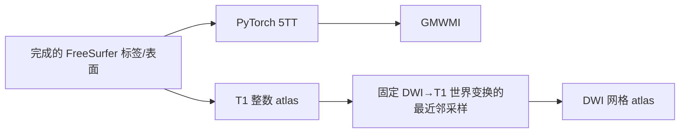
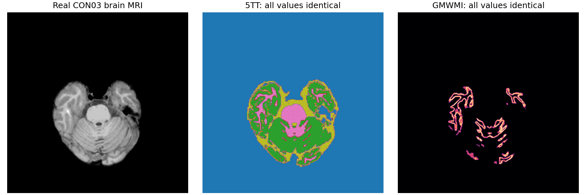
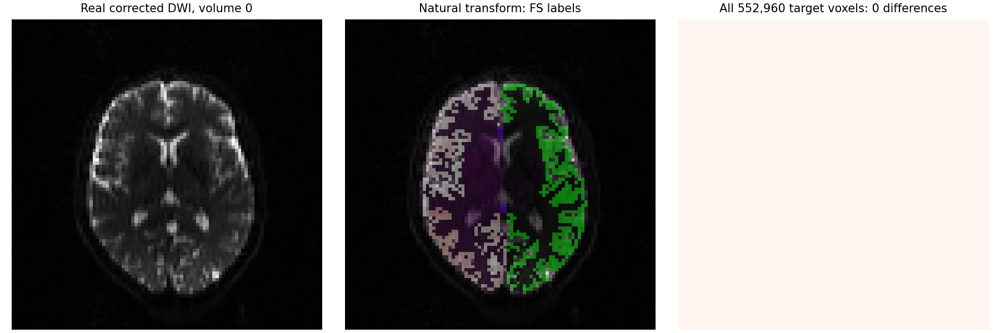

# 解剖与 atlas 精度核对：2026-10-03 task04

## 1. 功能与本轮结论

本轮核对已经完成 FreeSurfer 重建后的三个确定性算子：整数标签最近邻采样、FreeSurfer 标签转五组织图（5TT）、五组织图转灰白质界面图（GMWMI）。生产实现保留基线 `7af34e6d072e843fb2558c931bb2781f1d4b0be9`，五个解剖/atlas 模块没有代码改动。

CON01、CON03 的实际 DWI→T1 变换下，最近邻结果各比较完整 552,960 个目标体素，不一致均为 0。两例完整 256³ FreeSurfer 标签上，5TT 的 83,886,080 个通道值与 GMWMI 的 16,777,216 个体素均为 0 差，最大绝对差为 0。本轮没有证明新的连接矩阵精度提升。

MRtrix 版本以实际二进制 `3.0.3-103-g026e850d` 为准；对应源码完整提交为 `026e850d171ec2a12f09865d31b8332d23d7ecf6`。安装目录的 Git HEAD 不是该二进制源码，本轮未用它归因。



这是算子验证流程，完整 DWI 预处理、配准求解、追踪和连接矩阵由本轮主流程另行评测。

## 2. Python 调用、输入与输出

图像读取采用 nibabel；张量设备决定计算设备。5TT/GMWMI 使用 float32，最近邻索引几何使用 float64；本轮没有改变默认 TF32，也没有使用 float16。

| 函数/参数 | 输入与含义 | 输出 |
|---|---|---|
| `freesurfer_five_tissue(segmentation)` | `segmentation`：`[X,Y,Z]` 有限、非负整数 FreeSurfer 标签张量 | 同设备 float32 `[X,Y,Z,5]`；依次皮层 GM、皮层下 GM、WM、CSF、病灶；背景全零 |
| `gmwmi_from_five_tissue(five_tissue)` | `five_tissue`：上述五通道约定的 `[X,Y,Z,5]` | 同设备 `[X,Y,Z]` 灰白质界面权重 |
| `resample_labels_nearest(labels, source_affine, target_shape, target_affine, target_to_source_world)` | `labels`：源 `[X,Y,Z]` 整数标签；`source_affine`：源体素→RAS-mm 4×4；`target_shape`：目标三维形状；`target_affine`：目标体素→RAS-mm 4×4；`target_to_source_world`：目标/DWI RAS→源/T1 RAS 4×4 | 目标网格同整数类型张量；越界为零 |
| `combine_cortical_subcortical(cortical, subcortical, cortical_max_label)` | 两张同形状三维整数图；`cortical_max_label` 为皮层节点表最大编号 | 皮层非零优先；其余皮层下正标签加最大皮层编号；背景零 |

`target_to_source_world` 不能直接传 FSL scaled-mm `.mat`。下面使用本轮保存的 RAS 世界矩阵；输出网格取 DWI 的前三维。

```python
from pathlib import Path
import nibabel as nib
import numpy as np
import torch
from fnit.connectome.anatomy import (
    freesurfer_five_tissue, gmwmi_from_five_tissue, resample_labels_nearest,
)

freesurfer_subject_directory = Path("/data/freesurfer/sub-CON03_ses-preop")
corrected_dwi_path = Path("/data/connectome/preproc/eddy/data.nii.gz")
dwi_to_t1_world_path = Path("/data/connectome/dwi_to_t1_world.csv")
output_directory = Path("/data/anatomy_operator_outputs")
output_directory.mkdir(parents=True, exist_ok=True)
device = "cuda:0"

segmentation_image = nib.load(freesurfer_subject_directory / "mri/aparc+aseg.mgz")
target_image = nib.load(corrected_dwi_path)
segmentation_tensor = torch.as_tensor(
    np.asarray(segmentation_image.dataobj, dtype=np.int32).copy(), device=device,
)
five_tissue_tensor = freesurfer_five_tissue(segmentation=segmentation_tensor)
gmwmi_tensor = gmwmi_from_five_tissue(five_tissue=five_tissue_tensor)
labels_dwi_tensor = resample_labels_nearest(
    labels=segmentation_tensor,                  # 源 T1 整数标签
    source_affine=segmentation_image.affine,     # 源体素到 scanner RAS
    target_shape=target_image.shape[:3],         # 目标 DWI 三维网格
    target_affine=target_image.affine,           # 目标体素到 scanner RAS
    target_to_source_world=np.loadtxt(dwi_to_t1_world_path, delimiter=","),
)
for output_name, output_tensor, output_affine in (
    ("five_tissue_t1.nii.gz", five_tissue_tensor, segmentation_image.affine),
    ("gmwmi_t1.nii.gz", gmwmi_tensor, segmentation_image.affine),
    ("labels_dwi.nii.gz", labels_dwi_tensor, target_image.affine),
):
    nib.save(nib.Nifti1Image(output_tensor.cpu().numpy(), output_affine),
             output_directory / output_name)
```

表面投影、原生 annotation、Schaefer/Glasser/Tian atlas 和节点表的全部参数继续见项目已有的[解剖算子说明](../../../../docs/connectome/ANATOMY_OPERATORS.md)、[原 UKB atlas 说明](../../../../docs/connectome/ORIGINAL_ATLAS_OPERATORS.md)及[资源说明](../../../../docs/connectome/atlas-assets.md)。本轮没有替换这些成熟实现，也没有新增权重、模板或依赖。

## 3. 命令行调用与验证重现

三个算子没有新设独立生产 CLI；已有整链入口和参数见[主流程说明](../../../../docs/connectome/README.md)。使用已完成 FreeSurfer 目录的形式如下；100k 播种是主流程既定配置，与本节确定性算子验证无关。

```bash
BIDS_ROOT=/data/study_bids
FREESURFER_SUBJECT=/data/freesurfer/sub-CON03_ses-preop
OUTPUT_DIR=/data/derivatives/fnit_connectome_accuracy
export PYTORCH_CUDA_ALLOC_CONF=expandable_segments:True
fnit UKBConnectome_pipeline \
  --bids-root "$BIDS_ROOT" --subject CON03 \
  --freesurfer-subject-dir "$FREESURFER_SUBJECT" \
  --atlas fs-aparc --n-seeds 100000 --seed 0 \
  --eddy-gp-seed 12345 --device cuda:0 --output-dir "$OUTPUT_DIR"
```

本目录三个独立验证工具不会被生产模块导入。`run_nearest_reference.py` 绑定输入清单和两份源码；`--output` 必须是新目录；`--controlled-only` 仅运行明确标记的受控半体素算子测试；`--controlled-format` 指定原 MGZ、同一 NIfTI 或仅置换/翻轴的 canonical NIfTI。基线自身复测可把两份源码参数都指向当前 `anatomy.py`。

```bash
VALIDATION_DIRECTORY=validation/connectome/accuracy_20261003/task_04
INPUT_BINDINGS=/data/input_bindings_v1.json
python "$VALIDATION_DIRECTORY/run_nearest_reference.py" \
  --bindings "$INPUT_BINDINGS" \
  --baseline src/fnit/connectome/anatomy.py \
  --candidate src/fnit/connectome/anatomy.py \
  --output /data/new_nearest_reference
python "$VALIDATION_DIRECTORY/run_tissue_reference.py" \
  --bindings "$INPUT_BINDINGS" --source src/fnit/connectome/anatomy.py \
  --resource src/fnit/connectome/FreeSurfer2ACT_sgm_amyg_hipp_ids.tsv \
  --output /data/new_tissue_reference
```

这些 reference 工具的 native binary、精确源码 LUT、FreeSurfer 色表和 CPU 线程设置绑定本次服务器；迁移时按工具顶部路径配置相同资源，再核对 SHA。`evaluate_saved_nearest.py --reference DIR --candidate FILE --output NEW_JSON` 可对不可变的 native 输出评估新源码，避免重复运行 reference。

## 4. 原软件调用与版本

生产算子对应 `5ttgen freesurfer aparc+aseg.mgz five_tissue.mif -nocrop -sgm_amyg_hipp`，本轮复用已经完成的重建，不运行新的 recon-all 或 FIRST。独立 reference 展开精确版本的同一映射步骤，保留全部体素：

```bash
labelconvert aparc+aseg.mgz FreeSurferColorLUT.txt \
  FreeSurfer2ACT_sgm_amyg_hipp.txt indices.nii.gz -nthreads 8
mrcalc indices.nii.gz 1 -eq cgm.mif -nthreads 8
mrcalc indices.nii.gz 2 -eq sgm.mif -nthreads 8
mrcalc indices.nii.gz 3 -eq wm.mif -nthreads 8
mrcalc indices.nii.gz 4 -eq csf.mif -nthreads 8
mrcalc indices.nii.gz 5 -eq path.mif -nthreads 8
mrcat cgm.mif sgm.mif wm.mif csf.mif path.mif five_tissue.nii.gz \
  -axis 3 -datatype float32 -nthreads 8
5tt2gmwmi five_tissue.nii.gz gmwmi.nii.gz -nthreads 8
mrtransform aparc+aseg.mgz labels_dwi.nii.gz \
  -linear dwi_to_t1_world.txt -template corrected_dwi.nii.gz \
  -interp nearest -datatype int32 -nthreads 8
```

这里直接保存 **目标→源** 世界矩阵，因此 `mrtransform` 不加 `-inverse`。它与把正向图像变换传入再求逆的命令写法不能混用。每条实际 argv、退出码、输出 SHA 和墙钟已写入原始 JSON。

## 5. 真实数据精度、耗时与脑图

输入绑定清单 SHA-256 为 `1ee5145471a76d345cf85a18750bed85bd53f967a410ac36ddad7bfd252bc940`。真实路径、source/target affine、变换值及其 SHA 以原始 [nearest report](evidence/nearest_reference_v1/report.json) 和 [tissue report](evidence/tissue_reference_v1/report.json) 为准。运行目录为 `/cwStorage/home/gongwk/Notebook_code/fnit_connectome_accuracy_20261003_v1/task_04`，CPU 主机 nodecw10，8 线程。算子没有随机数或播种。

| 实际输入/算子 | 比较范围 | 不一致/最大绝对差 | FNIT CPU 计算 s | native 进程墙钟 s |
|---|---|---|---:|---:|
| CON03 自然变换最近邻 | 全部 552,960 体素 | 0 | 0.023761 | 0.328895 |
| CON01 自然变换最近邻 | 全部 552,960 体素 | 0 | 0.018851 | 0.312550 |
| CON03 5TT | 256³×5 | 0 / 0 | 0.233937 | 4.814498 |
| CON01 5TT | 256³×5 | 0 / 0 | 0.261092 | 5.050946 |
| CON03 GMWMI | 256³ | 0 / 0 | 0.465222 | 1.328697 |
| CON01 GMWMI | 256³ | 0 / 0 | 0.452582 | 1.288660 |

FNIT 时间从已在 CPU 内存中的标签/5TT 开始；native 时间包括进程、读写和压缩，5TT 取 7 条命令总和，不含后面的 GMWMI。因此这些数据不构成同口径 GPU 加速比或完整整链时间。本轮没有生产改动，没有新的 CUDA 显存测量；既有独立 GPU 记录（5TT+GMWMI 峰值约 1 GiB）见[先前算子说明](../../../../docs/connectome/ANATOMY_OPERATORS.md)，不当成本轮复测。十例整链墙钟与三种显存门槛由主流程报告。

下图来自真实 CON03 `brain.mgz` 和全体积官方组织输出，显示原 MGZ 第 1 轴索引 128 的完整切片。颜色表示五组织类别；右图为界面权重。比较在全体积完成。



下图显示实际校正 DWI 第 0 volume、同一既有变换得到的标签和零差异图。DWI 第 2 轴切片索引记录在 [figure provenance](evidence/figures_v1/figure_provenance.json)，不把展示切片替代全体积计数。



当前五模块源码 SHA 与精确上游文件 SHA 见 [source provenance](evidence/source_provenance.json)；native 二进制 SHA 在原始 JSON，版本和图生成记录见 [日志](evidence/native_version_and_figures_v1.log)。四个现有 focused 测试文件共 **10 passed**；[日志](evidence/focused_cpu_tests_v1.log)明确打印实际加载文件路径和 SHA，避免误用环境中已安装版本。

## 6. 更新记录、成熟实现问题与候选取舍

| 版本/候选 | 实测结果 | 取舍 |
|---|---|---|
| 7af 基线，本轮自然输入复测 | CON01/03 最近邻、5TT、GMWMI 全部逐值一致 | 保留生产实现 |
| 原 NiBabel 轴上 `floor(x+.5)` + 严格坐标边界 | 原 MGZ 受控轴 0/1 的差异由 130,051/96,926 增到 258,081/192,034；轴 2 也未消除差异 | 拒绝 |
| 同一 NIfTI 源/模板半体素测试 | 基线差异轴 0/1/2 为 130,051/96,926/8,805；简单候选为 258,081/192,034/0 | 不能以单轴改善替代整体正确性 |
| 完整 MRI 仅置换/翻轴至 canonical NIfTI | 基线轴 0/1/2 为 73,035/8,850/0；简单候选均 0 | 只证明受控 canonical 角落契约，不是自然配准或 SC 改善 |
| header-aware，单次复合几何变换 | 同一 NIfTI 受控轴 0/1/2 为 7,506/0/0 | 有残余角落差异，拒绝 |
| header-aware，顺序映射和逆 3×3 线性块 | 同一 NIfTI 受控轴 0/1/2 为 258,081/0/0 | 拒绝 |

**成熟实现的已知问题。** `resample_labels_nearest` 当前使用 `torch.round` 的 ties-to-even；native 在其 header 实际重排后的坐标上使用 `std::round`，且有效范围严格为 `(-.5, N-.5)`。原 MGZ 的 LIA 轴、native 自动轴置换/翻转和 MGH/NIfTI affine 读取的微小浮点差异会影响精确半体素取整。仅改原 NiBabel 坐标上的 floor 不能代表完整 native 语义。本轮没有加入 epsilon，也没有改变 source affine 或补偿真实变换；候选都未通过完整受控核对而撤回。原始失败结果及源码 SHA 保留在 [summary](evidence/summary.json) 和相应 JSON。

上述半体素实验使用完整真实 MRI 和受控世界变换，没有造模拟标签或删体素，但其性质是算子角落测试，不能标为自然配准或整链 benchmark。自然配准复测只使用原有两例变换，未重新估计变换或增加优化次数。

其余模块的源代码核对：表面最近点使用 float64 距离和不能保证最近点时的完整搜索；原生 annotation 保留既有 UKB 编号/过滤规则；Tian 继续复用成熟 SynthMorph 路径。没有找到本轮已经用真实 oracle 归因、且无时间退化的额外修复，因此这些模块与 TorchFLIRT 求解器未改动；本轮固定变换验证也不评价配准求解器的精度。既有历史 benchmark 保留在[原 atlas 报告](../../../../validation/connectome/atlas_original_parity/README.md)和[解剖算子报告](../../../../validation/connectome/ds004666/ANATOMY_STAGE_20260927.md)，不冒充本轮结果。

本次只发布 FNIT 自写验证工具、统计、哈希和脑图；原 MRtrix 源码隔离为只读 oracle，未复制发布。使用既有获授权的真实输入和完成的 FreeSurfer 结果，没有新下载/发布权重、模板、许可证或影像体积。

## 7. 参考文献与原实现

- MRtrix 精确实现：[nearest.h](https://github.com/MRtrix3/mrtrix3/blob/026e850d171ec2a12f09865d31b8332d23d7ecf6/core/interp/nearest.h)、[base.h](https://github.com/MRtrix3/mrtrix3/blob/026e850d171ec2a12f09865d31b8332d23d7ecf6/core/interp/base.h)、[header.cpp](https://github.com/MRtrix3/mrtrix3/blob/026e850d171ec2a12f09865d31b8332d23d7ecf6/core/header.cpp)、[axes.cpp](https://github.com/MRtrix3/mrtrix3/blob/026e850d171ec2a12f09865d31b8332d23d7ecf6/core/axes.cpp)、[5tt2gmwmi.cpp](https://github.com/MRtrix3/mrtrix3/blob/026e850d171ec2a12f09865d31b8332d23d7ecf6/cmd/5tt2gmwmi.cpp)、[FreeSurfer 5TT 生成](https://github.com/MRtrix3/mrtrix3/blob/026e850d171ec2a12f09865d31b8332d23d7ecf6/lib/mrtrix3/_5ttgen/freesurfer.py)。
- Tournier JD et al. MRtrix3: A fast, flexible and open software framework for medical image processing and visualisation. *NeuroImage* 202, 116137 (2019). [DOI](https://doi.org/10.1016/j.neuroimage.2019.116137).
- Smith RE et al. Anatomically-constrained tractography: Improved diffusion MRI streamlines tractography through effective use of anatomical information. *NeuroImage* 62, 1924–1938 (2012). [DOI](https://doi.org/10.1016/j.neuroimage.2012.06.005).
- Fischl B. FreeSurfer. *NeuroImage* 62, 774–781 (2012). [DOI](https://doi.org/10.1016/j.neuroimage.2012.01.021)；[FreeSurfer 源码](https://github.com/freesurfer/freesurfer)。
- [UKB-connectomics 原流程](https://github.com/sina-mansour/UKB-connectomics)及[表面体素投影](https://github.com/sina-mansour/UKB-connectomics/blob/main/scripts/python/map_surface_label_to_volume.py)。
