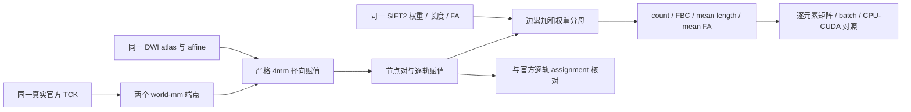
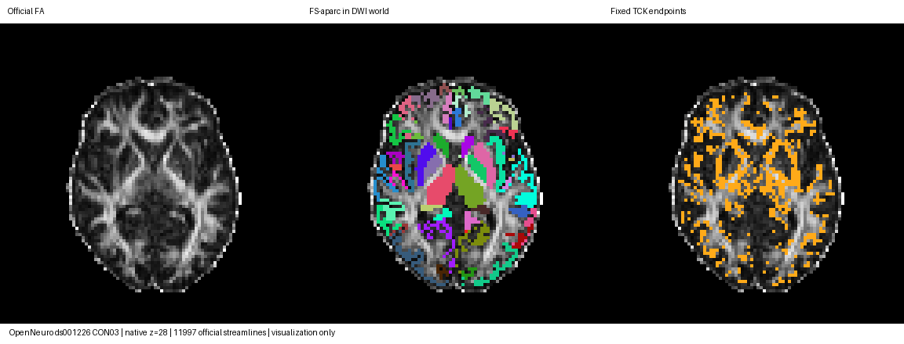

# 固定轨迹到结构连接矩阵：2026-10-03 精度审核

## 1. 功能、策略与结论

`build_connectomes()` 将轨迹端点分配到 atlas 节点，输出 count、SIFT2 FBC、平均长度和平均 FA。本轮检查真正执行的 MRtrix3 `3.0.3-103-g026e850d` 源码和公开真实 CON03，**保留原生产实现**：实际端点与 count 已匹配，Double 权重候选反而使多数矩阵更偏离官方，已经撤销。SIFT2 和 precise FA sampling 本轮也不改动。



这是固定轨迹的组件验收，不替代原始 DWI 到 connectome 的十例整链重复性验收。整链由总控制使用同一冻结实现完成。

## 2. Python 调用、输入与输出

```python
from pathlib import Path
import nibabel as nib
import numpy as np
import torch
from fnit.connectome.assignment import build_connectomes

device = torch.device('cuda:0')
tractogram_path = Path('/data/sub-CON03/tracks.tck')
atlas_path = Path('/data/sub-CON03/atlas_dwi.nii.gz')
streamline_weights_path = Path('/data/sub-CON03/sift2_weights.txt')
streamline_lengths_path = Path('/data/sub-CON03/lengths.txt')
streamline_fa_path = Path('/data/sub-CON03/mean_fa.txt')

# TCK 顺序必须与每条轨迹的三种标量完全对应。
streamlines = nib.streamlines.load(tractogram_path).tractogram.streamlines
endpoints_world_mm = torch.as_tensor(
    np.stack([(path[0], path[-1]) for path in streamlines]),
    dtype=torch.float32, device=device,
)
atlas_image = nib.load(atlas_path)
atlas_labels = torch.as_tensor(
    np.asarray(atlas_image.dataobj).astype(np.int32), device=device,
)
atlas_voxel_to_world = torch.as_tensor(
    atlas_image.affine, dtype=torch.float64, device=device,
)
matrices = build_connectomes(
    endpoints=endpoints_world_mm,             # [N,2,3]，DWI world mm
    atlas=atlas_labels,                      # [X,Y,Z]，非负整数节点
    affine=atlas_voxel_to_world,              # [4,4]，体素中心到相同 world
    weights=torch.as_tensor(np.loadtxt(streamline_weights_path), device=device),
    lengths=torch.as_tensor(np.loadtxt(streamline_lengths_path), device=device),
    fa=torch.as_tensor(np.loadtxt(streamline_fa_path), device=device),
    radius=4.0,                              # 严格距离 <4mm
    batch_size=1024,                         # 不减少轨迹，内部按候选数限内存
    node_count=84,                           # 保留实际 nodes.tsv 定义的全部行列
)
```

|参数|格式、默认值与含义|
|---|---|
|`endpoints`|`[N,2,3]`，与 atlas 同一 world 的毫米端点；其 device 决定运算设备；内部 Float32|
|`atlas`|3D 非负整数，0 为背景；节点 1 对应矩阵索引 0；缺失中间标签保留空行列|
|`affine`|`[4,4]` 可逆矩阵；体素中心到 world，当前内部 Float32；不能混用 surface RAS 或 voxel 位移|
|`weights`|可选 `[N]`，SIFT2 权重；当前按官方 mapped-track 存储语义转换 Float32，再 Double 累加|
|`lengths` / `fa`|可选 `[N]`，逐轨长度 mm / 平均 FA；Float32；与权重一起确定加权平均|
|`radius`|默认 4.0 mm，正有限数；恰好在半径边界的节点不赋值|
|`batch_size`|默认 1024，正整数；只是分块策略，输出不裁减轨迹|
|`node_count`|默认 atlas 最大值；显式值不得小于 atlas 最大值，适合 nodes.tsv 定义有缺失末尾节点的情况|

输出为同 device 的字典。`count` 是 Int64 `[K,K]`；按提供的标量加入 `sift2_fbc`、`mean_length` 和 `mean_fa` 三个 Float32 `[K,K]`。FBC 为 `sum(w)`；平均值为 `sum(w*value)/sum(w)`，未提供权重则普通平均。矩阵对称，保留自连接；有端点未赋值的轨迹丢弃，空边为 0。不改变输入轨迹、atlas 或标量。

## 3. 命令行与复现

矩阵子函数没有独立产品 CLI，由正式 pipeline 调用。例如已校正 DWI 与已有 recon-all：

```bash
fnit UKBConnectome_pipeline \
  --dwi /data/sub-CON03/corrected_dwi.nii.gz \
  --bvals /data/sub-CON03/dwi.bval \
  --bvecs /data/sub-CON03/eddy_rotated.bvec \
  --freesurfer-subject-dir /data/freesurfer/sub-CON03 \
  --atlas fs-aparc --device cuda:0 --n-seeds 100000 \
  --output-dir /data/connectome/sub-CON03
```

以下工具只用于独立验证，输出要求新目录，源数据和旧 frozen 输出只读：

|工具|全部参数及用途|
|---|---|
|`benchmark_assignment_weights.py`|`--bindings`/`--bindings-sha256` 实际十例源绑定；`--baseline`/`--candidate` 冻结 assignment 文件；`--output` 新目录；`--device` 默认 cpu；`--cases` 默认 sub-CON03；`--seeds` 默认 0..4；`--abba-rounds` 默认 4。检查官方全部 198 条命令成功、TCK/scalars/atlas/matrix SHA，保存 5×8 对照|
|`make_rejected_weight_candidate.py`|`--baseline` 必须为固定 SHA 的原文件；`--output` 新临时文件。生成与已拒绝 benchmark 完全相同的 Double-weight 候选，产品不消费此文件|
|`prepare_common_matrix_reference.py`|`--bindings`/`--bindings-sha256`；`--mrtrix-bin` 隔离 CPU 官方目录；`--output` 新 reference；`--case` 默认 sub-CON03；`--seed` 默认 0。8 atlas 各运行 count+逐轨 assignments 和同外部长度文件 mean，合计 16 条 CPU8 命令|
|`compare_common_matrix_reference.py`|`--source` 原 assignment；`--reference` 上述 completed report；`--output` 新目录；`--device` 默认 cpu；`--abba-rounds` 默认 4。诊断抓取每轨节点，计时仍调用未插桩函数；1024/256 四轮 ABBA；GPU 记录 allocated/reserved/NVML|
|`run_cuda_component.py`|`--root` 新 task05 目录、`--python` 已有 Conda Python。冻结 worker/helper/source/reference SHA 后用共享 flock 后台串行执行，状态写 cuda_controller_v1；不重新排科学任务或修改源|
|`make_fixed_tck_brain_image.py`|`--reference` 实际成功 CPU common report；`--output` 新 PNG，同时输出 SHA sidecar。使用现有 Conda Pillow，只显示真实 FA/atlas/端点|

GPU 用固定 UUID `GPU-e25cac06-0ce8-a833-abf9-09ab18c9c9ba`、共享 `/tmp/fnit-recon-five-20261002-gongwk.gpu.lock`，保持 TF32 默认及 `expandable_segments:True`。该阶段无 CUDA 子进程。官方程序仅 reference 使用，生产不调用。

## 4. 对应官方命令与源码消费类型

```bash
tck2connectome tracks.tck atlas_dwi.nii.gz count.csv \
  -symmetric -assignment_radial_search 4 -out_assignments assignments.txt -nthreads 8
tck2connectome tracks.tck atlas_dwi.nii.gz sift2_fbc.csv \
  -symmetric -assignment_radial_search 4 -tck_weights_in sift2_weights.txt -nthreads 8
tck2connectome tracks.tck atlas_dwi.nii.gz mean_length.csv \
  -symmetric -assignment_radial_search 4 -tck_weights_in sift2_weights.txt \
  -scale_file lengths.txt -stat_edge mean -nthreads 8
tck2connectome tracks.tck atlas_dwi.nii.gz mean_fa.csv \
  -symmetric -assignment_radial_search 4 -tck_weights_in sift2_weights.txt \
  -scale_file mean_fa.txt -stat_edge mean -nthreads 8
```

原完整官方流程长度矩阵用 `-scale_length`，直接从 TCK 计算。`tckstats -dump` 的有限位文本长度可能经过舍入，本轮追加 `-scale_file lengths.txt` 以核对严格相同的外部标量；两种 reference 分开保留，不能把导出尾差误判为子函数问题。

精确 `026e850d` 中，几何 `default_type` 是 Double；header 默认先重排到近 RAS，径向搜索的 `std::round` 半值远离零；offset 由 z/y/x 顺序插入再按 spacing 距离稳定排序，距离严格 `<radius`。现 FNIT Float32 几何、ties-even 舍入与候选顺序在人工半体素/等距边界可能不同；本轮真实逐轨赋值已相同，没有未验证的全局边界改动。

**特别核对成熟函数：Double 矩阵不意味着 Double 权重。** `Mapper` 将每轨权重和 factor 送入 `Mapped_track_base` 的 float 成员，之后 `Matrix<double>` 再进行 Double 乘积与累加；保留现有 Float32 weight/length/FA 正好符合这条消费链。最大 node ID ≥1024 时官方转为 `Matrix<float>`，Eigen FullPrecision 的 float CSV 精度也低于 Double CSV；FNIT 继续保留既有 Double 累加，不为了追逐文本舍入降低内部精度。

## 5. 真实精度、时间与脑图

数据为公开 OpenNeuro ds001226 CON03，新下载原始 diffusion/T1 经独立官方流程完成。原始病例、fresh recon-all、官方 corrected DWI/建模和全部完成命令由总控 source bindings 绑定；这里固定官方 TCK，并没有混用独立生成的 FNIT 轨迹。

### 原实现：五次官方轨迹 × 八 atlas

40 组 count 矩阵全部逐值相同。Double-weight 候选 FBC MAE 只有 4 组改善、36 组变坏；mean FA 为 3 组改善、37 组变坏；旧外部长度对照的 mean length 40 组均变坏。FBC 40 组平均 MAE 从 `1.20071e-8` 增至 `1.23539e-8`，未采用。原候选和完整矩阵保留在独立服务器验证目录，不进入生产；可由上述小生成器复现其完整源码 SHA。

### 追加严格外部标量与逐轨 oracle，CON03 seed0

共 11,997 条轨迹。八 atlas 每轨两个节点（不区分端点左右顺序）全部相同；count 全部逐值相同。CPU 与 CUDA 的 `batch_size=1024/256` 四个矩阵均逐位相同；两台运行的完整节点与四矩阵数组也逐位相同。

|atlas|逐轨节点不同 / count不同|FBC max|同外部长度 max mm|mean FA max|CPU / CUDA1024中位 s|
|---|---:|---:|---:|---:|---:|
|fs-aparc|0 / 0|8.88109e-6|7.28224e-6|2.96887e-8|0.05314 / 0.11468|
|aparc+TianS1|0 / 0|3.72529e-6|7.28224e-6|2.96495e-8|0.05724 / 0.07422|
|a2009s+TianS1|0 / 0|2.32458e-6|7.45981e-6|2.96522e-8|0.05672 / 0.23001|
|Glasser+TianS1|0 / 0|1.78814e-6|7.09904e-6|2.97668e-8|0.05770 / 0.12206|
|Glasser+TianS4|0 / 0|1.78814e-6|7.36684e-6|2.97668e-8|0.05592 / 0.12548|
|Schaefer200+TianS1|0 / 0|1.63913e-6|7.09904e-6|2.97434e-8|0.03273 / 0.01198|
|Schaefer500+TianS4|0 / 0|5.36442e-7|7.48838e-6|2.96891e-8|0.03347 / 0.12916|
|Schaefer1000+TianS4|0 / 0|4.66660e-5|0.000500488|5.57430e-7|0.04027 / 0.12181|

Schaefer1000 最大长度 cell `(285,810)` 为 FNIT `100.5495`、官方 CSV `100.55`，属于其 ≥1024 Float32 分支与文本表示边界；未把这一项删去或改用 Double 官方分支。浮点矩阵定义和 FNIT 输出 dtype 保持。

CPU8 正式新官方 count 命令含加载、运算、写 CSV/assignment 为 0.04298–0.29720 秒；长度命令为 0.05477–0.31273 秒，16 条合计 1.69965 秒。表中 FNIT 是同驻留输入、未插桩纯组件墙钟；I/O 范围不同，不能直接作为官方端到端加速倍数。GPU 同输入组件已在共享锁下后台完成，四轮 ABBA；八 atlas 1024 分块均快于 256，保留默认 1024。同期共享 GPU 的单组时长波动明显，报告保留所有 GPU 进程采样，不据此宣称空闲设备加速倍数。等待锁不计为计算时间。本次 GPU Torch allocated 最大 171,862,528 字节、reserved 最大 222,298,112 字节、NVML 本进程最大 2,120,220,672 字节，三者均 `<20e9`；失败采样 0、最大间隔 0.293 秒，控制器无 GPU 内存且没有 CUDA 子进程。这里是组件预算，原始十例整链时间、重复性与 process-tree 显存由总控制另列。



脑图只显示 native 第 28 层；紫色标识非有限 FA，显示不改变精度计算。SHA 和实际 affine 在同名 sidecar。成熟 assignment、SIFT2 mapping/组织掩膜/orchestration、precise FA 显式 CPU 回归 `18 passed, 4 CUDA skipped`，2.68 秒；固定 GPU UUID、共享锁内回归 `24 passed`（18 CPU＋6 CUDA），5.33 秒；与前轮冻结生产源码完全相同，不用模拟数据替代上述真实 benchmark。

## 6. 最近版本与 benchmark

- 基线 `7af34e6d072e843fb2558c931bb2781f1d4b0be9`；本轮 assignment SHA `d8901752cda4e5b8007f7c318613b343ad3edbd7072d0e0a05539a5d42ac6313` 保持。
- 2026-10-03：精确实际 bin 与 026e850d 源核对；安装目录旧 `.git` HEAD 不作为已编译源码身份。
- 同日：完成 CON03 5×8 Double-weight 候选反证，撤销候选；补齐 strict external-length CPU reference 和逐轨 assignments，全 8 atlas 逐轨匹配。
- 同日：完成 CUDA 同输入、batch1024/256 和 CPU/CUDA 完整数组逐位一致；保留成熟 SIFT2/precise FA 与原 Double 累加，组件三类显存均低于20e9。
- 最新 JSON 分别绑定各自 actual source、程序、输入、输出、命令和 CPU/CUDA设备；未完成十例新整链结果不在此表冒充验收。

## 7. 参考文献与原软件代码

- [MRtrix3 精确实际 commit 026e850d](https://github.com/MRtrix3/mrtrix3/tree/026e850d171ec2a12f09865d31b8332d23d7ecf6)。
- [tck2nodes.cpp](https://github.com/MRtrix3/mrtrix3/blob/026e850d/src/dwi/tractography/connectome/tck2nodes.cpp)，[header.cpp](https://github.com/MRtrix3/mrtrix3/blob/026e850d/core/header.cpp)，[axes.cpp](https://github.com/MRtrix3/mrtrix3/blob/026e850d/core/axes.cpp)。
- [mapped_track.h](https://github.com/MRtrix3/mrtrix3/blob/026e850d/src/dwi/tractography/connectome/mapped_track.h)，[mapper.h](https://github.com/MRtrix3/mrtrix3/blob/026e850d/src/dwi/tractography/connectome/mapper.h)，[matrix.cpp](https://github.com/MRtrix3/mrtrix3/blob/026e850d/src/dwi/tractography/connectome/matrix.cpp)，[tck2connectome.cpp](https://github.com/MRtrix3/mrtrix3/blob/026e850d/cmd/tck2connectome.cpp)。
- Smith RE et al. The effects of SIFT on the reproducibility and biological accuracy of the structural connectome. *NeuroImage*, 2015, 104:253–265.
- Smith RE et al. SIFT2: Enabling dense quantitative assessment of brain white matter connectivity using streamlines tractography. *NeuroImage*, 2015, 119:338–351.
- Tournier JD et al. MRtrix3: A fast, flexible and open software framework for medical image processing and visualisation. *NeuroImage*, 2019, 202:116137.
- [OpenNeuro ds001226](https://openneuro.org/datasets/ds001226)，原始下载和许可按前轮实际 provenance 记录；本轮不复制发布上游代码、二进制或受试者体积。
