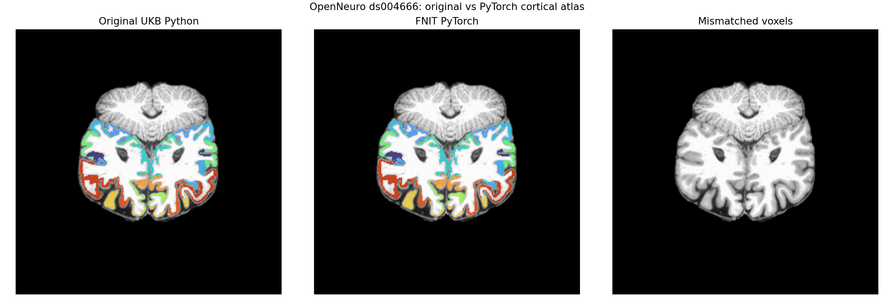

# 原 UKB atlas 步骤的同输入验证

两组真实数据分别用于不同证据。匹配的 UK Biobank T1/DWI 对用于检验原 UKB 脚本的皮层映射和 FSL Tian S1 形变步骤；其编号、私有路径、逐文件哈希与个人影像只保留在授权服务器，不入仓库。可公开的 OpenNeuro ds004666 同一 T1 的 FreeSurfer 8.2 `ribbon/pial/white/aparc.annot` 用于重跑原脚本与 FNIT，并提供示例图。公开数值记录在 [`atlas_stages.public.json`](atlas_stages.public.json)。原代码、功能与逐参数用法见[算子文档](../../../docs/connectome/ORIGINAL_ATLAS_OPERATORS.md)。

## 皮层 `aparc`：原脚本与 PyTorch

| 同输入数据 | 输出网格 | 原脚本完整进程含 I/O | FNIT 核心计算与张量搬运 | 显存峰值 | 标签差异 |
|---|---:|---:|---:|---:|---:|
| UKB 匹配 T1，官方 FreeSurfer 表面 | 256³ | 6.201 s | CUDA 4.083 s | PyTorch 已分配 1.421 GiB | 0 / 16,777,216；34 个正标签的最低 Dice 1.0；affine 相同 |
| OpenNeuro ds004666，官方 FreeSurfer 8.2 | 256³ | 7.201 s | CPU 42.580 s | 不适用 | 0 / 16,777,216；34 个正标签的最低 Dice 1.0；affine 相同 |

两组均从**同一份** `ribbon.mgz`、双半球 `pial`/`white`、`aparc.annot` 读取；原脚本是 UKB-connectomics 上游文件本身。原软件时间包括 Python 启动、输入读取和 NIfTI 写出；FNIT 时间包括 CPU→GPU 张量搬运与算子，但在输入影像已读取后开始，故不是严格端到端加速比。OpenNeuro 的 CPU 结果进一步核对设备无关性。CPU 版本慢于原脚本，GPU 版本较原脚本的完整进程墙钟短，但计时范围不同。



图中使用 OpenNeuro 公共 T1/FreeSurfer 数据。左、中的同一轴向切片叠加 `aparc` 原始标签，右图显示标签 XOR；全体积 0 个体素不同。图不使用 UKB 个人影像。

## Tian S1：冻结同一 FNIRT 输入，分开检查两个算子

原 UKB T1 存档无 `T1_to_MNI_warp_coef`，因此本次使用 **FSL 6.0.7.4** 在同一 T1 上重新运行 FLIRT（12 DOF、`corratio`）和 FNIRT（标准 `T1_2_MNI152_2mm.cnf`）得到前向 coefficient，随后冻结该文件作为双方的同输入；这个前向形变不是已归档的 UKB 产物。原 UKB README 指定的 FSL 6.0.3 也与本次参考版本不同。Tian S1 使用原仓库 `Tian_Subcortex_S1_3T.nii.gz`，MNI 网格 91×109×91；T1 参考网格 162×215×180，共 6,269,400 个体素；官方输出有 16 个正标签和 44,041 个正标签体素。

| 比较 | 精度 | 时间与内存 |
|---|---|---|
| **固定同一 FSL `invwarp` 输出**，只比较 FNIT `TorchApplyWarp` 与 FSL `applywarp --interp=nn` | 标签 0 / 6,269,400 不同；前景 Dice 1.0；16 个标签最低 Dice 1.0 | FNIT CUDA 2.058 s（含读写），PyTorch 峰值已分配 1.306 GiB；FSL 15.40 s（完整进程） |
| **固定同一 FSL `fnirt --cout` 前向 coefficient**，只比较 FNIT `invert_fnirt_t1_warp` 与 FSL `invwarp` | 全域三分量 MAE 2.115×10⁻⁶ mm，绝对误差 P99 7.629×10⁻⁶ mm、最大 1.144×10⁻⁵ mm；全域没有体素的任一分量超过 10⁻⁴ mm；Tian 正标签支持域 MAE 1.952×10⁻⁶ mm、P99 6.676×10⁻⁶ mm | FNIT CUDA 27.784 s（含读写），峰值已分配 0.367 GiB；FSL 41.43 s（完整进程） |
| FNIT **自有逆形变 + 自有最近邻采样** 对 FSL 最终 S1 | 标签 0 / 6,269,400 不同；前景 Dice 1.0；16 标签最低 Dice 1.0；正标签同为 44,041 体素 | 逆形变计时同上，采样另需 CUDA 1.240 s（含读写），峰值已分配 1.306 GiB |

FSL 参考前向步骤另耗时 FLIRT 18.98 s、FNIRT 251.23 s；两者仍是官方程序。FNIT 采用与 FSL 相同的四面体逐行求逆和六邻域填充。本次 FSL 默认 Jacobian 约束与 `--noconstraint` 的逆场最大差异 7.63×10⁻⁶ mm；FNIT 尚未实现对需要拓扑修正的其他形变所用的约束算子。FNIT 数值场与 FSL 保存的 float32 场仍有至多 1.144×10⁻⁵ mm 的舍入差异，故“标签逐体素一致”不等于“逆场文件逐字节一致”。本次前向 FNIRT coefficient 由 FSL 新生成，并非 UKB 归档文件；T1→MNI 前向配准仍待纯 PyTorch 同输入复现。FNIT 中无运行时 FSL 依赖。

## 可复现命令与输入说明

以下命令是**模板**，私有 UKB 文件需由授权用户在自己的环境设置路径。`$SUBJECT_DIR` 包含 `mri/ribbon.mgz`、双半球 `surf/*.pial/*.white` 和 `label/*.aparc.annot`；`$ORIGINAL_SCRIPT` 指向上游原始 Python 文件；`$SURFACE_OUT` 是本次输出目录；`$FNIT_PYTHON` 是装有 FNIT、PyTorch、nibabel 的 Python；`$REFERENCE_PYTHON` 还需 SciPy、pandas。`$T1_IMAGE` 是同一 T1，`$TIAN_MNI` 是原仓库 Tian S1 图，`$TIAN_OUT` 是 FSL 参考目录；`$FNIRT_COEF`、`$FSL_INVERSE`、`$FSL_ATLAS` 是该目录中的前向 coefficient、反向场和 native 标签图。

```bash
"$FNIT_PYTHON" tools/benchmark_connectome_surface_atlas.py \
  --subject-dir "$SUBJECT_DIR" \
  --original-script "$ORIGINAL_SCRIPT" \
  --output-dir "$SURFACE_OUT" \
  --device cuda:0 \
  --dataset-label real-FreeSurfer-subject \
  --subject-id "$SUBJECT_ID" \
  --instance "$INSTANCE" \
  --reference-python "$REFERENCE_PYTHON"

bash tools/benchmark_connectome_tian_reference.sh \
  "$T1_IMAGE" "$TIAN_MNI" "$TIAN_OUT"

"$FNIT_PYTHON" tools/benchmark_connectome_tian.py \
  --tian-template "$TIAN_MNI" \
  --native-t1 "$T1_IMAGE" \
  --forward-coefficients "$FNIRT_COEF" \
  --fsl-inverse "$FSL_INVERSE" \
  --fsl-atlas "$FSL_ATLAS" \
  --output-dir "$TIAN_OUT" \
  --device cuda:0
```

`benchmark_connectome_surface_atlas.py` 输出原始脚本标签图、FNIT 标签图及含输入哈希、命令、时间、显存、逐标签 Dice 的 `surface_atlas.internal.json`；`benchmark_connectome_tian.py` 输出 FSL 固定逆场的 FNIT 标签图、FNIT 逆场及完整 Tian 标签图和 `tian_atlas.internal.json`。`benchmark_connectome_tian_reference.sh` 输出 FLIRT/FNIRT/invwarp/applywarp 原始日志和影像。包含个人影像路径与输入哈希的 `*.internal.json` 应留在受控计算环境；仓库只保留上方脱敏汇总。公开 ds004666 图可用 `tools/plot_connectome_surface_atlas.py` 从其原脚本与 FNIT 两份标签图及 T1 brain/ribbon 重画，图像输出为 PNG。

## 下一验收点

1. 对 Tian S2–S4 以同一冻结 coefficient 与逆场检查逐体素标签。
2. 检查原 UKB 的 T1→MNI 标准化参数或取得其归档 coefficient；这一步决定能否主张与原流程的 atlas 输入完全相同。
3. 将七套 atlas 按原 LUT 顺序合并并映射到 DWI，检查逐标签 XOR、affine、连接矩阵维度与值。
