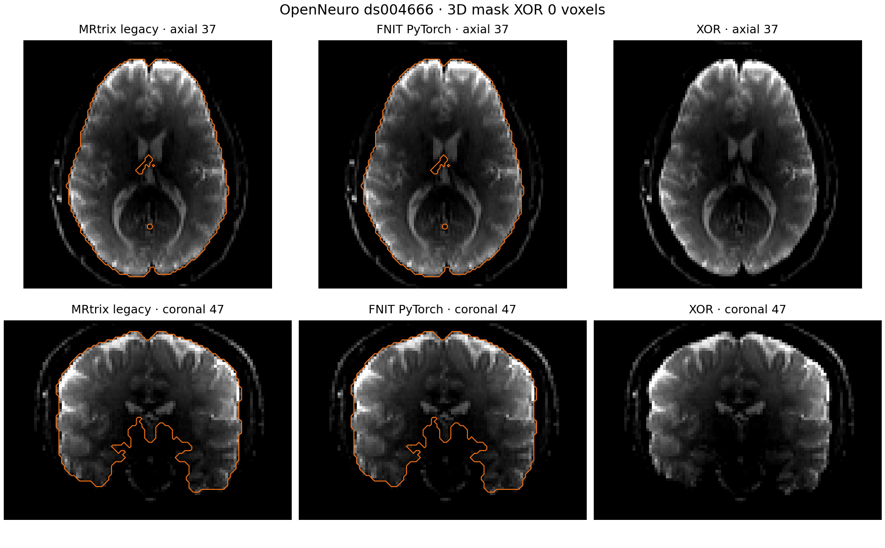

# 默认 DWI 响应掩膜：同输入对照

原 UKB 脚本执行 `dwi2response dhollander` 时不传 `-mask`。所固定的 MRtrix 版本因此在内部调用 `dwi2mask legacy`。FNIT 的 `UKBConnectome` 在 `response_mask=None` 时调用包内 `dwi2mask_legacy`；`brain_mask` 仍用于 FOD 和归一化阶段。若传入 `response_mask`，则直接使用该同网格二值文件，便于复测已有的固定掩膜实验。

## 输入、输出和计算顺序

`dwi2mask_legacy(signal, bvalues, shell_bvalues)` 的三个输入依次是校正后 float32 DWI `[X,Y,Z,N]`、与每卷对应的 MRtrix b 值 `[N]`、按升序排列的 shell 均值 `[S]`。三个张量位于同一 CPU 或 CUDA 设备。返回同设备 bool `[X,Y,Z]`，空间网格与 DWI 相同。实现按每个 shell 计算非负信号均值、相关性最优阈值与并集，然后依次执行 3×3×3 中值、最大六连通域、内部填洞、两尺度桥接清理，最后去除所有 DWI 卷均不大于零的体素。CUDA 路径默认启用 TF32；没有半精度计算。

```python
from fnit.connectome import dwi2mask_legacy

# dwi_tensor: 已校正 DWI，float32 [X,Y,Z,N]，已放到同一 CPU/CUDA 设备。
# mrtrix_bvalues: 与 N 卷逐项对应的 MRtrix 梯度 b 值，[N]。
# shell_means: 从这些 b 值聚类得到的升序 shell 均值，[S]。
response_mask = dwi2mask_legacy(
    signal=dwi_tensor,               # 输入 DWI；函数不修改它
    bvalues=mrtrix_bvalues,          # 每卷 b 值，单位 s/mm²
    shell_bvalues=shell_means,       # 各 shell 中心，单位 s/mm²
)
# response_mask: bool [X,Y,Z]；与输入 DWI 共用体素索引及 affine。
```

对应的原软件命令如下。`corrected.mif` 是用同一 DWI 和梯度转换的文件；`legacy_mask.mif` 是三维二值输出。正式响应命令不传掩膜参数。

```bash
mrconvert corrected_dwi.nii.gz corrected.mif -fslgrad rotated.bvec dwi.bval
dwi2mask legacy corrected.mif legacy_mask.mif
dwi2response dhollander corrected.mif wm.txt gm.txt csf.txt
```

## 真实数据比较

参考是原 UKB-connectomics 固定的 MRtrix `eeab681d3e0cb004cf1d1d31579d3892197ef5b6`；编译时只调整了旧计算节点上的动态库符号版本，未改变掩膜算法。输入为同一例真实 UKB 校正 DWI `104×104×72×105`，三组 shell 为 5、50、50 卷。官方和 FNIT 读取同一 float32 DWI 与同一 MRtrix 导出梯度。参考独立命令的完整掩膜由各中间操作再执行一次复核，两份原版结果本身也逐体素一致。

| 指标 | 原版 MRtrix | FNIT PyTorch CPU |
|---|---:|---:|
| 掩膜形状 | `104×104×72` | 相同 |
| 前景体素 | 156,270 | 156,270 |
| 不一致体素 | — | **0 / 778,752** |
| Dice | — | **1.000000** |
| 完整进程墙钟 | 13.45 s | 4.73 s |
| 最大驻留内存 | 0.614 GiB | 1.160 GiB |

两边计时均含输入读取、掩膜计算和输出或比较。FNIT 完整进程时间还含 Python 与 PyTorch 导入；其已加载解释器内的读取加计算为 1.54 s。MRtrix 使用 8 线程，FNIT CPU 限 8 线程。时间来自共享计算节点的各一次运行，不能解释为硬件独占状态下的加速比。GPU 用时与显存仍需补测。

公开的[ds004666 配对 T1/DWI](ds004666/README.md)采用相同命令另测一次：两边掩膜均有 186,885 个前景体素，**XOR 0 / 778,752**；原版完整进程 17.50 s，FNIT CPU 完整进程 5.33 s。机器可读聚合数值见[公开样本报告](ds004666/default_dwi_mask.cpu.public.json)。下图叠加相同校正 b0 的原版与 FNIT 掩膜边界；第三列显示逐体素差异。




可复跑的 FNIT 比较脚本为[benchmark_connectome_dwi2mask.py](../../tools/benchmark_connectome_dwi2mask.py)：

```bash
python tools/benchmark_connectome_dwi2mask.py \
  --dwi corrected_dwi_float32.nii \
  --grad-mrtrix grad_mrtrix.txt \
  --reference-mask legacy_mask.nii.gz \
  --output-json mask_report.json \
  --device cpu
```

`--dwi` 是参考 `corrected.mif` 的同精度 NIfTI，`--grad-mrtrix` 是 `mrinfo -export_grad_mrtrix` 的 `[N,4]` 文本，`--reference-mask` 是原版二值图，`--output-json` 是体素比较、运行时间和显存报告路径，`--device` 选择 CPU 或 CUDA。可选 `--output-mask` 用 nibabel 保存候选二值 NIfTI，供[绘图脚本](../../tools/plot_connectome_dwi2mask.py)生成公开示例。真实 UKB 影像、受试者编号、私有路径、逐体素数据和文件哈希仅存授权服务器；本页只发布聚合结果。可公开的配对 T1/DWI 脑图见[ds004666 示例](ds004666/README.md)。
