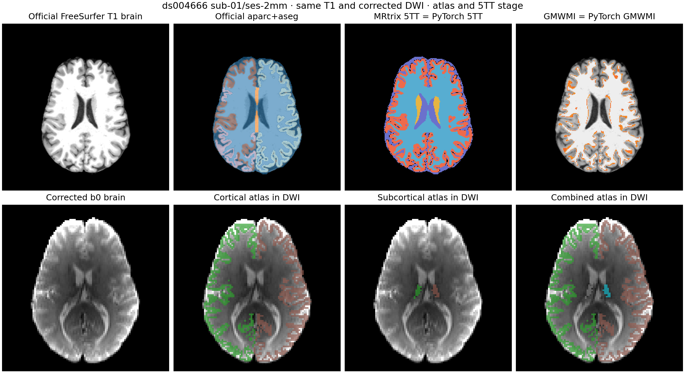

# 同输入 T1 解剖、配准与 atlas 阶段对照

固定样本为 [OpenNeuro ds004666](https://openneuro.org/datasets/ds004666) 的 `sub-01/ses-2mm` T1w 与同次已校正 AP-DWI。此阶段以 **FreeSurfer 8.2 官方 `recon-all`** 产出的 `aparc+aseg.mgz` 为冻结输入；本包的近似版 Python recon-all 不参与参考臂或候选臂。原 UKB 脚本使用 FreeSurfer 7.1、FIRST 和 `5ttgen freesurfer -first`；本机 MRtrix 3.0.3 不支持 `-first`，因此 5TT 对照采用 `-nocrop -sgm_amyg_hipp` 适配参考。这个差别限制了与原 UKB 全流程的等价性。

参考输入 SHA-256：`aparc+aseg.mgz` 为 `02e0dac0bb322e689d6c5910babe1f91b181c767d45d0bd2cdba72f508c476ab`，校正 DWI 的脑内均值 `b0_brain.nii.gz` 为 `21a929f9a3b4ed604e286a1bdea877f3eeae0ba3acc402ab0adc3ca319c638fd`，FreeSurfer `t1_brain.nii.gz` 为 `6c3f61d916ed177ab944e53c622620b1734d2b41789567dce0e563005bd28453`。其余输入和参考输出哈希分别保存在下列 JSON；[DWI 校正 provenance](corrected_input_provenance.public.json)记录 TOPUP/EDDY 条件。运算在 `gpucw1` 的 NVIDIA H100 上以 PyTorch 2.5.1、float32 和默认 TF32 执行；FSL 为 6.0.7.4，MRtrix 为 3.0.3。

| 阶段 | 相同输入与软件参考 | PyTorch 对照结果 | 单次墙钟时间 |
|---|---|---|---|
| T1 分割 | 官方 FreeSurfer `recon-all` 产出同一 `aparc+aseg.mgz`，两臂直接读取 | 分割本身使用同一官方文件，未重实现或声称分割等价 | 官方 `recon-all` 约 1.645 h，见[FreeSurfer 运行记录](freesurfer_recon_all.public.json) |
| 5TT | `5ttgen freesurfer -nocrop -sgm_amyg_hipp` 的 256³×5 组织图 | [逐值 0 不一致](anatomy_5tt.public.json)；MRtrix 9.56 s，PyTorch GPU 核心计算 0.286 s | 软件计时含进程/I/O，GPU 计时不含输入读取和写出 |
| GMWMI | `5tt2gmwmi`，相同 T1 5TT | [逐值 0 不一致](anatomy_5tt.public.json)，正值 336,136 个体素，支持 Dice 1；MRtrix 0.84 s，PyTorch GPU 核心计算 0.101 s | 同上 |
| 用固定 FSL 矩阵重采样 b0 | 相同 b0、T1 网格和 FSL 矩阵，`flirt -applyxfm -init` | [双方非零体素强度 Pearson 0.999999986、MAE 0.201、前景 Dice 0.999989](anatomy_registration_resample.public.json)；FSL 4.738 s，PyTorch 0.569 s | 测的是重采样算子，不含估计矩阵 |
| 单张标签映射 | 同一 `aparc+aseg.mgz`、FSL 变换和 b0 网格，MRtrix `mrtransform -inverse -interp nearest -template` | [104×104×72 上 0 个标签体素不一致](anatomy_atlas.public.json)，前景 Dice 1 | PyTorch 0.836 s；该单张参考未单独计时 |
| 两张 atlas 映射与合并 | 从同一 `aparc+aseg` 构造 2 区皮层、2 区皮层下测试图；分别用 MRtrix 最近邻映射，再按原 Python 脚本皮层优先、皮层下标签加 2 合并 | [皮层、皮层下、合并各 0 个体素不一致](anatomy_atlas_merge.public.json)；MRtrix 映射 0.723/0.515 s，PyTorch 0.538/0.023 s；合并核心 PyTorch 0.0158 s、原公式 NumPy 0.0058 s | 测试图用于验证操作规则，**不是**原 UKB 的皮层加 Tian atlas |

**显存。** 用 `torch.cuda.reset_peak_memory_stats()` 后的 `max_memory_allocated()` 测得：5TT+GMWMI 1.00 GiB、单张 atlas 0.218 GiB、双 atlas 0.220 GiB、固定矩阵 b0 重采样 1.130 GiB；均低于 20 GiB。报告还保存 PyTorch reserved 值。它们不包含其他进程占用，不能外推到更大输入或千万次追踪。



[示例图记录](anatomy_example_image.public.json)保存图像哈希、切面和标签来源。图中皮层/皮层下图来自冻结的 FreeSurfer 标签，验证坐标变换和合并顺序；色彩仅表示示例测试标签。5TT/GMWMI 图为 MRtrix 参考；逐值比较表明 PyTorch 数组与之相同。6DOF 配准求解器更新后的真实数据对照见[匹配 UKB 报告](../ORIGINAL_UKB_FLIRT_STAGE_20260929.md)。计时范围和软硬件开销不同，表中单项时间不能拼成完整流程的加速倍数。

## 可复跑入口

先在同一 T1 上运行官方 FreeSurfer `recon-all`。MRtrix 参考由 `5ttgen freesurfer <aparc+aseg.mgz> <5tt_t1.mif> -nocrop -sgm_amyg_hipp`、`5tt2gmwmi <5tt_t1.mif> <gmwmi_t1.mif>` 生成，再以 `mrconvert` 转为 NIfTI 供逐值比较。FSL 参考矩阵命令为：

```bash
flirt -in b0_brain.nii.gz -ref t1_brain.nii.gz \
  -cost normmi -dof 6 -omat diff2struct_fsl.txt
transformconvert diff2struct_fsl.txt b0_brain.nii.gz t1_brain.nii.gz \
  flirt_import diff2struct_mrtrix.txt
```

PyTorch 与软件参考共用这些文件。仓库脚本均有 `--help`，给出文件参数并输出带 SHA-256 的 JSON：

```bash
python tools/benchmark_connectome_anatomy.py --aparc-aseg aparc+aseg.mgz \
  --reference-5tt reference_5tt_t1.nii.gz \
  --reference-gmwmi reference_gmwmi_t1.nii.gz --device cuda:0 --output 5tt.json
python tools/benchmark_connectome_registration.py --b0 b0_brain.nii.gz \
  --t1 t1_brain.nii.gz --fsl-matrix diff2struct_fsl.txt \
  --device cuda:0 --output registration.json
python tools/benchmark_connectome_registration_resample.py --b0 b0_brain.nii.gz \
  --t1 t1_brain.nii.gz --fsl-matrix diff2struct_fsl.txt \
  --scratch scratch --device cuda:0 --output resample.json
python tools/benchmark_connectome_atlas.py --atlas-t1 aparc+aseg.mgz \
  --dwi-reference b0_brain.nii.gz --fsl-matrix diff2struct_fsl.txt \
  --mrtrix-atlas-dwi reference_aparc_dwi.nii.gz \
  --device cuda:0 --output atlas.json
python tools/benchmark_connectome_atlas_merge.py --aparc-aseg aparc+aseg.mgz \
  --dwi-reference b0_brain.nii.gz --fsl-matrix diff2struct_fsl.txt \
  --mrtrix-matrix diff2struct_mrtrix.txt --scratch scratch \
  --device cuda:0 --output atlas_merge.json
```

单张标签图的 MRtrix 参考命令为 `mrtransform aparc+aseg.mgz reference_aparc_dwi.nii.gz -linear diff2struct_mrtrix.txt -inverse -interp nearest -datatype uint32 -template b0_brain.nii.gz`。两张 atlas 的参考文件由最后一个脚本用同样参数独立生成；不同 NIfTI 存储轴顺序先依据 affine 重排到 b0 网格，之后才逐体素比较。图像入口为 [`tools/plot_connectome_anatomy.py`](../../../tools/plot_connectome_anatomy.py)。

这些结果验证此样本的官方分割输入、5TT/GMWMI、固定矩阵重采样和 atlas 操作。现行 6DOF 矩阵求解、原 UKB 的 FIRST 网格和 Tian atlas 分别见[配准](../ORIGINAL_UKB_FLIRT_STAGE_20260929.md)、[FIRST/5TT](../FIRST_MESH_5TT_STAGE_20260927.md)与[原流程 atlas](../../../docs/connectome/ORIGINAL_ATLAS_OPERATORS.md)报告；尚存的数值差异均在各报告中列出。概率纤维追踪、FOD 与 SIFT2 的差异见[连接矩阵报告](README.md)。
