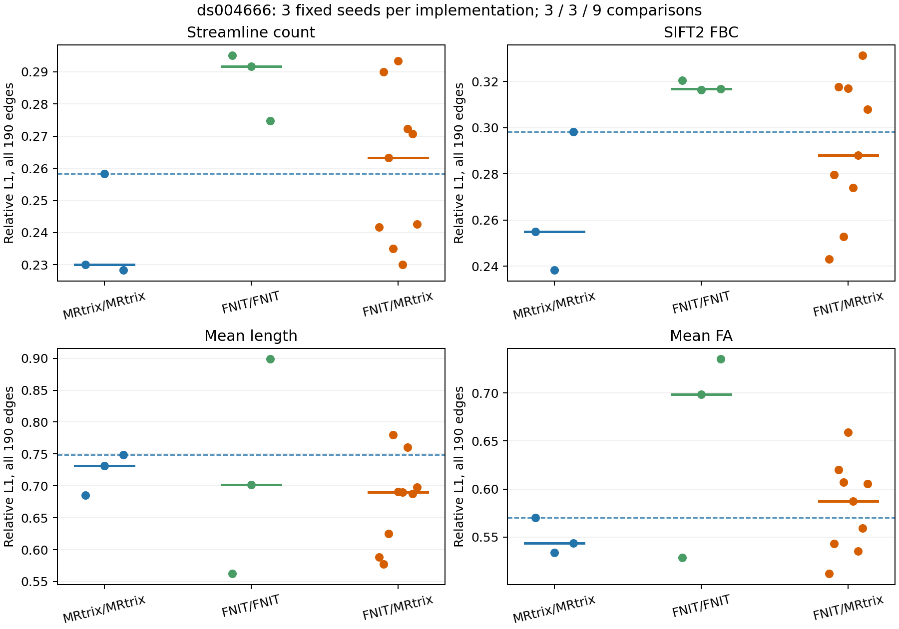

# ds004666 配对 T1/DWI：当前 connectome 验证

[OpenNeuro ds004666](https://openneuro.org/datasets/ds004666) `sub-01/ses-2mm` 提供配对 T1w 与 AP/PA DWI。原始输入的 SHA-256 见 [download_manifest.tsv](download_manifest.tsv)。本例以 FSL TOPUP/EDDY 生成校正 DWI 和旋转 bvec；元数据缺少实测总读出时间，因而参考处理假定 0.05 s，详见[输入来源](corrected_input_provenance.public.json)。T1 分割取已完成的官方 FreeSurfer `recon-all` 目录；FNIT 正式运行不调用 FreeSurfer。

## 与官方流程逐项对照

原 [UKB-connectomics](https://github.com/sina-mansour/UKB-connectomics) 以 UKB `data_ud`、FIRST、七套皮层+Tian 图谱及 1,000 万次播种为输入。本公开样本起初用 MRtrix3 3.0.3 的 FreeSurfer 5TT、20 节点 atlas 和每次 10,000 次播种隔离追踪误差；后续已扩展到 100k 播种和七套图谱矩阵。适配流程仍不等于原 UKB 的 FIRST/FNIRT/10M 整链。[早期参考命令和输出](corrected_mrtrix_fs5tt_act_adapted/)可核对。

| 步骤 | 当前同输入证据 |
|---|---|
| 5TT、GMWMI、DWI↔T1、atlas | [解剖报告](ANATOMY_STAGE_20260927.md)；固定官方分割的 5TT/GMWMI 逐值一致 |
| 掩膜、响应、FOD、mtnormalise | [掩膜](maskfilter_stage_20260927.md)、[响应/FOD](response_fod_stage_20260927.md)、[归一化](mtnormalise_stage_20260927.md)；固定输入的主要数值误差与脑图分别列明 |
| iFOD2/ACT | [当前拒绝采样与 ACT 报告](ifod2_rejection_20260929.md)；固定单弧最大概率误差 1.58×10⁻⁶，12,600 个真实 5TT 采样点 ACT 状态零差异；独立随机轨迹未全面进入官方重复包络 |
| GMWMI 播种位置 | [100k 两次官方与一次 FNIT 空间分布和脑图](gmwmi_seed_100k_20260929.md)；8 mm 网格直方图相关跨软件 0.92689、官方两次 0.92458；界面 GM−WM 差值中位数仍有小差异 |
| 100k 播种规模 | [同空间纯追踪](tracking_scale_100k_20260929.md)记录 FNIT 27,401 条、819.68 s、Torch 峰值 0.973 GiB；[三次官方与一次 FNIT 的全链四矩阵、轨迹分布和脑图](tracking_100k_matrices_20260929.md)另测 FNIT 追踪 1,443.91 s、全链 Torch 峰值 2.473 GiB。count 相对 L1 有 2/3 个跨软件比较进入官方自身范围，长度/端点/TDI 仍超出 |
| 可选 CUDA 圆弧编译核 | [同输入 128/1k/100k 对照与图](tracking_compile_20260929.md)；100k 首次编译计入的追踪 782.49 s、保留 27,353 条、全链 Torch 峰值 2.468 GiB。不同时间的共享 GPU 负载不能用于稳定加速比；长度/端点/TDI 仍超出官方自身重复范围 |
| 七套 atlas 的 100k 四矩阵 | [固定与独立 TCK 对照](seven_atlas_100k_20260929.md)；84–1054 节点的七套 count 在同一官方 TCK/逐轨数值下全部逐元素一致；独立 FNIT 轨迹的五项矩阵指标仍未全面进入三次官方互比范围，Tian 标签使用 SynthMorph |
| SIFT2、FA、双端赋值 | 固定同一官方 TCK，[SIFT2](sift2_mapping_stage.md) 逐轨权重相关 0.999999903、[FA](tcksample_precise_stage.md) 逐轨相关 0.9999999949、[count](integrated_seed0_fixed_tck_assignment.public.json) 400/400 元素一致 |
| atlas 自动生成 | [Schaefer200+Tian S1/S4](atlas_synthmorph_20260929.md)、[Schaefer500/1000+Tian S4](atlas_schaefer_multi_20260929.md)、[原生 aparc/a2009s+Tian S1](atlas_native_aparc_20260929.md)和[Glasser+Tian S1/S4](atlas_glasser_20260929.md)；七套原 UKB 图谱的皮层体积与原脚本逐体素一致。Glasser 有两个仅 1–2 个 T1 体素的节点在 DWI 网格消失。SynthMorph 与原 FNIRT 路线存在明确差异，给定同一 FNIRT coefficient 可使 Tian S1 逐体素一致 |
| 配准影响 | [固定流线敏感性实验](registration_sensitivity_20260929.md)；只换 atlas 时 count 相关 0.9986、相对 L1 0.0157；各自重跑追踪会放大矩阵差异 |

## 当前整链和随机重复

`fnit connectome --atlas schaefer200+tian-s1` 已直接读取校正 DWI、旋转梯度和官方 `recon-all` 目录，自动生成 216 节点 atlas、追踪、SIFT2 及四张矩阵。真实 1000 次播种的[输出检查与四矩阵图](atlas_synthmorph_20260929.md)显示 216 个节点全部存在、四矩阵有限且对称；这一小样本仅验收接口和文件结构。

固定真实 FOD/5TT、10,000 个 GMWMI 位置以及同一 20 节点 atlas 后，FNIT 三次分别接受 2,713、2,727、2,691 条，MRtrix 三次为 2,758、2,728、2,727 条。官方自身 count 上三角相对 L1 为 0.2283–0.2583，跨软件九组为 0.2300–0.2933，其中 4/9 进入官方范围；共同边 mean FA 归一化 MAE 官方为 0.0777–0.1014，跨软件为 0.0643–0.1039，其中 6/9 进入范围。完整矩阵、输入哈希、时间、显存及脑图见[当前追踪报告](ifod2_rejection_20260929.md)。尚不能称最终 connectome 与官方流程匹配。

100k 的[20 节点对照](tracking_100k_matrices_20260929.md)使用同一 FOD/5TT/GMWMI/FA，三次官方与一次 FNIT 的四矩阵 count 相对 L1 为官方互比 `0.094–0.117`、FNIT 对官方 `0.084–0.107`；跨软件 2/3 进入范围。FNIT 对官方的长度 KS `0.0099–0.0124`，高于官方互比 `0.0054–0.0070`；端点和 8 mm TDI 相关也略低于官方互比。[七套图谱的 100k 比较](seven_atlas_100k_20260929.md)进一步确认固定轨迹下的矩阵赋值逐值接近，但独立轨迹仍未全面匹配；1,000 万次播种尚未验收。

100k 的[可选编译核复跑](tracking_compile_20260929.md)降低了这次实测的追踪墙钟时间；FNIT 保留数与未编译运行相差 48 条，独立轨迹群体偏差未消除。当前未测 100 万及 1,000 万次播种。

## 复跑和输出

安装、每个参数及输出结构见[中文函数文档](../../../docs/connectome/README.md)。当前单模块追踪和 3×3 随机对照入口为 [`benchmark_connectome_ifod2_rejection_matrices.py`](../../../tools/benchmark_connectome_ifod2_rejection_matrices.py)；配准隔离实验为 [`benchmark_connectome_registration_sensitivity.py`](../../../tools/benchmark_connectome_registration_sensitivity.py)。官方参考命令留在相应报告的独立 benchmark 脚本中，不进入 FNIT 运行时。
