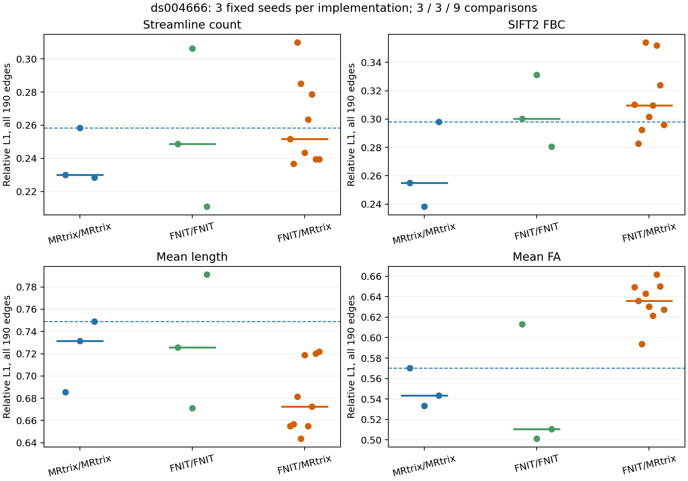

# ds004666 配对 T1/DWI：历史整链基线与分阶段验证

本页的独立追踪和整链矩阵运行于球谐函数查表修正之前，保留作历史基线。当前版的[固定单弧精度、耗时和冻结输入矩阵 A/B](ifod2_single_arc_20260929.md)已单独发表；最终 connectome 尚未达到官方多种子误差范围。

[OpenNeuro ds004666](https://openneuro.org/datasets/ds004666) `sub-01/ses-2mm` 提供同次真实 T1w、AP/PA DWI。源文件、字节数及 SHA-256 见 [download_manifest.tsv](download_manifest.tsv)。本例先以 FSL TOPUP/EDDY 校正 DWI 并旋转 bvec；元数据缺少实测总读出时间，因此 TOPUP/EDDY 都采用假定 `0.05 s`，命令与 QC 见[输入来源](corrected_input_provenance.public.json)。T1 使用官方 FreeSurfer 8.2 `recon-all`；PyTorch 不替代它。两臂固定同一校正 DWI、bval/bvec、`aparc+aseg.mgz`、20 区 SynthSeg atlas、脑掩膜和 DWI→T1 世界变换。此处整链旧报告显式提供脑掩膜，没有测试新默认 BET 分支；其单独基准见 connectome 主文档。


## 参考边界

原 [UKB-connectomics](https://github.com/sina-mansour/UKB-connectomics) 使用 UKB `data_ud`、BET 掩膜、FreeSurfer 7.1 + FIRST、Tian 亚皮层 atlas 和 1,000 万次播种。本公开样本适配 MRtrix 3.0.3 `5ttgen freesurfer -nocrop -sgm_amyg_hipp`，因安装版无 `-first`，使用 20 区 SynthSeg atlas 和每次 10,000 次播种。适配参考不等于逐字执行原 UKB 脚本。[MRtrix/FSL 实际命令](corrected_mrtrix_fs5tt_act_adapted/commands.public.txt)与[参考四矩阵](corrected_mrtrix_fs5tt_act_adapted/)可检查。

## 固定中间输入的逐步对照

| 阶段 | 同输入结果 | 时间、图像和重跑入口 |
|---|---|---|
| FreeSurfer 5TT/GMWMI、6-DOF 配准、atlas | 固定官方 `aparc+aseg.mgz` 的 5TT/GMWMI 逐值一致；真实配准与 atlas 单独报告 | [解剖阶段](ANATOMY_STAGE_20260927.md) |
| 六邻域掩膜两轮侵蚀／膨胀 | 真实 DWI 掩膜各 XOR 0、Dice 1 | [掩膜报告与切面](maskfilter_stage_20260927.md) |
| Dhollander 响应、全脑 MSMT-CSD、张量 FA | 11 个响应掩膜全部逐体素一致；WM/GM/CSF 响应最大误差 3.89e−9 / 9.06e−10 / 1.24e−10；全脑 WM 9,383,490 个 SH 值全部误差 ≤1e−5；FA 只有一个病态近零信号体素 >1e−6 | [响应/FOD 报告与图](response_fod_stage_20260927.md) |
| 三组织 `mtnormalise` | 固定官方原始 FOD，WM SH MAE 4.79e−10、最大 5.96e−8 | [归一化报告与图](mtnormalise_stage_20260927.md) |
| iFOD2 风格 GMWMI/ACT 追踪 | 10,000 次播种时官方与 PyTorch 接受 2,767 / 2,950 条；长度 KS 0.0577；8 mm 种子密度 r 0.466，接近官方自身重复 r 0.466 | [追踪报告与密度图](tracking_act_stage.md)；随机轨迹不能逐条比对 |
| SIFT2 的 fixel、处理掩膜、映射与优化 | 固定官方 FOD/5TT/2,758 条 TCK，fixel 数 243,822 一致；TDI r 0.999999937；最终逐轨权重 r 0.999999903、MAE 3.44e−5 | [FMLS 与掩膜图](sift2_fmls_stage_20260927.md)、[映射图](sift2_mapping_stage.md)、[优化器数值](sift2_optimizer_fmls_exact.public.json) |
| 精确沿程 FA | 固定官方 TCK 与原 MIF 几何，逐轨 r 0.9999999949、MAE 5.58e−7；最大差 0.000550 | [FA 报告与图](tcksample_precise_stage.md) |
| atlas 双端赋值 | 固定**本次官方 2,758 条 TCK**，两臂均赋值 2,740 条，20×20 count 400/400 元素完全一致 | [固定轨迹检查](integrated_seed0_fixed_tck_assignment.public.json) |

这些数字来自分别固定上游中间图像/流线的配对实验。各脚本参数、输入/输出结构、等价命令、真实图像、核心时间、参考时间及显存见链接报告与[完整函数文档](../../../docs/connectome/README.md)。固定轨迹的赋值一致不代替独立追踪后最终矩阵的验证。

## 当前整链 seed 0

[PyTorch 四矩阵 CSV、输入/参考 SHA-256、时间与显存](current_seed_0/report.json)对应以上相同的校正 DWI、官方 T1 分割、脑掩膜、atlas 和固定世界变换。实际输出存放在 [current_seed_0](current_seed_0/)；四个参考 CSV 在 [corrected_mrtrix_fs5tt_act_adapted](corrected_mrtrix_fs5tt_act_adapted/)。参考 CSV 的 SHA-256 与整链报告逐一相同。严格上三角 190 条边：

| 矩阵 | r：全部 190 边 | nMAE：全部边 | r：共同 39 边 | nMAE：共同边 | 支持 Dice |
|---|---:|---:|---:|---:|---:|
| count | 0.98864 | 0.06888 | 0.98760 | 0.18998 | 0.73585 |
| SIFT2 FBC | 0.98527 | 0.08491 | 0.98697 | 0.20711 | 0.73585 |
| mean length | 0.57720 | 0.17925 | 0.91292 | 0.26123 | 0.73585 |
| mean FA | 0.62107 | 0.17774 | 0.69061 | 0.12714 | 0.73585 |

nMAE = 被评估边的 MAE ÷ 该边集合内**非零参考值**的平均绝对值；共同边集合要求两臂 count 均非零。另在机器报告中保留 `relative_l1_upper` = 全部边绝对误差之和 ÷ 全部参考边绝对值之和；它与 nMAE 使用不同分母，不能直接与官方重复的 nMAE 比较。三次播种的统计采用同一口径。


[图像输入哈希](current_seed_0/connectome_comparison.json)与[可重跑绘图脚本](../../../tools/plot_connectome_end_to_end.py)确保图像对应上表的同一组 CSV。

PyTorch 10,000 次播种接受 2,827 条流线；`UKBConnectome` 调用耗时 **266.83 s**、Torch 峰值分配显存 **2.720 GiB**（H100、TF32 开启）。MRtrix 各独立命令的墙钟列在[参考 stage_times.tsv](corrected_mrtrix_fs5tt_act_adapted/stage_times.tsv)，其进程启动与文件 I/O 边界不同；FreeSurfer `recon-all` 另耗时 1.645 h。20 区上三角 count 只有 52–54 条非零边，故对长度/FA 的全边相关须与共同非零边误差一起看。[seed 0 差异诊断](integrated_seed0_diagnosis.public.json)保留边级和分布检查。

## 三种子随机波动与当前缺口

[官方随机基线阶段报告](official_stochastic_baseline_stage_20260927.md)及[官方 0/1/2 与 FNIT 0/1/2 的全部 9 个交叉比较](official_mrtrix_rng_variability/official_fnit_3x3.public.json)使用同一真实 DWI/FOD/5TT、atlas 与 FA。官方 `MRTRIX_RNG_SEED` 配合 `-nthreads 0` 固定随机序列；同种子再次生成的 TCK 流线 payload 哈希相同。FNIT 三次[矩阵与报告](current_seed_1/)（seed 1）和[矩阵与报告](current_seed_2/)（seed 2）均已归档。它们分别接受 2,827、2,828、2,832 条流线；调用时间 266.83、291.19、332.74 秒，Torch 峰值分配显存均约 2.72 GiB。时间受共享服务器负载影响。

| 指标（同一口径） | 官方三组两两范围 | FNIT×官方九组范围 |
|---|---:|---:|
| count：全边 nMAE | 0.0629–0.0707 | 0.0648–0.0909 |
| FBC：全边 nMAE | 0.0652–0.0895 | 0.0774–0.1149 |
| 非零边支持 Dice | 0.752–0.790 | 0.707–0.757 |
| mean FA：共同边 nMAE | **0.0777–0.1014** | **0.1264–0.1785** |
| mean FA：共同边 Pearson r | 0.697–0.845 | 0.433–0.691 |



此图使用**全边相对 L1**，不是上表的共同边 nMAE；完整配对边集合与两个公式均在机器报告中。

count/FBC 误差与官方随机波动部分重叠，但共同边 FA 的九次跨软件比较均劣于三次官方内部比较；当前不能称四张矩阵已与官方一致。固定同一批官方 TCK 的 FA 采样和 atlas 赋值已接近或达到逐值一致，剩余差异集中在独立 iFOD2/ACT 轨迹。正在按 MRtrix 源码改进皮层下 GM 的 ACT 终止规则，再以相同输入做单改动复测。原 UKB 1,000 万次播种的显存和时间未在此例测量。

## 复跑

安装与函数输入/输出详见[主文档](../../../docs/connectome/README.md)。固定本例文件后执行 [整链脚本](../../../tools/benchmark_connectome_end_to_end.py)；它写出四张候选 CSV、TCK、逐轨属性和带输入哈希的报告。

```bash
python tools/benchmark_connectome_end_to_end.py \
  --dwi corrected_dwi.nii.gz --bvals corrected_dwi.bval \
  --bvecs eddy_rotated.bvec --t1-brain t1_brain.nii.gz \
  --aparc-aseg aparc+aseg.mgz --atlas-dwi atlas_20_dwi.nii.gz \
  --brain-mask brain_mask_dwi.nii.gz --fod-mask brain_mask_dwi.nii.gz \
  --normalise-mask brain_mask_eroded_2.nii.gz \
  --transform diff2struct_mrtrix.txt --shell-bvals 5 999 1997 \
  --reference-dir corrected_mrtrix_fs5tt_act_adapted \
  --output-dir current_seed_0 --n-seeds 10000 --seed 0 --device cuda:0
```

本阶段新增的自动 mean b0/BET 对照见 [BET 同输入报告](bet_meanb0.public.json)和[中文算子说明与脑图](../../../docs/connectome/BET_B0_OPERATORS.md)；[阶段性成果及剩余门槛](../STAGE_RELEASE_20260928.md)单独归档。
