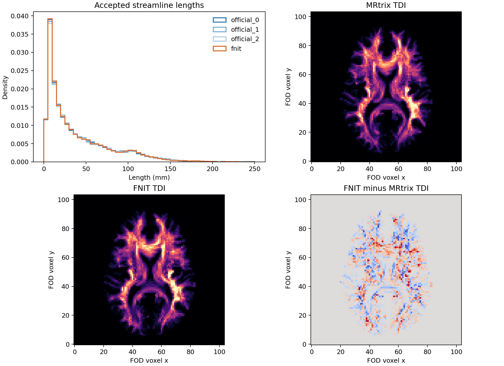

# 已接受流线的 ACT 种子界面：5TT 仿射精度对照

## 输入和问题

公开 OpenNeuro ds004666 `sub-01/ses-2mm` 的校正 DWI 与配对 T1 产生同一份 WM FOD、5TT、GMWMI。本页冻结官方 10k iFOD2/ACT 接受的 2,757 个种子及 FNIT 主线接受的 2,795 个种子，分别交给 MRtrix3 固定提交 `eeab681d3e0cb004cf1d1d31579d3892197ef5b6` 的 ACT 种子函数和 FNIT `_act_seed_direction`。初始方向固定为 `(1,0,0)`；单向分类由种子处组织分数决定，方向只影响向白质一侧翻转。

5TT MIF 的 SHA-256 是 `70dbcce20e635511a9c4b8b62b1f27fddaa5500419b24cc334233fda196eab0d`。普通 `mrconvert` NIfTI-1 保持体素完全相同，但 sform 存为 float32，SHA-256 为 `704539238d29c10eeaf4fab31831bc3ced9648ce6a59f4e9bd75c7b7d6d03fbf`。本次独立基准另写 NIfTI-2，使 sform 保留 MIF 世界变换的双精度数值，SHA-256 为 `927113d6576d31743306aa069be5087abf330bdac1912a2a9874a2189e9e1608`。[几何 JSON](sgm_tracking_20260929/five_exact_geometry.json)记录 NIfTI-1 八角点到精确几何的最大偏移 `1.43×10⁻⁵ mm`。体素数组不变；差别只在世界坐标。参考 MIF 程序仅用于基准输入准备，FNIT 正式运行不调用 MRtrix。

```bash
MRTRIX_BIN=/path/to/independent-mrtrix/bin    # 独立参考软件，不进入 FNIT 运行环境
FIVE_MIF=5tt_dwi.mif                          # 参考五组织 MIF
FIVE_NIFTI1=five_reference.nii.gz             # 同体素的普通 NIfTI-1
FIVE_NIFTI2=five_exact.nii.gz                 # 保留 MIF 仿射的 NIfTI-2 输出
"$MRTRIX_BIN/mrconvert" "$FIVE_MIF" "$FIVE_NIFTI1" # 实际输出 SHA 与本页相同
geometry_args=(
  --mrinfo "$MRTRIX_BIN/mrinfo"  # 读取参考 MIF 世界变换的程序
  --mif "$FIVE_MIF"             # 世界变换来源
  --nifti "$FIVE_NIFTI1"        # 已核对的体素数组和 NIfTI 数组顺序
  --output "$FIVE_NIFTI2"       # 精确仿射 NIfTI-2；标准输出为几何 JSON
)
python tools/reference/prepare_mif_geometry_nifti2.py "${geometry_args[@]}" > five_exact_geometry.json
```

`prepare_mif_geometry_nifti2.py` 的输入是 `mrinfo` 路径、MIF 路径及同体素 NIfTI-1 路径；输出是 NIfTI-2 图像与标准输出中的 4×4 仿射、体素轴整数置换、最大坐标残差和角点偏移。脚本检查体素轴映射确为整数翻转/置换；重新执行得到与本页 NIfTI-2 相同的 SHA-256。GMWMI 同样转换成 NIfTI-2，SHA-256 为 `00642e0da77a653cc3995860e4d2cd0ccf594e4053a754f072f034d8baa2653f`。

## 固定种子的函数级对照

基准用已有的[官方 ACT 种子观测程序](../../../tools/reference/ifod2_act_seed_oracle.cpp)调用该 MRtrix 固定提交中的实际 `check_seed`、`seed_is_unidirectional` 和 5TT 插值。输入 FOD MIF、5TT MIF、`[N,3]` 世界毫米种子文本、五列初始方向文本；输出十一列有效标志、单向标志、翻转后方向、五组织分数和界面梯度。这里方向文本每行是 `1 1 0 0 1`，即成功标志、xyz、幅度。FNIT 的[同输入脚本](../../../tools/benchmark_connectome_ifod2_act_seed.py)读取五通道 NIfTI、相同位置与初始方向及十一列官方输出；`--affine-mode header-spacing` 将 NIfTI-1 sform 列规范到头文件体素间距，`--affine-mode exact` 直接使用 NIfTI-2 仿射。`--output` 写汇总 JSON 和同名逐种子 CSV；`--device` 是 Torch 设备。

```bash
FOD_MIF=wm_fod_norm.mif                     # 参考 WM FOD；观测程序的第一项输入
FIVE_MIF=5tt_dwi.mif                       # 参考 5TT；观测程序的第二项输入
SEEDS=accepted_seed_xyz.txt                # 官方或 FNIT 已接受的 [N,3] RAS 毫米位置
INITIAL=accepted_x_dir.txt                 # 每行五列：1 1 0 0 1
OFFICIAL=accepted_act_oracle.txt           # 官方实际 ACT 输出，十一列
"$MRTRIX_BIN/ifod2_act_seed_oracle" "$FOD_MIF" "$FIVE_MIF" "$SEEDS" "$INITIAL" > "$OFFICIAL"

act_args=(
  --five-tissue five_exact.nii.gz           # 与参考 MIF 同体素、精确仿射的五组织图
  --seeds "$SEEDS"                         # 同一批已接受种子，三列
  --initial "$INITIAL"                     # 固定初始方向，五列
  --official "$OFFICIAL"                   # 十一列参考输出
  --output accepted_act_exact.json         # 逐点误差、单向 XOR、时间、输入哈希及同名 CSV
  --device cpu                              # 本次同机 CPU 计时；支持 cuda:0
  --affine-mode exact                       # 使用 NIfTI-2 sform 原值
)
python tools/benchmark_connectome_ifod2_act_seed.py "${act_args[@]}"
```

| 已接受种子来源 | 位置数 | 官方单向 | NIfTI-1 + 头间距：FNIT 单向 / XOR | NIfTI-2 + 精确 affine：FNIT 单向 / XOR |
|---|---:|---:|---:|---:|
| 官方 `tckgen -output_seeds` | 2,757 | 2,443 | 2,273 / 178 | 2,437 / 6 |
| FNIT 主线 `accepted_seeds.npy` | 2,795 | 2,404 | 2,321 / 93 | 2,404 / 0 |

五通道组织分数的逐值 MAE 在普通 NIfTI-1 为约 `4.16×10⁻⁶`，精确 NIfTI-2 为 `7.40–7.72×10⁻⁹`；单看 cGM 和 WM，普通 NIfTI-1 各约偏 `9.03×10⁻⁶`、`1.04×10⁻⁵`。不一致种子的官方 GM−WM 差值绝对值中位数仅数微量级，因此微小几何误差足以翻转单向判定。官方样本剩余 6 个不一致需单独核对位置文本的浮点舍入；不能称该组逐值一致。[四份 JSON 和逐种子 CSV](sgm_tracking_20260929/accepted_act_geometry/)及[组织分数细项](sgm_tracking_20260929/accepted_seed_tissue_parity.json)给出输入哈希和全部原值。

同一服务器上，官方观测程序检查两组种子的核心耗时分别为 0.0237、0.0167 s；FNIT 的 NIfTI-2 精确仿射检查分别为 0.0395、0.0467 s，NIfTI-1 头间距检查为 0.0656、0.0451 s。FNIT 计时从图像载入后开始，官方只计种子检查循环；数字不能视为全流程速度比。

## 精确几何下的 GMWMI 播种候选

上述检查冻结了已接受种子；实际播种还涉及 GM/WM 界面投影。旧实现使用通常的三线性取样，修正实现改用追踪 ACT 已采用的掩膜线性 5TT 取样，并保留 affine 双精度。两者分别生成 99,985 个 GMWMI 世界毫米坐标，与官方两次 `tckgen -algorithm Seedtest -output_seeds` 的成功位置比较。修正实现已在 10k/100k 独立流线对照后合并；表中“主线”指修改前的基线。

`benchmark_connectome_tracking_act_seeds.py` 的 `--five-tissue`、`--gmwmi` 输入同网格 NIfTI-2；`--reference-seeds`、`--reference-repeat-seeds` 输入两次官方 Seedtest CSV；`--reference-attempts` 记录官方尝试数；`--candidate-points` 写 FNIT float32 `[N,3]` NPY；`--output` 写输入哈希、空间直方图、界面误差、时间和显存 JSON；`--seed`、`--device` 指 PyTorch RNG 和设备；`--act-affine-mode exact` 直接用精确 affine。随后 `benchmark_connectome_seed_tissue_state.py` 用同一 5TT 和三组位置、固定 x 方向输出 ACT 有效/单向/GM 侧比例和 GM−WM 分位数。

```bash
seed_args=(
  --five-tissue five_exact.nii.gz       # 精确仿射五组织图
  --gmwmi gmwmi_exact.nii.gz            # 同网格 GMWMI 权重
  --reference-seeds seed0.csv           # 官方 Seedtest RNG 0 成功种子
  --reference-repeat-seeds seed1.csv    # 官方 Seedtest RNG 1 成功种子
  --reference-attempts 100000           # 官方尝试播种次数
  --candidate-points fnit_seeds.npy     # FNIT 世界毫米坐标输出 [99985,3]
  --output seed_report.json             # 空间/界面/性能指标及输入哈希
  --seed 0                              # FNIT PyTorch RNG
  --device cuda:1                       # 本次 H100 计算卡
  --act-affine-mode exact               # 精确 NIfTI-2 世界仿射
)
python tools/benchmark_connectome_tracking_act_seeds.py "${seed_args[@]}"

state_args=(
  --five-tissue five_exact.nii.gz       # 与播种相同的五组织图
  --official seed0.csv                  # 官方 RNG 0 成功种子
  --official-repeat seed1.csv           # 官方 RNG 1 成功种子
  --fnit fnit_seeds.npy                 # 上一步写出的 FNIT 种子
  --output seed_tissue_state.json       # ACT 单向/GM 侧/组织分位数 JSON
  --device cuda:1                       # Torch 设备
  --affine-mode exact                   # 直接采用 NIfTI-2 affine
)
python tools/benchmark_connectome_seed_tissue_state.py "${state_args[@]}"
```

| 100k 种子位置指标 | 官方两次 | FNIT 主线，精确几何 | 仅种子 affine 改双精度 | 掩膜线性播种加双精度 |
|---|---:|---:|---:|---:|
| ACT 单向比例 | 0.925899 / 0.925910 | 0.900015 | 0.914507 | 0.926149 |
| GM 侧比例 | 0.995899 / 0.995679 | 0.967495 | 0.982747 | 0.995109 |
| GM−WM 差绝对值中位数 | 0.000262 | 0.000398 | 0.000400 | 0.000265 |
| 8 mm 空间直方图相关，对官方 RNG 0 | 官方互比约 0.9246 | 0.9269 | 见原始 JSON | 0.9270 |
| 已载入影像的 FNIT 播种时间 | 官方 Seedtest 完整命令 1.26–1.36 s | 3.71 s | 见原始 JSON | 3.61 s |

双精度 affine 单独改善单向比例，但没有让种子紧贴官方的 GM/WM 界面；两项修改共同使用才在这两项指标上接近官方。空间相关和界面中位数只是函数级证据；独立追踪的结果见下文。[旧算法播种](sgm_tracking_20260929/seed_exact_compare/old_report.json)、[双精度单项](sgm_tracking_20260929/seed_exact_compare/old_float64_report.json)、[现行掩膜线性算法](sgm_tracking_20260929/seed_exact_compare/masked_report.json)及对应的 `tissue_state.json` 保存样本量、输入哈希、分位数和性能。官方完整命令与 FNIT 核心计时边界不同。

## 独立 10k 追踪的传播效果

固定同一真实 FOD NIfTI-1、FA、20 节点 atlas 和 FNIT RNG 0；五组织与 GMWMI 改用上面的精确 NIfTI-2，`probabilistic_tractography` 通过 `five_tissue_spacing_mm=None` 直接采用传入 affine。其他参数与[10k 分层检查](sgm_tracking_20260929.md)相同。官方保持原 MIF 输入。普通 NIfTI-1 主线与精确几何复跑分别接受 2,795、2,851 条，官方接受 2,757 条。追踪耗时 96.34、247.79 s，分别在不同时间的共享 H100 上计量，精确几何复跑 Torch 追踪峰值 0.663 GiB。

下列[真实输入基准脚本](../../../tools/benchmark_connectome_tracking_100k_matrices.py)的 `--act-affine-mode exact` 对应本次精确 NIfTI-2 试验。`--official-dir` 应指向同为 10k 播种的官方四矩阵；`--output-dir` 写 `tracks.tck`、`accepted_seeds.npy`、`tracking.json`、四张 CSV 和总体 `report.json`。`--n-seeds` 是播种尝试数，`--batch-size` 是每批种子数，`--seed` 是 FNIT RNG，`--device` 指计算设备，`--compile-arc` 启用 float32/TF32 的 CUDA 圆弧核编译。

```bash
track_args=(
  --fod fod_reference.nii.gz             # 与官方 MIF 同体素的 WM 球谐 FOD
  --five-tissue five_exact.nii.gz        # 精确世界仿射的五组织 NIfTI-2
  --gmwmi gmwmi_exact.nii.gz             # 与 5TT 同网格的精确 GMWMI NIfTI-2
  --fa fa_corrected.nii.gz               # 沿轨迹采样的真实 FA
  --atlas synthseg_gm_atlas_dwi.nii.gz   # DWI 空间 20 节点整数标签
  --official-dir official_10k_matrices   # 官方相同播种数的四矩阵参考目录
  --output-dir fnit_exact_10k            # FNIT TCK、种子、四矩阵和性能报告目录
  --n-seeds 10000                        # 尝试 10,000 次 GMWMI 播种
  --batch-size 8192                      # 每批最多 8,192 个种子
  --seed 0                               # 固定 FNIT PyTorch RNG
  --device cuda:0                        # H100 GPU；默认 TF32
  --compile-arc                          # 编译 iFOD2 圆弧概率核
  --act-affine-mode exact                # 直接使用精确 NIfTI-2 affine
)
python tools/benchmark_connectome_tracking_100k_matrices.py "${track_args[@]}"
```

| 组别 | 皮层 / 皮层下流线数 | 皮层 75% 长度 | 皮层下 75% 长度 | 对官方长度 KS：皮层 / 皮层下 |
|---|---:|---:|---:|---:|
| 官方 | 2449 / 308 | 56.35 mm | 76.71 mm | — |
| FNIT 原 NIfTI-1 | 2487 / 308 | 55.76 mm | 70.71 mm | 0.01565 / 0.06818 |
| FNIT 精确 NIfTI-2 | 2552 / 299 | 56.69 mm | 72.18 mm | 0.02626 / 0.05809 |

精确仿射修复了本批种子的组织取值，但独立流线数量和长度分布尚未进入官方范围。此项旧算法实验的 FOD 仍是 NIfTI-1 仿射；后续 FOD 精确仿射实验见下文。分层原始数据和脑图见[JSON](sgm_tracking_20260929/exact_10k_seed_stratified.json)、[PNG](sgm_tracking_20260929/exact_10k_seed_stratified.png)及[时间/显存](sgm_tracking_20260929/exact_10k_tracking.json)。

四矩阵另用[单次 FNIT 对三次官方脚本](../../../tools/benchmark_connectome_matrix_single_envelope.py)比较。`--official` 是按 RNG 0/1/2 排序的三份 20×20 四矩阵目录，`--fnit` 是一份同为 10k 播种的 FNIT 四矩阵目录，`--output` 写四矩阵输入哈希、官方三对、跨软件三对及范围内配对数。`count` 和 SIFT2 FBC 的全边相对 L1 为 `Σ|FNIT−官方|/Σ|官方|`；支持 Dice 按非零上三角边计算。各边数值和所有其他指标在原始 JSON 中。

```bash
matrix_args=(
  --official official_seed0/matrices official_seed1/matrices official_seed2/matrices # 三次独立官方 10k 四矩阵
  --fnit fnit_exact_10k               # 精确几何 FNIT 的四矩阵目录
  --output matrix_envelope.json       # 官方互比及 FNIT 对官方逐对指标和哈希
)
python tools/benchmark_connectome_matrix_single_envelope.py "${matrix_args[@]}"
```

| 10k 指标 | 官方自身三对范围 | NIfTI-1 FNIT 对官方三对：范围 / 入范围 | 精确 NIfTI-2 FNIT 对官方三对：范围 / 入范围 |
|---|---:|---:|---:|
| count 全边相对 L1 | 0.2283–0.2583 | 0.2613–0.2933 / 0 | 0.2383–0.2783 / 2 |
| SIFT2 FBC 全边相对 L1 | 0.2384–0.2982 | 0.2931–0.3272 / 1 | 0.2444–0.3407 / 2 |
| mean FA 共同边归一化误差 | 0.0777–0.1014 | 0.0845–0.1093 / 2 | 0.0858–0.0985 / 3 |
| count 非零边支持 Dice | 0.7523–0.7899 | 0.7395–0.7597 / 1 | 0.7333–0.7478 / 0 |

精确几何改善了三项矩阵数值的部分配对，但连接支持 Dice 的三次比较全部低于官方自身范围。[原 NIfTI-1 JSON](sgm_tracking_20260929/original_fnit_10k_matrix_envelope.json)与[精确 NIfTI-2 JSON](sgm_tracking_20260929/exact_10k_matrix_envelope.json)保存四矩阵逐对数据。这项变更没有达到完整 connectome 匹配。

精确 5TT/GMWMI 几何的旧播种算法再运行 100k，接受 27,386 条，官方三次为 27,616–27,717 条。FNIT 追踪 1,956.13 s、后处理 43.11 s，全链峰值 Torch 分配 2.472 GiB；与其他时段的 H100 负载不同，不能按墙钟推断算法本身变慢。对官方三次，count 全边相对 L1 为 0.0861–0.1097，有 2/3 落入官方 0.0937–0.1174 范围；count 支持 Dice 为 0.8835–0.8976，有 2/3 落入官方 0.8517–0.8879 范围。长度 KS 为 0.00865–0.01389，官方互比 0.00541–0.00696；8 mm 端点相关为 0.8828–0.8920，官方 0.8954–0.8970；8 mm TDI 相关为 0.9797–0.9824，官方 0.9841–0.9863。这三项跨软件配对仍全部在官方范围外。[轨迹群体 JSON](sgm_tracking_20260929/exact_100k_population.json)、[脑图](sgm_tracking_20260929/exact_100k_population.png)、[四矩阵 JSON](sgm_tracking_20260929/exact_100k_matrix_envelope.json)及[全链时间显存](sgm_tracking_20260929/exact_100k_full_report.json)保留逐对数值和输入哈希。FOD 此次仍为普通 NIfTI-1，后续单独检查其几何精度。

将掩膜线性播种修正放进同一精确几何的 10k 全链后，接受 2,707 条；官方为 2,757 条。皮层下起始流线为 289 条，75% 长度 66.35 mm，长度 KS 为 0.08644；旧算法对应 299 条、72.18 mm 和 0.05809。修正实现的 count 支持 Dice 为 0.7455–0.7619，仅 1/3 跨软件配对落入官方 0.7523–0.7899 范围；SIFT2 FBC 全边相对 L1 的 3/3 配对落入范围。10k 的各项指标方向不一致。追踪核心用时 277.95 s，峰值 Torch 分配 0.663 GiB；共享 H100 的负载与其他运行不同。[分层 JSON](sgm_tracking_20260929/masked_exact_10k_seed_stratified.json)、[分层图](sgm_tracking_20260929/masked_exact_10k_seed_stratified.png)、[四矩阵 JSON](sgm_tracking_20260929/masked_exact_10k_matrix_envelope.json)及[追踪计时](sgm_tracking_20260929/masked_exact_10k_tracking.json)保留具体数值。100k 的组织侧别和矩阵复核支持合并两处播种修正，但不支持宣称完整追踪已经匹配。

## FOD 仿射的单项检查

上面仅把 5TT/GMWMI 换成精确 NIfTI-2，FOD 仍是普通 NIfTI-1。再把 FOD 换成同体素、精确世界仿射的 NIfTI-2，保持主线追踪代码、RNG 0、FA 和 atlas 不变。FOD NIfTI-1 与 NIfTI-2 的 SHA-256 分别为 `18addc15596dadf7fb60727ae9af8d1cbd98c139964712454a33a718c5f4e7c1` 和 `d695ad2802c26322e380ee81cfd022a01c87f74831e0c61b9af4131562dd55e4`，体素逐值相同；角点世界位置最大相差 `1.548×10⁻⁵ mm`。[几何 JSON](sgm_tracking_20260929/fod_exact_geometry.json)记载轴映射和仿射。参考准备命令与本页开头相同，只把 `--mif` 指向 `wm_fod_norm.mif`、`--nifti` 指向 `fod_reference.nii.gz`、`--output` 指向 `fod_exact.nii.gz`。FNIT 基准命令只把上述 `track_args` 中的 `--fod` 改为 `fod_exact.nii.gz`。

| 10k 独立追踪 | FOD NIfTI-1，5TT 精确 | FOD 和 5TT 均精确 | 官方 |
|---|---:|---:|---:|
| 接受流线 | 2,851 | 2,814 | 2,757 |
| 皮层下 75% 长度 | 72.18 mm | 73.98 mm | 76.71 mm |
| 皮层 / 皮层下长度 KS | 0.02626 / 0.05809 | 0.01486 / 0.05289 | — |
| count 全边相对 L1，三对进入官方范围 | 2/3 | 3/3 | 范围 0.2283–0.2583 |
| count 支持 Dice，三对进入官方范围 | 0/3 | 0/3 | 范围 0.7523–0.7899 |
| mean FA 共同边误差，三对进入官方范围 | 3/3 | 1/3 | 范围 0.0777–0.1014 |

FOD 精确仿射改善了本次长度分布和 count 误差，但仍未让支持和 FA 全部进入官方重复范围；10k 单次不能说明稳定改进。[逐种子分层指标](sgm_tracking_20260929/exact_all_10k_stratified.json)、[长度图](sgm_tracking_20260929/exact_all_10k_stratified.png)、[四矩阵逐对指标](sgm_tracking_20260929/exact_all_10k_matrix_envelope.json)及[追踪计时](sgm_tracking_20260929/exact_all_10k_tracking.json)已经保存。同一条件的 100k 复核见下文。

## 100k 全链与当前合并结论

以下三组均用同一受试者、官方三次 100k 独立追踪、同一 FA 和 20 节点 DWI atlas。第一、二组共用精确 5TT/GMWMI，FOD 仍是普通 NIfTI-1；第二组的追踪源码 SHA-256 为 `6c74bba7ff28d60caaa3863aa8165d5383f85039efefbe72415d34378df35a4a`，相对旧代码仅改 5TT 取样函数与播种 affine 精度。第三组仅把 FOD 改成精确 NIfTI-2，保持旧播种算法。基准运行时均未把官方程序引入 FNIT 追踪路径。

| 100k 结果 | 旧播种、普通 FOD | 现行播种、普通 FOD | 旧播种、精确 FOD | 官方三次范围 |
|---|---:|---:|---:|---:|
| 已接受流线 | 27,386 | 27,549 | 27,234 | 27,616–27,717 |
| count 全边相对 L1 入范围 | 2/3 | **3/3** | 3/3 | 0.0937–0.1174 |
| count 支持 Dice 入范围 | 2/3 | **3/3** | 2/3 | 0.8517–0.8879 |
| mean FA 全边相对 L1 入范围 | 2/3 | **3/3** | 2/3 | 0.2771–0.3620 |
| 长度 KS 入范围 | 0/3 | 0/3 | 0/3 | 0.00541–0.00696 |
| 8 mm 端点相关入范围 | 0/3 | 0/3 | 0/3 | 0.8949–0.8965 |
| 8 mm TDI 相关入范围 | 0/3 | 0/3 | 0/3 | 0.9841–0.9863 |
| 追踪时间，H100 共享 GPU | 1,956.13 s | 1,980.32 s | 2,037.80 s | 官方 CPU 67.73–84.42 s |
| 全链 Torch 峰值显存 | 2.472 GiB | 2.472 GiB | 2.472 GiB | — |

“入范围”严格指跨软件三对数值落在官方三对数值的最小值与最大值之间，相关性高于官方上界或 KS 低于官方下界也记为范围外。因此这些计数是描述性随机基准，不是显著性检验。100k 现行播种把已接受种子的白质侧错误从 90/2,851（10k 旧算法）降到 0/2,707，与官方 0/2,757 相同；这一明确的算法修正和 count/支持对照支持合并。皮层下流线长度与 TDI 仍未匹配，不能把当前连接组称为完整复现。[现行 100k 四矩阵](sgm_tracking_20260929/masked_exact_100k_matrix_envelope.json)、[长度/端点/TDI](sgm_tracking_20260929/masked_exact_100k_population.json)、[计时显存](sgm_tracking_20260929/masked_exact_100k_tracking.json)、[脑图](sgm_tracking_20260929/masked_exact_100k_population.png)；[旧播种+精确 FOD 的对应四矩阵](sgm_tracking_20260929/exact_all_100k_matrix_envelope.json)、[群体指标](sgm_tracking_20260929/exact_all_100k_population.json)、[计时](sgm_tracking_20260929/exact_all_100k_tracking.json)和[脑图](sgm_tracking_20260929/exact_all_100k_population.png)均保留逐项数值与哈希。



保持上述现行播种并把 FOD 换成精确几何的 10k 隔离检查，接受 2,707 条，皮层下 75% 长度仍为 66.35 mm、KS 0.08644，未解决长度差异。[分层 JSON](sgm_tracking_20260929/masked_exact_all_10k_stratified.json)、[图](sgm_tracking_20260929/masked_exact_all_10k_stratified.png)、[四矩阵](sgm_tracking_20260929/masked_exact_all_10k_matrix_envelope.json)、[计时](sgm_tracking_20260929/masked_exact_all_10k_tracking.json)保存四因素组合的最后一组。后续优先冻结同一初始方向与圆弧提案，比较双向 ACT 终止和截断；随后在 100k、1M、10M 重测轨迹群体、四矩阵、耗时和显存。

## 已接受流线的种子与端点组织

为区分界面播种和后续终止，对上述 10k TCK 及其逐条已接受种子再用**同一精确 5TT**的 FNIT 掩膜线性插值取组织分数。诊断脚本 `benchmark_connectome_terminal_tissue.py` 的 `--official-tracks`、`--fnit-tracks` 是两份 TCK；`--official-seeds` 是 `tckgen -output_seeds` 的 CSV，`--fnit-seeds` 是形状 `[N,3]` 的 NPY，顺序均与 TCK 一致；`--five-tissue` 是 NIfTI-2 五组织图；`--output` 写含输入哈希、按种子组织分组的流线长度分位和端点组织计数的 JSON。背景/CSF/病灶也单独计数。官方命令在上面的 `tckgen` 后增加 `-output_seeds official_seeds.csv`；这个端点分类是独立诊断，不是官方 `tckgen` 的输出字段。

```bash
terminal_args=(
  --official-tracks official_10k/tracks.tck       # 官方已接受流线
  --official-seeds official_seeds.csv             # 官方逐条已接受种子的世界毫米坐标
  --fnit-tracks fnit_exact_10k/tracks.tck         # FNIT 同输入独立流线
  --fnit-seeds fnit_exact_10k/accepted_seeds.npy  # 对应的 [N,3] 世界毫米坐标
  --five-tissue five_exact.nii.gz                 # 两组共用的精确几何五组织图
  --output terminal_tissue.json                   # 输入哈希与按组织分类的 JSON
)
python tools/benchmark_connectome_terminal_tissue.py "${terminal_args[@]}"
```

| 10k 已接受种子的 WM 侧数 | 官方 | 精确 5TT/GMWMI 主线 | 掩膜线性播种候选 | FOD/5TT 均精确、主线播种 |
|---|---:|---:|---:|---:|
| `cGM+sGM < WM` | 0 / 2,757 | 90 / 2,851 | 0 / 2,707 | 95 / 2,814 |

因此候选播种解决了一处明确的界面方向错误；FOD 仿射精度单独不能解决它。所有流线的非种子终点按同一 5TT 分类时，官方有 cGM 2,374、sGM 670、WM 27 个；精确 5TT 主线为 2,500、734、3 个，播种候选为 2,314、694、3 个。这里的组织类别是终点位置取样，不能直接当作 `tckgen` 内部终止原因；剩余差别还需要冻结轨迹的 ACT 终止状态核对。[主线](sgm_tracking_20260929/exact_10k_terminal_tissue.json)、[播种候选](sgm_tracking_20260929/masked_exact_10k_terminal_tissue.json)、[精确 FOD 主线](sgm_tracking_20260929/exact_all_10k_terminal_tissue.json)记录每类种子的长度分位及末端组织。

## 参考文献与原实现

- Smith RE 等，*Anatomically-constrained tractography: improved diffusion MRI streamlines tractography through effective use of anatomical information*，NeuroImage 62:1924–1938，2012。[论文](https://pubmed.ncbi.nlm.nih.gov/22705374/)。
- Tournier JD 等，*MRtrix3: A fast, flexible and open software framework for medical image processing and visualisation*，NeuroImage 202:116137，2019。[论文](https://pubmed.ncbi.nlm.nih.gov/31473352/)。
- 原实现代码库：[MRtrix3 固定提交](https://github.com/MRtrix3/mrtrix3/tree/eeab681d3e0cb004cf1d1d31579d3892197ef5b6)、[UKB-connectomics](https://github.com/sina-mansour/UKB-connectomics)。
