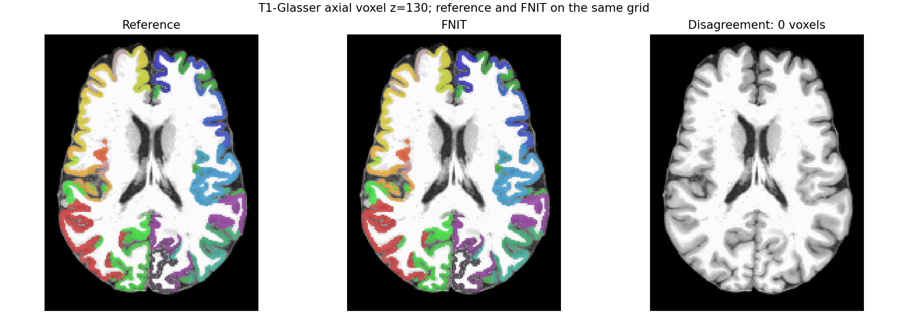

# Glasser 与 Tian S1/S4：公开 T1 和 DWI 图谱核对

公开 OpenNeuro ds004666 `sub-01/ses-2mm` 的已完成 `recon-all` 目录、原 UKB-connectomics 的 Glasser 32k dlabel、双半球 32k fsLR 与 164k fsaverage 球面是两臂共同输入。独立参考依次调用 Workbench `-cifti-separate`、`-label-resample BARYCENTRIC`、原 UKB `convert_labels_gii_to_annot.py`、FreeSurfer `mri_surf2surf` 和原 UKB `map_surface_label_to_volume.py`。FNIT 正式运行时仅调用允许的 Workbench 完成 fsLR→fsaverage 标签重采样，之后用已有 PyTorch 球面最近邻和 ribbon 投影，不调用 FreeSurfer 或原 UKB 脚本。

## 函数、输入与输出

`glasser_to_t1(subject_dir=..., fsaverage_dir=..., atlas_templates_dir=..., device=..., workbench_command=...)` 的输入分别是已完成的 recon-all 受试者目录、含双半球 `surf/*.sphere.reg` 的 fsaverage 目录、含 Glasser 32k dlabel 的原 UKB `data/templates/atlases` 目录、Torch 设备和 Workbench 程序。图谱目录相邻的 `data/templates/surfaces` 必须有双半球 32k fsLR 与 164k fsaverage 球面。输出 `(image, nodes)`：`image` 是 T1 ribbon 网格的 int32 NIfTI `[256,256,256]`，背景为 0、节点为 1..360；`nodes` 是 360 行 `ConnectomeNode(index, original_label, hemisphere, name)`，顺序与原 UKB Glasser 一致：右半球 1–180，左半球 181–360。

```python
from fnit.connectome import glasser_to_t1

image, nodes = glasser_to_t1(
    subject_dir=subject_dir,                 # 已完成 recon-all；含 ribbon、pial/white、sphere.reg
    fsaverage_dir=fsaverage_dir,             # fsaverage；含双半球 sphere.reg
    atlas_templates_dir=atlas_templates_dir, # 原 UKB data/templates/atlases；相邻目录为 surfaces
    device="cuda:0",                        # 164k→原生顶点与 ribbon 投影的 PyTorch 设备
    workbench_command="wb_command",         # fsLR32k→fsaverage164k 的 Workbench 程序
)
```

独立参考的全部参数见[原版命令脚本](../../../tools/reference/benchmark_glasser_original.sh)：五个位置参数依次是原 UKB 工作目录、同一 recon-all 目录、Workbench 程序、FreeSurfer 安装目录、参考输出目录。核心命令：

```bash
wb_command -cifti-separate Glasser.32k_fs_LR.dlabel.nii COLUMN \
  -label CORTEX_LEFT lh.32k.label.gii
wb_command -label-resample lh.32k.label.gii L.sphere.32k_fs_LR.surf.gii \
  fs_L-to-fs_LR_fsaverage.L_LR.spherical_std.164k_fs_L.surf.gii \
  BARYCENTRIC lh.164k.label.gii
python scripts/python/convert_labels_gii_to_annot.py \
  lh.164k.label.gii lh.fsaverage.Glasser.annot
mri_surf2surf --srcsubject fsaverage --trgsubject SUBJECT --hemi lh \
  --sval-annot lh.fsaverage.Glasser.annot --tval lh.native.Glasser.annot
python scripts/python/map_surface_label_to_volume.py \
  MAIN_DIR SUBJECTS_DIR public 0 Glasser
```

右半球同序运行，`CORTEX_LEFT` 与 `L` 换成 `CORTEX_RIGHT` 与 `R`。完整 dlabel 文件名、输入路径和输出计时在参考脚本中。FNIT [体积对照脚本](../../../tools/benchmark_connectome_glasser_volume.py)的参数如下：

```bash
glasser_args=(
  --subject-dir "$SUBJECT"                 # 相同的已完成 recon-all 受试者目录
  --fsaverage-dir "$FSAVERAGE"             # 相同 FreeSurfer 版本的 fsaverage
  --atlas-templates-dir "$ATLAS_TEMPLATES" # 原 UKB atlas 目录；相邻 surfaces 目录
  --official-volume "$OFFICIAL_T1"        # 原版最终 native.Glasser.nii.gz
  --workbench-command "$WB_COMMAND"       # Connectome Workbench 可执行文件
  --device cuda:0                          # H100 GPU，PyTorch 默认 TF32
  --output-dir "$OUTPUT"                  # atlas_t1.nii.gz、report.json
)
python tools/benchmark_connectome_glasser_volume.py "${glasser_args[@]}"
```

## 同输入结果

| 阶段 | 原版 CPU 墙钟 | FNIT H100 墙钟 | 结果 |
|---|---:|---:|---|
| 双半球分离、重采样、注释转换、原生映射及体积 | 20.52 s | 5.30 s | 360 节点；逐体素差异 **0 / 16,777,216**；前景差异 0 |
| Glasser + Tian S1，同一校正 DWI 网格 | — | 9.22 s | T1 376 节点；DWI 374 节点有体素 |
| Glasser + Tian S4，同一校正 DWI 网格 | — | 7.92 s | T1 414 节点；DWI 412 节点有体素 |

原版在 Xeon Gold 6418H、FNIT 在共享 H100 PCIe 运行；计时都包含各自进程、读写，硬件和缓存条件不同。FNIT 的 Torch 分配峰值均为 **1.399 GiB**；这是 Torch 分配，不含 Workbench 进程和其他内存。Glasser 两套组合在 DWI 网格都失去 `R_H_ROI`、`L_H_ROI` 的体素：它们在 1 mm T1 网格仅有 2 和 1 个体素。节点仍保留在 `nodes.tsv` 和矩阵维度中，其对应行列可为零。逐体素报告和输入哈希见[皮层](atlas_glasser_20260929/glasser.json)、[376 节点](atlas_glasser_20260929/glasser_tian_s1.json)、[414 节点](atlas_glasser_20260929/glasser_tian_s4.json)。

共享的 fsaverage→原生顶点函数现在从实际左半球标签集合判定 `hemisphere`，适配 Glasser 的右半球先编号。用相同 Schaefer500 真实输入再次验证，旧有皮层体积仍为 500 节点、体素差异 0 / 16,777,216，耗时 2.27 s；见[回归 JSON](atlas_glasser_20260929/schaefer500_regression.json)。



[组合图谱脚本](../../../tools/benchmark_connectome_cortical_tian_profile.py)添加 `--glasser-template-dir` 指向上述 atlas 目录，`--workbench-command` 指向 Workbench；`--tian-t1` 指向 SynthMorph 得到的同 T1 网格 Tian S1 或 S4，`--tian-names` 是分别 16 或 54 行节点名，`--dwi-reference` 只提供真实校正 DWI 网格及 affine，`--dwi-to-t1-world` 是固定的 4×4 RAS 毫米变换，`--output-dir` 写出 `atlas_t1.nii.gz`、`atlas_dwi.nii.gz`、`nodes.tsv`、`report.json`。两套图谱均使用前述同一 DWI→T1 变换。Tian 的 SynthMorph 配准与原 UKB FNIRT 是不同方法；上述皮层逐体素一致不代表组合图谱或最终 connectome 已与原版逐值一致。两种 Glasser CLI 选项尚未各自完成 DWI 到四矩阵的一键实测。

正式 CLI 的 Glasser+Tian S1 输入示例；S4 只需把 `--atlas` 改成 `glasser+tian-s4`，图谱目录须同时有 Tian S4 图像与名称表：

```bash
glasser_cli_args=(
  --dwi "$DWI"                       # 已完成 TOPUP/eddy 的四维 DWI NIfTI
  --bvals "$BVALS"                   # 与 DWI 每个体积对应的 b 值
  --bvecs "$BVECS"                   # eddy 旋转后的方向向量
  --freesurfer-subject-dir "$SUBJECT" # 已完成 recon-all 的同受试者目录
  --atlas glasser+tian-s1            # 360 个 Glasser 皮层节点加 16 个 Tian S1 节点
  --atlas-templates-dir "$ATLAS_TEMPLATES" # 原 UKB atlases 目录，相邻为 surfaces
  --fsaverage-dir "$FSAVERAGE"       # 含双半球 sphere.reg 的 fsaverage 目录
  --mni-template "$MNI_TEMPLATE"     # 与 Tian 模板同网格的 MNI T1 图像
  --synthmorph-weights "$WEIGHTS"    # SynthMorph affine/deform 权重目录
  --n-seeds 10000                    # GMWMI 播种尝试次数
  --seed 0                           # PyTorch 追踪随机种子
  --device cuda:0                    # H100 等 CUDA 设备；默认 TF32
  --output-dir "$OUTPUT"             # 四张矩阵 CSV、DWI atlas、nodes.tsv 和中间 NIfTI
)
fnit UKBConnectome_pipeline "${glasser_cli_args[@]}"
```

`--mni-template` 与 `--synthmorph-weights` 采用用户允许的 SynthMorph 配准；已有原流程同一 T1 的 FNIRT coefficient 时，可改用单项 `--tian-fnirt-coeff "$FNIRT_COEFF"`，其路径指向 T1→MNI 系数 NIfTI。两条路线只能选一条。正式命令在环境 `PATH` 中寻找 `wb_command`。四张 CSV 分别是 `count`、`sift2_fbc`、`mean_length`（mm）及 `mean_fa`，行列编号严格由 `nodes.tsv` 定义。
