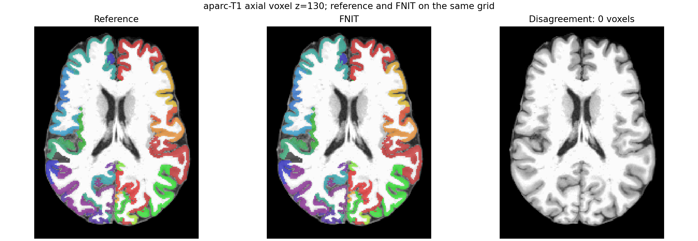
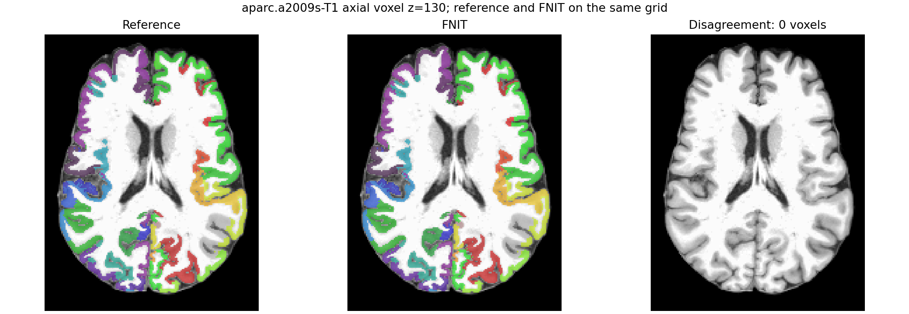

# 原生 aparc / aparc.a2009s 与 Tian S1：真实 T1 图谱核对

公开 OpenNeuro ds004666 `sub-01/ses-2mm` 的已完成 `recon-all` 目录提供 T1、双半球 `.annot`、`pial/white` 表面和 `ribbon.mgz`。原 UKB-connectomics 的 `convert_native_annot.py` 先删除未出现的标签并连续编号，再由 `map_surface_label_to_volume.py` 把两个半球投影到 T1 ribbon。FNIT 读取相同的 recon-all 输出，调用 PyTorch 的原生注释编号和既有 ribbon 投影；原版两个脚本只用于独立参考。`fs-aparc` 是另一个直接取 `aparc+aseg.mgz` 的 84 节点接口，此处的 `aparc+tian-s1` 是原 UKB 的皮层 aparc 加 Tian S1，二者名称和节点定义不同。

## 函数和参数

`native_annotation_to_t1(subject_dir=..., annotation=..., device=...)` 中，`subject_dir` 是已完成的 recon-all 受试者目录；`annotation` 只能是 `aparc` 或 `aparc.a2009s`，读取 `label/lh.<annotation>.annot`、`label/rh.<annotation>.annot`；`device` 是表面至 ribbon 最近邻投影的 Torch 设备。返回 `(image, nodes)`：`image` 是与 `ribbon.mgz` 同 `[256,256,256]` T1 网格的 int32 NIfTI，背景 0、节点连续 1..K；`nodes` 为 K 行 `ConnectomeNode(index, original_label, hemisphere, name)`，定义矩阵行列。原版 `convert_native_annot.py` 用左半球出现的标签过滤两侧 LUT；FNIT 保留了这一编号规则，参考输出可以逐体素比较。

```python
from fnit.connectome import native_annotation_to_t1

atlas_t1, nodes = native_annotation_to_t1(
    subject_dir=subject_dir,       # 已完成 recon-all 的受试者目录；含 label/surf/mri
    annotation="aparc.a2009s",    # 原生 Destrieux 注释；可改为 aparc
    device="cuda:0",              # 表面投影使用的 GPU；默认 TF32
)
```

独立参考[脚本](../../../tools/reference/benchmark_native_aparc_original.sh)的四个位置参数依次为原 UKB 工作目录、同一 recon-all 目录、注释名和参考输出目录。核心原版命令为：

```bash
python scripts/python/convert_native_annot.py \
  SUBJECT/label/lh.aparc.annot SUBJECT/label/rh.aparc.annot \
  lh.native.aparc.annot rh.native.aparc.annot
python scripts/python/map_surface_label_to_volume.py \
  MAIN_DIR SUBJECTS_DIR public 0 aparc
```

FNIT [同输入脚本](../../../tools/benchmark_connectome_native_aparc.py)的 `--subject-dir` 是上述 recon-all 目录，`--annotation` 选原生注释，`--official-volume` 是原版 T1 NIfTI，`--device` 选择 Torch 设备，`--output-dir` 保存 `atlas_t1.nii.gz` 和 `report.json`；报告包含输入哈希、节点数、全体素 XOR、时间和 Torch 分配峰值。

## 对照结果

| 注释 | 皮层节点 | 原版转换 + 体积 | FNIT 皮层 | 体素差异 | FNIT Torch 峰值 |
|---|---:|---:|---:|---:|---:|
| aparc | 68 | 2.01 + 6.53 s | 1.42 s | 0 / 16,777,216 | 1.399 GiB |
| aparc.a2009s | 148 | 3.58 + 4.53 s | 1.73 s | 0 / 16,777,216 | 1.399 GiB |

原版脚本运行在 Xeon Gold 6418H，FNIT 运行在共享 H100 PCIe。不同设备、读写和缓存条件下的耗时仅作本次记录。两种原版及候选体积的输入 SHA-256、非背景 XOR 和标签范围见[aparc JSON](atlas_native_aparc_20260929/aparc.json)、[a2009s JSON](atlas_native_aparc_20260929/aparc_a2009s.json)。切片显示相同体素标签：





[组合图谱脚本](../../../tools/benchmark_connectome_cortical_tian_profile.py)在同一 T1 上把 FNIT SynthMorph 生成的 Tian S1 放入皮层背景，并以固定 DWI→T1 世界变换采样到实际校正 DWI 网格。调用时设 `--native-annotation aparc` 或 `aparc.a2009s`；`--tian-t1` 是 16 标签 T1 NIfTI，`--tian-names` 是按 1..16 排列的名称，`--dwi-reference` 指定 DWI 形状和 affine，`--dwi-to-t1-world` 提供 4×4 RAS 毫米变换，`--output-dir` 写 `atlas_t1.nii.gz`、`atlas_dwi.nii.gz`、`nodes.tsv` 与 `report.json`。两种组合分别生成 84、164 个节点，在真实 DWI 网格均全部出现；实测 4.88、4.79 s，Torch 峰值均 1.399 GiB，见[84 节点](atlas_native_aparc_20260929/aparc_tian_s1.json)和[164 节点](atlas_native_aparc_20260929/aparc_a2009s_tian_s1.json)。

该 Tian S1 使用 FNIT SynthMorph，属于 T1→MNI 配准替代；其与原 UKB FNIRT 的差别见[配准对照](atlas_synthmorph_20260929.md)。两种新的 CLI 图谱选项尚未分别完成 DWI 到四矩阵的独立一键运行。完整 connectome 与原 UKB 流程一致性仍取决于追踪、FIRST 和原图谱配准条件。
