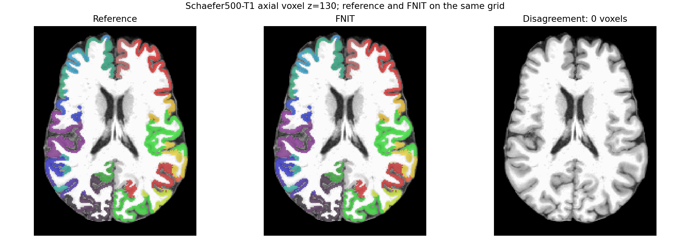
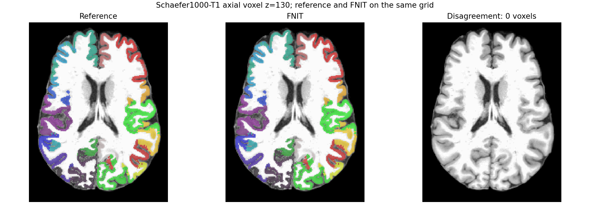

# Schaefer500/1000 与 Tian S4：真实 T1 图谱核对

公开 OpenNeuro ds004666 `sub-01/ses-2mm` 的 `recon-all` 结果作为结构像输入；原 UKB 仓库的双半球 Schaefer 7-network 注释和 Tian S4 模板作为图谱输入。`recon-all` 已完成，FNIT 只读取其影像与表面。原版 `convert_schaefer_annot.py`、FreeSurfer `mri_surf2surf`、原版 `map_surface_label_to_volume.py` 构成独立参考，均不在 FNIT 正式运行时调用。`fsaverage` 取同一 FreeSurfer 8.2.0-1 的 `sphere.reg`。

## 输入、函数与输出

`schaefer_to_t1(subject_dir=..., fsaverage_dir=..., left_annot=..., right_annot=..., device=...)` 读取完成的 recon-all 目录、fsaverage 双半球球面及原 Schaefer 注释，在 GPU 上先将顶点标签映射到受试者球面，再投影到 `ribbon.mgz` 的 T1 体素网格。返回 `(image, nodes)`：`image` 是 int32 `[256,256,256]` NIfTI，标签为 `0..K`，`nodes` 是 K 行、按标签 `1..K` 排列的编号、原标签、半球、名称。`K` 分别为 500 或 1000。`combine_cortical_tian(cortical_t1=..., cortical_nodes=..., tian_t1=..., tian_names=...)` 把同一 T1 网格上的 54 个 Tian S4 节点放在皮层背景处；返回 `0..K+54` 的 T1 NIfTI 及相同顺序的节点表。随后 `resample_labels_nearest` 用已固定的 DWI→T1 世界变换得到 DWI 网格标签。正式 CLI 对应 `--atlas schaefer500+tian-s4` 或 `--atlas schaefer1000+tian-s4`。

参考臂的完整参数由[表面脚本](../../../tools/reference/benchmark_schaefer_surface_official.sh)与[体积脚本](../../../tools/reference/benchmark_schaefer_volume_original.sh)记录。第 6 个表面参数、第 4 个体积参数取 `500` 或 `1000`，其余参数依次是 FreeSurfer 安装目录、同时含 fsaverage 和目标 subject 的 `SUBJECTS_DIR`、subject 名、原 UKB 图谱目录、参考输出目录，以及原 UKB 工作目录、受试者目录、原生注释目录。参考核心命令为：

```bash
mri_surf2surf --srcsubject fsaverage --trgsubject SUBJECT \
  --hemi lh --sval-annot lh.fsaverage.Schaefer500.annot \
  --tval lh.native.Schaefer500.annot
python scripts/python/map_surface_label_to_volume.py \
  MAIN_DIR SUBJECTS_DIR public 0 Schaefer500
```

[皮层体积基准脚本](../../../tools/benchmark_connectome_schaefer_volume.py)的 `--subject-dir` 指向 recon-all 目录，`--fsaverage-dir` 指向 fsaverage，`--left-annot`/`--right-annot` 指向两个原始注释，`--official-volume` 指向原脚本生成的 T1 NIfTI，`--parcels` 选 500 或 1000，`--output-dir` 写入 FNIT NIfTI 与 JSON，`--device` 指定 GPU。下面的数组写法可直接在 bash 复跑，每一行注释说明对应参数：

```bash
atlas_args=(
  --subject-dir "$SUBJECT"              # 已完成 recon-all 的受试者目录
  --fsaverage-dir "$FSAVERAGE"          # 源 fsaverage，含 lh/rh.sphere.reg
  --left-annot "$LEFT_ANNOT"            # 原 UKB 左半球 Schaefer 注释
  --right-annot "$RIGHT_ANNOT"          # 原 UKB 右半球 Schaefer 注释
  --official-volume "$OFFICIAL_T1"      # 原版 mri_surf2surf + 体积脚本输出
  --parcels 500                         # 双半球皮层节点数；也可取 1000
  --device cuda:0                       # H100 GPU，默认 TF32
  --output-dir "$OUTPUT"                # FNIT T1 atlas、报告 JSON
)
python tools/benchmark_connectome_schaefer_volume.py "${atlas_args[@]}"
```

[组合图谱脚本](../../../tools/benchmark_connectome_schaefer_tian_profile.py)另接收 `--tian-t1`（FNIT SynthMorph 得到的同 T1 网格 Tian S4 标签）、`--tian-names`（按 1..54 排列的名称）、`--dwi-reference`（校正 DWI，只取网格和 affine）、`--dwi-to-t1-world`（4×4 RAS 毫米变换 CSV）和 `--output-dir`。输出 `atlas_t1.nii.gz`、`atlas_dwi.nii.gz`、`nodes.tsv`、`report.json`；报告保存输入 SHA-256、两空间中的节点覆盖率、时间与 Torch 峰值。Tian S4 的 SynthMorph 与官方 SynthMorph 对照、输入含义及脑图见[既有实测](atlas_synthmorph_20260929.md)。此组组合测试共用一次已固定的 DWI→T1 变换，不重复扩散处理。

## 实测结果

| 图谱 | 原版双半球表面 | 原版 T1 体积 | FNIT 表面+T1 体积 | 体素差异 | 组合后节点 | DWI 网格出现节点 |
|---|---:|---:|---:|---:|---:|---:|
| Schaefer500 + Tian S4 | 4.72 + 4.10 s | 12.03 s | 2.56 s | 0 / 16,777,216 | 554 | 554 |
| Schaefer1000 + Tian S4 | 3.24 + 2.73 s | 5.15 s | 2.28 s | 0 / 16,777,216 | 1054 | 1054 |

原版程序在 Xeon Gold 6418H，FNIT 在共享 H100 PCIe 上运行；两者读写和缓存条件不同。FNIT 皮层阶段的 Torch 分配峰值两种图谱均为 `1.399 GiB`；固定 Tian S4 标签后，合并并采样到 DWI 网格分别耗时 `8.10 s`、`9.00 s`（包含重新生成皮层体积），峰值仍为 `1.399 GiB`。每个原版/候选体积的形状、哈希、标签范围、完整体素 XOR 见[Schaefer500 JSON](atlas_schaefer_multi_20260929/schaefer500.json)、[Schaefer1000 JSON](atlas_schaefer_multi_20260929/schaefer1000.json)；组合阶段见[554 节点](atlas_schaefer_multi_20260929/schaefer500_tian_s4.json)与[1054 节点](atlas_schaefer_multi_20260929/schaefer1000_tian_s4.json)。





皮层体积已与原版逐体素一致；Tian S4 的 SynthMorph 是允许的 T1→MNI 配准替代，不能当作原 UKB FNIRT 标签逐体素一致。组合图谱已在真实 DWI 网格确认全部节点有体素。新增的两种 atlas 选项尚未分别完成从 DWI 到四张矩阵的独立一键运行；一键全链的现有实测只覆盖 Schaefer200 + Tian S1。
