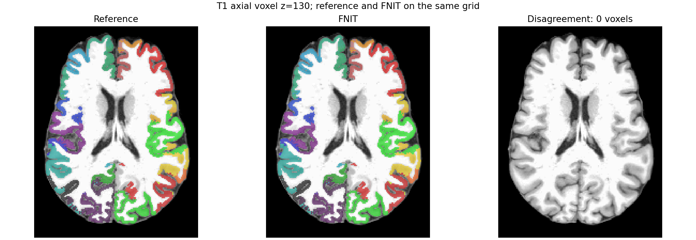
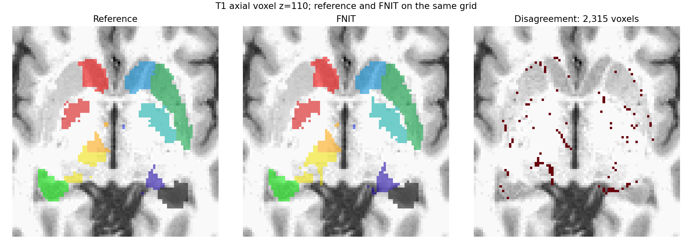
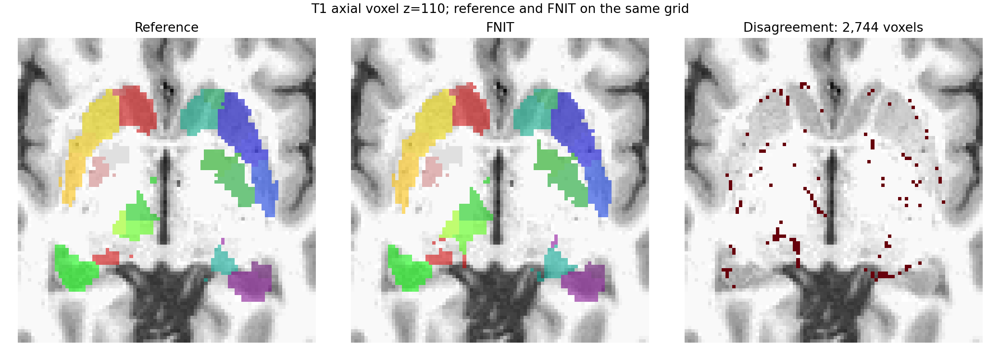
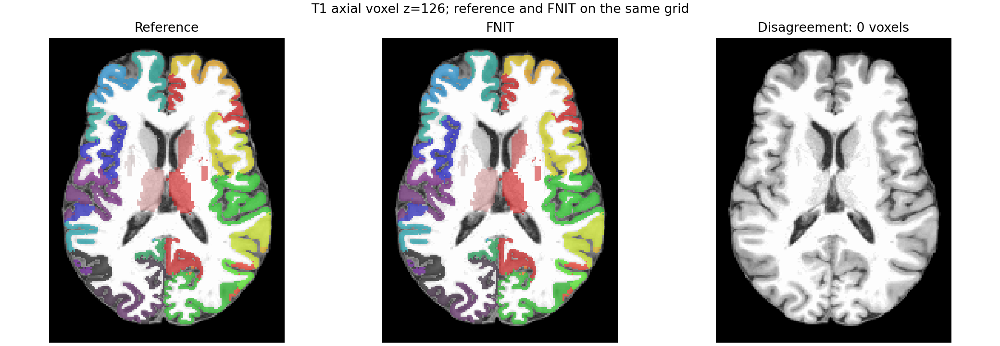
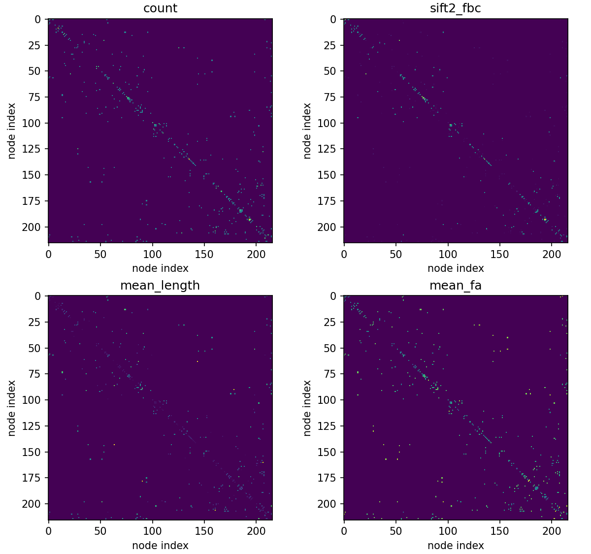

# 公开真实 T1 的 Schaefer200 与 Tian atlas 对照

## 输入与范围

受试者为公开 ds004666 的 `sub-01/ses-2mm`，T1 使用已完成的官方 `recon-all` 目录。Schaefer200 双半球注释与 Tian S1/S4 标签来自原 UKB-connectomics 模板；MNI T1 使用与 Tian 标签同为 2 mm 的 MNI152 模板。配准和重采样在 FNIT 内由已有的 PyTorch SynthMorph 完成，官方 FreeSurfer/SynthMorph 只用于独立对照。实际比较使用同一份 T1、模板、标签和模型权重，完整 SHA-256 见[验证记录](atlas_synthmorph_20260929/fnit_synthmorph_tian_compared/report.json)。

原 UKB 脚本从 FNIRT 的 T1→MNI 形变求逆，把 Tian 标签送回 T1；这里按用户指定改用 SynthMorph。为了取得标签所需的 MNI→T1 映射，直接以 MNI T1 为 moving、受试者 T1 为 fixed 运行 joint 模式。这一分支与原 FNIRT 分支方法不同，不能把标签的一致性称作对原 UKB 配准的逐值复现。

## 皮层标签

`resample_annotation_to_native` 读取 fsaverage 和受试者的 `sphere.reg` 坐标，以及 fsaverage 的逐顶点整数标签，返回受试者表面逐顶点标签。等价参考步骤：`mri_surf2surf --srcsubject fsaverage --trgsubject SUBJECT --hemi lh --sval-annot atlas.annot --tval native.annot`，右半球同理。

`schaefer_to_t1` 接收 `subject_dir`、`fsaverage_dir`、`left_annot`、`right_annot`、`device`；内部先映射双半球表面标签，再用 `ribbon.mgz`、`pial`、`white` 投影到 T1 体素。返回值为 T1 网格 int32 NIfTI 与 200 行 `ConnectomeNode`，背景为 0，节点编号为 1–200。体积投影的原版命令是 `python scripts/python/map_surface_label_to_volume.py MAIN_DIR SUBJECTS_DIR SUBJECT_ID INSTANCE Schaefer200`。

| 实际输入 | 官方参考 | FNIT | 对照 |
|---|---:|---:|---:|
| 左/右 fsaverage→native 表面 | `mri_surf2surf` 左 7.67 s、右 6.55 s | PyTorch 最近邻左 0.961 s、右 0.234 s；峰值 Torch 0.351 GiB | 双半球顶点标签 XOR 均 0；左 146,968、右 144,783 个顶点 |
| Schaefer200→T1 ribbon 体积 | 原 UKB Python，11.85 s | H100 核心 2.46 s，峰值 Torch 1.40 GiB | 16,777,216 个体素的标签 XOR 0；节点 200 个 |

表面和体积是不同计时范围；体积对照从原始 fsaverage 注释开始，包含 FNIT 表面映射。官方参考使用原脚本以及原版注释转换，FNIT 的入口直接读取源注释，不依赖随机颜色表。

## Tian 标签与 SynthMorph

`synthmorph_tian_to_t1` 的输入依次是已去颅骨的 `t1_brain`、与 Tian 标签同网格的 `mni_template`、整数 `tian_mni`、设备 `device` 和可选 `weights`。第一次调用返回原生 T1 网格的 int16 标签 NIfTI 及带几何信息的变换；将变换传给第二次调用的 `transform` 参数可处理另一套 Tian 标签而无需再次注册。官方参考命令：

```bash
mri_synthmorph register -m joint -j 8 -t mni_to_t1.mgz MNI_T1_2mm.nii.gz brain.mgz
mri_synthmorph apply -m nearest -t int16 mni_to_t1.mgz Tian_S1.nii.gz tian_s1_t1.nii.gz
mri_synthmorph apply -m nearest -t int16 mni_to_t1.mgz Tian_S4.nii.gz tian_s4_t1.nii.gz
```

| 真实 T1，256³ 体素 | 官方 SynthMorph | FNIT PyTorch | 标签对照 |
|---|---:|---:|---:|
| MNI→T1 注册及首次 S1 重采样 | 注册 738.21 s，S1 重采样 38.31 s | 33.69 s，峰值 Torch 12.49 GiB | S1 XOR 2,315 / 16,777,216；前景 Dice 0.9810；16 区平均 Dice 0.9752 |
| 复用形变重采样 S4 | 41.21 s | 1.52 s | S4 XOR 2,744 / 16,777,216；前景 Dice 0.9810；54 区平均 Dice 0.9672 |

官方程序在此次服务器环境中的注册主要使用 CPU；上表是实际命令耗时，不是同设备加速比。两臂使用相同模型权重。独立计算的两份位移场在此受试者上相差均值 0.105 mm、95 分位 0.187 mm、最大 0.417 mm。固定官方形变时，FNIT 最近邻重采样的 S1、S4 标签均 **16,777,216 / 16,777,216 个体素完全一致**。因此此处的 2,315/2,744 个体素差异来自独立计算的 SynthMorph 配准场，而非标签采样。官方形变由独立对照中的 `mri_convert` 转为 NIfTI 位移场；正式 FNIT 路径不运行该命令。

**与原 UKB FNIRT 路线的配对比较。** 上表只对比 SynthMorph 的两个实现。另在同一真实 UKB T1 上，分别将原 FSL FLIRT/FNIRT/invwarp/applywarp 路线与 FNIT SynthMorph 的 Tian S1 标签比较。完整 MNI T1 模板得到 9,553 / 6,269,400 体素不同、前景 Dice 0.9057、16 标签平均 Dice 0.8651；去颅骨 MNI 模板分别为 9,451、0.9046、0.8697。两套模板均未复现 FNIRT atlas。因此选择 SynthMorph 时，应把输出标为 FNIT 的替代配准结果；要求原 UKB atlas 逐体素一致时，应提供同一 T1 的 FNIRT 前向 coefficient，并调用 FNIT 的 `fnirt_tian_to_t1`。FSL 参考 coefficient 是此前在同一 UKB T1 上新计算的，不是原 UKB 包自带。脱敏指标见[UKB 配对报告](atlas_synthmorph_20260929/ukb_tian_fnirt_comparison.public.json)，输入路径及哈希只保留在授权服务器。

在上述 UKB T1 原生 162×215×180 网格上，`fnirt_tian_to_t1` 读取同一前向 coefficient 后，与 FSL `invwarp`/`applywarp --interp=nn` 输出的 Tian S1 **0 / 6,269,400 个体素不同**，16 个标签最低 Dice 1.0。FNIT 本次完整函数调用含读写 72.79 s、峰值 Torch 分配显存 1.306 GiB；独立 FSL `invwarp` 与 `applywarp` 基准分别为 41.43 s 和 15.40 s。两次运行的共享负载不同，不能据此推导稳定速度比。复跑脚本为 [`benchmark_connectome_tian_fnirt_profile.py`](../../../tools/benchmark_connectome_tian_fnirt_profile.py)；其 `--t1-brain` 是目标 T1、`--tian-mni` 是 MNI 标签、`--forward-coefficients` 是给定前向文件、`--reference-atlas` 是同一网格的 FSL 标签、`--output-dir` 保存标签及含哈希/精度/时间/显存的报告、`--device` 选择设备。

为直接验收 `recon-all` 输入网格，又以同一 UKB 的 `brain.mgz` 作为 256³ 目标 T1，FSL 对给定 coefficient 重新执行 `invwarp` 与 `applywarp --interp=nn`，FNIT 用同一个 `brain.mgz` 调用上述函数。Tian S1 **0 / 16,777,216 个体素不同**，16 标签最低 Dice 1.0。FNIT 含读写 85.24 s、峰值 Torch 分配显存 3.426 GiB；FSL 两命令分别 136.97 s 和 27.12 s，服务器负载不同。官方命令见[`benchmark_tian_fnirt_conformed_official.sh`](../../../tools/reference/benchmark_tian_fnirt_conformed_official.sh)。私有影像、coefficient 和逐文件哈希留在服务器；仓库只放脱敏数值。

同一皮层和 Tian S1 体积送入合并函数后，FNIT 的 216 节点图谱与原 `combine_volumetric_atlases.py` 输出逐体素一致（XOR 0 / 16,777,216）；FNIT 合并 0.645 s，原脚本 4.80 s。这只验证合并规则：正式七套图谱的 DWI 重采样和所有 atlas 组合仍需逐项验证。合并记录见[JSON](atlas_synthmorph_20260929/fnit_combined_schaefer200_tian_s1/report.json)。









## 调用与输出

```python
from pathlib import Path
from fnit.connectome import schaefer_to_t1, synthmorph_tian_to_t1, combine_cortical_tian

subject_dir = Path("/data/sub-01/recon-all")  # 已完成 recon-all 的受试者目录
fsaverage_dir = Path("/data/fsaverage")         # fsaverage，包含双半球 sphere.reg
templates = Path("/data/ukb-atlases")          # 原 UKB atlas 模板目录
weights_dir = Path("/data/fnit-weights")        # FNIT setup_weights.py 获取的 SynthMorph 权重

cortical_t1, cortical_nodes = schaefer_to_t1(
    subject_dir=subject_dir,                     # 读取 ribbon、pial、white、sphere.reg
    fsaverage_dir=fsaverage_dir,                 # 源球面
    left_annot=templates / "lh.Schaefer2018_200Parcels_7Networks_order.annot",  # 左标签
    right_annot=templates / "rh.Schaefer2018_200Parcels_7Networks_order.annot", # 右标签
    device="cuda:0",                            # GPU；float32/TF32，无半精度
)
tian_s1_t1, mni_to_t1 = synthmorph_tian_to_t1(
    t1_brain=subject_dir / "mri/brain.mgz",      # 原生 T1 脑图
    mni_template=templates / "MNI152_T1_2mm.nii.gz", # 与 Tian 同网格的 MNI T1
    tian_mni=templates / "Tian_Subcortex_S1_3T.nii.gz", # MNI S1 整数标签
    device="cuda:0",                            # 推理设备
    weights=weights_dir,                         # 已下载模型权重目录
)
names_s1 = tuple((templates / "Tian_Subcortex_S1_3T_label.txt").read_text().splitlines())
combined_t1, nodes = combine_cortical_tian(
    cortical_t1=cortical_t1,     # 原生 T1 网格 0..200 皮层标签
    cortical_nodes=cortical_nodes, # 200 行连续节点表
    tian_t1=tian_s1_t1,         # 同网格 0..16 Tian 标签
    tian_names=names_s1,        # 与 Tian 1..16 对应的 16 个名称
)
# combined_t1：T1 网格 int32 NIfTI，0 为背景；nodes：216 行矩阵行列说明。
```

已有同一 T1 的 FNIRT 前向 coefficient 时，可改用下面的原 UKB 标签路线。`fnirt_tian_to_t1` 输入为 T1 网格、MNI Tian 整数标签、`fnirt --cout` 产生的 intent 2007 coefficient 和计算设备；输出为 T1 网格的整数 NIfTI。函数内部复用 FNIT 已验证的 PyTorch 逆形变与最近邻采样；原软件等价命令是 `invwarp --ref=T1 --warp=coeff --out=inverse` 后执行 `applywarp --ref=T1 --in=Tian --warp=inverse --interp=nn --out=atlas_T1`。

```python
from fnit.connectome import fnirt_tian_to_t1

tian_s1_original_t1 = fnirt_tian_to_t1(
    t1_brain=subject_dir / "mri/brain.mgz",  # 同一受试者原生 T1 目标网格
    tian_mni=templates / "Tian_Subcortex_S1_3T.nii.gz",  # MNI 整数标签
    forward_coefficients=Path("/data/T1_to_MNI_warp_coef.nii.gz"),  # 已给定的 FNIRT 前向系数
    device="cuda:0",  # PyTorch 逆形变和最近邻重采样设备
)
# tian_s1_original_t1：T1 网格 int32 NIfTI，0 为背景，1..16 为 Tian S1。
```

复现脚本：`tools/reference/benchmark_schaefer_surface_official.sh`、`tools/benchmark_connectome_schaefer_surface.py`、`tools/reference/benchmark_schaefer_volume_original.sh`、`tools/benchmark_connectome_schaefer_volume.py`、`tools/reference/benchmark_synthmorph_tian_official.sh`、`tools/benchmark_connectome_synthmorph_tian.py`、`tools/benchmark_connectome_combine_tian.py`。它们分别记录真实输入哈希、精度、时间和显存。FNIT 的正式运行路径不调用 FreeSurfer、FSL 或 MRtrix 可执行程序。

## 一条命令的真实 DWI 验收

同一受试者的校正 AP DWI、bval、eddy 旋转 bvec 与已完成的 `recon-all` 目录直接输入 `fnit connectome --atlas schaefer200+tian-s1 --n-seeds 1000`。额外参数提供原 UKB 的 Schaefer/Tian 模板目录、fsaverage 目录、MNI 2 mm T1 和已安装的 SynthMorph 权重；完整具名命令及每个参数的含义见[主文档](../../../docs/connectome/README.md)。程序自动生成 T1 atlas、DWI atlas、5TT、GMWMI、FOD、流线、SIFT2 权重和四张矩阵，不要求预先提供 `atlas_dwi`。

[输出检查](atlas_synthmorph_20260929/one_command_schaefer200_tian_s1/output_qc.json)读取实际产物重新验证：`nodes.tsv` 有 216 行；DWI atlas 的 216 个节点全部存在；count、SIFT2 FBC、平均长度、平均 FA 均为有限、对称的 216×216 矩阵。1000 次播种接受 298 条流线，其中 197 条获得双端 atlas 赋值，形成 186 条非零无向边。墙钟 1577.34 s，进程峰值 RSS 2,565,032 KiB，程序报告 PyTorch 峰值分配显存 13.248 GiB。此时 GPU 被其他任务共享，墙钟不可用作单独的算法速度比较。1000 次播种主要检查接口和输出结构；图谱专门的逐体素基准及追踪的 10,000 次多种子对照分别见上文和[追踪报告](ifod2_rejection_20260929.md)。


