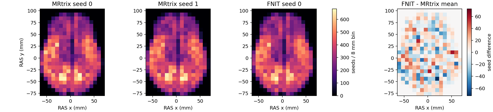

# 真实 5TT 上的 100k GMWMI 播种分布

## 函数和输入

`sample_gmwmi_seeds(gmwmi, five_tissue, affine, n_seeds, generator)` 从非负的 GMWMI 权重图按体素权重抽样，在该体素内取连续位置，再依照配对 5TT 的 GM=WM 界面投影并沿界面扰动。`gmwmi` 是 float32 `[X,Y,Z]`，`five_tissue` 是同网格的 float32 `[X,Y,Z,5]`，五通道依次是 cGM、sGM、WM、CSF、病理；`affine` 是体素中心到 RAS 世界毫米的 `[4,4]` 变换；`n_seeds` 是所需世界坐标数；`generator` 是与图像同设备的 PyTorch 随机数发生器。函数返回 float32 `[n_seeds,3]` RAS 毫米坐标，留在输入设备。正式追踪函数会用这些位置，再独立检查 FOD 初始方向和 ACT 种子状态。

本次使用公开 OpenNeuro ds004666 `sub-01/ses-2mm` 的真实配对 T1/DWI 派生 5TT 与 GMWMI，均是同一份 MRtrix MIF 无重采样转成的 NIfTI-1；体素核对见[100k 输入报告](tracking_scale_100k_20260929.md)。两张 NIfTI 的 SHA-256 分别为 `704539238d29c10eeaf4fab31831bc3ced9648ce6a59f4e9bd75c7b7d6d03fbf`、`06243e393410bad709c2569e68d5eeed49d5f28500e607890a06e217a19a9823`。[精确仿射与现行播种修正](act_geometry_accepted_seeds_20260929.md)后来发现 NIfTI-1 sform 的微小舍入会改变界面附近的 ACT 单向判定；本页是修改前源码及 NIfTI-1 存储精度下的历史播种分布基线。两种软件的随机数发生器不同，因此比较播种分布，不比较逐行坐标。

```python
import nibabel as nib
import numpy as np
import torch
from fnit.connectome.tracking import sample_gmwmi_seeds

five_image = nib.load("five_reference.nii.gz")  # 输入：真实五组织体素和 NIfTI-1 世界仿射
gmwmi_image = nib.load("gmwmi_reference.nii.gz")  # 输入：与五组织同网格的权重图
five_tissue = torch.as_tensor(np.asarray(five_image.dataobj, dtype=np.float32).copy(), device="cuda:0")
gmwmi = torch.as_tensor(np.asarray(gmwmi_image.dataobj, dtype=np.float32).copy(), device="cuda:0")
affine = torch.as_tensor(five_image.affine, dtype=torch.float64, device="cuda:0")
generator = torch.Generator(device="cuda:0").manual_seed(0)  # 输入：FNIT 随机序列
seeds = sample_gmwmi_seeds(
    gmwmi=gmwmi,              # 输入：非负 float32 [256,256,256] GMWMI 权重
    five_tissue=five_tissue,  # 输入：同网格 float32 [256,256,256,5] 五组织分数
    affine=affine,            # 输入：体素中心→RAS 毫米 [4,4]
    n_seeds=100_000,          # 输入：要求返回的世界坐标数
    generator=generator,      # 输入：同设备 PyTorch 随机数发生器
)
# 输出 seeds：CUDA float32 [100000,3]；每行是一个 RAS 毫米播种位置。
```

## 原版命令与本次对照

原版使用 `tckgen -seed_gmwmi -act`，此处指定 `Seedtest` 只观察播种位置，不运行 iFOD2。固定参考源码为 MRtrix3 提交 `eeab681d3e0cb004cf1d1d31579d3892197ef5b6`。两个随机种子各尝试 100,000 次；`-output_seeds` 只写成功的种子：

```bash
MRTRIX_BIN=/path/to/independent-mrtrix/bin  # 独立基准软件目录，正式 FNIT 不调用
FOD=wm_fod_norm.mif                           # 与这份 5TT 配对的真实 WM FOD
FIVE=5tt_dwi.mif                             # 真实五组织图，含 DWI 世界仿射
GMWMI=gmwmi_seed_dwi.mif                      # 与 FIVE 同网格的 GMWMI 权重
OUTPUT=benchmark/seed_100k                   # 两次种子文本、TCK 和计时的目录
mkdir -p "$OUTPUT"                           # 建立参考输出目录
for reference_seed in 0 1; do               # 官方 RNG 0、1 两次独立播种
  MRTRIX_RNG_SEED="$reference_seed" /usr/bin/time \
    -f 'wall_seconds=%e peak_rss_kib=%M' \
    -o "$OUTPUT/seed${reference_seed}.time" \
    "$MRTRIX_BIN/tckgen" \
    -algorithm Seedtest -seed_gmwmi "$GMWMI" -act "$FIVE" \
    -seeds 100000 -select 0 -nthreads 0 \
    -output_seeds "$OUTPUT/seed${reference_seed}.txt" \
    "$FOD" "$OUTPUT/seed${reference_seed}.tck"
done
```

[FNIT 分布脚本](../../../tools/benchmark_connectome_tracking_act_seeds.py)读取官方两份文本的第 3–5 列坐标。`--reference-attempts` 记录原版尝试数；为保证三组空间直方图采用接近相同样本量，FNIT 生成与官方 seed 0 成功数相同的 99,985 个坐标。`--candidate-points` 另存 float32 `[99985,3]` NPY 用于复绘；`--output` 是含输入和输出 SHA-256、空间指标、时间、显存的 JSON。正式 FNIT 运行时不调用参考软件。

```bash
seed_args=(
  --five-tissue five_reference.nii.gz        # 与原版同体素；NIfTI-1 仿射有舍入
  --gmwmi gmwmi_reference.nii.gz             # 与原版同体素；NIfTI-1 仿射有舍入
  --reference-seeds benchmark/seed_100k/seed0.txt        # 官方 RNG 0 的成功种子 CSV
  --reference-repeat-seeds benchmark/seed_100k/seed1.txt # 官方 RNG 1 的成功种子 CSV
  --reference-attempts 100000                # 官方每次尝试的播种次数
  --candidate-points benchmark/seed_100k/fnit_seeds.npy  # FNIT 世界坐标输出
  --output benchmark/seed_100k/seed_report.json         # 数值与哈希输出
  --seed 0                                   # FNIT PyTorch 随机种子
  --device cuda:0                            # H100 设备，默认 TF32
)
python tools/benchmark_connectome_tracking_act_seeds.py "${seed_args[@]}"
```

下图以 8 mm 的 RAS x/y 方格把所有 z 坐标求和；右侧为 FNIT 减去两次官方均值。复绘脚本[`plot_connectome_gmwmi_seed_distribution.py`](../../../tools/plot_connectome_gmwmi_seed_distribution.py)的 `--official`、`--official-repeat`、`--fnit` 分别接上述 CSV/CSV/NPY；`--output` 写 PNG。



## 实测结果与范围

| 指标 | 官方两次 | FNIT 对官方 seed 0 |
|---|---:|---:|
| 成功位置数／100,000 次尝试 | 99,985；99,987 | 为同样本量生成 99,985 |
| 8 mm 三维网格直方图相关 | 0.92458 | 0.92689 |
| 种子最近邻距离中位数，mm | 0.68590 | 0.68117 |
| GM−WM 分数差绝对值中位数 | 0.000265 | 0.000400 |
| 完整官方 `Seedtest`／已载入影像的 FNIT 播种时间 | 1.36 s；1.26 s | 2.64 s |
| 内存 | 官方进程 RSS 0.194／0.195 GiB | Torch 峰值 0.461 GiB |

[原始指标 JSON](gmwmi_seed_100k_20260929/seed_report.json)还记录两侧最近邻距离 90/99 分位、世界坐标质心、种子文本哈希和 FNIT NPY 哈希；官方完整进程的[seed 0](gmwmi_seed_100k_20260929/seed0.time)和[seed 1](gmwmi_seed_100k_20260929/seed1.time)计时另存。官方在 CPU 上包含进程启动、读写，FNIT 的时间从 GPU 图像载入后开始；不能把这组时间解释为硬件加速比。100k 的粗尺度播种位置与官方两次波动相近，FNIT 的界面差值中位数略高。这个结果没有排除更细的界面位置误差，也不能解释为整条轨迹已匹配；[100k 独立追踪](tracking_100k_matrices_20260929.md)的长度、端点和 TDI 仍有超出官方重复范围的差异。

## 参考文献与原实现

- Tournier JD 等，*MRtrix3: A fast, flexible and open software framework for medical image processing and visualisation*，NeuroImage 202:116137，2019。[论文](https://pubmed.ncbi.nlm.nih.gov/31473352/)
- Smith RE 等，*Anatomically-constrained tractography: improved diffusion MRI streamlines tractography through effective use of anatomical information*，NeuroImage 62:1924–1938，2012。[论文](https://pubmed.ncbi.nlm.nih.gov/22705374/)
- 原版 [MRtrix3 GMWMI 播种源码](https://github.com/MRtrix3/mrtrix3/blob/eeab681d3e0cb004cf1d1d31579d3892197ef5b6/src/dwi/tractography/seeding/gmwmi.cpp)与[原 UKB connectomics 流程](https://github.com/sina-mansour/UKB-connectomics)。
