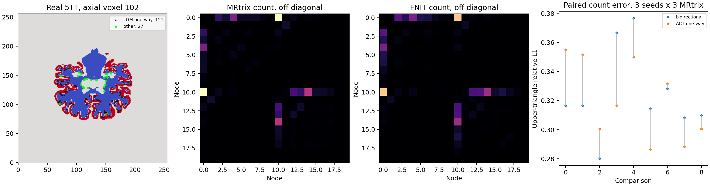

# ACT 种子检查与单向播种：真实 5TT 对照

## 输入和本次修改

使用公开 ds004666 `sub-01/ses-2mm` 的校正 DWI 所生成的归一化 WM FOD、配对官方 `recon-all` 分割生成的 5TT，以及固定的 10,000 个 GMWMI 世界毫米坐标。FOD、5TT、坐标文件的 SHA-256 分别是 `32461e2e2281f60a15dfd546ad91129d7fe68582844c9d983a7602f23f7c59c6`、`32a27dabd9fa7e6094beafda8c90515642f733f1c245530b183846bf40cc5153`、`41f036eae125b83dd2b6fc7f3c916dd5da8c20915c2990df3f65cce8fb45ffe6`。影像仍在验证服务器；仓库归档种子坐标、逐点结果、矩阵、图和报告。[校正输入的来源与假定读出时间](corrected_input_provenance.public.json)及[原始图像切面](../../../docs/connectome/figures/ds004666_t1_raw_vs_topup_eddy_atlas.png)另有记录。

MRtrix3 固定源码提交 `eeab681d3e0cb004cf1d1d31579d3892197ef5b6` 的 `ACT/method.h::check_seed()`、`seed_is_unidirectional()` 规定：无效组织拒绝播种；皮层灰质侧的灰白质界面只向白质方向传播；亚皮层灰质种子仍可双向传播。方向由种子两侧各 0.001 mm 的 GM−WM 值判定。FNIT 现在实现这两个种子函数，并把单向标志用于流线拼接。后续每步圆弧仍用 16 候选抽样，ACT 回溯和截断尚未逐步对齐。

`_five_tissue_mrtrix(five_tissue, points, inverse_affine)` 接收 float32 `[X,Y,Z,5]` 五组织图、RAS 世界毫米 `[B,3]` 坐标和世界→体素 `[4,4]` 变换；返回 float32 `[B,5]`，通道顺序是皮层灰质、亚皮层灰质、白质、脑脊液、病理。超出图像、最近体素为背景时返回零；三线性权重小于 `1e-6` 时置零。MRtrix 根据 NIfTI 头文件体素尺寸规范化 sform 的方向列；仅用 nibabel 读出的浮点 sform 列长度，种子分类会在界面附近产生错误。因此直接调用公开追踪函数时，应传 `five_tissue_spacing_mm=(sx,sy,sz)`，单位 mm；`UKBConnectome` 自动从官方分割头文件传入。省略该参数时采用 affine 列长度。

`_act_seed_direction(five_tissue, seeds, directions, inverse_affine)` 接收同一 5TT、世界毫米种子 `[B,3]`、单位初始方向 `[B,3]` 及上述逆变换；返回 bool `valid[B]`、bool `one_way[B]` 和 float32 `oriented[B,3]`。`valid` 表示可播种，`one_way` 表示只沿 `oriented` 向白质传播。公开 `probabilistic_tractography(...)` 仍返回 `Tractogram`：逐流线 `[Pi,3]` 世界毫米点、`endpoints[T,2,3]`、`lengths_mm[T]`、`accepted_seeds[T,3]` 和尝试数；详细输入、输出及其他参数见[函数文档](../../../docs/connectome/README.md)。GMWMI 加权体素选择和传播候选选择改为 float64 累积分布加显式随机抽样，修复同一 GPU、同一种子跨进程矩阵偶发不同的问题。

直接调用示例；所有图像张量及仿射均已载入同一个 CUDA 设备：

```python
from fnit.connectome.tracking import probabilistic_tractography

tracks = probabilistic_tractography(
    wm_sh=wm_sh,                              # 输入：归一化 WM FOD，float32 [XF,YF,ZF,45]
    fod_affine=fod_affine,                    # 输入：FOD 体素中心→RAS 毫米，[4,4]
    five_tissue=five_tissue,                  # 输入：cGM/sGM/WM/CSF/病理 5TT，[XA,YA,ZA,5]
    five_tissue_affine=five_tissue_affine,    # 输入：5TT 体素中心→RAS 毫米，[4,4]
    gmwmi=gmwmi,                              # 输入：5TT 网格 GMWMI 播种权重，[XA,YA,ZA]
    n_seeds=10_000,                           # 输入：尝试的种子数，不等于接受流线数
    lmax=8,                                   # 输入：WM 球谐最高阶；45 个系数
    five_tissue_spacing_mm=(1.0, 1.0, 1.0),  # 输入：5TT NIfTI 头文件三轴体素尺寸，mm
    fa=None,                                  # 输入：可选同 FOD 网格 FA；正式均值另行精确采样
    seed=0,                                   # 输入：PyTorch 随机种子
    batch_size=8192,                          # 输入：每批种子数
    arc_proposals=16,                         # 输入：当前每步候选数，尚非官方拒绝采样
    max_length_mm=250.0,                      # 输入：流线上限，mm
    min_length_mm=None,                       # 输入：None 时为最小 FOD 体素边长两倍
    step_mm=None,                             # 输入：None 时为最小 FOD 体素边长一半
    max_angle_degrees=45.0,                   # 输入：每步最大转角
    cutoff=0.1,                               # 输入：FOD 截止值
    power=0.5,                                # 输入：圆弧 FOD 概率幂次
)
# 输出：tracks.paths、endpoints、lengths_mm、accepted_seeds、seeds_attempted；
# 当 fa=None 时 tracks.mean_fa=None。
```

## 官方同输入检查

标准追踪参考命令如下。`--` 后的 `tckgen` 参数与本例参考相同；官方随机序列与 PyTorch 不相同，因此最终轨迹只比较分布和矩阵。

```bash
MRTRIX_RNG_SEED=0 tckgen wm_fod_norm.nii.gz tracks.tck \
  -algorithm iFOD2 -seed_gmwmi gmwmi.mif -act five_tissue.mif \
  -seeds 10000 -select 0 -maxlength 250 -cutoff 0.1 -power 0.5 -samples 3 -nthreads 0
```

标准 `tckgen` 不写出逐点种子分类。[仅用于 benchmark 的官方源码观测程序](../../../tools/reference/ifod2_act_seed_oracle.cpp)在该固定提交的 MRtrix 源码树中编译：复制到 `cmd/`，执行 `NUMBER_OF_PROCESSORS=4 ./build bin/ifod2_act_seed_oracle`，再运行 `bin/ifod2_act_seed_oracle wm_fod_norm.nii.gz five_tissue.mif frozen_seeds.txt official_seed0.txt > official_act_seed0_final.txt`。四个位置参数依次为 FOD、5TT、三列 RAS 毫米种子、五列官方初始方向；重定向文件写出十一列结果，依次为有效标志、单向标志、定向后的 xyz、五个组织分数和用于翻转的梯度。此观测程序不进入 FNIT 包或运行路径。PyTorch 基准命令：

```bash
python tools/benchmark_connectome_ifod2_act_seed.py \
  --five-tissue five_tissue.nii.gz \
  --seeds frozen_seeds.txt \
  --initial official_seed0.txt \
  --official official_act_seed0_final.txt \
  --output fnit_act_seed0_final.json --device cuda:0
```

`--five-tissue` 是真实五通道 NIfTI；`--seeds` 是冻结坐标；`--initial` 为同一坐标的官方初始方向；`--official` 为十一列 ACT 输出；`--output` 写汇总 JSON，同名 CSV 写逐种子的有效/单向/定向结果；`--device` 是 PyTorch 设备。采用同一官方初始方向排除了两种随机生成器的差异。结果见[逐种子报告](ifod2_act_seed_20260929/fnit_act_seed0_final.json)和[官方逐点值](ifod2_act_seed_20260929/official_act_seed0_final.txt)。

| 同一 10,000 个真实位置与初始方向 | MRtrix | FNIT |
|---|---:|---:|
| 初始方向有效 | 9,662 | 固定使用同一 9,662 个 |
| ACT 种子有效 | 9,659 | 9,659；XOR 0 |
| 皮层单向种子 | 8,430 | 8,430；XOR 0 |
| 五组织分数绝对误差 | 参考 | MAE 7.70×10⁻⁹；最大 1.79×10⁻⁷ |
| 定向不一致 | 参考 | 1 / 9,659；该点官方梯度 −2.98×10⁻⁸ |
| 已载入图像的种子检查核心 | CPU 0.0488 s | H100 0.1687 s；Torch 峰值 0.346 GiB |

官方独立进程完整墙钟 1.28 s、最大 RSS 622,912 KiB。两侧硬件与计时边界不同；本次不声称 GPU 加速。定向的单点分歧来自接近零的梯度数值符号，没有在报告中掩盖。

## 对连接矩阵的影响与重复性

[固定位置 A/B 程序](../../../tools/benchmark_connectome_ifod2_act_ab.py)让两组共享连续初始方向、ACT 种子有效掩膜和后续 PyTorch 随机序列，只切换皮层单向播种与流线拼接。三种 FNIT 种子分别和三份官方 20 节点矩阵比较，共九个配对；FOD、5TT、FA 与 atlas 相同。`--fod`、`--five-tissue`、`--fa`、`--atlas` 是四张真实 NIfTI，`--seeds` 是上述三列坐标，`--five-spacing 1 1 1` 来自 5TT 头文件，重复的 `--official-dir` 各含四张官方矩阵，`--seed` 控制初始方向并令传播 RNG 为 1729+seed，`--output-dir` 写双臂四张 CSV 与指标 JSON。种子 0 的命令如下，种子 1、2 只替换 `--seed` 和输出目录：

```bash
python tools/benchmark_connectome_ifod2_act_ab.py \
  --fod wm_fod_norm.nii.gz --five-tissue five_tissue.nii.gz \
  --seeds frozen_seeds.txt --fa fa_corrected.nii.gz \
  --atlas synthseg_gm_atlas_dwi.nii.gz --five-spacing 1 1 1 \
  --official-dir official_seed0_matrices --official-dir official_seed1_matrices \
  --official-dir official_seed2_matrices --seed 0 --device cuda:0 \
  --output-dir act_ab_seed0
```

| 九个配对平均；20 节点严格上三角 | 双向旧规则 | ACT 单向规则 | 单向更好 |
|---|---:|---:|---:|
| count 相对 L1 | 0.32421 | 0.32007 | 5 / 9 |
| count 非零支持 Dice | 0.74758 | 0.75626 | 8 / 9 |
| SIFT2 FBC 相对 L1 | 0.34535 | 0.33325 | 5 / 9 |
| mean length 相对 L1 | 0.73512 | 0.72589 | 6 / 9 |
| mean FA 共同边 nMAE | 0.10634 | 0.10645 | 4 / 9 |

两组接受流线数按 FNIT 种子为 `3001→2902`、`2989→2851`、`2974→2877`；每组固定位置追踪核心约 8.3–9.3 s，后处理约 29–33 s，详见三份 [A/B 原始矩阵与报告](ifod2_act_seed_20260929/)。官方三次自身 count 相对 L1 为 0.2144–0.2426、共同边 FA nMAE 为 0.0787–0.0999；单向规则改善了支持率，但没有让所有最终矩阵进入官方重复范围。三次公开 `probabilistic_tractography()` 入口各尝试 10,000 次并独立采样种子，接受 2,863、2,829、2,830 条；追踪 12.64–16.55 s、含 SIFT2/FA/赋值的已载入输入核心 24.81–27.87 s，Torch 峰值约 2.123 GiB。官方对应整条 `tckgen` 的一次进程墙钟 16.90 s，见[原阶段时间](corrected_mrtrix_fs5tt_act_adapted/stage_times.tsv)；两侧阶段边界与共享负载不同。

FNIT seed 0 跨独立进程重跑，接受流线均为 2,863，四张输出 CSV 的 SHA-256 逐张相同。[四份公开入口报告与 CSV](ifod2_act_seed_20260929/)保留三种子和 seed 0 重跑的输入哈希、误差、时间与显存；图中 count 热图移除了对角线，以便观察 region-region 边。

更新后的完整入口还以同一公开受试者、已校正 DWI、eddy 旋转 bvec 和官方 `recon-all` 目录运行 `fnit connectome --atlas fs-aparc --n-seeds 100 --seed 0 --device cuda:0`，不预制 atlas、脑掩膜或配准矩阵。接受 39 条流线；`nodes.tsv` 有 84 节点，四张 84×84 CSV 均为有限对称矩阵，每张有 17 条非零非对角边。完整进程墙钟 626.62 s、最大 RSS 1,781,320 KiB、Torch 分配峰值 2.782 GiB。[本次输出矩阵、节点表、输入与输出哈希](ifod2_act_seed_20260929/full_smoke_100/)可以逐文件复查；仓库中的节点表仅把换行从 CRLF 转为 LF。100 次播种只检验接口和文件结构，不能用于判断 84 节点矩阵的统计一致性。项目 Conda 环境中 `pip wheel . --no-deps --no-build-isolation` 构建 `0.16.0` wheel 成功，SHA-256 为 `b685936909f102f5d67787f9b5f9402f6442e25d80ba5724aa424750dacd6d2b`；隔离安装后可以导入含 `five_tissue_spacing_mm` 的公开追踪入口。



绘图程序为 [`plot_connectome_ifod2_act_seed.py`](../../../tools/plot_connectome_ifod2_act_seed.py)。当前剩余的主要方法差异是 iFOD2 每步的校准拒绝采样和完整 ACT `reverse_track`、回溯与亚皮层截断状态；当前函数仍使用 16 候选多项选择。更大样本的 84 节点整链重复性与百万级播种性能尚待验证。阶段验证只证明本次种子判定函数的同输入对齐，不证明整条流线逐条一致。
