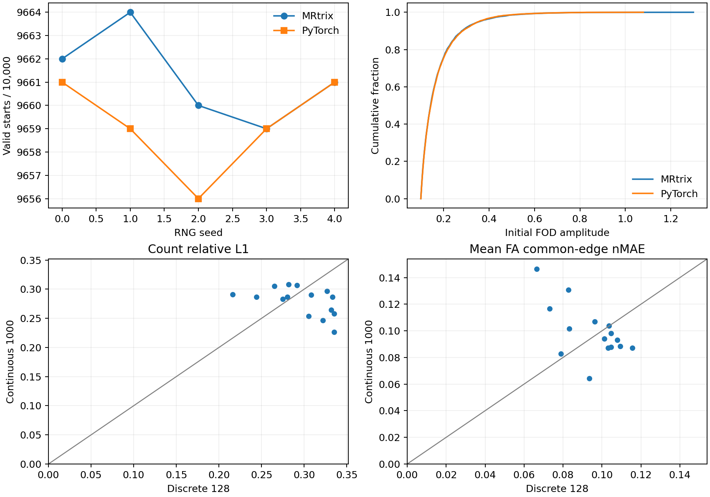

# iFOD2 初始方向：真实 FOD 与 MRtrix 五次重复

本页的初始方向函数验证仍适用；矩阵 A/B 与公开追踪入口数值来自后续 ACT 种子规则修正之前的提交 `17743cf`，仅保留作该阶段的历史对照。更新后的 ACT 种子判定、固定输入 A/B、跨进程重复及四矩阵见[新阶段报告](ifod2_act_seed_20260929.md)。

## 实现与输入

这次只修改追踪开始时的方向选择。`probabilistic_tractography()` 已改为从立方体拒绝采样单位球内的连续方向，再归一化；每个种子取第一个 FOD 振幅严格大于 `cutoff` 的方向，最多尝试 1,000 次。GPU 每轮并行评估 16 次**独立尝试**，取时间顺序上的首个通过者。后续 `_grow()` 仍是每步 16 个候选方向的有限采样，ACT 状态也尚未与官方完全对齐。

内部函数 `_initial_directions(coefficients, generator, *, lmax, cutoff)` 的输入是同设备 float32 FOD 系数 `[B,C]`、同设备 PyTorch 随机生成器、偶数最高球谐阶 `lmax` 和 FOD 截止值 `cutoff`；`C=(lmax+1)(lmax+2)/2`。返回 float32 单位方向 `[B,3]`、bool 有效掩膜 `[B]`、int32 实际尝试次数 `[B]`。超过 1,000 次的种子标为无效，方向槽放置 `[1,0,0]`，公开追踪函数在接受流线前排除它。`probabilistic_tractography()` 的完整影像输入、参数与 `Tractogram` 字段见[函数文档](../../../docs/connectome/README.md)。

示例调用（此处 `coefficients` 为从真实 WM FOD 在种子世界坐标插值得到的张量）：

```python
import torch
from fnit.connectome.tracking import _initial_directions

generator = torch.Generator(device="cuda:0").manual_seed(0)  # 输入：PyTorch 随机序列；与 MRtrix 的 RNG 不同
directions, valid, attempts = _initial_directions(
    coefficients=coefficients,  # 输入：CUDA float32 [B,45]，每行一个 lmax=8 FOD
    generator=generator,        # 输入：同设备随机生成器
    lmax=8,                    # 输入：WM FOD 最高球谐阶
    cutoff=0.1,                # 输入：初始 FOD 振幅严格大于 0.1
)
# 输出：directions [B,3] 世界方向；valid [B] 是否找到方向；attempts [B] 实际尝试次数
```

公开入口示例中的三张输入图应已载入为同设备张量，两个 affine 均为体素中心到 RAS 世界毫米的 `[4,4]` 矩阵：

```python
from fnit.connectome.tracking import probabilistic_tractography

tracks = probabilistic_tractography(
    wm_sh=wm_sh,                        # 输入：float32 归一化 WM FOD [XF,YF,ZF,45]
    fod_affine=fod_affine,              # 输入：FOD 网格到 RAS 毫米的 [4,4] 变换
    five_tissue=five_tissue,            # 输入：float32 5TT [XA,YA,ZA,5]，依次为 cGM/sGM/WM/CSF/病理
    five_tissue_affine=five_affine,     # 输入：5TT 网格到 RAS 毫米的 [4,4] 变换
    gmwmi=gmwmi,                        # 输入：与 5TT 同网格的 float32 [XA,YA,ZA] 播种权重
    n_seeds=10_000,                     # 输入：尝试的种子数，不是最后保留的流线数
    lmax=8,                             # 输入：WM FOD 最高球谐阶；45 个系数对应 8
    fa=None,                            # 输入：可选 FOD 网格 FA [XF,YF,ZF]；正式沿程 FA 另用 precise 采样
    seed=0,                             # 输入：可复现的 PyTorch RNG 种子
    batch_size=8192,                    # 输入：每批并行传播的种子数
    arc_proposals=16,                   # 输入：传播每步有限候选数；尚非官方拒绝采样
    max_length_mm=250.0,                # 输入：流线最长世界毫米长度
    min_length_mm=None,                 # 输入：None 时为最小 FOD 体素边长的两倍
    step_mm=None,                       # 输入：None 时为最小 FOD 体素边长的一半
    max_angle_degrees=45.0,             # 输入：传播方向最大偏转角
    cutoff=0.1,                         # 输入：FOD 截止值；初始方向要求严格大于此值
    power=0.5,                          # 输入：传播圆弧 FOD 概率幂次
)
# 输出：tracks.paths 为逐流线 [Pi,3] 世界毫米点；endpoints [T,2,3]；
# lengths_mm [T]；accepted_seeds [T,3]；seeds_attempted=10000；mean_fa=None。
```

官方规则取自 MRtrix3 提交 `eeab681d3e0cb004cf1d1d31579d3892197ef5b6` 的 `MethodBase::random_direction()` 和 `iFOD2::init()`。基准程序[ifod2_initial_direction_oracle.cpp](../../../tools/reference/ifod2_initial_direction_oracle.cpp)直接调用官方 `init()`，每个新种子把 `method.dir` 置为 NaN，等同正式追踪入口的 GMWMI 播种状态。它只用于独立验证，FNIT 运行时不调用 MRtrix。原软件对应命令为：

```bash
MRTRIX_RNG_SEED=0 tckgen wm_fod_norm.nii.gz tracks.tck \
  -algorithm iFOD2 -seed_gmwmi gmwmi.mif -act five_tissue.mif \
  -seeds 10000 -select 0 -maxlength 250 -cutoff 0.1 -power 0.5 -samples 3 -nthreads 0
```

标准 `tckgen` 不输出逐种子的初始方向。已配置上述官方源码后，可复制此观测程序到 `cmd/`，运行 `NUMBER_OF_PROCESSORS=4 ./build bin/ifod2_initial_direction_oracle`，再执行 `MRTRIX_RNG_SEED=0 bin/ifod2_initial_direction_oracle wm_fod_norm.nii.gz frozen_seeds.txt > official_seed0.txt`；把随机种子改为 1–4 得到另四份参考。程序读入三列 RAS 世界毫米种子坐标，每行输出 `成功标志,方向 x/y/z,FOD 振幅` 五列；失败方向与振幅为 NaN。

## 同输入初始方向

输入为公开 OpenNeuro ds004666 `sub-01/ses-2mm` 的真实归一化 WM FOD `[104,104,72,45]` 和[冻结的 10,000 个 GMWMI 种子坐标](ifod2_initial_20260929/frozen_seeds.txt)。FOD 文件较大，留在验证机器；SHA-256 为 `32461e2e2281f60a15dfd546ad91129d7fe68582844c9d983a7602f23f7c59c6`。坐标 SHA-256 为 `41f036eae125b83dd2b6fc7f3c916dd5da8c20915c2990df3f65cce8fb45ffe6`。官方五次逐种子结果保存在[验证目录](ifod2_initial_20260929/)；PyTorch 五次结果见 [JSON](ifod2_initial_20260929/fnit_five_seed.json) 和 [NPZ](ifod2_initial_20260929/fnit_five_seed.npz)。两臂随机数生成器不同，因此检验分布，不检验逐行方向相等。

| 指标 | MRtrix 五次 | FNIT 五次 |
|---|---:|---:|
| 有效初始方向数／10,000 | 9,662、9,664、9,660、9,659、9,661 | 9,661、9,659、9,656、9,659、9,661 |
| 两臂 FOD 振幅 KS | 官方内部 0.00763–0.01463 | 对官方 0.00721–0.01508 |
| 方向 z 分量 KS | 官方内部 0.00865–0.02624 | 对官方 0.00527–0.02119 |
| 同一官方方向的 FNIT FOD 振幅最大误差 | 参考值 | 7.42×10⁻⁶ |
| 10,000 种子初始方向核心用时 | CPU 0.15355 s（seed 0） | H100 0.250–1.980 s（五次） |

官方独立进程完整墙钟 0.95 s、最大 RSS 295,388 KiB；FNIT 已载入 GPU 张量后的峰值 Torch 分配 0.254 GiB。两侧计时范围不同且服务器共享，不能据此声称加速。FNIT 五次有效方向均满足振幅 `>0.1`；最多 1,000 次尝试。

重跑 PyTorch 基准：

```bash
python tools/benchmark_connectome_ifod2_initial_directions.py \
  --fod wm_fod_norm.nii.gz \
  --seeds validation/connectome/ds004666/ifod2_initial_20260929/frozen_seeds.txt \
  --official validation/connectome/ds004666/ifod2_initial_20260929/official_seed0.txt \
  --official validation/connectome/ds004666/ifod2_initial_20260929/official_seed1.txt \
  --official validation/connectome/ds004666/ifod2_initial_20260929/official_seed2.txt \
  --official validation/connectome/ds004666/ifod2_initial_20260929/official_seed3.txt \
  --official validation/connectome/ds004666/ifod2_initial_20260929/official_seed4.txt \
  --output initial_direction_report.json --device cuda:0
```

`--fod` 是 float32 归一化 WM SH NIfTI；`--seeds` 是三列世界坐标；每个 `--official` 是同一坐标、不同 MRtrix RNG 种子的五列结果；`--output` 是汇总 JSON 路径，同名 `.npz` 保存 `[5,10000,3]` 方向以及逐种子有效标志、尝试数和 FOD 振幅；`--device` 选择 CPU 或 CUDA。

## 对最终矩阵的影响

[冻结输入 A/B 脚本](../../../tools/benchmark_connectome_ifod2_initial_ab.py)在同一真实 FOD、5TT、FA、20 节点 atlas 和上述 10,000 个种子位置上，比较旧的 128 个离散方向与新的连续方向；每一对均重置相同的后续追踪 RNG，SIFT2、沿程 FA 与端点赋值不变。五个 FNIT 种子分别与三个独立 MRtrix 矩阵比较，共 15 对。报告及四张矩阵 CSV 见[逐种子目录](ifod2_initial_20260929/)的 `current_lookup_matrix_ab` 与 `current_lookup_matrix_ab_seed1` 至 `seed4`。

| 指标，15 对平均 | 离散 128 | 连续方向 | 单对改善数 |
|---|---:|---:|---:|
| count 上三角相对 L1 | 0.29668 | 0.27932 | 8/15 |
| mean FA 共同非零边 nMAE | 0.09496 | 0.09927 | 8/15 |

相对 L1 为上三角绝对差之和除以官方上三角绝对值之和；共同边 nMAE 为共同非零边平均绝对差除以该组官方均值。五次离散方向有效数均为 9,607；连续方向为 9,656–9,661。两组流线接受数分别为 2,958–3,032 与 2,928–3,080。H100 两组追踪耗时各约 7–12 s；后处理约 29–36 s；峰值 Torch 分配 2.127 GiB。这是冻结中间输入的消融，不能替代完整 DWI→矩阵实测。

单次 A/B 的复跑命令如下；把 `--seed` 改为 1–4 并分别改 `--output-dir` 可得到五次结果：

```bash
python tools/benchmark_connectome_ifod2_initial_ab.py \
  --fod wm_fod_norm.nii.gz --five-tissue five_tissue_dwi_world.nii.gz \
  --seeds validation/connectome/ds004666/ifod2_initial_20260929/frozen_seeds.txt \
  --fa fa_dwi.nii.gz --atlas atlas_20_dwi.nii.gz \
  --official-dir official_seed0_matrices --official-dir official_seed1_matrices \
  --official-dir official_seed2_matrices --seed 0 --device cuda:0 \
  --output-dir matrix_ab_seed0
```

`--fod`、`--five-tissue`、`--fa` 和 `--atlas` 分别为归一化 WM FOD、五组织体积、FA 和整数节点图；`--seeds` 为冻结的 10,000 个世界毫米位置；每个 `--official-dir` 包含同一次官方追踪的 `count.csv`、`sift2_fbc.csv`、`mean_length.csv`、`mean_fa.csv`；`--seed` 控制初始方向 RNG，传播 RNG 固定为 `1729+seed` 并在两组重置；`--device` 指定计算设备。`--output-dir` 输出两组各四张无表头矩阵 CSV 及含哈希、逐参考误差、时间、显存的 `report.json`。

公开 `probabilistic_tractography()` 入口另以真实 FOD/5TT/GMWMI、10,000 次新播种运行：接受 3,024 条，追踪 13.27 s，SIFT2 13.86 s，核心合计 27.40 s，峰值 2.096 GiB。与三个官方参考相比，count 上三角相关为 0.975–0.983、非零支持 Dice 为 0.738–0.779；具体四矩阵指标、输入哈希见[公开追踪入口报告](ifod2_initial_20260929/current_public_tracker_seed0.json)。这次初始方向对齐没有让最终连接组落入已测的官方随机重复范围，独立追踪仍是主要差异来源。



绘图脚本为 [`plot_connectome_ifod2_initial.py`](../../../tools/plot_connectome_ifod2_initial.py)。上图下排灰线代表新旧矩阵误差相同；灰线下方表示连续方向较好。对应 JSON/CSV/NPZ 与逐文件 SHA-256 见[验证目录](ifod2_initial_20260929/)。

## 下一步判据

传播阶段仍需把每步 16 个候选的多项抽样改为 MRtrix 的连续提案与校准拒绝采样，并核对半概率的跨步状态。ACT 的种子有效性与单向方向已有[同输入验证](ifod2_act_seed_20260929.md)，反向、回溯、截断及皮层下灰质状态仍待核对。修改应先通过固定单弧判定，再在同一真实 FOD/5TT 和多个 RNG 种子上检验长度、TDI、边支持和四矩阵是否进入官方自身重复范围；百万种子显存和运行时间尚未验收。
